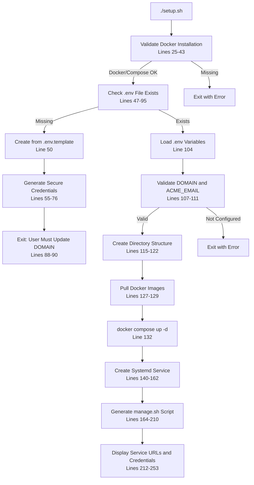
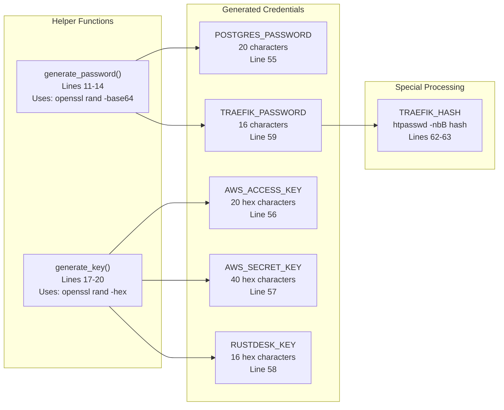
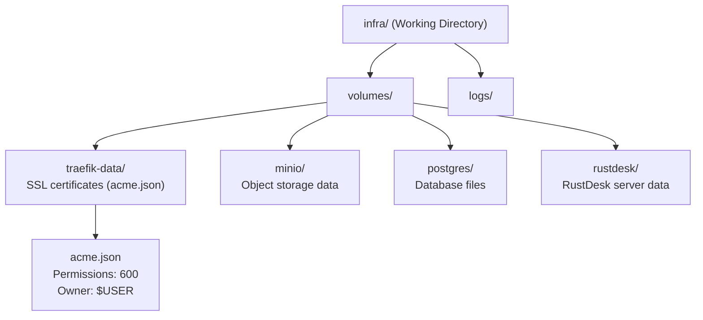
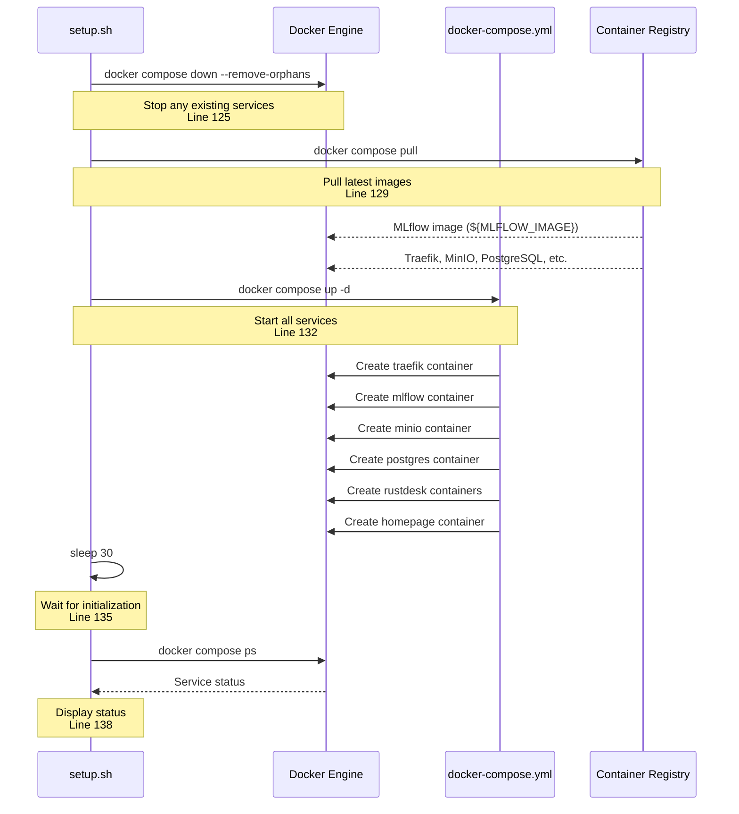
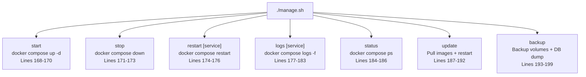

# Setup and Deployment

<details>
<summary>Relevant source files</summary>

The following files were used as context for generating this wiki page:

- [infra/Readme.md](infra/Readme.md)
- [infra/setup.sh](infra/setup.sh)

</details>


## Purpose and Scope

This page documents the automated setup and deployment process for the infrastructure stack using the `setup.sh` script, systemd service integration, and the `manage.sh` management utility. It covers initial deployment, service lifecycle management, and operational maintenance tasks.

For details about the individual services being deployed, see [Service Architecture](#4.1). For configuration file management and environment variables, see [Configuration Management](#4.3). For a complete step-by-step deployment guide including DNS setup, see [Infrastructure Deployment](#6.1).

---

## Setup Script Overview

The `setup.sh` script provides a fully automated deployment process that handles prerequisite validation, credential generation, service initialization, and systemd integration in a single execution.

### Script Execution Flow



**Sources:** [infra/setup.sh:1-254]()

### Prerequisite Validation

The script validates that all required tools are installed and running before proceeding with deployment:

| Tool | Check Method | Location |
|------|-------------|----------|
| `docker` | `command -v docker` | [infra/setup.sh:25-28]() |
| Docker daemon | `docker info` | [infra/setup.sh:30-33]() |
| `docker compose` | `command -v docker compose` | [infra/setup.sh:35-38]() |
| `openssl` | `command -v openssl` | [infra/setup.sh:40-43]() |

**Sources:** [infra/setup.sh:25-45]()

---

## Credential Generation Process

When creating a new `.env` file from the template, the script automatically generates cryptographically secure credentials for all services.

### Credential Generation Functions

The script provides two utility functions for generating secure random values:



### Credential Substitution

Generated credentials are substituted into the `.env` file using `sed` replacement operations:

| Placeholder | Replacement Variable | Line |
|------------|---------------------|------|
| `replace-with-postgres-user` | `postgres` | [infra/setup.sh:65]() |
| `replace-with-postgres-password` | `$POSTGRES_PASSWORD` | [infra/setup.sh:66]() |
| `replace-with-aws-access-key` | `$AWS_ACCESS_KEY` | [infra/setup.sh:67]() |
| `replace-with-aws-secret-key` | `$AWS_SECRET_KEY` | [infra/setup.sh:68]() |
| `replace-with-traefik-password` | `$TRAEFIK_PASSWORD` | [infra/setup.sh:69]() |
| `replace-with-traefik-hash` | `$TRAEFIK_HASH` | [infra/setup.sh:70]() |
| `replace-with-rustdesk-key` | `$RUSTDESK_KEY` | [infra/setup.sh:71]() |

**Note:** The Traefik password hash is generated using the `httpd:2.4-alpine` Docker image's `htpasswd` utility with bcrypt algorithm (`-nbB`). The `$` characters in the hash are doubled (`$$`) to escape them for docker-compose substitution.

**Sources:** [infra/setup.sh:11-76]()

---

## Directory Structure Creation

The script creates a standardized directory structure for persistent data storage and operational logs.

### Created Directories



### Directory Creation and Permissions

1. **Directory creation** [infra/setup.sh:115-117]():
   - `volumes/{traefik-data,minio,postgres,rustdesk}` - Service data volumes
   - `logs/` - Application logs directory

2. **Special file permissions** [infra/setup.sh:119-122]():
   - `volumes/traefik-data/acme.json` - Created with `600` permissions (required by Traefik for SSL certificate storage)
   - All volumes owned by `$USER:$USER` for proper access control

**Sources:** [infra/setup.sh:115-122]()

---

## Service Initialization

The script manages the complete service lifecycle from image retrieval to container startup.

### Initialization Sequence



### MLflow Image Configuration

The script uses the `MLFLOW_IMAGE` environment variable to specify which MLflow image to pull. This supports custom-built MLflow images with additional dependencies:

```bash
# From .env file
MLFLOW_IMAGE=ghcr.io/kshitijrajsharma/mlflow:latest
```

The image is displayed during setup [infra/setup.sh:128]() and pulled from the registry [infra/setup.sh:129]().

**Sources:** [infra/setup.sh:124-138]()

---

## Systemd Integration

The script creates a systemd service unit for automatic startup and system integration.

### Service Unit Definition

The systemd service is generated dynamically at [infra/setup.sh:141-159]():

```ini
[Unit]
Description=Tech Infrastructure Services
Requires=docker.service
After=docker.service

[Service]
Type=oneshot
RemainAfterExit=yes
User=$USER
Group=$USER
WorkingDirectory=$(pwd)
ExecStart=/usr/bin/docker compose up -d
ExecStop=/usr/bin/docker compose down
TimeoutStartSec=0

[Install]
WantedBy=multi-user.target
```

### Service Unit Characteristics

| Field | Value | Purpose |
|-------|-------|---------|
| `Type` | `oneshot` | Service runs to completion then remains active |
| `RemainAfterExit` | `yes` | Service stays active after ExecStart completes |
| `Requires` | `docker.service` | Hard dependency on Docker daemon |
| `After` | `docker.service` | Start after Docker is ready |
| `WantedBy` | `multi-user.target` | Enable on system boot |
| `TimeoutStartSec` | `0` | No timeout for service startup |

### Systemd Installation

The script performs the following systemd operations [infra/setup.sh:161-162]():

```bash
sudo systemctl daemon-reload       # Reload systemd configuration
sudo systemctl enable tech-infra.service  # Enable auto-start on boot
```

### System Management Commands

Once installed, the systemd service can be controlled with:

```bash
sudo systemctl start tech-infra    # Start all services
sudo systemctl stop tech-infra     # Stop all services
sudo systemctl status tech-infra   # Check service status
sudo systemctl restart tech-infra  # Restart all services
```

**Sources:** [infra/setup.sh:140-162](), [infra/Readme.md:64-68]()

---

## Management Script Generation

The setup script generates a `manage.sh` utility script that provides convenient commands for daily operations.

### Management Script Commands



### Command Reference

| Command | Function | Implementation |
|---------|----------|----------------|
| `./manage.sh start` | Start all services | `docker compose up -d` |
| `./manage.sh stop` | Stop all services | `docker compose down` |
| `./manage.sh restart [service]` | Restart one or all services | `docker compose restart ${service}` |
| `./manage.sh logs [service]` | View logs (follow mode if service specified) | `docker compose logs [-f] [service]` |
| `./manage.sh status` | Display service status | `docker compose ps` |
| `./manage.sh update` | Pull latest images and restart | `docker compose pull` + `docker compose up -d` |
| `./manage.sh backup` | Create timestamped backup | Copy volumes + PostgreSQL dump |

### Backup Operation Details

The `backup` command [infra/setup.sh:193-199]() creates a comprehensive backup:

1. **Backup directory** created at `./backups/YYYYMMDD_HHMMSS/`
2. **Volume data** copied with `cp -r volumes/ "$BACKUP_DIR/"`
3. **PostgreSQL database** dumped with:
   ```bash
   docker compose exec -T postgres pg_dump -U ${POSTGRES_USER} ${POSTGRES_DB} \
     > "$BACKUP_DIR/postgres_dump.sql"
   ```

### Usage Examples

```bash
# View MLflow logs in real-time
./manage.sh logs mlflow

# Restart only the PostgreSQL service
./manage.sh restart postgres

# Pull latest images and restart all services
./manage.sh update

# Create a full backup
./manage.sh backup
```

**Sources:** [infra/setup.sh:164-210](), [infra/Readme.md:54-60]()

---

## Setup Completion and Output

Upon successful completion, the script displays comprehensive information about the deployed infrastructure.

### Service URL Display

The script outputs all service URLs using the configured `DOMAIN` variable [infra/setup.sh:212-221]():

```
Homepage Dashboard: https://${DOMAIN}
MLflow Tracking: https://mlflow.${DOMAIN}
MinIO Console: https://minio.${DOMAIN}
MinIO API: https://minio-api.${DOMAIN}
RustDesk Server: https://rustdesk.${DOMAIN}
Traefik Dashboard: https://traefik.${DOMAIN}
PostgreSQL Database: postgres.${DOMAIN}:5432
```

### Credential Summary

All generated credentials are displayed for immediate reference [infra/setup.sh:229-251]():

1. **Traefik Dashboard**
   - URL, username (`admin`), and password

2. **PostgreSQL Database**
   - Host, port, database name, username, and password

3. **MinIO/S3 Storage**
   - Console URL, API URL, access key, and secret key

4. **MLflow Tracking**
   - URL and integration notes

### Security Notice

The script emphasizes credential security [infra/setup.sh:78-90](), [infra/setup.sh:252-253]():
- All credentials displayed at first setup (before domain configuration)
- Reminder that credentials are stored in `.env` file
- Warning to keep `.env` file secure and backed up

**Sources:** [infra/setup.sh:212-253]()

---

## Deployment Workflow Summary

The complete deployment process follows this sequence:

```mermaid
flowchart LR
    A["Clone Repository"] --> B["Execute setup.sh"]
    B --> C{"First Run?"}
    
    C -->|"Yes"| D["Generate .env<br/>with credentials"]
    D --> E["Exit: Configure<br/>DOMAIN and EMAIL"]
    E --> F["User edits .env"]
    F --> G["Execute setup.sh again"]
    
    C -->|"No"| H["Validate configuration"]
    
    G --> H
    H --> I["Create directories<br/>Set permissions"]
    I --> J["Pull Docker images"]
    J --> K["Start services"]
    K --> L["Create systemd service"]
    L --> M["Generate manage.sh"]
    M --> N["Display credentials<br/>and URLs"]
    
    N --> O["Services Running"]
```



### Two-Stage Setup Process

1. **First execution** [infra/setup.sh:47-95]():
   - Generates `.env` from template
   - Creates secure credentials
   - Exits with instructions to configure `DOMAIN` and `ACME_EMAIL`

2. **Second execution** [infra/setup.sh:104-253]():
   - Loads validated configuration
   - Deploys complete infrastructure
   - Creates management tools
   - Displays access information

This two-stage approach ensures users explicitly configure their domain settings before services are deployed with SSL certificates.

**Sources:** [infra/setup.sh:1-254](), [infra/Readme.md:14-30]()

---

## Required DNS Configuration

Before running the setup script, the following DNS A records must point to the server's IP address:

| Subdomain | Service | Required |
|-----------|---------|----------|
| `yourdomain.com` | Homepage Dashboard | Yes |
| `mlflow.yourdomain.com` | MLflow Tracking Server | Yes |
| `minio.yourdomain.com` | MinIO Console | Yes |
| `minio-api.yourdomain.com` | MinIO S3 API | Yes |
| `postgres.yourdomain.com` | PostgreSQL Database | Yes |
| `rustdesk.yourdomain.com` | RustDesk Server | Yes |
| `traefik.yourdomain.com` | Traefik Dashboard | Yes |

These DNS records are required for Traefik to correctly route requests and for Let's Encrypt to issue SSL certificates.

**Sources:** [infra/Readme.md:32-42]()