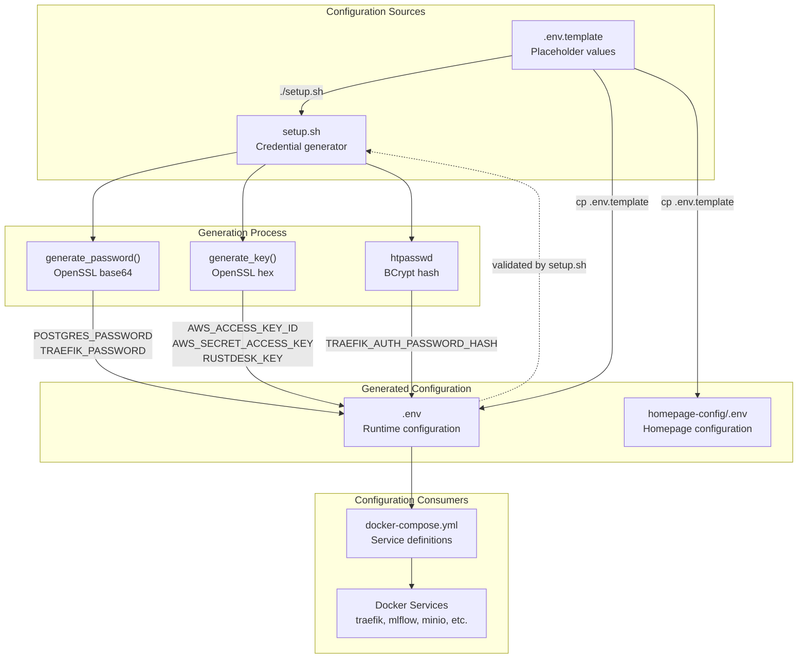
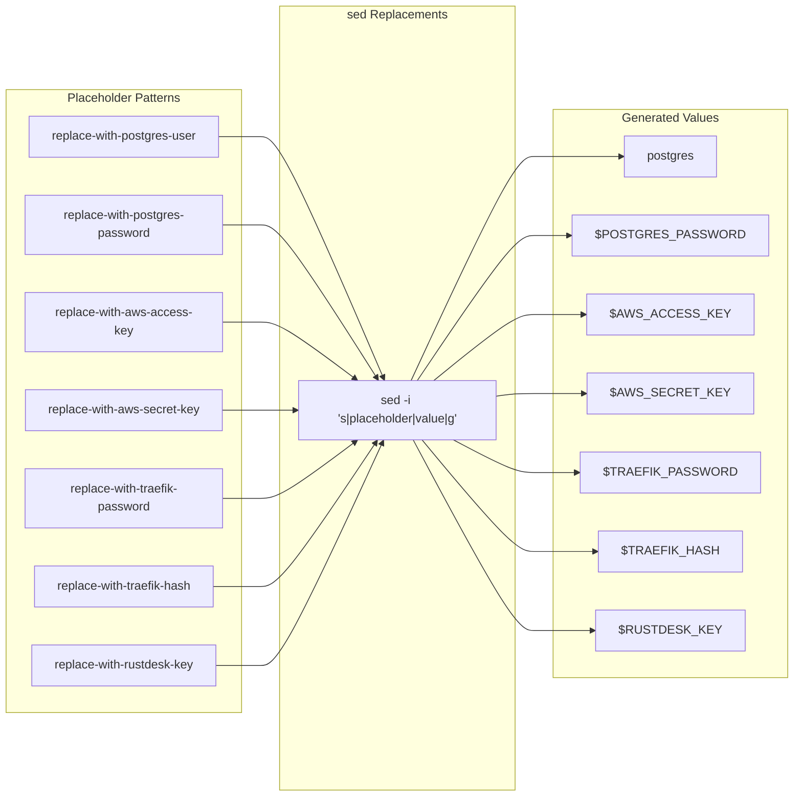
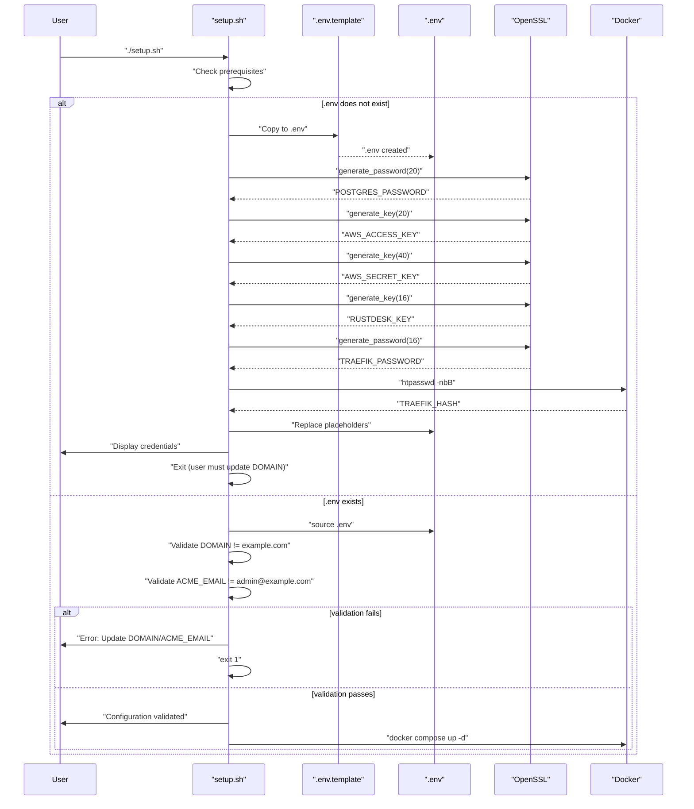
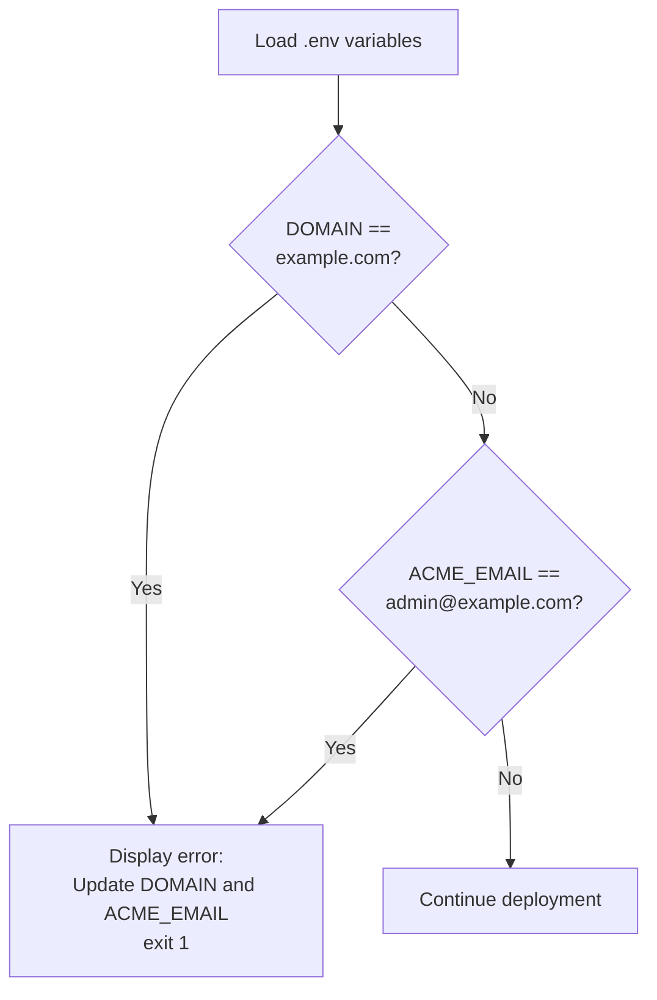
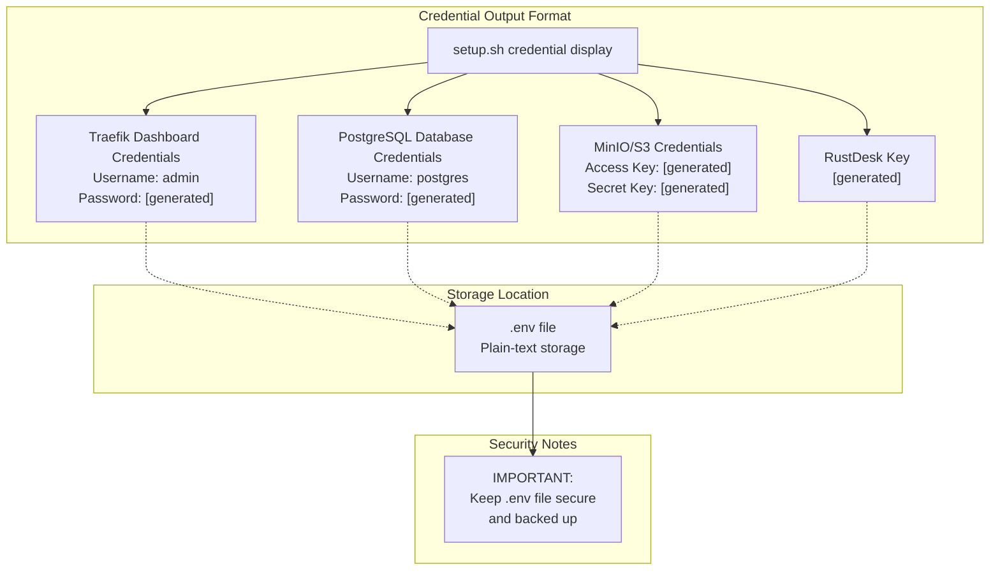
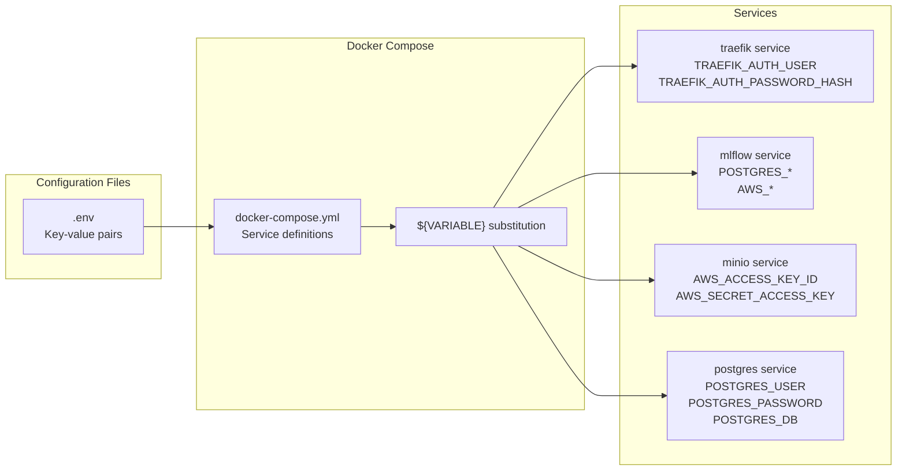

# Configuration Management

<details>
<summary>Relevant source files</summary>

The following files were used as context for generating this wiki page:

- [infra/.env.template](infra/.env.template)
- [infra/setup.sh](infra/setup.sh)

</details>


## Purpose and Scope

This document covers the configuration management system for the infrastructure stack, including environment variable templates, automated credential generation, security settings, and validation processes. The configuration system is centered around the `.env` template file and the `setup.sh` script, which together provide a secure, reproducible method for deploying the infrastructure services.

For information about the broader infrastructure architecture and service deployment, see [Service Architecture](#4.1). For details about the deployment process that uses these configurations, see [Setup and Deployment](#4.2).

**Sources:** [infra/.env.template:1-37](), [infra/setup.sh:1-254]()

---

## Configuration System Architecture

The configuration management system uses a template-based approach where placeholders are replaced with generated credentials during the initial setup.



**Diagram: Configuration Generation Flow**

The system generates secure credentials automatically and validates that critical configuration values are set before allowing deployment.

**Sources:** [infra/setup.sh:47-95](), [infra/setup.sh:11-20]()

---

## Environment Variable Template Structure

The `.env.template` file is organized into logical sections, each containing related configuration variables.

### Configuration Categories

| Category | Variables | Purpose |
|----------|-----------|---------|
| Domain Configuration | `DOMAIN`, `ACME_EMAIL` | DNS domain for services and Let's Encrypt contact |
| Traefik Configuration | `TRAEFIK_DATA_DIR`, `TRAEFIK_AUTH_USER`, `TRAEFIK_AUTH_PASSWORD`, `TRAEFIK_AUTH_PASSWORD_HASH` | Reverse proxy data storage and authentication |
| Homepage Configuration | `HOMEPAGE_CONFIG`, `HOMEPAGE_ALLOWED_HOSTS` | Dashboard configuration path and allowed domains |
| MLflow Configuration | `MLFLOW_IMAGE` | Custom MLflow Docker image from GHCR |
| MinIO Configuration | `AWS_ACCESS_KEY_ID`, `AWS_SECRET_ACCESS_KEY`, `MINIO_BUCKET_NAME`, `MINIO_DATA_DIR` | S3-compatible object storage credentials and settings |
| PostgreSQL Configuration | `POSTGRES_USER`, `POSTGRES_PASSWORD`, `POSTGRES_DB`, `POSTGRES_DATA_DIR` | Database credentials and storage location |
| RustDesk Configuration | `RUSTDESK_DATA_DIR`, `RUSTDESK_KEY` | Remote desktop server data and encryption key |
| System Configuration | `PUID`, `PGID`, `TZ` | Unix user/group IDs and timezone |

**Sources:** [infra/.env.template:1-37]()

### Template Placeholder Pattern

The template uses specific placeholder strings that are replaced during setup:



**Diagram: Placeholder Replacement Mechanism**

**Sources:** [infra/setup.sh:64-71](), [infra/.env.template:8-9](), [infra/.env.template:19-20](), [infra/.env.template:25-26](), [infra/.env.template:32]()

---

## Credential Generation

The `setup.sh` script implements two primary functions for generating secure credentials using OpenSSL.

### Password Generation

The `generate_password()` function creates URL-safe base64 passwords:

| Parameter | Default | Purpose |
|-----------|---------|---------|
| `length` | 16 | Number of characters in final password |

**Implementation:** Uses `openssl rand -base64` with character filtering to remove problematic characters (`=+/`).

**Used for:**
- `POSTGRES_PASSWORD` (20 characters)
- `TRAEFIK_PASSWORD` (16 characters)

**Sources:** [infra/setup.sh:11-14](), [infra/setup.sh:55](), [infra/setup.sh:59]()

### Key Generation

The `generate_key()` function creates hexadecimal keys:

| Parameter | Default | Purpose |
|-----------|---------|---------|
| `length` | 32 | Number of hex characters (bytes) |

**Implementation:** Uses `openssl rand -hex` to generate cryptographically secure random hex strings.

**Used for:**
- `AWS_ACCESS_KEY_ID` (20 bytes = 40 hex characters)
- `AWS_SECRET_ACCESS_KEY` (40 bytes = 80 hex characters)
- `RUSTDESK_KEY` (16 bytes = 32 hex characters)

**Sources:** [infra/setup.sh:17-20](), [infra/setup.sh:56-58]()

### Hash Generation

The Traefik basic authentication hash is generated using Apache's `htpasswd` utility with BCrypt:

```
TRAEFIK_HASH=$(docker run --rm httpd:2.4-alpine htpasswd -nbB admin "$TRAEFIK_PASSWORD" 2>/dev/null | cut -d ":" -f 2 | sed 's/\$/\$\$/g')
```

**Special handling:** Dollar signs are doubled (`$` → `$$`) to escape them for docker-compose variable interpolation.

**Sources:** [infra/setup.sh:62]()

---

## Configuration Workflow

The complete configuration workflow follows this sequence:



**Diagram: Configuration Setup Sequence**

**Sources:** [infra/setup.sh:47-95](), [infra/setup.sh:104-113]()

---

## Configuration Validation

The setup script performs multiple validation checks before deployment.

### Prerequisite Validation

| Check | Command | Error Message |
|-------|---------|---------------|
| Docker installed | `command -v docker` | "Docker is not installed" |
| Docker running | `docker info` | "Docker is not running" |
| Docker Compose installed | `command -v docker compose` | "Docker Compose is not installed" |
| OpenSSL installed | `command -v openssl` | "OpenSSL is required for generating secure credentials" |

**Sources:** [infra/setup.sh:25-43]()

### Configuration Value Validation

After generating credentials, the script validates that critical configuration values have been updated from their defaults:



**Diagram: Configuration Validation Logic**

**Sources:** [infra/setup.sh:104-111]()

---

## Directory and Permission Management

The setup script creates necessary directories and sets appropriate permissions for security.

### Directory Structure

| Path | Purpose | Owner |
|------|---------|-------|
| `volumes/traefik-data/` | Traefik configuration and SSL certificates | Current user |
| `volumes/minio/` | MinIO object storage data | Current user |
| `volumes/postgres/` | PostgreSQL database files | Current user |
| `volumes/rustdesk/` | RustDesk server data | Current user |
| `logs/` | Application log files | Current user |

**Sources:** [infra/setup.sh:115-117](), [infra/.env.template:6](), [infra/.env.template:22](), [infra/.env.template:28](), [infra/.env.template:31]()

### Critical Permission Settings

The ACME certificate file requires specific permissions to prevent security warnings:

```
touch volumes/traefik-data/acme.json
chmod 600 volumes/traefik-data/acme.json
```

**Purpose:** Let's Encrypt requires that the certificate storage file is readable/writable only by the owner (mode 600).

**Sources:** [infra/setup.sh:119-122]()

---

## Service-Specific Configuration

### Domain-Based Routing Configuration

All services use subdomain-based routing patterns:

| Service | Subdomain Pattern | Variable Used |
|---------|-------------------|---------------|
| Homepage | `${DOMAIN}` | `DOMAIN` |
| MLflow | `mlflow.${DOMAIN}` | `DOMAIN` |
| MinIO Console | `minio.${DOMAIN}` | `DOMAIN` |
| MinIO API | `minio-api.${DOMAIN}` | `DOMAIN` |
| Traefik Dashboard | `traefik.${DOMAIN}` | `DOMAIN` |
| PostgreSQL | `postgres.${DOMAIN}:5432` | `DOMAIN` |
| RustDesk | `rustdesk.${DOMAIN}` | `DOMAIN` |

**Sources:** [infra/setup.sh:213-220]()

### MLflow Backend Configuration

MLflow uses environment variables to configure its backend store and artifact store:

| Variable | Purpose | Default Value |
|----------|---------|---------------|
| `MLFLOW_IMAGE` | Custom MLflow Docker image | `ghcr.io/kshitijrajsharma/opengeoaimodelshub/mlflow:latest` |
| `POSTGRES_USER` | Database username | Generated (postgres) |
| `POSTGRES_PASSWORD` | Database password | Generated |
| `POSTGRES_DB` | Database name | `mlflow` |
| `AWS_ACCESS_KEY_ID` | MinIO access key | Generated |
| `AWS_SECRET_ACCESS_KEY` | MinIO secret key | Generated |
| `MINIO_BUCKET_NAME` | Artifact storage bucket | `mlflow` |

**Sources:** [infra/.env.template:15-28]()

### Security Configuration

#### Traefik Authentication

Traefik dashboard uses HTTP Basic Authentication with BCrypt-hashed passwords:

| Variable | Purpose |
|----------|---------|
| `TRAEFIK_AUTH_USER` | Username for dashboard access (default: admin) |
| `TRAEFIK_AUTH_PASSWORD` | Plain-text password (stored for reference) |
| `TRAEFIK_AUTH_PASSWORD_HASH` | BCrypt hash with doubled dollar signs |

**Sources:** [infra/.env.template:7-9]()

#### Homepage Access Control

Homepage dashboard restricts access to specific domains:

| Variable | Purpose | Example |
|----------|---------|---------|
| `HOMEPAGE_ALLOWED_HOSTS` | Comma-separated list of allowed domains | `example.com,www.example.com` |

**Sources:** [infra/.env.template:13]()

---

## Credential Display and Storage

After generating credentials, the setup script displays them in an organized format:



**Diagram: Credential Storage and Display**

The script displays credentials twice: once during initial generation (with a warning to update `DOMAIN`) and again after successful deployment.

**Sources:** [infra/setup.sh:78-88](), [infra/setup.sh:229-253]()

---

## Configuration Update Workflow

When updating the infrastructure, the configuration system follows this pattern:

| Scenario | Action | Result |
|----------|--------|--------|
| First run | Copy `.env.template` → `.env`, generate credentials | `.env` created with secure credentials |
| `.env` exists with defaults | Validation fails | Script exits with error message |
| `.env` exists with valid values | Source variables, validate | Deployment proceeds |
| Update configuration | Manually edit `.env` | Run `./manage.sh restart` to apply |

**Sources:** [infra/setup.sh:47-113]()

---

## Integration with Docker Compose

The `.env` file is automatically sourced by Docker Compose through environment variable substitution:



**Diagram: Environment Variable Flow to Services**

**Sources:** [infra/.env.template:1-37]()

---

## System Configuration Variables

The system-level configuration variables affect file ownership and timestamps:

| Variable | Purpose | Default | Usage |
|----------|---------|---------|-------|
| `PUID` | Process User ID | 1000 | File ownership for volume-mounted data |
| `PGID` | Process Group ID | 1000 | File ownership for volume-mounted data |
| `TZ` | Timezone | UTC | Container timezone settings |

These are particularly important for ensuring that files created by containerized services have the correct ownership on the host filesystem.

**Sources:** [infra/.env.template:35-37]()

---

## Best Practices

### Security Recommendations

1. **Never commit `.env` file to version control** - Contains plain-text credentials
2. **Backup `.env` file securely** - Required for disaster recovery
3. **Rotate credentials periodically** - Generate new credentials and update `.env`
4. **Use strong domain names** - Avoid predictable patterns
5. **Keep `ACME_EMAIL` valid** - Required for Let's Encrypt notifications

### Configuration Management

1. **Document custom changes** - Add comments to `.env` for non-standard configurations
2. **Test in staging first** - Validate configuration changes before production
3. **Use version control for `.env.template`** - Track template changes
4. **Maintain separate environments** - Use different `.env` files for dev/staging/prod

**Sources:** [infra/setup.sh:88](), [infra/setup.sh:253]()