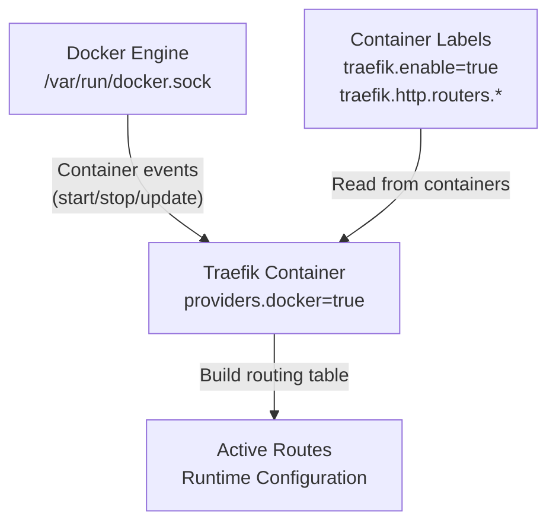
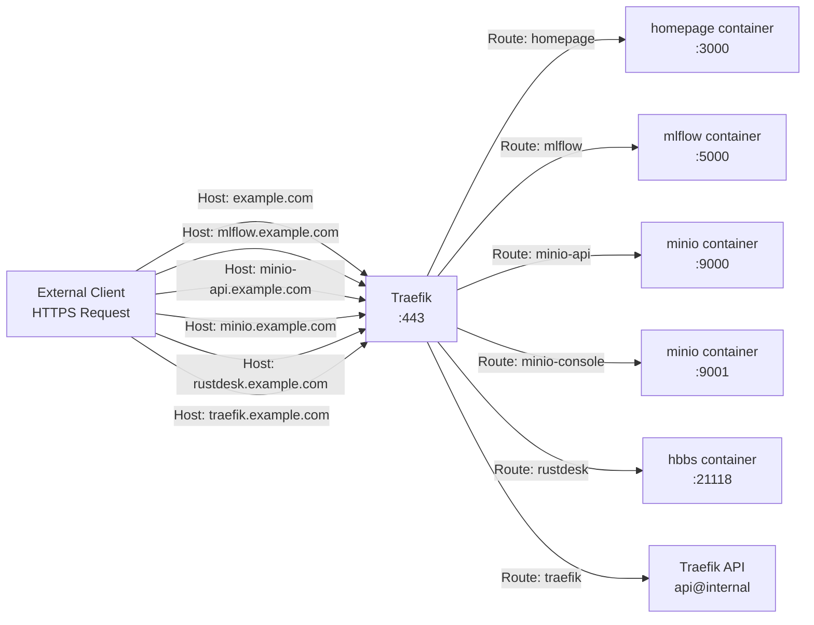
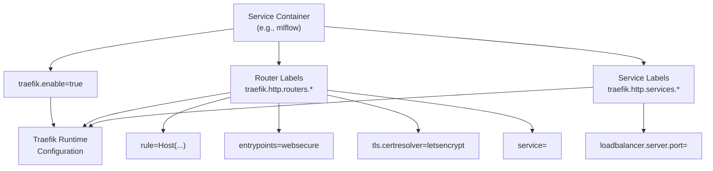
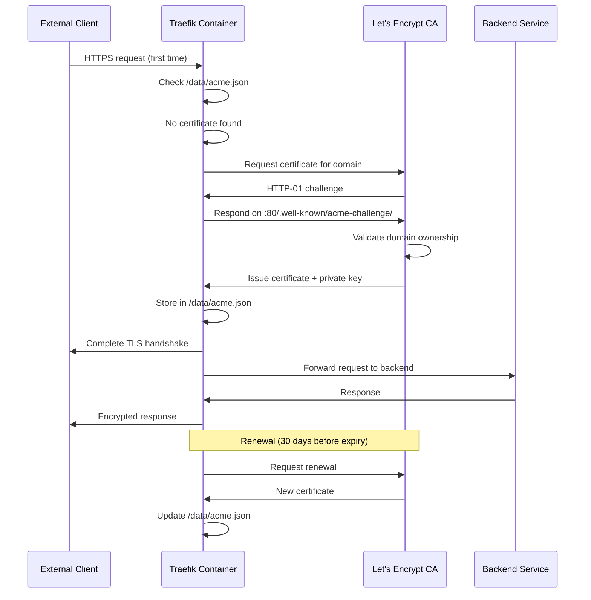

# Traefik Reverse Proxy

<details>
<summary>Relevant source files</summary>

The following files were used as context for generating this wiki page:

- [infra/.env.template](infra/.env.template)
- [infra/docker-compose.yml](infra/docker-compose.yml)

</details>


This document covers Traefik's configuration and operation as the edge router in the OpenGeoAIModelHub infrastructure stack. Traefik serves as the single entry point for all HTTP/HTTPS traffic, handles automatic SSL certificate provisioning via Let's Encrypt, and routes requests to appropriate backend services using Docker label-based service discovery.

For information about the overall infrastructure architecture, see [Service Architecture](#4.1). For details about individual backend services that Traefik routes to, see [MLflow Tracking Server](#4.5), [Storage Services](#4.6), and [Additional Services](#4.7).

**Sources:** [infra/docker-compose.yml:1-184]()

---

## Purpose and Capabilities

Traefik functions as a cloud-native edge router that automatically discovers services running in Docker containers and configures routing rules dynamically. The implementation in this infrastructure provides:

- **Automatic Service Discovery**: Reads Docker labels to configure routes without manual intervention
- **SSL Termination**: Automatically provisions and renews Let's Encrypt certificates for all services
- **HTTP to HTTPS Redirection**: Forces secure connections for all web traffic
- **Multi-Protocol Support**: Handles both HTTP/HTTPS (ports 80/443) and TCP traffic (port 5432 for PostgreSQL)
- **Dashboard Interface**: Web UI for monitoring routing configuration and service health
- **Access Control**: Basic authentication middleware for protecting sensitive services

**Sources:** [infra/docker-compose.yml:2-38]()

---

## Service Configuration

The Traefik service is defined in the Docker Compose stack with specific port bindings, volume mounts, and command-line configuration.

### Container Definition

```yaml
traefik:
  image: traefik:v3.0
  container_name: traefik
  restart: unless-stopped
  ports:
    - "80:80"      # HTTP entry point
    - "443:443"    # HTTPS entry point
    - "8080:8080"  # Dashboard (optional)
```

| Port | Protocol | Purpose |
|------|----------|---------|
| 80 | HTTP | Web entry point, redirects to HTTPS |
| 443 | HTTPS | Secure web traffic, SSL termination |
| 8080 | HTTP | Dashboard access (can be disabled) |

The service uses the `traefik:v3.0` image and runs with `unless-stopped` restart policy to ensure availability across system reboots.

**Sources:** [infra/docker-compose.yml:2-9]()

### Volume Mounts

Two critical volumes are mounted:

```yaml
volumes:
  - /var/run/docker.sock:/var/run/docker.sock:ro
  - ${TRAEFIK_DATA_DIR:-./volumes/traefik-data}:/data
```

| Volume | Mode | Purpose |
|--------|------|---------|
| `/var/run/docker.sock` | read-only | Docker API access for service discovery |
| `${TRAEFIK_DATA_DIR}:/data` | read-write | Persistent storage for ACME certificates and configuration |

The Docker socket mount enables Traefik to monitor container events and automatically update routing configuration. The `/data` volume persists Let's Encrypt certificates in `/data/acme.json`.

**Sources:** [infra/docker-compose.yml:10-12]()

---

## Command-Line Configuration

Traefik is configured entirely via command-line flags, enabling zero-config startup once environment variables are set.

### Provider Configuration

```
--providers.docker=true
--providers.docker.exposedbydefault=false
```

The Docker provider enables automatic service discovery. Setting `exposedbydefault=false` requires explicit opt-in via `traefik.enable=true` labels, preventing accidental exposure of services.

**Mermaid: Docker Provider Service Discovery Flow**



**Sources:** [infra/docker-compose.yml:16-17]()

### Entry Points

```
--entrypoints.web.address=:80
--entrypoints.websecure.address=:443
--entrypoints.postgres.address=:5432
```

Three entry points are defined:

| Entry Point | Address | Protocol | Usage |
|-------------|---------|----------|-------|
| `web` | `:80` | HTTP | Initial requests, redirects to HTTPS |
| `websecure` | `:443` | HTTPS | Secure HTTP traffic for all web services |
| `postgres` | `:5432` | TCP | Direct PostgreSQL database connections |

The `postgres` entry point enables TCP-level routing for database traffic, distinct from HTTP routing.

**Sources:** [infra/docker-compose.yml:18-20]()

### Automatic HTTPS Redirection

```
--entrypoints.web.http.redirections.entrypoint.to=websecure
--entrypoints.web.http.redirections.entrypoint.scheme=https
```

All traffic arriving on the `web` entry point (port 80) is automatically redirected to `websecure` (port 443) with the HTTPS scheme, enforcing encryption for all services.

**Sources:** [infra/docker-compose.yml:21-22]()

### Let's Encrypt Integration

```
--certificatesresolvers.letsencrypt.acme.email=${ACME_EMAIL}
--certificatesresolvers.letsencrypt.acme.storage=/data/acme.json
--certificatesresolvers.letsencrypt.acme.httpchallenge=true
--certificatesresolvers.letsencrypt.acme.httpchallenge.entrypoint=web
```

The `letsencrypt` certificate resolver automatically provisions SSL certificates:

- **Email**: `${ACME_EMAIL}` receives certificate expiration notifications
- **Storage**: `/data/acme.json` persists certificates across restarts
- **Challenge**: HTTP-01 challenge on the `web` entry point validates domain ownership

Certificate renewal occurs automatically approximately 30 days before expiration.

**Sources:** [infra/docker-compose.yml:23-26](), [infra/.env.template:3]()

### Logging Configuration

```
--log.level=INFO
--accesslog=true
```

- **Log Level**: `INFO` provides operational visibility without excessive verbosity
- **Access Logs**: Enabled for request auditing and debugging

**Sources:** [infra/docker-compose.yml:27-28]()

---

## Dashboard Access

Traefik exposes its own dashboard via self-referential labels.

### Dashboard Configuration

```yaml
labels:
  - "traefik.enable=true"
  - "traefik.http.routers.traefik.rule=Host(`traefik.${DOMAIN}`)"
  - "traefik.http.routers.traefik.entrypoints=websecure"
  - "traefik.http.routers.traefik.tls.certresolver=letsencrypt"
  - "traefik.http.routers.traefik.service=api@internal"
  - "traefik.http.routers.traefik.middlewares=auth"
  - "traefik.http.middlewares.auth.basicauth.users=${TRAEFIK_AUTH_USER}:${TRAEFIK_AUTH_PASSWORD_HASH}"
```

| Label Key | Value | Purpose |
|-----------|-------|---------|
| `traefik.enable` | `true` | Enables routing for Traefik itself |
| `traefik.http.routers.traefik.rule` | `Host(\`traefik.${DOMAIN}\`)` | Routes requests for subdomain |
| `traefik.http.routers.traefik.service` | `api@internal` | Special internal service for dashboard |
| `traefik.http.routers.traefik.middlewares` | `auth` | Applies basic authentication |
| `traefik.http.middlewares.auth.basicauth.users` | `${TRAEFIK_AUTH_USER}:${TRAEFIK_AUTH_PASSWORD_HASH}` | Credentials |

The dashboard is accessible at `https://traefik.${DOMAIN}` and protected by basic authentication. The `api@internal` service is a built-in Traefik service that doesn't require external container configuration.

**Sources:** [infra/docker-compose.yml:29-36](), [infra/.env.template:7-9]()

### API Dashboard Flag

```
--api.dashboard=true
--api.insecure=false
```

The dashboard is enabled but not exposed insecurely on port 8080. Access is only via the authenticated HTTPS route.

**Sources:** [infra/docker-compose.yml:14-15]()

---

## Routing Patterns

Traefik routes traffic based on Docker labels attached to each service container. This section documents the routing patterns used across the infrastructure.

### HTTP Router Configuration

**Mermaid: HTTP Routing Architecture**



**Sources:** [infra/docker-compose.yml:40-176]()

### Homepage Service Routing

```yaml
homepage:
  labels:
    - "traefik.enable=true"
    - "traefik.http.routers.homepage.rule=Host(`${DOMAIN}`) || Host(`www.${DOMAIN}`)"
    - "traefik.http.routers.homepage.entrypoints=websecure"
    - "traefik.http.routers.homepage.tls.certresolver=letsencrypt"
    - "traefik.http.services.homepage.loadbalancer.server.port=3000"
```

The homepage service demonstrates a multi-host routing rule, accepting both apex domain and www subdomain. The router named `homepage` forwards to the service also named `homepage`, which load balances to port 3000.

**Sources:** [infra/docker-compose.yml:52-58]()

### MLflow Service Routing

```yaml
mlflow:
  labels:
    - "traefik.enable=true"
    - "traefik.http.routers.mlflow.rule=Host(`mlflow.${DOMAIN}`)"
    - "traefik.http.routers.mlflow.entrypoints=websecure"
    - "traefik.http.routers.mlflow.tls.certresolver=letsencrypt"
    - "traefik.http.services.mlflow.loadbalancer.server.port=5000"
```

Standard single-subdomain routing pattern. The `mlflow` router uses the `letsencrypt` certificate resolver to automatically provision SSL certificates for the subdomain.

**Sources:** [infra/docker-compose.yml:76-81]()

### MinIO Dual-Service Routing

```yaml
minio:
  labels:
    # API endpoint
    - "traefik.http.routers.minio-api.rule=Host(`minio-api.${DOMAIN}`)"
    - "traefik.http.routers.minio-api.service=minio-api"
    - "traefik.http.services.minio-api.loadbalancer.server.port=9000"
    
    # Console endpoint
    - "traefik.http.routers.minio-console.rule=Host(`minio.${DOMAIN}`)"
    - "traefik.http.routers.minio-console.service=minio-console"
    - "traefik.http.services.minio-console.loadbalancer.server.port=9001"
```

MinIO exposes two distinct HTTP services on different ports, requiring two separate routers. The `minio-api` router forwards to port 9000 (S3 API), while `minio-console` router forwards to port 9001 (web console).

**Sources:** [infra/docker-compose.yml:98-110]()

### PostgreSQL TCP Routing

```yaml
postgres:
  labels:
    - "traefik.enable=true"
    - "traefik.tcp.routers.postgres.rule=HostSNI(`postgres.${DOMAIN}`)"
    - "traefik.tcp.routers.postgres.entrypoints=postgres"
    - "traefik.tcp.routers.postgres.service=postgres"
    - "traefik.tcp.services.postgres.loadbalancer.server.port=5432"
    - "traefik.tcp.routers.postgres.tls=true"
    - "traefik.tcp.routers.postgres.tls.certresolver=letsencrypt"
```

PostgreSQL uses TCP routing instead of HTTP routing. Key differences:

- Uses `traefik.tcp.routers.*` instead of `traefik.http.routers.*`
- Routing rule uses `HostSNI` (Server Name Indication) for TLS-based routing
- Entry point is `postgres` (port 5432) instead of `websecure`
- TLS is explicitly enabled at the TCP level

**Sources:** [infra/docker-compose.yml:127-133]()

---

## Label Reference

All services route through Traefik by specifying Docker labels. This section documents the label patterns.

### Common Label Patterns

**Mermaid: Label Configuration Flow**



**Sources:** [infra/docker-compose.yml:52-160]()

### Label Schema

#### Router Labels

| Label Pattern | Purpose | Example |
|---------------|---------|---------|
| `traefik.enable` | Opt-in to Traefik routing | `true` |
| `traefik.http.routers.<name>.rule` | Host-based routing rule | `Host(\`mlflow.example.com\`)` |
| `traefik.http.routers.<name>.entrypoints` | Entry point selection | `websecure` |
| `traefik.http.routers.<name>.tls.certresolver` | Certificate resolver | `letsencrypt` |
| `traefik.http.routers.<name>.service` | Target service reference | `mlflow` |
| `traefik.http.routers.<name>.middlewares` | Middleware chain | `auth` |

#### Service Labels

| Label Pattern | Purpose | Example |
|---------------|---------|---------|
| `traefik.http.services.<name>.loadbalancer.server.port` | Backend container port | `5000` |
| `traefik.http.services.<name>.loadbalancer.server.url` | Complete backend URL | `http://mlflow:5000` |

#### TCP-Specific Labels

| Label Pattern | Purpose | Example |
|---------------|---------|---------|
| `traefik.tcp.routers.<name>.rule` | TCP routing rule | `HostSNI(\`postgres.example.com\`)` |
| `traefik.tcp.routers.<name>.tls` | Enable TLS | `true` |
| `traefik.tcp.services.<name>.loadbalancer.server.port` | TCP backend port | `5432` |

**Sources:** [infra/docker-compose.yml:29-160]()

---

## Middleware Configuration

Traefik supports middleware for request/response transformation. The infrastructure uses basic authentication middleware.

### Basic Auth Middleware

```yaml
labels:
  - "traefik.http.middlewares.auth.basicauth.users=${TRAEFIK_AUTH_USER}:${TRAEFIK_AUTH_PASSWORD_HASH}"
  - "traefik.http.routers.traefik.middlewares=auth"
```

The `auth` middleware is defined globally on the Traefik service itself and can be referenced by any router. The credentials are stored as `username:hashed-password`, where the hash is bcrypt format.

To generate a password hash:

```bash
htpasswd -nb admin password
# Or using Python:
python3 -c "import bcrypt; print(bcrypt.hashpw(b'password', bcrypt.gensalt()).decode())"
```

The hash must have dollar signs (`$`) escaped as `$$` in Docker Compose files.

**Sources:** [infra/docker-compose.yml:35-36](), [infra/.env.template:7-9]()

---

## Network Configuration

All services route through Traefik via a shared Docker network.

### Network Definition

```yaml
networks:
  traefik-network:
    name: traefik-network
    driver: bridge
```

The `traefik-network` uses the bridge driver, creating an isolated network segment. All services that need external access must attach to this network.

### Service Network Attachment

```yaml
services:
  traefik:
    networks:
      - traefik-network
  
  mlflow:
    networks:
      - traefik-network
```

Each service explicitly declares network membership. Traefik can only route to services on networks it has access to.

**Sources:** [infra/docker-compose.yml:37-38](), [infra/docker-compose.yml:177-180]()

---

## Environment Variables

Traefik configuration depends on several environment variables defined in `.env`.

### Required Variables

| Variable | Purpose | Example |
|----------|---------|---------|
| `DOMAIN` | Base domain for all services | `example.com` |
| `ACME_EMAIL` | Let's Encrypt notification email | `admin@example.com` |
| `TRAEFIK_DATA_DIR` | Volume path for certificate storage | `./volumes/traefik-data` |
| `TRAEFIK_AUTH_USER` | Dashboard username | `admin` |
| `TRAEFIK_AUTH_PASSWORD_HASH` | Bcrypt hash of dashboard password | `$2y$05$...` |

### Usage in Configuration

```yaml
command:
  - --certificatesresolvers.letsencrypt.acme.email=${ACME_EMAIL}
labels:
  - "traefik.http.routers.traefik.rule=Host(`traefik.${DOMAIN}`)"
  - "traefik.http.middlewares.auth.basicauth.users=${TRAEFIK_AUTH_USER}:${TRAEFIK_AUTH_PASSWORD_HASH}"
```

Environment variable substitution occurs at Docker Compose startup, generating the final configuration.

**Sources:** [infra/.env.template:1-9](), [infra/docker-compose.yml:23](), [infra/docker-compose.yml:31](), [infra/docker-compose.yml:36]()

---

## Certificate Management

Let's Encrypt certificates are automatically provisioned, renewed, and stored.

### Certificate Storage

Certificates are stored in `/data/acme.json` inside the container, backed by the `${TRAEFIK_DATA_DIR}` volume on the host. The file has the following structure:

```json
{
  "letsencrypt": {
    "Account": {...},
    "Certificates": [
      {
        "domain": {"main": "example.com"},
        "certificate": "...",
        "key": "..."
      }
    ]
  }
}
```

**Important**: The `acme.json` file must have 600 permissions (`-rw-------`) to prevent security warnings.

### Certificate Lifecycle

**Mermaid: Certificate Provisioning Flow**



**Sources:** [infra/docker-compose.yml:23-26]()

### Multi-Domain Certificates

Each service with a unique subdomain gets its own certificate:

- `example.com` (homepage)
- `mlflow.example.com`
- `minio-api.example.com`
- `minio.example.com`
- `postgres.example.com`
- `rustdesk.example.com`
- `traefik.example.com`

Let's Encrypt has rate limits of 50 certificates per registered domain per week, which is sufficient for typical deployments.

**Sources:** [infra/docker-compose.yml:54](), [infra/docker-compose.yml:77](), [infra/docker-compose.yml:99](), [infra/docker-compose.yml:105](), [infra/docker-compose.yml:128](), [infra/docker-compose.yml:156](), [infra/docker-compose.yml:31]()

---

## Complete Routing Table

This table summarizes all routes configured in the infrastructure stack.

| Subdomain | Service | Container Port | Router Name | Protocol | Middleware |
|-----------|---------|----------------|-------------|----------|------------|
| `${DOMAIN}` | homepage | 3000 | `homepage` | HTTPS | - |
| `www.${DOMAIN}` | homepage | 3000 | `homepage` | HTTPS | - |
| `mlflow.${DOMAIN}` | mlflow | 5000 | `mlflow` | HTTPS | - |
| `minio-api.${DOMAIN}` | minio | 9000 | `minio-api` | HTTPS | - |
| `minio.${DOMAIN}` | minio | 9001 | `minio-console` | HTTPS | - |
| `postgres.${DOMAIN}` | postgres | 5432 | `postgres` | TLS/TCP | - |
| `rustdesk.${DOMAIN}` | hbbs | 21118 | `rustdesk` | HTTPS | - |
| `traefik.${DOMAIN}` | traefik | `api@internal` | `traefik` | HTTPS | `auth` |

**Sources:** [infra/docker-compose.yml:1-176]()

---

## Operational Considerations

### Monitoring Traefik

Access the dashboard at `https://traefik.${DOMAIN}` to view:

- Active routers and their matching rules
- Configured services and health status
- Middleware chains
- Certificate status
- Recent access logs

### Troubleshooting Common Issues

#### Certificate Provisioning Failures

If certificates fail to provision:

1. Verify DNS records point to the server
2. Ensure ports 80 and 443 are open in firewall
3. Check `acme.json` file permissions (must be 600)
4. Review Traefik logs: `docker logs traefik`
5. Verify `ACME_EMAIL` is set correctly

#### Service Not Routing

If a service is not accessible:

1. Verify `traefik.enable=true` label is present
2. Check router labels for syntax errors
3. Confirm service is on `traefik-network`
4. Review Traefik dashboard for router status
5. Check service logs for binding errors

#### SSL Mixed Content Warnings

If browsers show mixed content warnings:

1. Ensure all `entrypoints` use `websecure`
2. Verify HTTP to HTTPS redirection is working
3. Check internal service URLs use `http://` (not `https://`)
4. Traefik handles SSL termination; backend services use plain HTTP

**Sources:** [infra/docker-compose.yml:1-184]()

---

## Security Considerations

### Docker Socket Access

Traefik mounts `/var/run/docker.sock` with read-only access. This grants Traefik permission to query container metadata but not modify containers. This is necessary for service discovery but represents a privileged operation.

### Basic Auth Credentials

The Traefik dashboard uses basic authentication. Best practices:

- Use strong passwords (minimum 16 characters)
- Rotate credentials periodically
- Never commit plaintext passwords to version control
- Use bcrypt hashing for password storage

### Certificate Storage

The `acme.json` file contains private keys for all certificates. Protect this file:

- Ensure 600 permissions (`chmod 600 acme.json`)
- Include in backup procedures
- Exclude from version control (add to `.gitignore`)

### Network Isolation

The `traefik-network` provides a security boundary. Services not on this network cannot be reached via Traefik, providing defense-in-depth.

**Sources:** [infra/docker-compose.yml:11](), [infra/docker-compose.yml:12](), [infra/docker-compose.yml:36](), [infra/docker-compose.yml:177-180]()