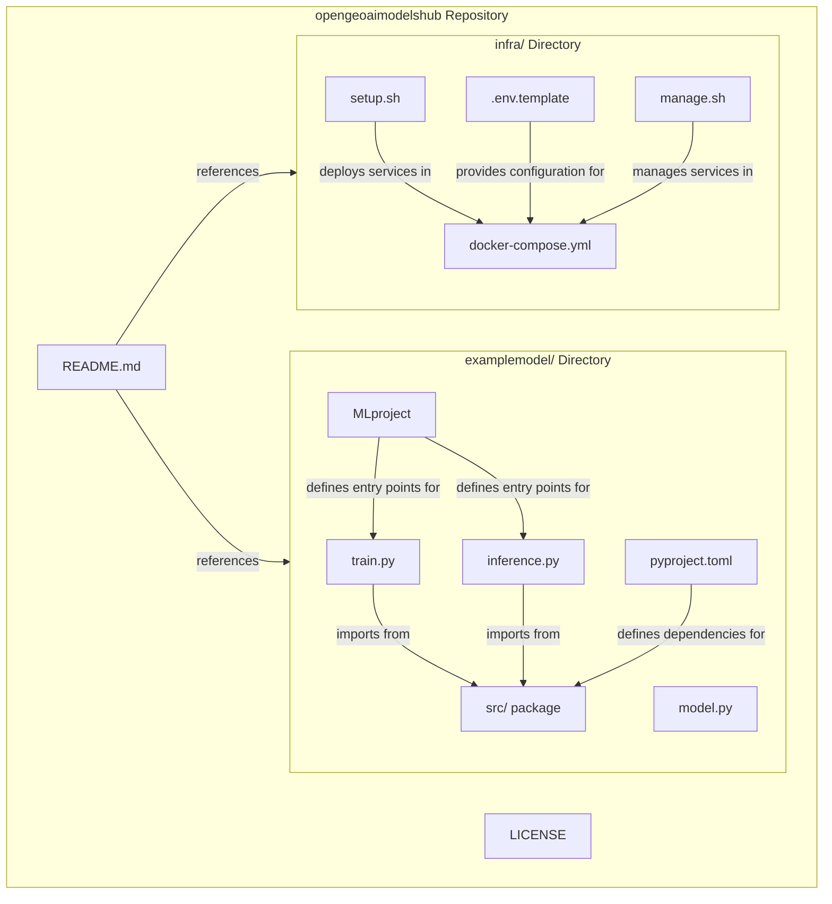
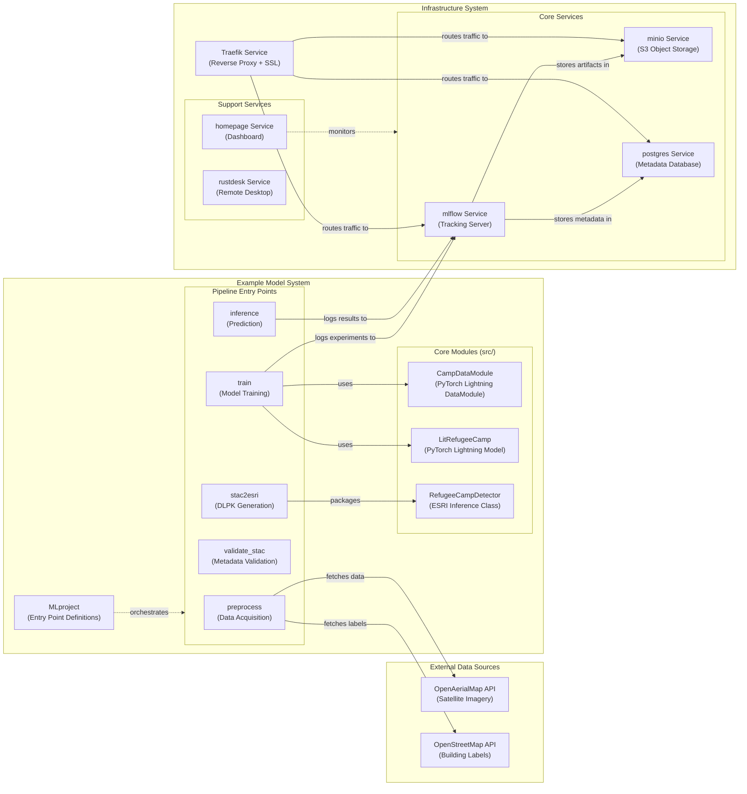
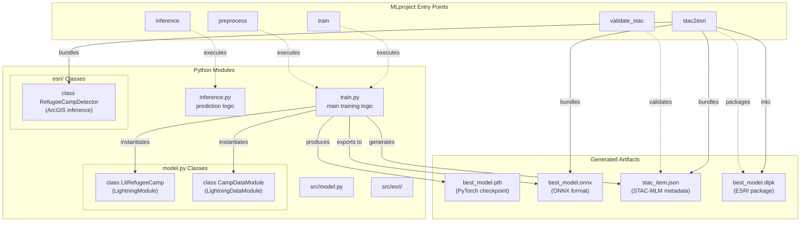
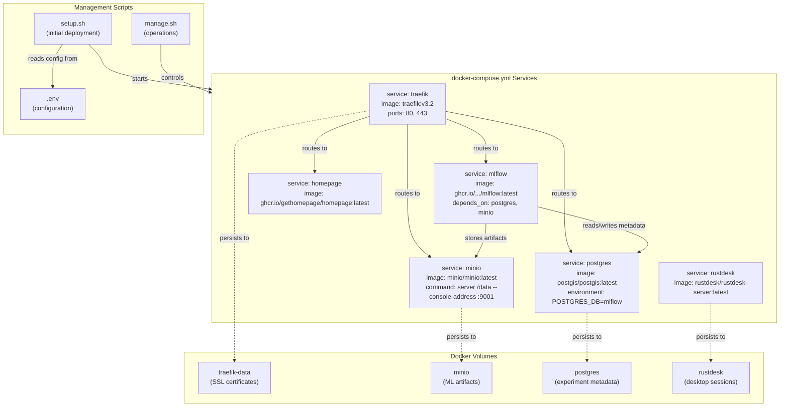
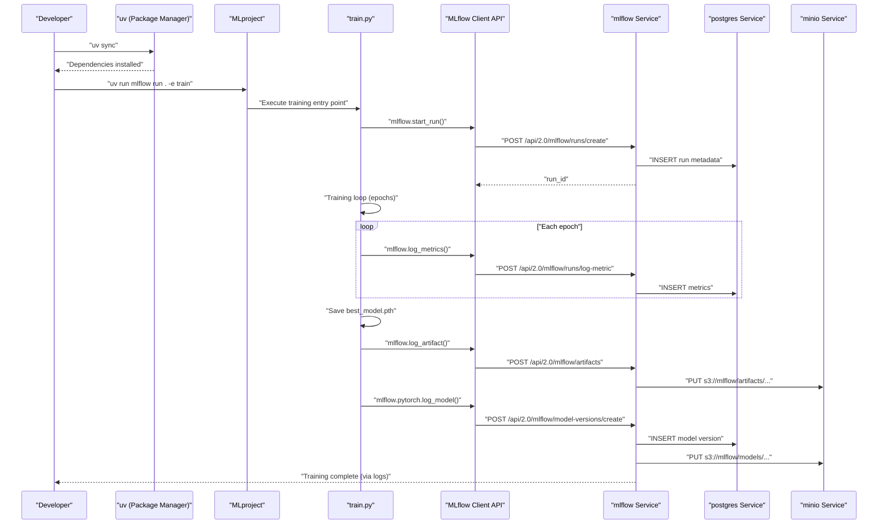

# Overview

Relevant source files

The following files were used as context for generating this wiki page:

- [LICENSE](LICENSE)
- [README.md](README.md)
- [docs/report.pdf](docs/report.pdf)
- [examplemodel/README.md](examplemodel/README.md)
- [infra/Readme.md](infra/Readme.md)

This document provides a high-level introduction to the OpenGeoAIModelHub repository, explaining its architecture, core components, and dual purpose as both an example ML model implementation and a production-ready infrastructure stack. For detailed setup instructions, see [Getting Started](#2). For infrastructure deployment specifics, see [Infrastructure Deployment](#6.1). For model training details, see [Training Pipeline](#3.2).

## Purpose and Scope

OpenGeoAIModelHub is a reference implementation demonstrating how to build reproducible, deployable, and scalable Geo-AI models using metadata standards and modern MLOps practices. The repository serves two interconnected purposes:

1. **Example Model System**: A complete refugee camp detection model built with PyTorch Lightning, demonstrating best practices for geospatial ML development including data acquisition from OpenAerialMap and OpenStreetMap, training orchestration via MLflow, and multi-format model deployment (PyTorch, ONNX, ESRI DLPK).

2. **Infrastructure System**: A production-grade, self-hosted MLOps stack featuring Traefik reverse proxy, MLflow tracking server, MinIO object storage, PostgreSQL with PostGIS, and supporting services for experiment tracking, model registry, and deployment.

The repository was developed as part of internship work with the Coastal Dynamics Lab (CDL) to explore standardized approaches for managing multiple GeoAI models within a unified platform.

**Sources:** [README.md:1-8](), [examplemodel/README.md:1-3](), [infra/Readme.md:1-3]()

## Repository Structure

The repository is organized into two primary directories, each representing one of the major systems:

| Directory | Purpose | Key Files |
|-----------|---------|-----------|
| `examplemodel/` | ML model implementation | `MLproject`, `train.py`, `inference.py`, `model.py`, `pyproject.toml` |
| `infra/` | Infrastructure stack | `docker-compose.yml`, `setup.sh`, `.env.template`, `manage.sh` |

**Diagram: Repository File Structure and Dependencies**

**Sources:** [README.md:1-9](), [examplemodel/README.md:1-52](), [infra/Readme.md:1-83]()

## System Architecture

The repository implements a layered architecture where the Example Model System operates as a client to the Infrastructure System. The Infrastructure System provides core MLOps services (experiment tracking, artifact storage, model registry), while the Example Model System demonstrates how to build and deploy a geospatial ML model using these services.

**Diagram: System Architecture with Code Entity Mapping**

**Sources:** [README.md:1-9](), [examplemodel/README.md:1-52](), [infra/Readme.md:1-83]()

## Major Components

### Example Model System Components

The Example Model System is located in the `examplemodel/` directory and implements a complete ML pipeline using MLflow Projects for orchestration.

| Component | File/Class | Purpose |
|-----------|------------|---------|
| **MLflow Project Definition** | [examplemodel/MLproject]() | Defines five entry points: `preprocess`, `train`, `inference`, `validate_stac`, `stac2esri` |
| **Training Script** | [examplemodel/train.py]() | Implements training loop with PyTorch Lightning and MLflow logging |
| **Inference Script** | [examplemodel/inference.py]() | Performs model inference and generates prediction overlays |
| **Model Architecture** | [examplemodel/src/model.py]() | Defines `LitRefugeeCamp` (U-Net) and `CampDataModule` classes |
| **ESRI Integration** | [examplemodel/src/esri/RefugeeCampDetector.py]() | `RefugeeCampDetector` class for ArcGIS Deep Learning Package deployment |
| **Dependency Management** | [examplemodel/pyproject.toml]() | Declares dependencies using modern Python packaging standards |

**Diagram: Example Model Component Mapping (Natural Language to Code Entities)**

**Sources:** [examplemodel/README.md:1-52]()

### Infrastructure System Components

The Infrastructure System is located in the `infra/` directory and provides a complete MLOps stack managed by Docker Compose.

| Service | Docker Image | Purpose | Exposed Subdomain |
|---------|--------------|---------|-------------------|
| **traefik** | `traefik:v3.2` | Reverse proxy with automatic SSL via Let's Encrypt | `traefik.yourdomain.com` |
| **mlflow** | `ghcr.io/<user>/mlflow:latest` | Experiment tracking and model registry | `mlflow.yourdomain.com` |
| **minio** | `minio/minio:latest` | S3-compatible object storage for ML artifacts | `minio.yourdomain.com`, `minio-api.yourdomain.com` |
| **postgres** | `postgis/postgis:latest` | PostgreSQL with PostGIS for metadata and geospatial data | `postgres.yourdomain.com` |
| **homepage** | `ghcr.io/gethomepage/homepage:latest` | Service monitoring dashboard | `yourdomain.com` |
| **rustdesk** | `rustdesk/rustdesk-server:latest` | Remote desktop server | `rustdesk.yourdomain.com` |

**Diagram: Infrastructure Component Mapping (Docker Services and Scripts)**

**Sources:** [infra/Readme.md:1-83]()

## Key Technologies and Standards

The repository leverages modern tooling and industry standards to ensure reproducibility, interoperability, and production readiness:

### ML Pipeline Technologies

- **MLflow Projects**: Declarative pipeline orchestration with reproducible entry points
- **PyTorch Lightning**: Structured deep learning framework with `LightningModule` and `LightningDataModule` abstractions
- **ONNX**: Model export format for cross-platform inference and deployment
- **STAC-MLM**: SpatioTemporal Asset Catalog Machine Learning Model extension for metadata standardization
- **ESRI DLPK**: Deep Learning Package format for ArcGIS Pro integration

### Infrastructure Technologies

- **Docker Compose**: Multi-container orchestration for service deployment
- **Traefik**: Modern reverse proxy with automatic HTTPS via Let's Encrypt ACME protocol
- **MinIO**: High-performance S3-compatible object storage implementing the AWS S3 API
- **PostgreSQL + PostGIS**: Relational database with geospatial extensions supporting spatial queries
- **uv**: Fast Python package installer and resolver for dependency management

### Standards Compliance

The repository demonstrates compliance with geospatial AI standards:

- **STAC-MLM Extension**: Model metadata follows the STAC Machine Learning Model extension specification
- **OGC Standards**: Integration with OpenStreetMap (OGC-compliant) for label acquisition
- **S3 API**: Artifact storage implements the Amazon S3 API via MinIO for cloud compatibility
- **MLflow Tracking API**: Experiment logging follows MLflow's standard tracking protocol

**Sources:** [examplemodel/README.md:1-52](), [infra/Readme.md:1-83]()

## Integration Workflow

The Example Model System and Infrastructure System integrate through MLflow's client-server architecture. During training, the model code (client) logs experiments to the MLflow server, which persists metadata in PostgreSQL and artifacts in MinIO.

**Diagram: Integration Workflow Showing API Interactions**

**Sources:** [examplemodel/README.md:40-48](), [infra/Readme.md:5-12]()

## Deployment Outputs

The training pipeline produces multiple deployment-ready artifacts, each targeting different deployment scenarios:

| Artifact | Format | Use Case | Generated By |
|----------|--------|----------|--------------|
| `best_model.pth` | PyTorch checkpoint | Direct PyTorch inference, fine-tuning | [train.py]() |
| `best_model.onnx` | ONNX format | Cross-platform inference (ONNX Runtime) | [train.py]() with `torch.onnx.export()` |
| `best_model.dlpk` | ESRI Deep Learning Package | ArcGIS Pro deep learning tools | [stac2esri]() entry point |
| `stac_item.json` | STAC-MLM JSON | Model discovery and metadata exchange | [train.py]() |

These artifacts are stored in MinIO object storage and tracked in the MLflow Model Registry, enabling versioning, lineage tracking, and collaborative model management.

**Sources:** [examplemodel/README.md:1-52]()

## License

The repository is released under the MIT License, permitting commercial and non-commercial use with minimal restrictions. See [LICENSE:1-22]() for full terms.

**Sources:** [LICENSE:1-22]()

## Additional Resources

For more detailed information on specific subsystems:

- **Setting up the infrastructure**: See [Infrastructure Deployment](#6.1)
- **Training the example model**: See [Training Pipeline](#3.2)
- **Deploying models to ArcGIS**: See [ESRI Integration and DLPK Generation](#3.4)
- **Understanding MLflow Projects**: See [MLflow Project Structure](#3.5)
- **Configuring services**: See [Configuration Management](#4.3)
- **Project background and research**: See [Research and Background](#8.3) and slides at https://gamma.app/docs/Internship-Presentation-3-min-xsuj64t3h0kyow4

**Sources:** [README.md:1-9]()