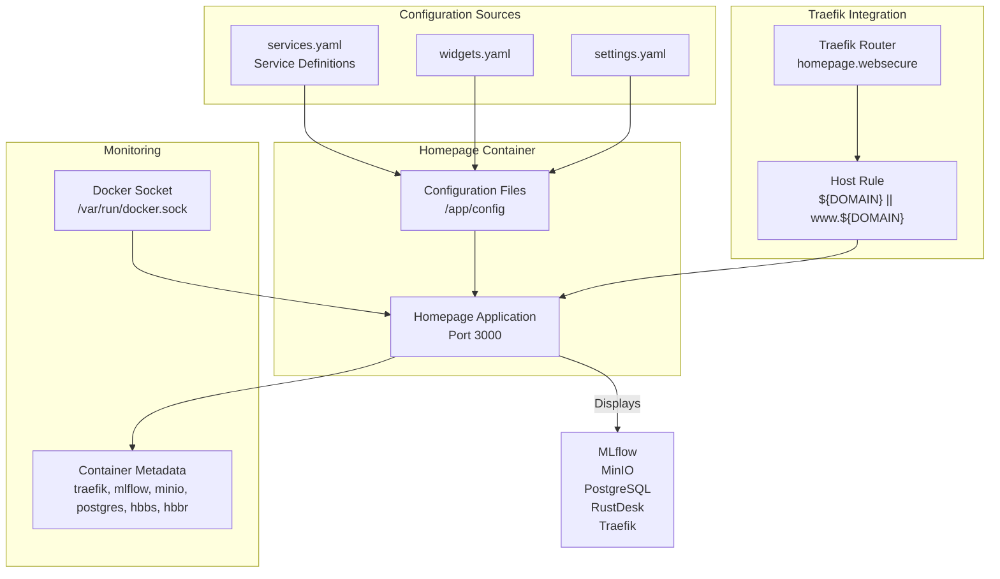
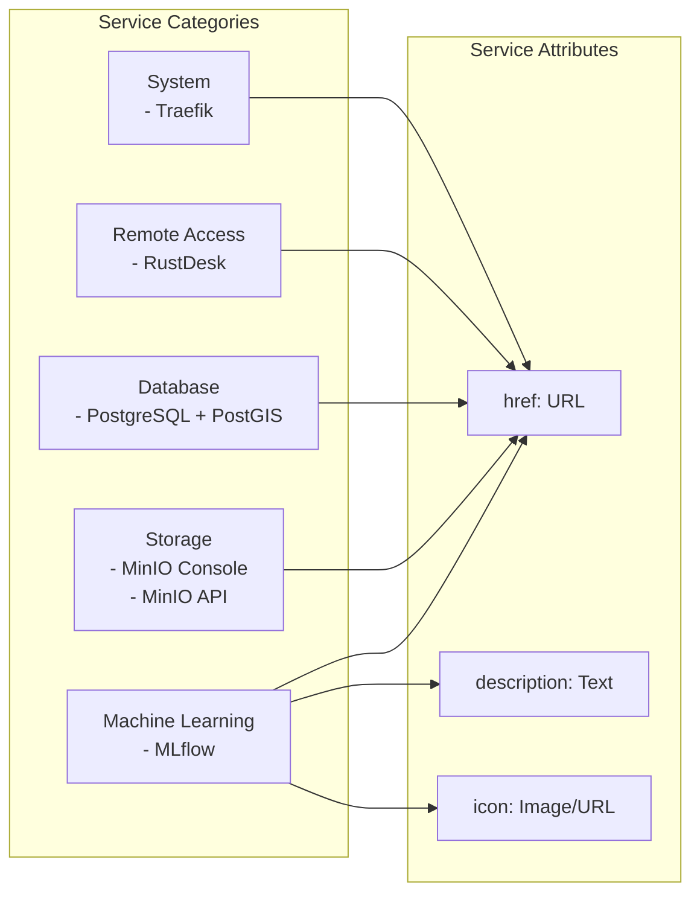
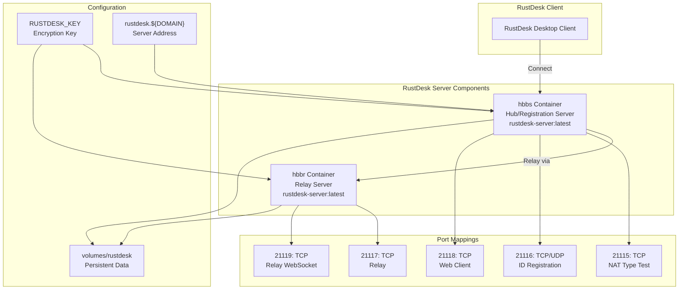
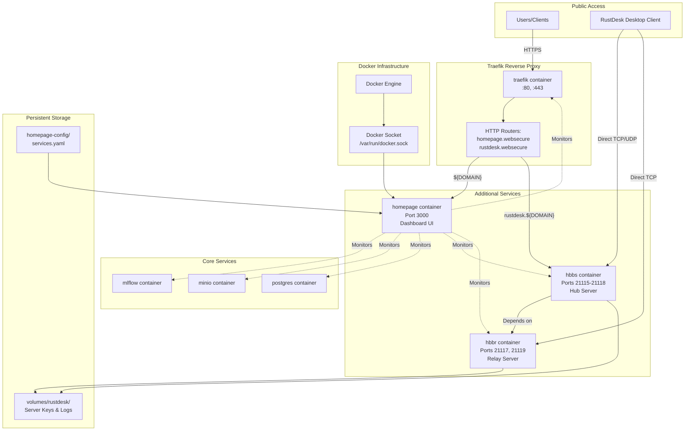

# Additional Services

<details>
<summary>Relevant source files</summary>

The following files were used as context for generating this wiki page:

- [infra/docker-compose.yml](infra/docker-compose.yml)
- [infra/homepage-config/services.yaml](infra/homepage-config/services.yaml)

</details>


This page documents the auxiliary services in the infrastructure stack that provide operational visibility and remote access capabilities. The **Homepage dashboard** serves as a centralized monitoring interface for all services, while the **RustDesk server** enables secure remote desktop access to development environments.

For information about the core infrastructure services (Traefik, MLflow, MinIO, PostgreSQL), see [Service Architecture](#4.1), [Traefik Reverse Proxy](#4.4), [MLflow Tracking Server](#4.5), and [Storage Services](#4.6).

## Service Overview

The infrastructure stack includes two additional services beyond the core ML operations components:

| Service | Container(s) | Purpose | Subdomain |
|---------|-------------|---------|-----------|
| Homepage | `homepage` | Service monitoring dashboard | Root domain (`${DOMAIN}`) |
| RustDesk | `hbbs`, `hbbr` | Remote desktop server | `rustdesk.${DOMAIN}` |

Sources: [infra/docker-compose.yml:40-60](), [infra/docker-compose.yml:138-175]()

## Homepage Dashboard Service

### Architecture and Role

Homepage is a web-based dashboard that provides centralized monitoring and quick access to all infrastructure services. The service monitors Docker containers through the Docker socket, displaying real-time status, links, and descriptions for each service in the stack.



**Homepage Dashboard Architecture**

The `homepage` container runs the dashboard application and mounts two critical volumes: the configuration directory and the Docker socket for container monitoring.

Sources: [infra/docker-compose.yml:40-60]()

### Container Configuration

The Homepage service is defined in the Docker Compose stack with the following configuration:

```yaml
homepage:
  image: ghcr.io/gethomepage/homepage:latest
  container_name: homepage
  restart: unless-stopped
  environment:
    HOMEPAGE_ALLOWED_HOSTS: ${HOMEPAGE_ALLOWED_HOSTS}
    PUID: ${PUID}
    PGID: ${PGID}
    TZ: ${TZ}
  volumes:
    - ${HOMEPAGE_CONFIG:-./homepage-config}:/app/config
    - /var/run/docker.sock:/var/run/docker.sock:ro
```

**Environment Variables:**

| Variable | Purpose | Source |
|----------|---------|--------|
| `HOMEPAGE_ALLOWED_HOSTS` | Permitted hostnames for accessing the dashboard | `.env` file |
| `PUID` | User ID for file permissions | `.env` file |
| `PGID` | Group ID for file permissions | `.env` file |
| `TZ` | Timezone for timestamp display | `.env` file |

Sources: [infra/docker-compose.yml:44-48]()

### Traefik Routing Configuration

Homepage is exposed on the root domain using Traefik labels:

| Label | Value | Purpose |
|-------|-------|---------|
| `traefik.enable` | `true` | Enable Traefik routing |
| `traefik.http.routers.homepage.rule` | `Host(\`${DOMAIN}\`) \|\| Host(\`www.${DOMAIN}\`)` | Route root and www subdomain |
| `traefik.http.routers.homepage.entrypoints` | `websecure` | Use HTTPS entrypoint (port 443) |
| `traefik.http.routers.homepage.tls.certresolver` | `letsencrypt` | Automatic SSL certificates |
| `traefik.http.services.homepage.loadbalancer.server.port` | `3000` | Internal container port |

The dashboard is accessible at both `https://${DOMAIN}` and `https://www.${DOMAIN}`.

Sources: [infra/docker-compose.yml:52-58]()

### Service Configuration

The Homepage dashboard reads service definitions from the configuration directory. The `services.yaml` file defines the services displayed on the dashboard:



**Service Categories and Definitions**

Each service entry in `services.yaml` includes three attributes: `href` (URL), `description` (explanatory text), and `icon` (visual identifier).

Sources: [infra/homepage-config/services.yaml:1-35]()

### Docker Socket Monitoring

The Homepage service monitors Docker containers by mounting the Docker socket in read-only mode:

```
/var/run/docker.sock:/var/run/docker.sock:ro
```

This allows Homepage to:
- Query container status (running, stopped, restarting)
- Display container metadata (names, images, ports)
- Show resource usage (CPU, memory, network)
- Detect container lifecycle events

The read-only mount ensures Homepage cannot modify container state, maintaining security boundaries.

Sources: [infra/docker-compose.yml:51]()

## RustDesk Remote Desktop Server

### Architecture and Components

RustDesk is an open-source remote desktop solution consisting of two server components: **hbbs** (hub server) and **hbbr** (relay server). Together, these services enable secure remote desktop connections to development machines.



**RustDesk Server Architecture**

The `hbbs` container handles client registration and coordination, while `hbbr` provides relay functionality for NAT traversal. Both containers share the same encryption key and data volume.

Sources: [infra/docker-compose.yml:138-175]()

### HBBS (Hub Server) Configuration

The `hbbs` container is the primary registration and coordination server:

**Container Definition:**

| Property | Value | Purpose |
|----------|-------|---------|
| Image | `rustdesk/rustdesk-server:latest` | Official RustDesk server image |
| Container Name | `hbbs` | Hub/registration server identifier |
| Restart Policy | `unless-stopped` | Automatic restart on failure |
| Environment | `ALWAYS_USE_RELAY=Y` | Force all connections through relay |
| Command | `hbbs -r rustdesk.${DOMAIN} -k ${RUSTDESK_KEY}` | Start hub server with domain and key |

**Port Mappings:**

| Host Port | Container Port | Protocol | Purpose |
|-----------|----------------|----------|---------|
| 21115 | 21115 | TCP | NAT type test server |
| 21116 | 21116 | TCP | ID registration server |
| 21116 | 21116 | UDP | ID registration server (UDP) |
| 21118 | 21118 | TCP | Web client HTTP server |

The `hbbs` container depends on `hbbr` to ensure the relay server is available before accepting connections.

Sources: [infra/docker-compose.yml:138-162]()

### HBBR (Relay Server) Configuration

The `hbbr` container provides NAT traversal and relay services:

**Container Definition:**

| Property | Value | Purpose |
|----------|-------|---------|
| Image | `rustdesk/rustdesk-server:latest` | Official RustDesk server image |
| Container Name | `hbbr` | Relay server identifier |
| Restart Policy | `unless-stopped` | Automatic restart on failure |
| Command | `hbbr -k ${RUSTDESK_KEY}` | Start relay server with encryption key |

**Port Mappings:**

| Host Port | Container Port | Protocol | Purpose |
|-----------|----------------|----------|---------|
| 21117 | 21117 | TCP | Relay server |
| 21119 | 21119 | TCP | Relay server WebSocket |

Sources: [infra/docker-compose.yml:164-175]()

### RustDesk Configuration Parameters

Both RustDesk containers share common configuration:

**Environment Variables:**

| Variable | Usage | Description |
|----------|-------|-------------|
| `RUSTDESK_KEY` | Command line `-k` flag | Encryption key for secure communication |
| `DOMAIN` | Command line `-r rustdesk.${DOMAIN}` | Server domain for client configuration |

**Volume Mounts:**

```
${RUSTDESK_DATA_DIR:-./volumes/rustdesk}:/root
```

The data directory stores:
- Server identification keys
- Client registration data
- Connection logs
- Configuration persistence

Sources: [infra/docker-compose.yml:144](), [infra/docker-compose.yml:168]()

### Traefik Integration

The `hbbs` container exposes its web client interface through Traefik:

**Traefik Labels:**

| Label | Value | Purpose |
|-------|-------|---------|
| `traefik.enable` | `true` | Enable Traefik routing |
| `traefik.http.routers.rustdesk.rule` | `Host(\`rustdesk.${DOMAIN}\`)` | Route rustdesk subdomain |
| `traefik.http.routers.rustdesk.entrypoints` | `websecure` | Use HTTPS (port 443) |
| `traefik.http.routers.rustdesk.tls.certresolver` | `letsencrypt` | Automatic SSL certificates |
| `traefik.http.services.rustdesk.loadbalancer.server.port` | `21118` | Route to web client port |

The web interface is accessible at `https://rustdesk.${DOMAIN}`, while the native RustDesk desktop client connects directly to the exposed ports (21115, 21116, 21117, 21119).

Sources: [infra/docker-compose.yml:155-160]()

## Service Integration

The following diagram illustrates how Homepage and RustDesk integrate with the core infrastructure:



**Infrastructure Integration Architecture**

The Homepage dashboard monitors all services through the Docker socket, while RustDesk operates independently with direct port access for remote desktop connections. Both services integrate with Traefik for HTTPS access to their web interfaces.

Sources: [infra/docker-compose.yml:40-175]()

### Network Configuration

All services in the stack share the `traefik-network` bridge network, enabling:

- **Homepage**: Access to Docker socket for monitoring, HTTP communication with Traefik
- **RustDesk (hbbs, hbbr)**: HTTP communication with Traefik for web interface, direct port exposure for desktop client
- **Cross-service communication**: Homepage can query metadata from all containers on the shared network

The network is defined at the bottom of the Docker Compose file:

```yaml
networks:
  traefik-network:
    name: traefik-network
    driver: bridge
```

Sources: [infra/docker-compose.yml:177-180](), [infra/docker-compose.yml:60](), [infra/docker-compose.yml:162](), [infra/docker-compose.yml:175]()

### Volume Management

The additional services use the following volume mounts:

| Service | Host Path | Container Path | Purpose |
|---------|-----------|----------------|---------|
| `homepage` | `${HOMEPAGE_CONFIG:-./homepage-config}` | `/app/config` | Dashboard configuration files |
| `homepage` | `/var/run/docker.sock` | `/var/run/docker.sock` | Docker container monitoring (read-only) |
| `hbbs` | `${RUSTDESK_DATA_DIR:-./volumes/rustdesk}` | `/root` | Server keys and registration data |
| `hbbr` | `${RUSTDESK_DATA_DIR:-./volumes/rustdesk}` | `/root` | Server keys and relay data |

Both RustDesk containers share the same data directory to maintain consistent server identification and encryption keys.

Sources: [infra/docker-compose.yml:49-51](), [infra/docker-compose.yml:145-146](), [infra/docker-compose.yml:169-170]()