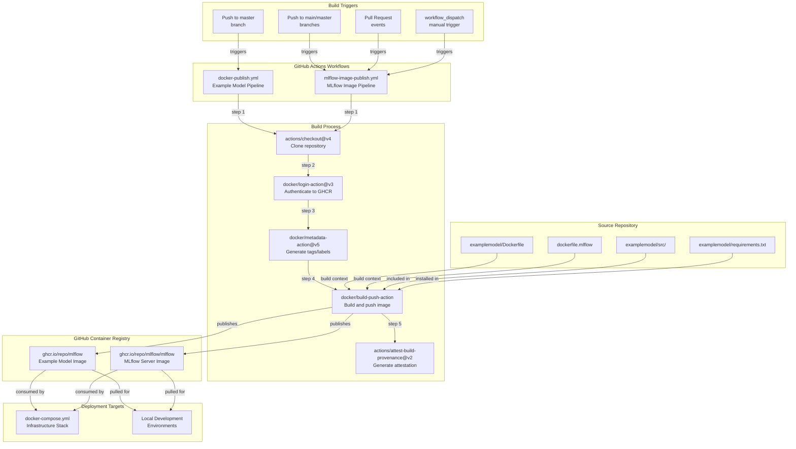
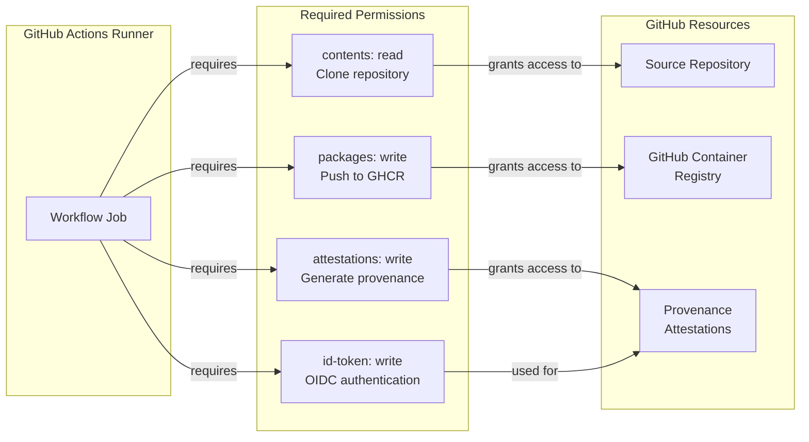
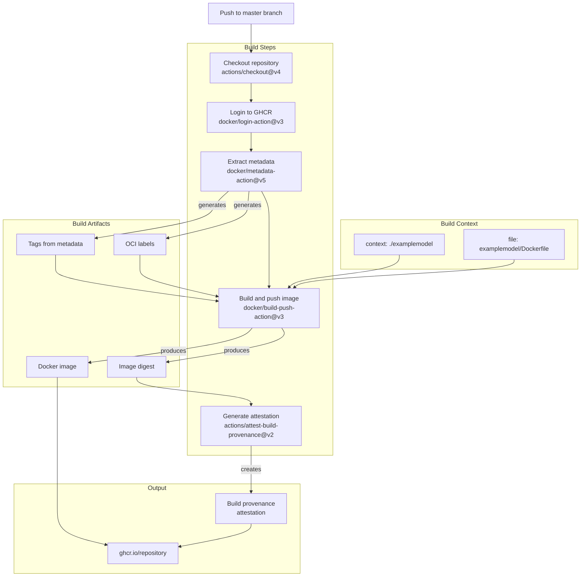
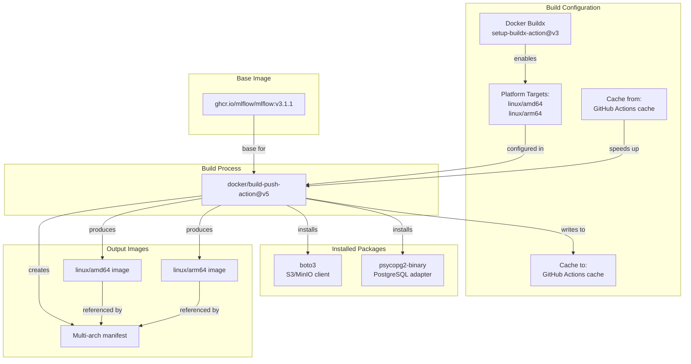
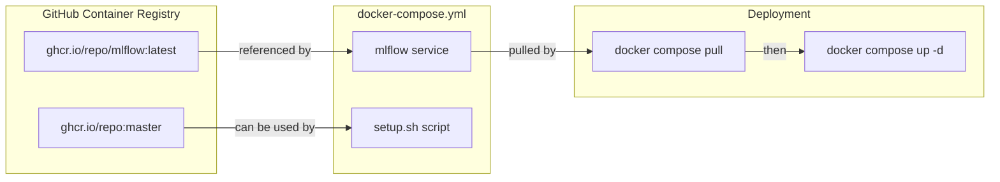

# CI/CD Pipelines

<details>
<summary>Relevant source files</summary>

The following files were used as context for generating this wiki page:

- [.dockerignore](.dockerignore)
- [.github/workflows/docker-publish.yml](.github/workflows/docker-publish.yml)
- [.github/workflows/mlflow-image-publish.yml](.github/workflows/mlflow-image-publish.yml)
- [dockerfile.mlflow](dockerfile.mlflow)
- [examplemodel/Dockerfile](examplemodel/Dockerfile)
- [examplemodel/requirements.txt](examplemodel/requirements.txt)

</details>


This document describes the automated CI/CD pipelines implemented via GitHub Actions for building and publishing Docker images. The repository contains two primary pipelines: one for the example model container and one for the custom MLflow server image. Both pipelines publish images to GitHub Container Registry (GHCR) for use in the infrastructure stack.

For information about deploying the published images, see [Infrastructure Deployment](#6.1). For details on the infrastructure services that consume these images, see [Service Architecture](#4.1).

## Overview

The CI/CD system automates the creation of production-ready Docker images through GitHub Actions workflows. Each workflow is triggered on code changes and publishes multi-architecture images to GHCR with appropriate tagging strategies.

### CI/CD Pipeline Architecture



**Sources:** [.github/workflows/docker-publish.yml:1-51](), [.github/workflows/mlflow-image-publish.yml:1-81]()

### Published Images

| Image | Registry Path | Purpose | Workflow |
|-------|--------------|---------|----------|
| Example Model | `ghcr.io/<repository>` | Contains trained model and inference code | `docker-publish.yml` |
| MLflow Server | `ghcr.io/<repository>/mlflow` | Custom MLflow with S3 and PostgreSQL support | `mlflow-image-publish.yml` |

**Sources:** [.github/workflows/docker-publish.yml:8-9](), [.github/workflows/mlflow-image-publish.yml:16-17]()

## Workflow Components

### Common Workflow Elements

Both workflows share common structural components:

**Authentication**: Uses `docker/login-action@v3` with GitHub token-based authentication to GHCR [.github/workflows/docker-publish.yml:24-28](), [.github/workflows/mlflow-image-publish.yml:34-38]().

**Metadata Extraction**: Uses `docker/metadata-action@v5` to generate Docker tags and OCI labels from Git metadata [.github/workflows/docker-publish.yml:29-33](), [.github/workflows/mlflow-image-publish.yml:40-49]().

**Build and Push**: Uses `docker/build-push-action` to build images and push to GHCR [.github/workflows/docker-publish.yml:35-43](), [.github/workflows/mlflow-image-publish.yml:51-61]().

### Permissions Model



**Sources:** [.github/workflows/docker-publish.yml:14-18](), [.github/workflows/mlflow-image-publish.yml:22-24]()

## Example Model Image Pipeline

The example model pipeline builds a containerized version of the refugee camp detection model with all dependencies and code.

### Workflow Triggers

- **Push events**: Triggers on pushes to `master` branch [.github/workflows/docker-publish.yml:4-5]()
- **Manual**: Can be triggered via GitHub Actions UI (implied by workflow structure)

### Build Process



**Sources:** [.github/workflows/docker-publish.yml:3-50]()

### Dockerfile Structure

The example model Dockerfile [examplemodel/Dockerfile:1-14]() implements a lean build:

1. **Base Image**: `python:3.11-slim-bookworm` - Debian-based Python runtime
2. **System Dependencies**: Installs GDAL for geospatial operations [examplemodel/Dockerfile:3-7]()
3. **Application Setup**: Copies `requirements.txt` and installs Python dependencies [examplemodel/Dockerfile:11-12]()
4. **Code Deployment**: Copies entire application code [examplemodel/Dockerfile:14]()

**Build Context Exclusions**: The `.dockerignore` file [.dockerignore:1-51]() excludes development artifacts, documentation, and virtual environments to minimize image size.

### Image Tagging Strategy

The `docker/metadata-action` generates tags based on Git references:

| Git Event | Generated Tag |
|-----------|---------------|
| Push to master | `ghcr.io/<repo>:master` |
| Commit SHA | `ghcr.io/<repo>:sha-<short-sha>` |

**Sources:** [.github/workflows/docker-publish.yml:29-33]()

## MLflow Custom Image Pipeline

The MLflow pipeline builds a custom server image with S3 (MinIO) and PostgreSQL backend support, which is consumed by the infrastructure stack.

### Workflow Triggers

The workflow supports multiple trigger mechanisms [.github/workflows/mlflow-image-publish.yml:3-13]():

| Trigger Type | Condition | Purpose |
|--------------|-----------|---------|
| Push to main/master | Changes to `dockerfile.mlflow` or workflow file | Automated production builds |
| Pull Request | Changes to `dockerfile.mlflow` | Preview builds for testing |
| Manual Dispatch | `workflow_dispatch` | On-demand builds |

### Multi-Platform Build



**Sources:** [.github/workflows/mlflow-image-publish.yml:30-61]()

The multi-platform build enables deployment on both x86_64 and ARM64 architectures (e.g., Apple Silicon, AWS Graviton). The GitHub Actions cache is used to accelerate subsequent builds [.github/workflows/mlflow-image-publish.yml:60-61]().

### Custom MLflow Dockerfile

The `dockerfile.mlflow` [dockerfile.mlflow:1-30]() implements a multi-stage build:

**Stage 1: Base Configuration** [dockerfile.mlflow:5-20]()
- Starts from official MLflow image `ghcr.io/mlflow/mlflow:v3.1.1`
- Sets Python environment variables for optimization
- Installs `boto3` for S3/MinIO compatibility
- Installs `psycopg2-binary` for PostgreSQL connectivity

**Stage 2: Final Image** [dockerfile.mlflow:22-30]()
- Copies installed packages from base stage
- Sets working directory to `/app`
- Exposes port 5000 for MLflow UI and API

This custom image is required because the standard MLflow image lacks S3 and PostgreSQL backend support needed by the infrastructure stack.

### Tagging Strategy

The workflow implements a sophisticated tagging strategy [.github/workflows/mlflow-image-publish.yml:45-49]():

| Tag Type | Format | Example | When Applied |
|----------|--------|---------|--------------|
| Branch reference | `type=ref,event=branch` | `master`, `main` | On branch push |
| PR reference | `type=ref,event=pr` | `pr-123` | On pull request |
| Commit SHA | `type=sha,prefix={{branch}}-` | `master-abc1234` | All pushes |
| Latest | `type=raw,value=latest` | `latest` | Only on default branch |

This strategy provides:
- **Stable tags** (`latest`) for production deployments
- **Versioned tags** (commit SHA) for reproducibility
- **Preview tags** (PR numbers) for testing

**Sources:** [.github/workflows/mlflow-image-publish.yml:40-49]()

### Build Summary Generation

The workflow generates a GitHub Actions job summary [.github/workflows/mlflow-image-publish.yml:63-80]() that displays:

1. Image registry path
2. All generated tags
3. Supported platforms
4. Usage example for `docker-compose.yml`

This summary provides immediate feedback on build artifacts and their consumption path.

## Image Consumption

### Infrastructure Stack Integration

The published images are referenced in the infrastructure stack:



The MLflow service in [docker-compose.yml:16.88]() (referenced in high-level diagrams) uses the custom MLflow image. The `setup.sh` script [setup.sh:6.88]() (referenced in high-level diagrams) pulls the latest images before starting services.

**Sources:** High-level system diagrams, [.github/workflows/mlflow-image-publish.yml:76-80]()

### Local Development Usage

Developers can pull and use the published images:

```bash
# Pull the latest MLflow image
docker pull ghcr.io/<repository>/mlflow:latest

# Pull a specific version by commit SHA
docker pull ghcr.io/<repository>/mlflow:master-abc1234

# Pull the example model image
docker pull ghcr.io/<repository>:master
```

## Security Features

### Build Provenance Attestation

The example model pipeline generates cryptographically signed build provenance [.github/workflows/docker-publish.yml:45-50]():

1. **Subject**: The published Docker image
2. **Digest**: SHA256 hash of image layers
3. **Provenance**: Build environment, inputs, and process
4. **Storage**: Pushed to GHCR alongside image

This attestation enables:
- **Supply chain verification**: Confirm image was built by official workflow
- **Reproducibility**: Trace image back to exact source code and build environment
- **Compliance**: Meet security and audit requirements

### Authentication Security

Both workflows use `GITHUB_TOKEN` [.github/workflows/docker-publish.yml:28]() [.github/workflows/mlflow-image-publish.yml:38](), which:
- Is automatically generated by GitHub Actions
- Has minimal required permissions
- Expires after workflow completion
- Is scoped to the specific repository

**Sources:** [.github/workflows/docker-publish.yml:14-28](), [.github/workflows/mlflow-image-publish.yml:22-38]()

## Workflow Maintenance

### Updating Dependencies

**Example Model Dependencies**: Modify [examplemodel/requirements.txt:1-402]() and commit. The workflow rebuilds automatically on next push to `master`.

**MLflow Base Image**: Update the `MLFLOW_VERSION` build argument in [dockerfile.mlflow:1]() to use a different MLflow release. The workflow rebuilds automatically on file change.

**MLflow Python Packages**: Update `BOTO3_VERSION` or `PSYCOPG2_VERSION` arguments in [dockerfile.mlflow:2-3]() to pin specific versions.

### Triggering Manual Builds

The MLflow workflow supports manual triggering:

1. Navigate to GitHub Actions tab
2. Select "Build and Push MLflow Docker Image" workflow
3. Click "Run workflow" dropdown
4. Select branch and click "Run workflow" button

**Sources:** [.github/workflows/mlflow-image-publish.yml:13]()

### Monitoring Build Status

Build status is visible:
- **Repository badges**: Add workflow status badge to README
- **GitHub Actions tab**: View all workflow runs and logs
- **GHCR packages page**: View published images and tags
- **Job summaries**: Generated markdown summary for each MLflow build [.github/workflows/mlflow-image-publish.yml:63-80]()

**Sources:** [.github/workflows/docker-publish.yml:1-51](), [.github/workflows/mlflow-image-publish.yml:1-81]()