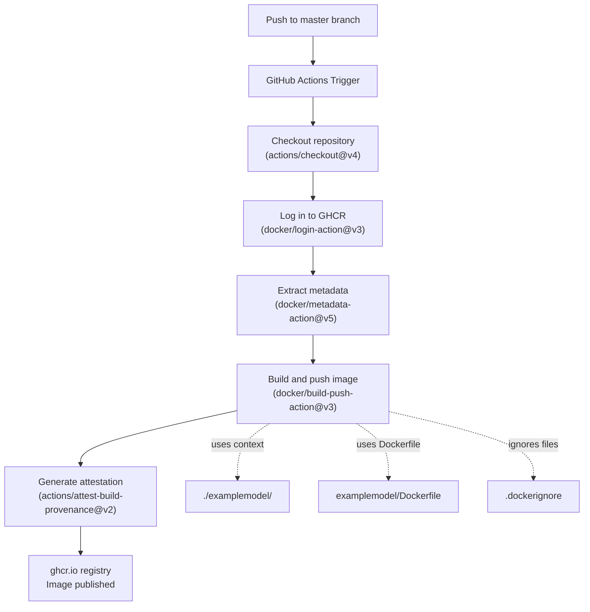
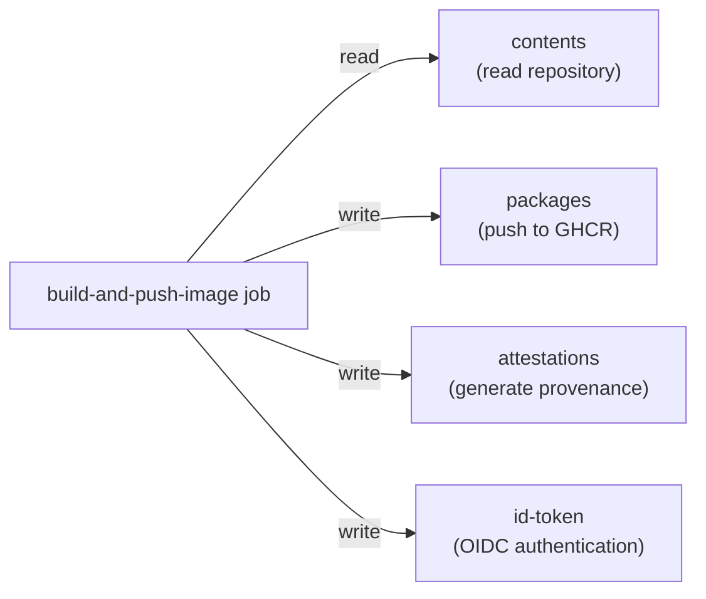
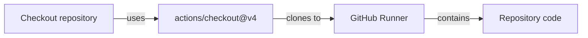
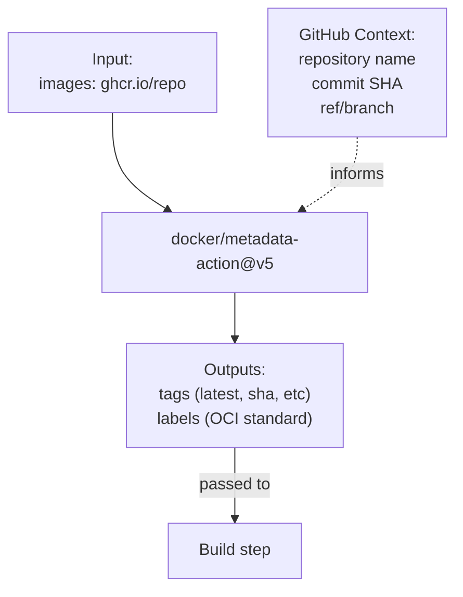
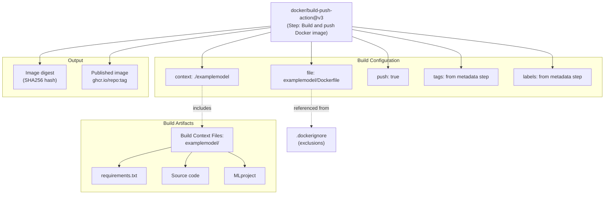
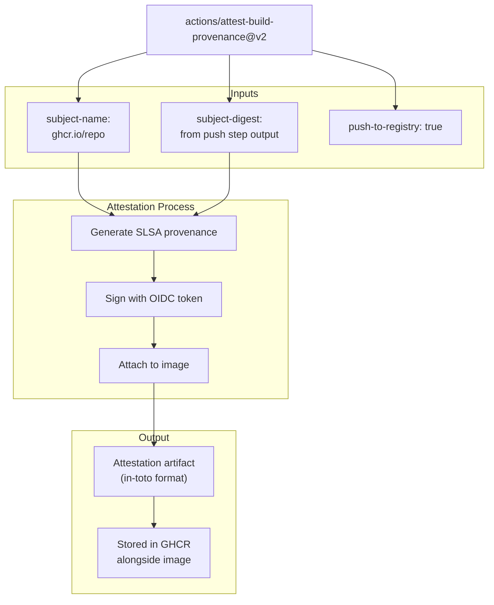
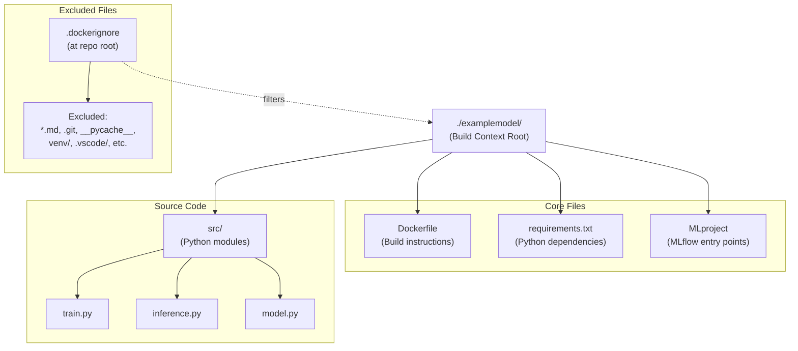
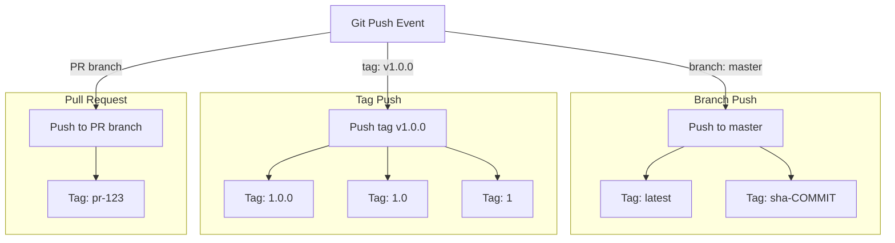
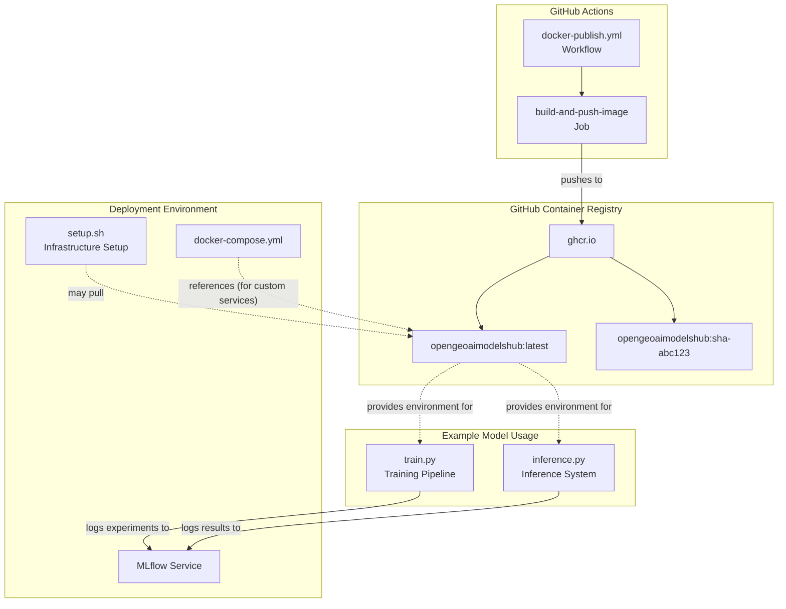

# Docker Image Publishing Workflows

<details>
<summary>Relevant source files</summary>

The following files were used as context for generating this wiki page:

- [.dockerignore](.dockerignore)
- [.github/workflows/docker-publish.yml](.github/workflows/docker-publish.yml)
- [dockerfile.mlflow](dockerfile.mlflow)
- [examplemodel/Dockerfile](examplemodel/Dockerfile)
- [examplemodel/requirements.txt](examplemodel/requirements.txt)

</details>


## Purpose and Scope

This document describes the automated Docker image publishing workflows implemented using GitHub Actions in the OpenGeoAIModelHub repository. These workflows automatically build and publish Docker images to GitHub Container Registry (GHCR) whenever code is pushed to the master branch. 

The primary workflow covered here handles publishing the example model's Docker image. For details about the MLflow custom image build process, see [MLflow Custom Image Pipeline](#5.2). For information about deploying the published images, see [Infrastructure Deployment](#6.1).

**Sources:** [.github/workflows/docker-publish.yml:1-51]()

---

## Workflow Overview

The Docker image publishing system uses GitHub Actions to automate the build-and-push process. The workflow is triggered on every push to the `master` branch and publishes the resulting image to `ghcr.io`, making it available for deployment in production environments.



**Workflow Execution Flow**

The publishing process follows these stages:

1. **Trigger**: Push to master branch activates the workflow
2. **Checkout**: Repository code is checked out to the runner
3. **Authentication**: GitHub token authenticates to GHCR
4. **Metadata Generation**: Tags and labels are extracted from repository metadata
5. **Build and Push**: Docker image is built from the examplemodel context and pushed to GHCR
6. **Attestation**: Build provenance is generated and attached to the image

**Sources:** [.github/workflows/docker-publish.yml:3-51]()

---

## GitHub Actions Workflow Configuration

### Workflow Trigger and Environment

The workflow is defined in `.github/workflows/docker-publish.yml` and uses the following configuration:

| Configuration | Value | Purpose |
|--------------|-------|---------|
| **Workflow Name** | `Create and publish a Docker image` | Identifies the workflow in GitHub UI |
| **Trigger** | `push` to `branches: ["master"]` | Activates on master branch commits |
| **Registry** | `ghcr.io` | GitHub Container Registry endpoint |
| **Image Name** | `${{ github.repository }}` | Uses repository name as image name |

The workflow defines two critical environment variables at the workflow level:

```yaml
env:
  REGISTRY: ghcr.io
  IMAGE_NAME: ${{ github.repository }}
```

These variables are referenced throughout the workflow to ensure consistent registry and naming conventions.

**Sources:** [.github/workflows/docker-publish.yml:1-10]()

### Job Permissions

The `build-and-push-image` job requires specific permissions to interact with GitHub resources:



**Permission Mapping**

| Permission | Access Level | Usage |
|-----------|-------------|-------|
| `contents` | `read` | Access repository files for build context |
| `packages` | `write` | Push Docker images to GitHub Packages (GHCR) |
| `attestations` | `write` | Attach build provenance attestations to images |
| `id-token` | `write` | Generate OIDC tokens for secure attestation signing |

**Sources:** [.github/workflows/docker-publish.yml:11-18]()

---

## Workflow Steps Breakdown

### Step 1: Repository Checkout



The first step uses `actions/checkout@v4` to clone the repository to the GitHub Actions runner. This provides access to all files needed for the Docker build, including the Dockerfile and build context.

**Sources:** [.github/workflows/docker-publish.yml:21-22]()

### Step 2: Container Registry Authentication

The workflow authenticates to GHCR using the `docker/login-action@v3`:

```yaml
- name: Log in to the Container registry
  uses: docker/login-action@v3
  with:
    registry: ${{ env.REGISTRY }}
    username: ${{ github.actor }}
    password: ${{ secrets.GITHUB_TOKEN }}
```

**Authentication Parameters**

| Parameter | Value | Description |
|-----------|-------|-------------|
| `registry` | `ghcr.io` | Target container registry |
| `username` | `${{ github.actor }}` | GitHub user who triggered the workflow |
| `password` | `${{ secrets.GITHUB_TOKEN }}` | Automatically provided GitHub token with package write permissions |

The `GITHUB_TOKEN` is automatically available in GitHub Actions and has the necessary permissions to push to GHCR when the job has `packages: write` permission.

**Sources:** [.github/workflows/docker-publish.yml:23-28]()

### Step 3: Metadata Extraction

The `docker/metadata-action@v5` generates Docker tags and OCI-compliant labels from repository metadata:



The action automatically generates tags based on the Git reference (branch, tag, or SHA) and creates standard OCI labels including repository URL, commit SHA, and creation timestamp.

**Sources:** [.github/workflows/docker-publish.yml:29-33]()

### Step 4: Build and Push Image

The core build step uses `docker/build-push-action@v3`:



**Build Configuration Details**

| Parameter | Value | Purpose |
|-----------|-------|---------|
| `context` | `./examplemodel` | Directory containing files to include in build context |
| `push` | `true` | Push the built image to the registry |
| `file` | `examplemodel/Dockerfile` | Path to Dockerfile relative to repository root |
| `tags` | `${{ steps.meta.outputs.tags }}` | Image tags from metadata action |
| `labels` | `${{ steps.meta.outputs.labels }}` | OCI labels from metadata action |

The build context (`./examplemodel`) includes all files in the examplemodel directory except those excluded by `.dockerignore`.

**Sources:** [.github/workflows/docker-publish.yml:35-43]()

### Step 5: Build Provenance Attestation

The final step generates cryptographic attestations for supply chain security:



**Attestation Parameters**

| Parameter | Value | Purpose |
|-----------|-------|---------|
| `subject-name` | `${{ env.REGISTRY }}/${{ env.IMAGE_NAME}}` | Identifies the attested image |
| `subject-digest` | `${{ steps.push.outputs.digest }}` | SHA256 digest of the built image |
| `push-to-registry` | `true` | Stores attestation in GHCR alongside the image |

The attestation provides verifiable proof of:
- Where the image was built (GitHub Actions)
- When it was built (timestamp)
- What source code was used (commit SHA)
- How it was built (workflow definition)

This enables supply chain verification using tools like `cosign` or `slsa-verifier`.

**Sources:** [.github/workflows/docker-publish.yml:45-50]()

---

## Build Context and Docker Configuration

### Example Model Build Context

The workflow builds from the `./examplemodel` directory, which contains:



**Sources:** [.github/workflows/docker-publish.yml:39](), [examplemodel/Dockerfile:1-15]()

### Dockerfile Structure

The `examplemodel/Dockerfile` defines the image build process:

**Base Image and System Dependencies**

```dockerfile
FROM python:3.11-slim-bookworm
```

The image uses Python 3.11 on Debian Bookworm (slim variant for smaller image size). It installs GDAL for geospatial data processing:

```dockerfile
RUN apt-get update && apt-get install -y --no-install-recommends \
    gdal-bin \
    libgdal-dev \
    && apt-get clean \
    && rm -rf /var/lib/apt/lists/*
```

**Application Setup**

The Dockerfile sets the working directory and installs Python dependencies:

```dockerfile
WORKDIR /app
COPY requirements.txt .
RUN pip install --no-cache-dir -r requirements.txt
COPY . .
```

**Layer Optimization**

The build process is optimized for layer caching:
1. Install system dependencies (rarely changes)
2. Copy `requirements.txt` only (triggers rebuild only when dependencies change)
3. Install Python packages
4. Copy application code (changes most frequently)

**Sources:** [examplemodel/Dockerfile:1-15]()

### Excluded Files

The `.dockerignore` file at the repository root excludes unnecessary files from the build context:

| Category | Patterns | Reason for Exclusion |
|----------|----------|---------------------|
| Version Control | `.git`, `.gitignore` | Not needed in container |
| Python Artifacts | `__pycache__/`, `*.pyc`, `.pytest_cache/` | Generated files, recreated during build |
| Virtual Environments | `venv/`, `env/`, `ENV/` | Dependencies installed via requirements.txt |
| IDE Files | `.vscode/`, `.idea/`, `*.swp` | Editor-specific configuration |
| Documentation | `*.md`, `docs/` | Not needed at runtime |
| Build Artifacts | `build/`, `dist/`, `*.egg-info/` | Intermediate files |

Excluding these files reduces the build context size, speeding up uploads to the build environment and reducing final image size.

**Sources:** [.dockerignore:1-51]()

---

## Image Tagging Strategy

The `docker/metadata-action@v5` generates image tags based on Git references:



**Default Tagging Behavior**

For pushes to `master` (the configured trigger branch), the action generates:
- `latest`: Points to the most recent master build
- `sha-<commit>`: Immutable tag referencing specific commit

**Image Location**

The published image is available at:
```
ghcr.io/<github-username>/<repo-name>:<tag>
```

For example, if the repository is `kshitijrajsharma/opengeoaimodelshub`, images are published to:
```
ghcr.io/kshitijrajsharma/opengeoaimodelshub:latest
ghcr.io/kshitijrajsharma/opengeoaimodelshub:sha-abc123
```

**Sources:** [.github/workflows/docker-publish.yml:29-33]()

---

## Relationship to Infrastructure Stack

The published Docker image integrates with the broader infrastructure system:



**Integration Points**

1. **Infrastructure Setup**: The `setup.sh` script can pull the published image for custom service deployment
2. **MLflow Execution**: The image provides a consistent environment for MLflow project runs
3. **Example Model Training**: The published image includes all dependencies needed for the training pipeline
4. **Inference Deployment**: The image can be deployed to run inference services

**Sources:** [.github/workflows/docker-publish.yml:1-51]()

---

## Workflow Execution Summary

The complete workflow execution can be summarized as follows:

| Stage | Action | Input | Output |
|-------|--------|-------|--------|
| **Trigger** | Push to master detected | Git push event | Workflow initiated |
| **Checkout** | `actions/checkout@v4` | Repository URL | Code on runner |
| **Authentication** | `docker/login-action@v3` | GITHUB_TOKEN | Authenticated Docker client |
| **Metadata** | `docker/metadata-action@v5` | Repository metadata | Tags and labels |
| **Build** | `docker/build-push-action@v3` | Dockerfile, build context | Published image, digest |
| **Attestation** | `actions/attest-build-provenance@v2` | Image digest | SLSA provenance |

**Workflow File Location**: [.github/workflows/docker-publish.yml:1-51]()

**Related Files**:
- Build Instructions: [examplemodel/Dockerfile:1-15]()
- Context Exclusions: [.dockerignore:1-51]()
- Python Dependencies: [examplemodel/requirements.txt:1-402]()

**Sources:** [.github/workflows/docker-publish.yml:1-51](), [examplemodel/Dockerfile:1-15](), [.dockerignore:1-51](), [examplemodel/requirements.txt:1-402]()