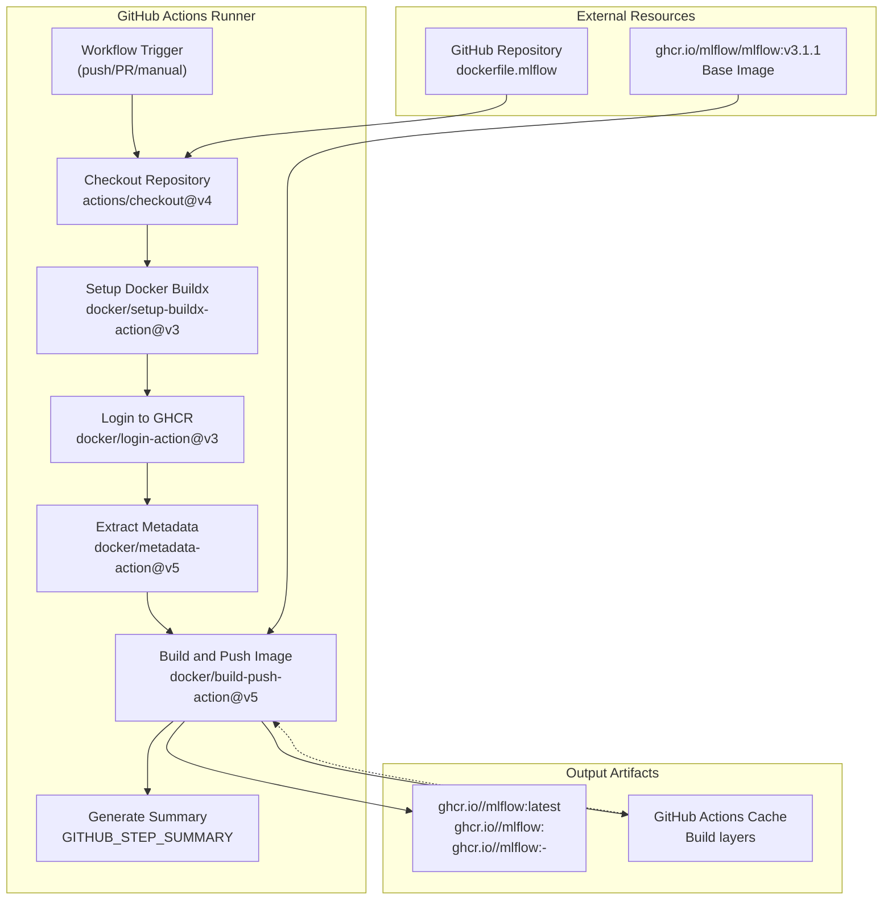
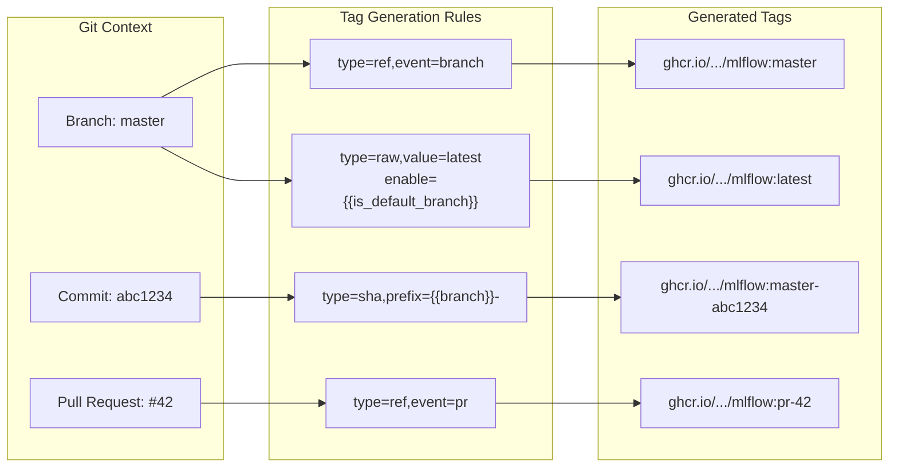

# MLflow Custom Image Pipeline

<details>
<summary>Relevant source files</summary>

The following files were used as context for generating this wiki page:

- [.dockerignore](.dockerignore)
- [.github/workflows/docker-publish.yml](.github/workflows/docker-publish.yml)
- [.github/workflows/mlflow-image-publish.yml](.github/workflows/mlflow-image-publish.yml)
- [dockerfile.mlflow](dockerfile.mlflow)

</details>


## Purpose and Scope

This document details the automated build and publishing pipeline for the custom MLflow Docker image used in the OpenGeoAIModelHub infrastructure stack. The pipeline extends the official MLflow base image with additional dependencies required for S3-compatible storage (MinIO) and PostgreSQL backend connectivity.

For information about the general Docker image publishing workflows including the example model image, see [Docker Image Publishing Workflows](#5.1). For details on how this MLflow image integrates with the infrastructure stack, see [MLflow Tracking Server](#4.5).

## MLflow Custom Image Overview

The custom MLflow image serves as the foundation for the MLflow tracking server in the infrastructure stack. It extends the official `ghcr.io/mlflow/mlflow` base image by adding two critical Python dependencies:

- **boto3**: Enables S3-compatible object storage integration with MinIO
- **psycopg2-binary**: Provides PostgreSQL database connectivity for the backend store

The image is automatically built and published to GitHub Container Registry (GHCR) whenever changes are pushed to the repository, ensuring the infrastructure stack always has access to an up-to-date image.

**Sources:** [dockerfile.mlflow:1-30](), [.github/workflows/mlflow-image-publish.yml:1-81]()

## Dockerfile Structure

### Build Arguments and Base Image

The Dockerfile uses a multi-stage build approach with configurable build arguments:

```dockerfile
ARG MLFLOW_VERSION=v3.1.1
ARG BOTO3_VERSION=""
ARG PSYCOPG2_VERSION=""

FROM ghcr.io/mlflow/mlflow:${MLFLOW_VERSION} as base
```

| Build Argument | Default Value | Purpose |
|----------------|---------------|---------|
| `MLFLOW_VERSION` | `v3.1.1` | Specifies the MLflow base image version |
| `BOTO3_VERSION` | `""` (empty) | Optional version pin for boto3 |
| `PSYCOPG2_VERSION` | `""` (empty) | Optional version pin for psycopg2-binary |

The empty string defaults allow for installing the latest compatible versions of dependencies unless explicitly pinned.

**Sources:** [dockerfile.mlflow:1-5]()

### Environment Configuration

The image configures Python environment variables for optimal container execution:

| Environment Variable | Value | Purpose |
|---------------------|-------|---------|
| `PYTHONUNBUFFERED` | `1` | Ensures real-time log output without buffering |
| `PYTHONDONTWRITEBYTECODE` | `1` | Prevents `.pyc` file generation |
| `PIP_NO_CACHE_DIR` | `1` | Reduces image size by disabling pip cache |
| `PIP_DISABLE_PIP_VERSION_CHECK` | `1` | Suppresses pip version warnings |

**Sources:** [dockerfile.mlflow:7-11]()

### Dependency Installation

The build process dynamically generates a `requirements.txt` file with conditional version pinning:

```dockerfile
RUN echo "boto3${BOTO3_VERSION:+==}${BOTO3_VERSION}" > /tmp/requirements.txt && \
    echo "psycopg2-binary${PSYCOPG2_VERSION:+==}${PSYCOPG2_VERSION}" >> /tmp/requirements.txt

RUN pip install --no-cache-dir -r /tmp/requirements.txt && \
    rm /tmp/requirements.txt
```

The bash parameter expansion `${BOTO3_VERSION:+==}${BOTO3_VERSION}` ensures that if the build argument is empty, no version constraint is applied. If a version is specified, it adds `==<version>` to the requirement.

**Sources:** [dockerfile.mlflow:16-20]()

### Final Stage Configuration

The final stage uses a multi-stage copy pattern to ensure a clean image:

```dockerfile
FROM base as final

COPY --from=base /usr/local/lib/python*/site-packages /usr/local/lib/python*/site-packages
COPY --from=base /usr/local/bin /usr/local/bin

WORKDIR /app
EXPOSE 5000
```

The wildcard pattern `python*/site-packages` ensures compatibility across different Python versions in the base image.

**Sources:** [dockerfile.mlflow:22-30]()

## GitHub Actions Workflow Architecture

### Workflow Trigger Configuration

The workflow is triggered by three mechanisms:

```yaml
on:
  push:
    branches: [main, master]
    paths:
      - "dockerfile.mlflow"
      - ".github/workflows/build-mlflow.yml"
  pull_request:
    branches: [main, master]
    paths:
      - "dockerfile.mlflow"
  workflow_dispatch:
```

| Trigger Type | Branches | Path Filters | Purpose |
|-------------|----------|--------------|---------|
| `push` | `main`, `master` | Dockerfile and workflow file | Automatic builds on commits |
| `pull_request` | `main`, `master` | Dockerfile only | Validation builds for PRs |
| `workflow_dispatch` | N/A | N/A | Manual triggering via UI |

The path filters optimize CI/CD resource usage by only triggering builds when relevant files change.

**Sources:** [.github/workflows/mlflow-image-publish.yml:3-13]()

### Workflow Environment Variables

```yaml
env:
  REGISTRY: ghcr.io
  IMAGE_NAME: ${{ github.repository }}/mlflow
```

The `IMAGE_NAME` dynamically constructs the full image path as `ghcr.io/<owner>/<repo>/mlflow`, ensuring consistent naming across forks.

**Sources:** [.github/workflows/mlflow-image-publish.yml:15-17]()

### Workflow Permissions

The job requires specific GitHub token permissions:

| Permission | Access Level | Purpose |
|-----------|-------------|---------|
| `contents` | `read` | Checkout repository code |
| `packages` | `write` | Push images to GHCR |

**Sources:** [.github/workflows/mlflow-image-publish.yml:22-24]()

## Build Process Flow



**Diagram: MLflow Image Build Pipeline Flow**

**Sources:** [.github/workflows/mlflow-image-publish.yml:26-80]()

### Step-by-Step Breakdown

#### 1. Repository Checkout

```yaml
- name: Checkout repository
  uses: actions/checkout@v4
```

Clones the repository to access [dockerfile.mlflow:1-30]().

#### 2. Docker Buildx Setup

```yaml
- name: Set up Docker Buildx
  uses: docker/setup-buildx-action@v3
```

Enables multi-platform builds and build caching through the Buildx builder.

#### 3. Container Registry Authentication

```yaml
- name: Log in to Container Registry
  uses: docker/login-action@v3
  with:
    registry: ${{ env.REGISTRY }}
    username: ${{ github.actor }}
    password: ${{ secrets.GITHUB_TOKEN }}
```

Authenticates to GHCR using the automatically provided `GITHUB_TOKEN`, scoped to the repository.

#### 4. Metadata Extraction

```yaml
- name: Extract metadata
  id: meta
  uses: docker/metadata-action@v5
  with:
    images: ${{ env.REGISTRY }}/${{ env.IMAGE_NAME }}
    tags: |
      type=ref,event=branch
      type=ref,event=pr
      type=sha,prefix={{branch}}-
      type=raw,value=latest,enable={{is_default_branch}}
```

Generates Docker tags based on Git context. See the Image Tagging Strategy section below for details.

**Sources:** [.github/workflows/mlflow-image-publish.yml:26-50]()

#### 5. Build and Push

```yaml
- name: Build and push Docker image
  uses: docker/build-push-action@v5
  with:
    context: .
    file: ./dockerfile.mlflow
    push: true
    tags: ${{ steps.meta.outputs.tags }}
    labels: ${{ steps.meta.outputs.labels }}
    platforms: linux/amd64,linux/arm64
    cache-from: type=gha
    cache-to: type=gha,mode=max
```

Key configuration parameters:

| Parameter | Value | Effect |
|-----------|-------|--------|
| `context` | `.` | Root directory as build context |
| `file` | `./dockerfile.mlflow` | Explicit Dockerfile path |
| `push` | `true` | Publish image to registry |
| `platforms` | `linux/amd64,linux/arm64` | Multi-architecture support |
| `cache-from` | `type=gha` | Use GitHub Actions cache for layers |
| `cache-to` | `type=gha,mode=max` | Persist all layers to cache |

The `mode=max` cache setting caches all intermediate layers, optimizing subsequent builds.

**Sources:** [.github/workflows/mlflow-image-publish.yml:51-61]()

#### 6. Summary Generation

```yaml
- name: Generate summary
  run: |
    echo "## Docker Image Built Successfully! 🐳" >> $GITHUB_STEP_SUMMARY
    echo "" >> $GITHUB_STEP_SUMMARY
    echo "**Image:** \`${{ env.REGISTRY }}/${{ env.IMAGE_NAME }}\`" >> $GITHUB_STEP_SUMMARY
    echo "" >> $GITHUB_STEP_SUMMARY
    echo "**Tags:**" >> $GITHUB_STEP_SUMMARY
    echo "\`\`\`" >> $GITHUB_STEP_SUMMARY
    echo "${{ steps.meta.outputs.tags }}" >> $GITHUB_STEP_SUMMARY
    echo "\`\`\`" >> $GITHUB_STEP_SUMMARY
```

Creates a GitHub Actions job summary visible in the Actions UI, displaying the built image name, applied tags, and usage examples.

**Sources:** [.github/workflows/mlflow-image-publish.yml:63-80]()

## Image Tagging Strategy

The metadata extraction step applies multiple tag types based on Git context:



**Diagram: Image Tag Generation Based on Git Context**

### Tag Type Reference

| Tag Type | Format | When Applied | Example |
|----------|--------|--------------|---------|
| Branch reference | `<branch-name>` | On push to any branch | `master`, `feature-xyz` |
| PR reference | `pr-<number>` | On pull request builds | `pr-42` |
| SHA with prefix | `<branch>-<short-sha>` | Always | `master-abc1234` |
| Latest | `latest` | Only on default branch (`master`) | `latest` |

This strategy ensures:
- **Traceability**: SHA-based tags link images to specific commits
- **Convenience**: `latest` tag provides easy access to production image
- **Testing**: PR tags enable validation before merging
- **Branch tracking**: Branch tags allow testing branch-specific changes

**Sources:** [.github/workflows/mlflow-image-publish.yml:40-49]()

## Multi-Platform Support

The workflow builds images for both `linux/amd64` and `linux/arm64` architectures:

```yaml
platforms: linux/amd64,linux/arm64
```

### Architecture Support Matrix

| Platform | Use Case | Supported |
|----------|----------|-----------|
| `linux/amd64` | x86_64 servers, cloud VMs | ✓ |
| `linux/arm64` | ARM servers, Apple Silicon, Raspberry Pi | ✓ |

Docker automatically selects the appropriate image variant based on the host architecture when pulling the image.

### Build Cache Strategy

```yaml
cache-from: type=gha
cache-to: type=gha,mode=max
```

The GitHub Actions cache integration provides:

1. **Layer Reuse**: Unchanged layers are fetched from cache instead of rebuilt
2. **Cross-Build Optimization**: Cache is shared between platform builds
3. **Persistent Storage**: Cache survives between workflow runs

The `mode=max` setting caches all intermediate layers, not just final stage layers, maximizing build speed at the cost of cache size.

**Sources:** [.github/workflows/mlflow-image-publish.yml:59-61]()

## Docker Build Context and Exclusions

The build uses the repository root (`.`) as the context, with exclusions defined in [.dockerignore:1-51]():

### Excluded Categories

| Category | Patterns | Rationale |
|----------|----------|-----------|
| Git metadata | `.git`, `.gitignore` | Reduces image size, no runtime value |
| Python artifacts | `__pycache__/`, `*.pyc`, `*.egg-info/` | Build-time generated, not needed in image |
| Virtual environments | `venv/`, `env/`, `ENV/` | Local dev environments |
| IDE files | `.vscode/`, `.idea/`, `*.swp` | Editor-specific configurations |
| Documentation | `*.md`, `docs/` | Not needed at runtime |
| Build artifacts | `build/`, `dist/`, `.cache/` | Intermediate build outputs |

Despite using the root context, the MLflow image build only requires [dockerfile.mlflow:1-30]() itself, as it starts from the official MLflow base image and adds minimal dependencies.

**Sources:** [.dockerignore:1-51](), [.github/workflows/mlflow-image-publish.yml:54-55]()

## Integration with Infrastructure Stack

The published image integrates with the infrastructure stack defined in the `docker-compose.yml`:

```yaml
mlflow:
  image: ghcr.io/<repository>/mlflow:latest
  # ... service configuration
```

The workflow summary provides copy-paste ready configuration:

```
**Usage in docker-compose.yml:**
```yaml
mlflow:
  image: ghcr.io/<repository>/mlflow:latest
```
```

This automated documentation helps users quickly integrate the custom image into their deployment.

**Sources:** [.github/workflows/mlflow-image-publish.yml:76-80]()

## Build Workflow Comparison

The MLflow image pipeline differs from the example model image pipeline ([.github/workflows/docker-publish.yml:1-51]()):

| Aspect | MLflow Pipeline | Example Model Pipeline |
|--------|----------------|------------------------|
| Trigger paths | `dockerfile.mlflow`, workflow file | `examplemodel/` directory |
| Multi-platform | ✓ (amd64, arm64) | ✗ (single platform) |
| Build context | Repository root | `./examplemodel` |
| Dockerfile location | `./dockerfile.mlflow` | `examplemodel/Dockerfile` |
| Image name | `<repo>/mlflow` | `<repo>` |
| Attestation | ✗ | ✓ (provenance attestation) |
| Cache strategy | GitHub Actions cache | No caching configured |

The MLflow pipeline prioritizes platform compatibility and build performance, while the example model pipeline focuses on attestation and provenance tracking.

**Sources:** [.github/workflows/mlflow-image-publish.yml:1-81](), [.github/workflows/docker-publish.yml:1-51]()

## Workflow Execution and Outputs

When the workflow completes successfully, it produces:

1. **Published Docker Image**: Available at `ghcr.io/<owner>/<repo>/mlflow` with multiple tags
2. **GitHub Actions Artifacts**: Build logs and execution history
3. **Cache Layers**: Stored in GitHub Actions cache for subsequent builds
4. **Job Summary**: Markdown summary visible in the Actions UI with image details

The image can be pulled using any of the generated tags:

```bash
# Pull latest from default branch
docker pull ghcr.io/<owner>/<repo>/mlflow:latest

# Pull specific commit
docker pull ghcr.io/<owner>/<repo>/mlflow:master-abc1234

# Pull from PR
docker pull ghcr.io/<owner>/<repo>/mlflow:pr-42
```

**Sources:** [.github/workflows/mlflow-image-publish.yml:1-81]()