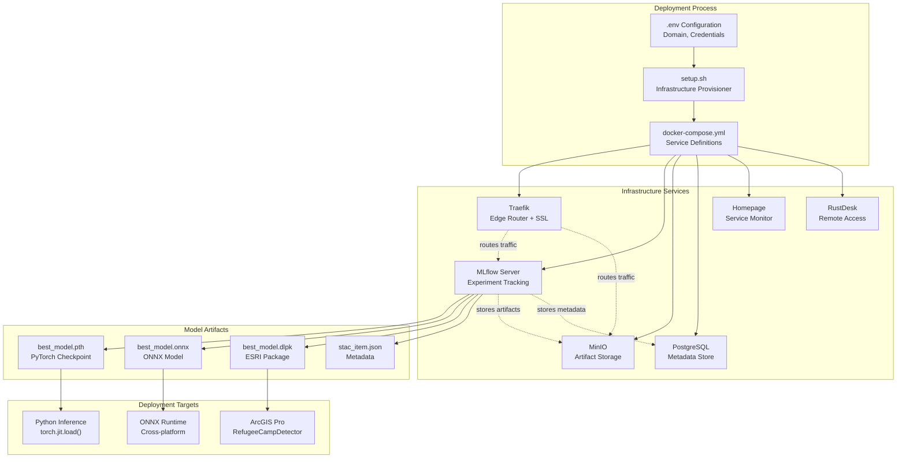
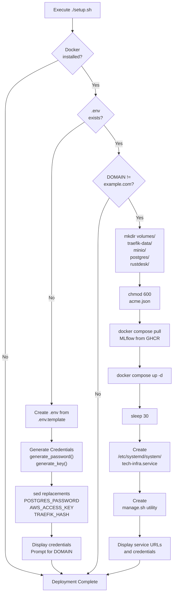
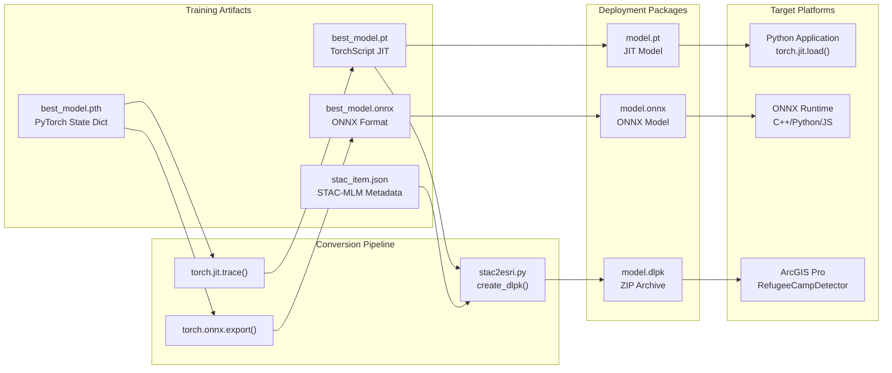
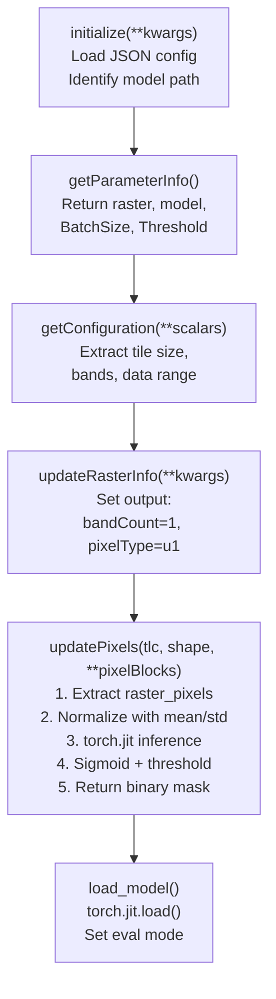

# Deployment Guide

<details>
<summary>Relevant source files</summary>

The following files were used as context for generating this wiki page:

- [examplemodel/src/esri/RefugeeCampDetector.py](examplemodel/src/esri/RefugeeCampDetector.py)
- [examplemodel/src/inference.py](examplemodel/src/inference.py)
- [examplemodel/src/stac2esri.py](examplemodel/src/stac2esri.py)
- [infra/setup.sh](infra/setup.sh)

</details>


## Purpose and Scope

This document provides comprehensive instructions for deploying both the infrastructure stack and trained ML models to production environments. It covers automated infrastructure provisioning, DNS/SSL configuration, service management, and multiple model deployment strategies targeting different platforms (standalone inference, ONNX runtime, ArcGIS).

For detailed infrastructure architecture, see [Infrastructure System](#4). For model training and artifact generation, see [Training Pipeline](#3.2). For local development setup, see [Local Development Setup](#7.1).

---

## Overview: Deployment Architecture

The deployment architecture consists of two independent but complementary layers: infrastructure services and model artifacts. The infrastructure provides MLOps capabilities, while models can be deployed to various target platforms.



**Diagram: Deployment Architecture Overview**

Sources: [infra/setup.sh:1-254](), [examplemodel/src/stac2esri.py:1-115](), [examplemodel/src/esri/RefugeeCampDetector.py:1-184]()

---

## Infrastructure Deployment

### Prerequisites

Before deploying the infrastructure stack, ensure the following are installed on the target system:

| Component | Version | Purpose | Validation Command |
|-----------|---------|---------|-------------------|
| Docker | 20.10+ | Container runtime | `docker --version` |
| Docker Compose | 2.0+ | Multi-container orchestration | `docker compose version` |
| OpenSSL | 1.1+ | Credential generation | `openssl version` |
| Domain Name | N/A | DNS records pointing to server | `dig yourdomain.com` |

The [infra/setup.sh:25-43]() script validates these prerequisites automatically during execution.

Sources: [infra/setup.sh:25-43]()

### DNS Configuration Requirements

Configure the following DNS records before deployment. All records should point to the server's public IP address:

| Record Type | Hostname | Purpose |
|-------------|----------|---------|
| A | `yourdomain.com` | Homepage dashboard |
| A | `mlflow.yourdomain.com` | MLflow tracking server |
| A | `minio.yourdomain.com` | MinIO console UI |
| A | `minio-api.yourdomain.com` | MinIO S3 API endpoint |
| A | `traefik.yourdomain.com` | Traefik dashboard |
| A | `rustdesk.yourdomain.com` | RustDesk remote access |
| A | `postgres.yourdomain.com` | PostgreSQL database (optional) |

Traefik automatically provisions Let's Encrypt SSL certificates for all configured subdomains via the ACME protocol.

Sources: [infra/setup.sh:214-220]()

### Automated Deployment Process

The deployment process is fully automated via the `setup.sh` script, which orchestrates credential generation, service configuration, and container initialization.



**Diagram: Infrastructure Deployment Workflow**

Sources: [infra/setup.sh:1-254]()

### Step-by-Step Deployment

#### Step 1: Initial Setup

Execute the setup script from the `infra/` directory:

```bash
cd infra/
./setup.sh
```

On first run, the script generates `.env` from [infra/.env.template]() and creates secure credentials using `generate_password()` and `generate_key()` functions [infra/setup.sh:11-20](). It displays generated credentials and exits, prompting you to update the `DOMAIN` and `ACME_EMAIL` variables.

Sources: [infra/setup.sh:47-95]()

#### Step 2: Configure Domain and Email

Edit the `.env` file to set your production domain and Let's Encrypt email:

```bash
nano .env
```

Update these critical variables:
- `DOMAIN=yourdomain.com` - Your root domain
- `ACME_EMAIL=admin@yourdomain.com` - Email for SSL certificate notifications

The script validates these values [infra/setup.sh:107-111]() and refuses to proceed if they remain at default values.

Sources: [infra/setup.sh:104-111]()

#### Step 3: Complete Deployment

Re-run the setup script after configuration:

```bash
./setup.sh
```

This execution:
1. Creates volume directories [infra/setup.sh:115-117]()
2. Sets permissions on `acme.json` for SSL certificate storage [infra/setup.sh:119-122]()
3. Pulls Docker images including custom MLflow image from GHCR [infra/setup.sh:127-129]()
4. Starts all services via `docker compose up -d` [infra/setup.sh:131-132]()
5. Creates systemd service `tech-infra.service` for automatic startup [infra/setup.sh:140-162]()
6. Generates `manage.sh` utility script [infra/setup.sh:164-210]()

Sources: [infra/setup.sh:115-162]()

### Service Endpoints

After successful deployment, services are accessible at the following URLs:

| Service | URL | Authentication | Purpose |
|---------|-----|----------------|---------|
| Homepage | `https://yourdomain.com` | None | Service monitoring dashboard |
| MLflow | `https://mlflow.yourdomain.com` | None | Experiment tracking and model registry |
| MinIO Console | `https://minio.yourdomain.com` | Access Key / Secret Key | Object storage management |
| MinIO API | `https://minio-api.yourdomain.com` | Access Key / Secret Key | S3-compatible API endpoint |
| Traefik Dashboard | `https://traefik.yourdomain.com` | Basic Auth | Reverse proxy monitoring |
| RustDesk | `https://rustdesk.yourdomain.com` | Key-based | Remote desktop access |
| PostgreSQL | `postgres.yourdomain.com:5432` | Username / Password | Database direct access |

Credentials for authenticated services are stored in `.env` and displayed during initial setup [infra/setup.sh:229-253]().

Sources: [infra/setup.sh:213-253]()

### Service Management

The `manage.sh` utility script provides operational commands for managing the infrastructure stack:

| Command | Description | Example |
|---------|-------------|---------|
| `./manage.sh start` | Start all services | `./manage.sh start` |
| `./manage.sh stop` | Stop all services | `./manage.sh stop` |
| `./manage.sh restart [service]` | Restart specific or all services | `./manage.sh restart mlflow` |
| `./manage.sh logs [service]` | View logs (optionally follow) | `./manage.sh logs -f postgres` |
| `./manage.sh status` | Display service status | `./manage.sh status` |
| `./manage.sh update` | Pull latest images and restart | `./manage.sh update` |
| `./manage.sh backup` | Create full backup of volumes and database | `./manage.sh backup` |

The backup command [infra/setup.sh:193-199]() creates timestamped snapshots in `./backups/` including volume copies and PostgreSQL dumps.

Sources: [infra/setup.sh:164-210]()

---

## Model Deployment Strategies

Trained models can be deployed to multiple target platforms depending on operational requirements. The training pipeline [examplemodel/src/train.py]() generates artifacts in three formats: PyTorch checkpoints, ONNX models, and ESRI Deep Learning Packages (DLPK).



**Diagram: Model Artifact Generation and Deployment Paths**

Sources: [examplemodel/src/stac2esri.py:1-115](), [examplemodel/src/inference.py:127-143]()

### PyTorch Direct Deployment

PyTorch models can be loaded directly for inference using TorchScript JIT compilation. This approach is suitable for Python-based deployment environments with PyTorch runtime available.

#### Loading TorchScript Models

The [examplemodel/src/inference.py:127-143]() demonstrates loading and executing TorchScript models:

```python
# Load TorchScript model
model = torch.jit.load("path/to/model.pt")

# Preprocess image
input_tensor = preprocess_image(image_path)

# Execute inference
model.eval()
with torch.no_grad():
    output = model(input_tensor)
```

The `preprocess_image()` function [examplemodel/src/inference.py:52-60]() applies:
- Resize to 256×256 pixels
- RGB conversion
- ImageNet normalization (mean=[0.485, 0.456, 0.406], std=[0.229, 0.224, 0.225])

#### Inference with Metadata Generation

For production deployments requiring provenance tracking, use `predict_image_enhanced()` [examplemodel/src/inference.py:63-124](), which generates:
- Raw prediction probabilities (`.npy` format)
- Binary segmentation masks (`.png` format)
- Overlay visualizations with original imagery
- JSON metadata including inference time, model version, preprocessing parameters

Sources: [examplemodel/src/inference.py:52-124]()

### ONNX Deployment

ONNX (Open Neural Network Exchange) models enable cross-platform deployment without Python or PyTorch dependencies. The training pipeline exports models to ONNX format, which can be executed by ONNX Runtime on various platforms including C++, Java, C#, and JavaScript.

#### ONNX Runtime Integration

Deployment with ONNX Runtime (example in Python):

```python
import onnxruntime as ort
import numpy as np

# Load ONNX model
session = ort.InferenceSession("best_model.onnx")

# Prepare input (C×H×W format, float32)
input_tensor = preprocess_image(image_path)
input_data = {session.get_inputs()[0].name: input_tensor.numpy()}

# Execute inference
output = session.run(None, input_data)
prediction = output[0]
```

ONNX Runtime provides:
- Hardware acceleration (CPU, CUDA, DirectML, CoreML)
- Minimal memory footprint
- Native code performance
- No Python runtime required

Sources: [examplemodel/src/stac2esri.py:11-16]()

### ESRI Deep Learning Package (DLPK) Deployment

The DLPK format packages models specifically for ArcGIS Pro and ArcGIS Enterprise deployment. It bundles the model, metadata, and inference code into a single `.dlpk` file.

#### DLPK Structure

The [examplemodel/src/stac2esri.py:54-58]() `create_dlpk()` function creates a ZIP archive containing:

| File | Purpose | Source |
|------|---------|--------|
| `model.emd` | ESRI model definition (JSON) | Generated from STAC-MLM metadata |
| `model.pt` | TorchScript model | PyTorch checkpoint |
| `RefugeeCampDetector.py` | Inference implementation | Custom raster function |

#### ESRI Model Definition (EMD)

The [examplemodel/src/stac2esri.py:7-51]() `stacmlm_to_emd()` function converts STAC-MLM metadata to ESRI's EMD format:

```json
{
  "Framework": "PyTorch",
  "ModelType": "ImageClassification",
  "ModelFile": "model.pt",
  "InferenceFunction": "RefugeeCampDetector.py",
  "ImageHeight": 256,
  "ImageWidth": 256,
  "ExtractBands": [0, 1, 2],
  "Classes": [
    {"Value": 0, "Name": "Background", "Color": [0, 0, 0]},
    {"Value": 1, "Name": "Refugee Camp", "Color": [255, 0, 0]}
  ],
  "ModelParameters": {
    "mean": [0.485, 0.456, 0.406],
    "std": [0.229, 0.224, 0.225]
  }
}
```

Sources: [examplemodel/src/stac2esri.py:7-51]()

#### RefugeeCampDetector Class

The [examplemodel/src/esri/RefugeeCampDetector.py:25-183]() implements the ESRI raster function interface:



**Diagram: RefugeeCampDetector Execution Flow**

The `updatePixels()` method [examplemodel/src/esri/RefugeeCampDetector.py:107-183]() processes raster tiles:

1. Receives `raster_pixels` (C×H×W numpy array) and `raster_mask`
2. Applies band selection [examplemodel/src/esri/RefugeeCampDetector.py:121-124]()
3. Normalizes using ImageNet statistics [examplemodel/src/esri/RefugeeCampDetector.py:134-141]()
4. Converts to PyTorch tensor and executes inference [examplemodel/src/esri/RefugeeCampDetector.py:143-148]()
5. Applies sigmoid activation and threshold [examplemodel/src/esri/RefugeeCampDetector.py:172-174]()
6. Returns binary mask (0 or 255) [examplemodel/src/esri/RefugeeCampDetector.py:180-183]()

Sources: [examplemodel/src/esri/RefugeeCampDetector.py:25-183]()

#### Generating DLPK Packages

Use the `stac2esri.py` utility to create DLPK packages from trained models:

```bash
cd examplemodel/
python src/stac2esri.py \
  --stac meta/stac_item.json \
  --pt meta/best_model.pt \
  --out-dir output \
  --dlpk-name refugee_camp_detector.dlpk
```

The [examplemodel/src/stac2esri.py:61-110]() `main()` function:
1. Parses STAC-MLM metadata
2. Locates PyTorch model artifact
3. Generates EMD configuration
4. Bundles all files into `.dlpk` ZIP archive

Sources: [examplemodel/src/stac2esri.py:61-110]()

#### Deploying to ArcGIS Pro

1. Open ArcGIS Pro
2. Navigate to **Analysis** → **Raster Functions**
3. Select **Import Deep Learning Model**
4. Browse to `.dlpk` file
5. Configure inference parameters (batch size, threshold)
6. Apply to raster imagery

The `RefugeeCampDetector` class loads automatically and processes imagery tiles using the `updatePixels()` method.

Sources: [examplemodel/src/esri/RefugeeCampDetector.py:1-184]()

---

## Deployment Verification

### Infrastructure Health Checks

Verify all services are running correctly:

```bash
cd infra/
./manage.sh status
```

Expected output shows all services with `Up` status. Access the Homepage dashboard at `https://yourdomain.com` for real-time monitoring.

#### Service-Specific Tests

| Service | Test Command | Expected Result |
|---------|--------------|-----------------|
| Traefik | `curl -k https://traefik.yourdomain.com` | 401 Unauthorized (auth required) |
| MLflow | `curl https://mlflow.yourdomain.com/health` | `{"status": "ok"}` |
| MinIO | `curl https://minio-api.yourdomain.com/minio/health/live` | `200 OK` |
| PostgreSQL | `docker compose exec postgres pg_isready` | `accepting connections` |

Sources: [infra/setup.sh:134-138]()

### Model Inference Tests

#### Test PyTorch Model

```bash
cd examplemodel/
python src/inference.py test_image.jpg \
  --model_path meta/best_model.pt \
  --output_dir output/test
```

Verify outputs in `output/test/`:
- `prediction_raw.npy` - Raw probability values
- `prediction_mask.png` - Binary segmentation
- `prediction_overlay.png` - Visualization
- `inference_metadata.json` - Provenance metadata

Sources: [examplemodel/src/inference.py:211-246]()

#### Test ONNX Model

```python
import onnxruntime as ort
session = ort.InferenceSession("meta/best_model.onnx")
print(f"Model loaded: {session.get_inputs()[0].name}")
# Expected: Input name displayed
```

#### Test DLPK Package

1. Extract `.dlpk` to verify contents:
```bash
unzip -l refugee_camp_detector.dlpk
# Expected: model.emd, model.pt, RefugeeCampDetector.py
```

2. Import into ArcGIS Pro and apply to test imagery

Sources: [examplemodel/src/stac2esri.py:54-58]()

---

## Troubleshooting

### Infrastructure Issues

**Problem: Services fail to start**
- Check Docker daemon: `systemctl status docker`
- Review logs: `./manage.sh logs [service]`
- Verify ports not in use: `sudo netstat -tulpn | grep -E ':(80|443|5432|9000)'`

**Problem: SSL certificates not provisioning**
- Verify DNS records propagated: `dig yourdomain.com`
- Check Traefik logs: `./manage.sh logs traefik`
- Ensure ports 80/443 accessible from internet
- Review ACME email in `.env` is valid

**Problem: MinIO S3 access denied**
- Verify credentials in `.env` match environment variables
- Check bucket creation in MinIO console
- Ensure MLflow has correct `AWS_ACCESS_KEY_ID` and `AWS_SECRET_ACCESS_KEY`

Sources: [infra/setup.sh:124-138]()

### Model Deployment Issues

**Problem: PyTorch model load fails**
- Verify PyTorch version compatibility
- Check model file integrity: `ls -lh meta/best_model.pt`
- Ensure TorchScript compilation succeeded during training

**Problem: ONNX Runtime errors**
- Verify ONNX opset version compatibility
- Check input tensor shape matches model expectations (1×3×256×256)
- Ensure preprocessing normalization applied correctly

**Problem: DLPK fails in ArcGIS Pro**
- Check `rcd_debug.log` in DLPK extraction directory
- Verify PyTorch installed in ArcGIS Pro environment
- Review EMD configuration matches model architecture
- Ensure `RefugeeCampDetector.py` implements all required methods

The [examplemodel/src/esri/RefugeeCampDetector.py:20-22]() `log()` function writes detailed diagnostic messages for debugging ESRI inference issues.

Sources: [examplemodel/src/esri/RefugeeCampDetector.py:17-22]()

---

## Security Considerations

### Credential Management

Generated credentials are stored in `.env` and should be:
- Excluded from version control (`.gitignore`)
- Backed up securely offline
- Rotated periodically

The [infra/setup.sh:54-59]() credential generation uses:
- `openssl rand -base64` for passwords (160+ bits entropy)
- `openssl rand -hex` for keys (256+ bits entropy)

### Network Security

- Traefik enforces HTTPS with automatic Let's Encrypt certificates
- Basic authentication protects Traefik dashboard [infra/setup.sh:62]()
- MinIO API requires S3 signature authentication
- PostgreSQL accessible only via Docker network (not exposed externally)

### Model Security

- DLPK packages should be signed before distribution to ArcGIS users
- Validate STAC-MLM checksums before deploying models
- Restrict MLflow access to authorized users only

Sources: [infra/setup.sh:54-76]()

---

## Production Best Practices

### High Availability

- Deploy infrastructure across multiple availability zones
- Use external PostgreSQL (RDS/CloudSQL) for database resilience
- Configure MinIO distributed mode for object storage redundancy
- Implement backup automation via cron: `0 2 * * * /path/to/manage.sh backup`

### Monitoring

- Enable Traefik access logs for audit trails
- Configure MLflow to log deployment events
- Monitor disk usage of volume mounts: `df -h volumes/`
- Set up alerts for service downtime using Homepage integrations

### Model Versioning

- Tag model versions in MLflow registry
- Use semantic versioning for DLPK releases
- Document model changes in STAC-MLM metadata
- Maintain deployment history in version control

Sources: [infra/setup.sh:193-199]()