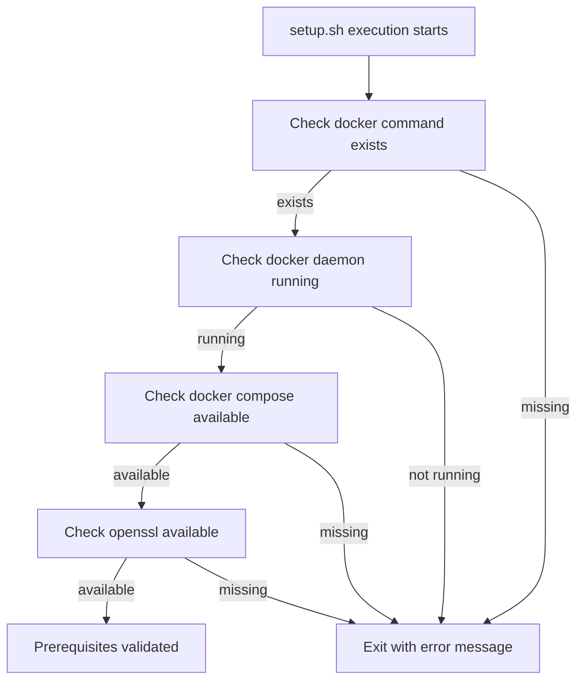
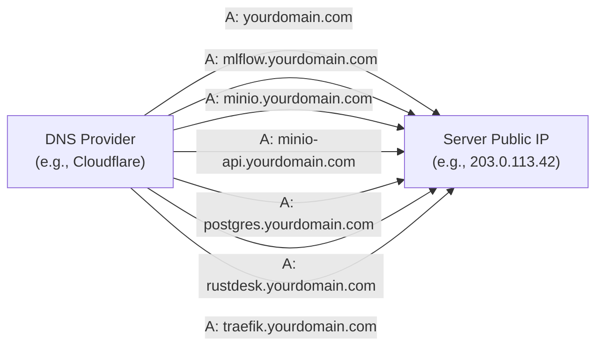
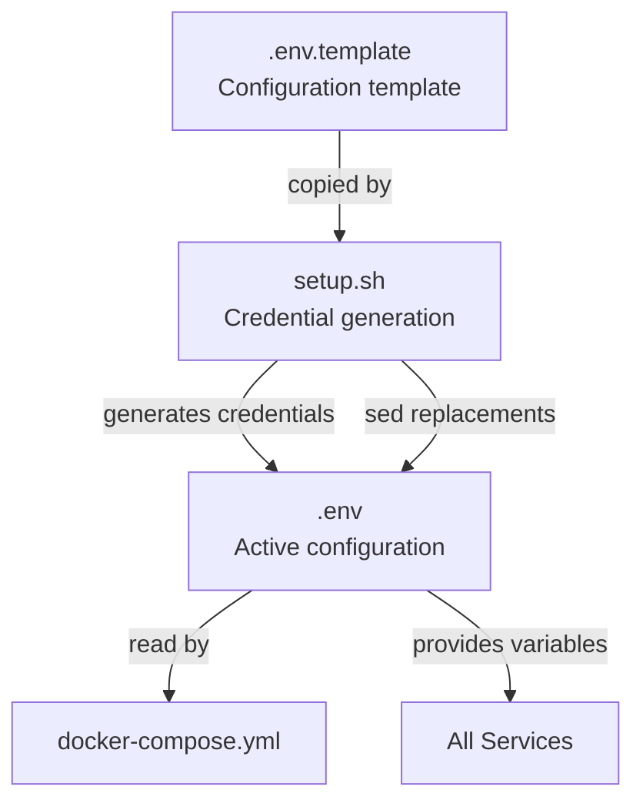
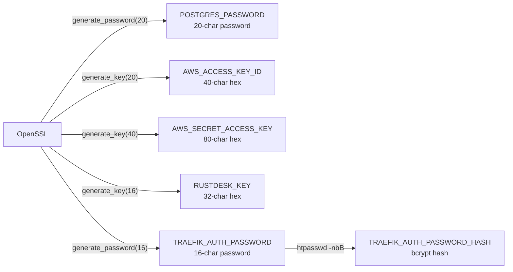
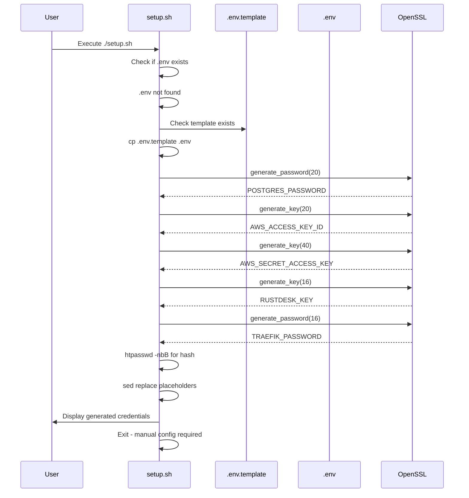
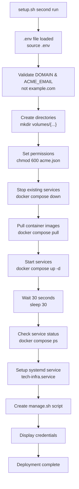
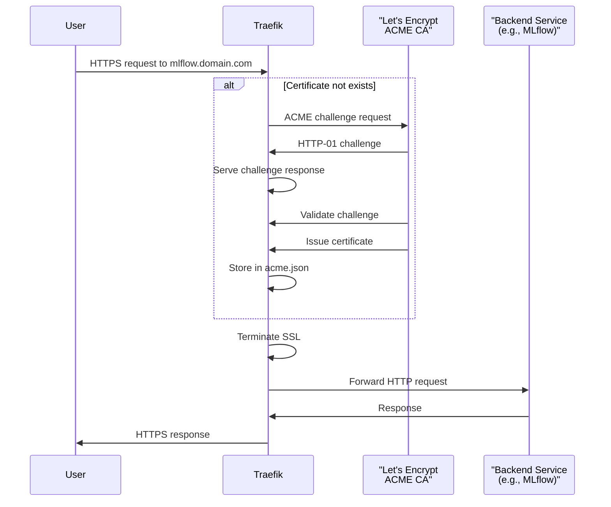
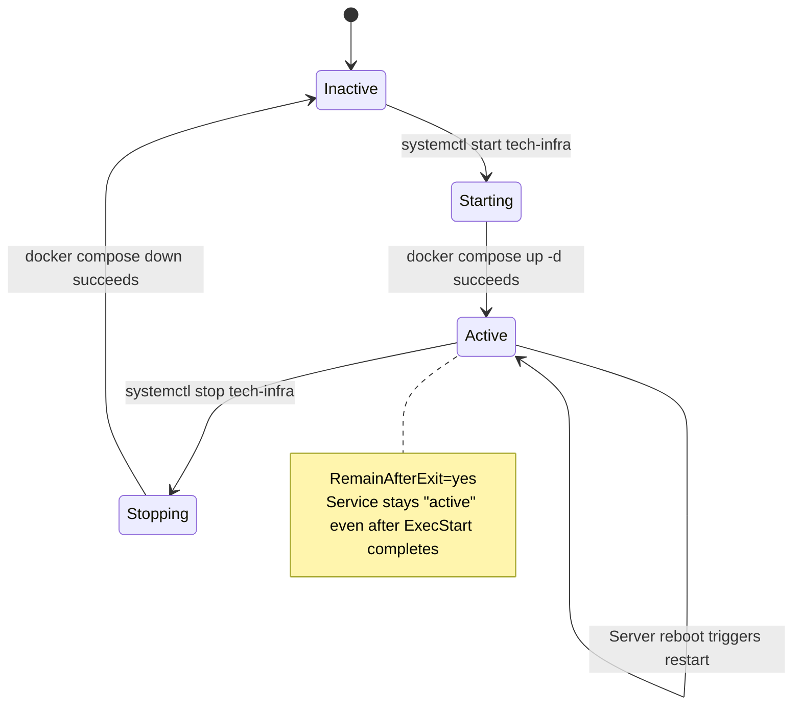
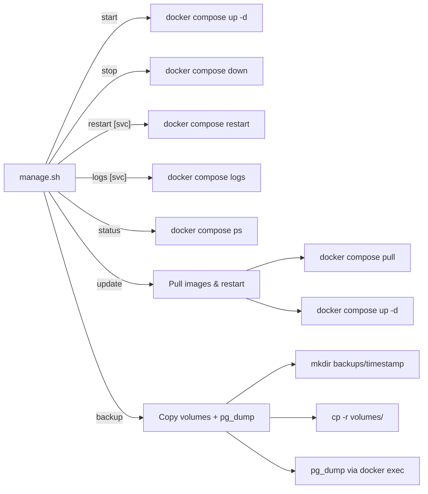
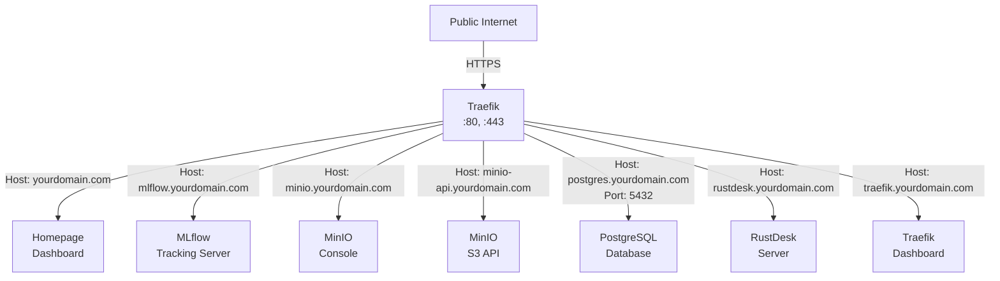

# Infrastructure Deployment

<details>
<summary>Relevant source files</summary>

The following files were used as context for generating this wiki page:

- [infra/.env.template](infra/.env.template)
- [infra/Readme.md](infra/Readme.md)
- [infra/setup.sh](infra/setup.sh)

</details>


## Purpose and Scope

This document provides a comprehensive guide for deploying the production-ready infrastructure stack to a server environment. The infrastructure stack consists of seven containerized services orchestrated by Docker Compose: Traefik reverse proxy, MLflow tracking server, MinIO object storage, PostgreSQL+PostGIS database, RustDesk remote desktop server, Homepage dashboard, and supporting services.

This page covers infrastructure deployment only. For deploying trained ML models to production environments, see [Model Deployment Options](#6.2). For understanding the infrastructure architecture, see [Service Architecture](#4.1).

**Sources:** [infra/Readme.md:1-83](), [infra/setup.sh:1-254]()

---

## Prerequisites

The infrastructure stack requires the following prerequisites on the target deployment server:

| Requirement | Minimum Version | Validation Command |
|-------------|----------------|-------------------|
| Docker Engine | 20.10+ | `docker --version` |
| Docker Compose | 2.0+ | `docker compose version` |
| OpenSSL | Any recent | `openssl version` |
| Domain Name | N/A | DNS A records configured |
| Server OS | Linux (Ubuntu/Debian recommended) | `uname -a` |
| Root/Sudo Access | Required for systemd setup | `sudo -v` |

The `setup.sh` script validates these prerequisites during execution at [infra/setup.sh:25-43]():



**Diagram: Prerequisites Validation Flow in setup.sh**

**Sources:** [infra/setup.sh:25-43]()

---

## DNS Configuration

Before deployment, configure DNS A records pointing to your server's public IP address. The infrastructure uses subdomain-based routing via Traefik.

### Required DNS Records

| Subdomain | Service | Purpose |
|-----------|---------|---------|
| `yourdomain.com` | Homepage | Main dashboard and service overview |
| `mlflow.yourdomain.com` | MLflow | Experiment tracking and model registry |
| `minio.yourdomain.com` | MinIO Console | Web UI for S3-compatible storage |
| `minio-api.yourdomain.com` | MinIO API | S3 API endpoint for programmatic access |
| `postgres.yourdomain.com` | PostgreSQL | Database connection endpoint |
| `rustdesk.yourdomain.com` | RustDesk | Remote desktop server |
| `traefik.yourdomain.com` | Traefik Dashboard | Proxy monitoring and configuration |



**Diagram: DNS Record Configuration**

**Sources:** [infra/Readme.md:32-42]()

---

## Environment Configuration

The infrastructure uses environment variables defined in `.env` for configuration. The deployment process uses [infra/.env.template:1-37]() as the base configuration template.

### Configuration File Structure



**Diagram: Environment Configuration Flow**

**Sources:** [infra/setup.sh:47-95](), [infra/.env.template:1-37]()

### Critical Configuration Variables

The following variables in `.env` must be manually configured before deployment:

| Variable | Purpose | Example Value | Line Reference |
|----------|---------|---------------|----------------|
| `DOMAIN` | Base domain for all services | `example.com` | [infra/.env.template:2]() |
| `ACME_EMAIL` | Let's Encrypt certificate email | `admin@example.com` | [infra/.env.template:3]() |

### Auto-Generated Security Credentials

The `setup.sh` script automatically generates secure credentials using OpenSSL at [infra/setup.sh:52-76](). The following credentials are generated:



**Diagram: Credential Generation Process**

Functions used for generation:
- `generate_password()` at [infra/setup.sh:11-14]() - uses `openssl rand -base64`
- `generate_key()` at [infra/setup.sh:17-20]() - uses `openssl rand -hex`

**Sources:** [infra/setup.sh:11-20](), [infra/setup.sh:52-76]()

---

## Deployment Process

### Step 1: Clone Repository and Navigate to Infrastructure Directory

```bash
git clone https://github.com/kshitijrajsharma/opengeoaimodelshub
cd opengeoaimodelshub/infra
```

### Step 2: Initial Configuration

The `setup.sh` script will create `.env` from template on first run:

```bash
chmod +x setup.sh
./setup.sh
```

On first execution, the script performs the following sequence at [infra/setup.sh:47-95]():



**Diagram: First-Run Configuration Sequence**

**Sources:** [infra/setup.sh:47-95]()

The script will exit after generating credentials, requiring manual configuration of `DOMAIN` and `ACME_EMAIL`.

### Step 3: Configure Domain and Email

Edit the `.env` file with your domain information:

```bash
nano .env
```

Update the following lines (originally at [infra/.env.template:2-3]()):
- Set `DOMAIN=yourdomain.com` (replace with your actual domain)
- Set `ACME_EMAIL=youremail@yourdomain.com` (email for Let's Encrypt notifications)

The script validates these values at [infra/setup.sh:104-111]() and will exit if placeholders remain.

### Step 4: Execute Full Deployment

Run `setup.sh` again after domain configuration:

```bash
./setup.sh
```

The script now executes the complete deployment sequence:



**Diagram: Full Deployment Sequence**

**Sources:** [infra/setup.sh:104-254]()

Key deployment actions:

| Step | Line Reference | Action |
|------|---------------|---------|
| Directory creation | [infra/setup.sh:115-117]() | Creates `volumes/{traefik-data,minio,postgres,rustdesk}` |
| Permission setup | [infra/setup.sh:119-122]() | Sets `acme.json` to mode 600 for Let's Encrypt |
| Service cleanup | [infra/setup.sh:124-125]() | Stops any existing containers |
| Image pull | [infra/setup.sh:127-129]() | Pulls all service images from registries |
| Service start | [infra/setup.sh:131-132]() | Starts all services in detached mode |
| Initialization wait | [infra/setup.sh:134-135]() | 30-second delay for service initialization |

---

## SSL Certificate Management

SSL certificates are automatically managed by Traefik using the ACME protocol (Let's Encrypt).

### Automatic Certificate Provisioning



**Diagram: Automatic SSL Certificate Provisioning**

The `acme.json` file stores all certificates and is created with secure permissions (mode 600) at [infra/setup.sh:120-121](). This file persists in the `TRAEFIK_DATA_DIR` volume (configured at [infra/.env.template:6]()).

**Sources:** [infra/setup.sh:120-121](), [infra/.env.template:6]()

---

## Systemd Integration

The deployment creates a systemd service unit for automatic startup and system integration.

### Service Unit Creation

The systemd unit file is created at [infra/setup.sh:140-162]() with the following configuration:

| Directive | Value | Purpose |
|-----------|-------|---------|
| `Description` | "Tech Infrastructure Services" | Service description |
| `Requires` | `docker.service` | Dependency on Docker daemon |
| `After` | `docker.service` | Start after Docker is ready |
| `Type` | `oneshot` | Single execution service |
| `RemainAfterExit` | `yes` | Keep active after start command |
| `ExecStart` | `/usr/bin/docker compose up -d` | Start command |
| `ExecStop` | `/usr/bin/docker compose down` | Stop command |
| `WantedBy` | `multi-user.target` | Enable at boot |



**Diagram: Systemd Service State Lifecycle**

The service is enabled for automatic startup at [infra/setup.sh:161-162]():

```bash
sudo systemctl daemon-reload
sudo systemctl enable tech-infra.service
```

**Sources:** [infra/setup.sh:140-162]()

---

## Service Management

The deployment creates `manage.sh` script at [infra/setup.sh:164-208]() providing unified service management commands.

### Management Script Commands

| Command | Function | Description |
|---------|----------|-------------|
| `./manage.sh start` | Start all services | Executes `docker compose up -d` |
| `./manage.sh stop` | Stop all services | Executes `docker compose down` |
| `./manage.sh restart [service]` | Restart service(s) | Restarts specified or all services |
| `./manage.sh logs [service]` | View logs | Shows logs, `-f` follows if service specified |
| `./manage.sh status` | Check status | Displays `docker compose ps` output |
| `./manage.sh update` | Update images | Pulls latest images and restarts |
| `./manage.sh backup` | Create backup | Backs up volumes and PostgreSQL dump |



**Diagram: Management Script Command Flow**

### Backup Functionality

The backup command at [infra/setup.sh:193-199]() performs:

1. Creates timestamped backup directory: `./backups/YYYYMMDD_HHMMSS`
2. Copies all Docker volumes: `volumes/` → backup directory
3. Exports PostgreSQL database: `pg_dump` via `docker compose exec`

Example backup command:
```bash
./manage.sh backup
# Creates: ./backups/20240115_143022/
#   - volumes/ (complete copy)
#   - postgres_dump.sql
```

**Sources:** [infra/setup.sh:164-208]()

---

## Service Verification

After deployment, verify services are running correctly.

### Service Status Check

```bash
./manage.sh status
# or
docker compose ps
```

Expected output shows all services in "running" state:

| Service | Container Name | Expected State | Ports |
|---------|---------------|----------------|-------|
| `homepage` | Homepage dashboard | Up | 3000 (internal) |
| `mlflow` | MLflow tracking | Up | 5000 (internal) |
| `minio` | MinIO storage | Up | 9000, 9001 (internal) |
| `postgres` | PostgreSQL+PostGIS | Up | 5432 (internal) |
| `rustdesk` | RustDesk server | Up | Various (internal) |
| `traefik` | Traefik proxy | Up | 80, 443, 8080 |

### Service Access Verification

After successful deployment, services are accessible at [infra/setup.sh:213-220]():



**Diagram: Service Access Routing**

Access each service through your browser:
- Homepage: `https://yourdomain.com`
- MLflow: `https://mlflow.yourdomain.com`
- MinIO Console: `https://minio.yourdomain.com`
- Traefik Dashboard: `https://traefik.yourdomain.com` (requires authentication)

**Sources:** [infra/setup.sh:213-220]()

### Credential Access

All service credentials are displayed at deployment completion [infra/setup.sh:229-253]() and stored in `.env` file:

| Service | Access Information | Environment Variables |
|---------|-------------------|----------------------|
| Traefik Dashboard | Username: `admin`<br/>Password: from `.env` | `TRAEFIK_AUTH_USER`, `TRAEFIK_AUTH_PASSWORD` |
| PostgreSQL | Host: `postgres.yourdomain.com`<br/>Port: 5432<br/>Database: `mlflow` | `POSTGRES_USER`, `POSTGRES_PASSWORD`, `POSTGRES_DB` |
| MinIO | Console: `https://minio.yourdomain.com`<br/>API: `https://minio-api.yourdomain.com` | `AWS_ACCESS_KEY_ID`, `AWS_SECRET_ACCESS_KEY` |
| MLflow | URL: `https://mlflow.yourdomain.com` | Uses PostgreSQL and MinIO credentials |

**Important:** The `.env` file contains all credentials and must be kept secure. The script displays credentials once at [infra/setup.sh:229-253]() and recommends backing up the `.env` file.

**Sources:** [infra/setup.sh:229-253](), [infra/.env.template:1-37]()

---

## Troubleshooting Common Issues

### DNS Propagation Issues

If services are not accessible after deployment:

1. Verify DNS records are correctly configured: `nslookup mlflow.yourdomain.com`
2. DNS propagation can take up to 48 hours (typically minutes)
3. Check Traefik logs: `./manage.sh logs traefik`
4. Verify ACME challenges succeed in logs

### Certificate Provisioning Failures

If Let's Encrypt certificate provisioning fails:

1. Verify `ACME_EMAIL` is valid in `.env` at [infra/.env.template:3]()
2. Ensure ports 80 and 443 are accessible from internet
3. Check `acme.json` permissions: must be 600 (set at [infra/setup.sh:120-121]())
4. Review Traefik logs for ACME errors: `./manage.sh logs traefik`

### Service Start Failures

If services fail to start:

1. Check Docker daemon status: `sudo systemctl status docker`
2. Verify `.env` configuration is complete
3. Review service-specific logs: `./manage.sh logs <service-name>`
4. Ensure sufficient disk space for volumes
5. Check for port conflicts if services fail to bind

### Image Pull Failures

If `docker compose pull` fails:

1. Verify internet connectivity from server
2. Check Docker Hub or GHCR accessibility
3. Review `MLFLOW_IMAGE` variable at [infra/.env.template:16]()
4. Manually pull problematic image: `docker pull <image-name>`

**Sources:** [infra/setup.sh:120-132](), [infra/.env.template:3-16]()

---

## Post-Deployment Configuration

### Homepage Dashboard Customization

The Homepage dashboard configuration is stored in `homepage-config/` directory. The setup script creates `homepage-config/.env` from template at [infra/setup.sh:97-102]().

Update `HOMEPAGE_ALLOWED_HOSTS` in `.env` to match your domain at [infra/.env.template:13]().

### MLflow Backend Configuration

MLflow connects to PostgreSQL and MinIO using environment variables. The connection is established automatically using:
- PostgreSQL backend: `POSTGRES_USER`, `POSTGRES_PASSWORD`, `POSTGRES_DB`
- MinIO artifact store: `AWS_ACCESS_KEY_ID`, `AWS_SECRET_ACCESS_KEY`, `MINIO_BUCKET_NAME`

No additional configuration is required after deployment.

### Database External Access

PostgreSQL is accessible externally via Traefik at `postgres.yourdomain.com:5432`. Connection parameters from [infra/Readme.md:44-50]():

- **Host:** `postgres.yourdomain.com`
- **Port:** `5432`
- **Database:** `mlflow`
- **SSL Mode:** Required (Traefik terminates SSL)
- **Username/Password:** From `.env` file

**Sources:** [infra/setup.sh:97-102](), [infra/.env.template:13-28](), [infra/Readme.md:44-50]()

---

## Updating the Infrastructure

To update services to latest versions:

```bash
./manage.sh update
```

This command at [infra/setup.sh:187-192]():
1. Pulls latest images: `docker compose pull`
2. Recreates containers with new images: `docker compose up -d`
3. Preserves all data in volumes

The MLflow image is specified by `MLFLOW_IMAGE` variable at [infra/.env.template:16](), which references a pre-built image from GitHub Container Registry. See [MLflow Custom Image Pipeline](#5.2) for details on the custom image build process.

**Sources:** [infra/setup.sh:187-192](), [infra/.env.template:16]()