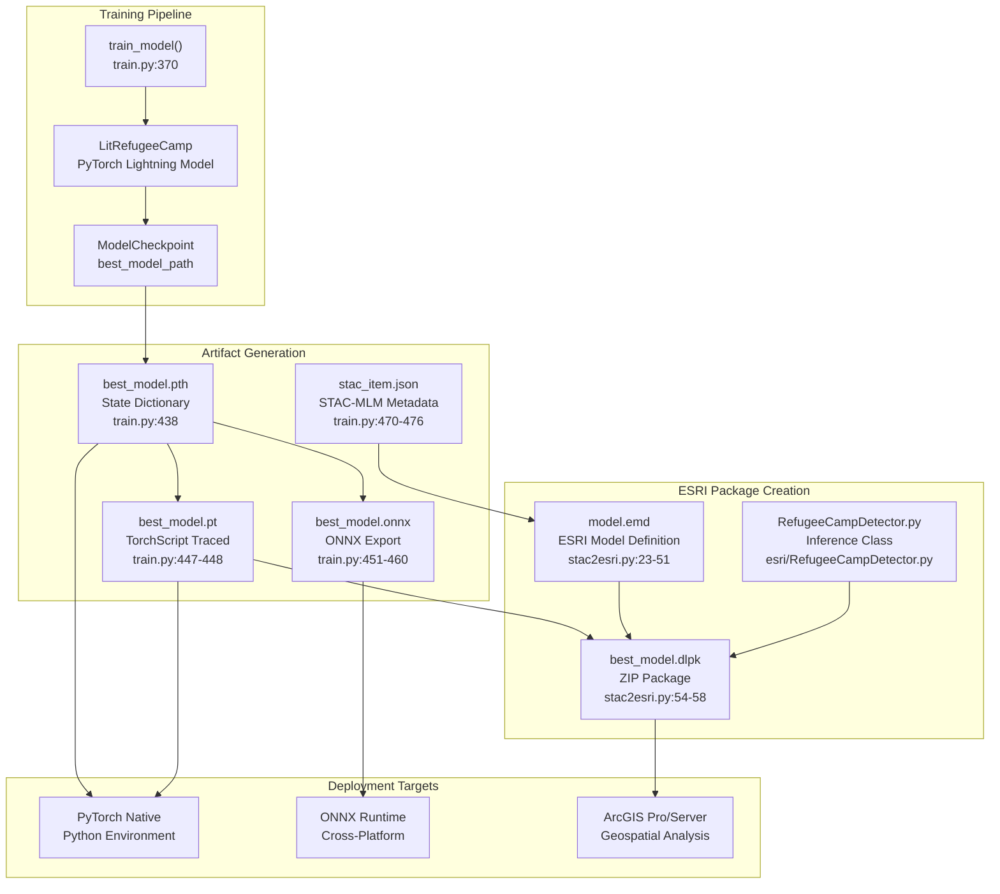
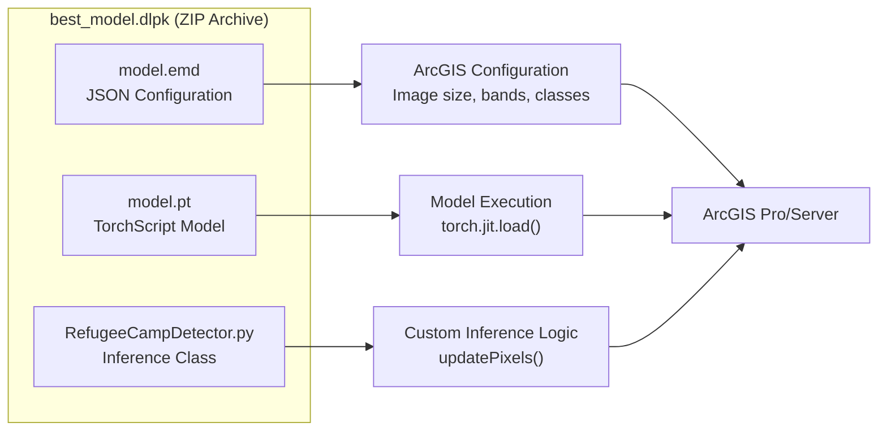
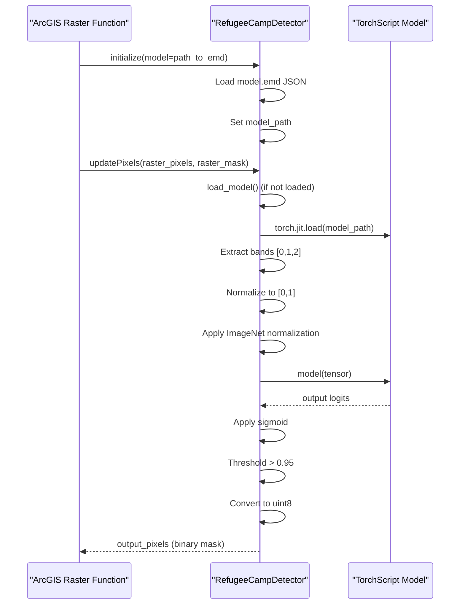
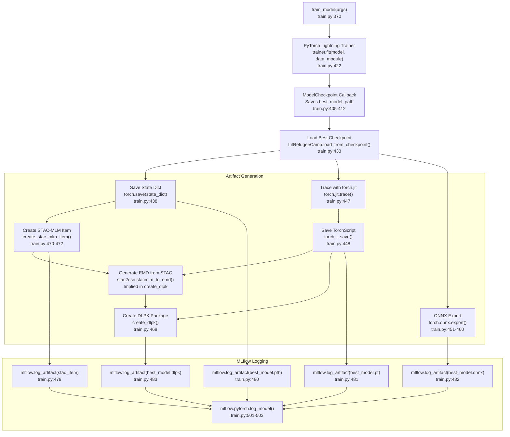

# Model Deployment Options

<details>
<summary>Relevant source files</summary>

The following files were used as context for generating this wiki page:

- [examplemodel/src/esri/RefugeeCampDetector.py](examplemodel/src/esri/RefugeeCampDetector.py)
- [examplemodel/src/inference.py](examplemodel/src/inference.py)
- [examplemodel/src/stac2esri.py](examplemodel/src/stac2esri.py)
- [examplemodel/src/train.py](examplemodel/src/train.py)

</details>


## Purpose and Scope

This document explains the three distinct model deployment strategies supported by the OpenGeoAIModelHub training pipeline. Each deployment format serves different use cases and target platforms. The training pipeline in [examplemodel/src/train.py]() automatically generates all three formats during model training, enabling deployment flexibility without retraining.

For information about deploying the infrastructure stack itself, see [Infrastructure Deployment](#6.1). For details on the training pipeline that produces these artifacts, see [Training Pipeline](#3.2).

## Deployment Format Overview

The training pipeline produces four model artifact formats that enable three primary deployment strategies:

| Format | File Extension | Primary Use Case | Target Runtime |
|--------|---------------|------------------|----------------|
| PyTorch State Dict | `.pth` | Direct PyTorch inference, further training | Python with PyTorch |
| TorchScript | `.pt` | Optimized PyTorch inference, mobile deployment | PyTorch C++ API, Python |
| ONNX | `.onnx` | Cross-platform inference, production systems | ONNX Runtime (any language) |
| ESRI DLPK | `.dlpk` | GIS integration and geospatial analysis | ArcGIS Pro, ArcGIS Server |

All formats are generated during the training process and logged to MLflow for version control and artifact management.



**Diagram: Model Artifact Generation and Deployment Flow**

Sources: [examplemodel/src/train.py:370-507](), [examplemodel/src/stac2esri.py:54-58]()

## PyTorch Native Deployment

### Format Details

The training pipeline generates two PyTorch formats optimized for different use cases:

1. **State Dictionary (`.pth`)**: Raw model weights in PyTorch's native format
2. **TorchScript (`.pt`)**: Optimized, serialized model using `torch.jit.trace`

The state dictionary is created at [examplemodel/src/train.py:438]():

```python
torch.save(model.state_dict(), "meta/best_model.pth")
```

The TorchScript model is created through tracing at [examplemodel/src/train.py:444-448]():

```python
torch_model = clean_model.model
torch_model.eval()
traced_model = torch.jit.trace(torch_model, torch.randn(1, 3, 256, 256))
torch.jit.save(traced_model, "meta/best_model.pt")
```

### Use Cases

| Scenario | Recommended Format | Rationale |
|----------|-------------------|-----------|
| Fine-tuning or transfer learning | `.pth` state dict | Requires access to full model architecture and optimizer state |
| Production Python inference | `.pt` TorchScript | Optimized execution, no Python dependency on model definition |
| Mobile/embedded deployment | `.pt` TorchScript | C++ API compatible, smaller runtime footprint |
| Development and debugging | `.pth` state dict | Full access to model internals and gradients |

### Loading and Inference

The inference system provides two methods for loading PyTorch models, as shown in [examplemodel/src/inference.py:127-133]():

**State Dictionary Loading:**
```python
from model import LitRefugeeCamp
model = LitRefugeeCamp()
model.load_state_dict(torch.load("meta/best_model.pth"))
```

**TorchScript Loading:**
```python
model = torch.jit.load("meta/best_model.pt")
```

The `predict_image()` function at [examplemodel/src/inference.py:127-142]() demonstrates the complete inference pipeline including preprocessing and postprocessing.

### Deployment Requirements

- **Python**: 3.8+
- **PyTorch**: Version logged in STAC metadata (`mlm:framework_version`)
- **Dependencies**: Listed in [examplemodel/pyproject.toml]()
- **Input**: RGB images normalized with ImageNet statistics (mean=[0.485, 0.456, 0.406], std=[0.229, 0.224, 0.225])
- **Output**: Binary segmentation mask (256×256 pixels)

Sources: [examplemodel/src/train.py:438-448](), [examplemodel/src/inference.py:127-142]()

## ONNX Cross-Platform Deployment

### Format Details

ONNX (Open Neural Network Exchange) provides a standardized format for deploying models across multiple frameworks and platforms. The model is exported at [examplemodel/src/train.py:450-460]():

```python
torch.onnx.export(
    torch_model,
    dummy_input,
    "meta/best_model.onnx",
    export_params=True,
    opset_version=11,
    input_names=["input"],
    output_names=["output"],
    dynamic_axes={"input": {0: "batch_size"}, "output": {0: "batch_size"}}
)
```

Key export parameters:
- **Opset version**: 11 (ensures broad runtime compatibility)
- **Dynamic axes**: Batch dimension is dynamic, allowing variable batch sizes
- **Input shape**: `[batch_size, 3, 256, 256]` (NCHW format)
- **Output shape**: `[batch_size, 1, 256, 256]` (logits before sigmoid)

### Use Cases

| Runtime Environment | Benefits | Implementation Notes |
|---------------------|----------|----------------------|
| ONNX Runtime (Python) | Fast CPU/GPU inference, no PyTorch dependency | Use `onnxruntime` or `onnxruntime-gpu` |
| ONNX Runtime (C++) | Production services, minimal dependencies | Link against ONNX Runtime library |
| TensorRT | NVIDIA GPU optimization | Convert ONNX to TensorRT engine |
| OpenVINO | Intel hardware optimization | Use OpenVINO toolkit for inference |
| Web browsers | Client-side inference | Use ONNX.js for browser deployment |
| Mobile devices | iOS/Android apps | Use ONNX Runtime Mobile |

### STAC-MLM Metadata

The ONNX artifact is documented in STAC-MLM metadata at [examplemodel/src/train.py:275-283]():

```json
{
  "onnx-model": {
    "href": "meta/best_model.onnx",
    "type": "application/octet-stream; framework=onnx",
    "title": "ONNX Model",
    "description": "ONNX format model for cross-platform inference and deployment",
    "roles": ["mlm:model", "mlm:inference"],
    "mlm:artifact_type": "onnx",
    "mlm:compile_method": "aot"
  }
}
```

### Inference with ONNX Runtime

Example Python inference using ONNX Runtime:

```python
import onnxruntime as ort
import numpy as np

# Load model
session = ort.InferenceSession("meta/best_model.onnx")

# Prepare input (after preprocessing)
input_data = preprocess_image(image_path)  # Shape: (1, 3, 256, 256)

# Run inference
outputs = session.run(["output"], {"input": input_data.numpy()})

# Apply sigmoid and threshold
prediction = 1 / (1 + np.exp(-outputs[0]))  # Sigmoid
binary_mask = (prediction > 0.5).astype(np.uint8)
```

### Performance Characteristics

- **No PyTorch dependency**: Reduces deployment complexity
- **Hardware optimization**: Runtime-specific optimizations for CPU/GPU
- **Smaller memory footprint**: Optimized graph reduces memory usage
- **Language agnostic**: Can be loaded from C++, C#, Java, JavaScript, etc.

Sources: [examplemodel/src/train.py:450-460](), [examplemodel/src/train.py:275-283]()

## ESRI Deep Learning Package (DLPK) Deployment

### Package Structure

The DLPK format is a specialized deployment package for ArcGIS integration. It is created by [examplemodel/src/stac2esri.py:54-58]() and contains three components:



**Diagram: DLPK Package Structure and Components**

### ESRI Model Definition (EMD)

The EMD file is generated by converting STAC-MLM metadata at [examplemodel/src/stac2esri.py:7-51]():

```python
emd = {
    "Framework": "PyTorch",
    "ModelType": "ImageClassification",
    "ModelName": props.get("mlm:name", "RefugeeCampDetector"),
    "Architecture": props.get("mlm:architecture", "U-Net"),
    "ModelFile": "model.pt",
    "InferenceFunction": "RefugeeCampDetector.py",
    "ImageHeight": 256,
    "ImageWidth": 256,
    "ImageSpaceUsed": "MAP_SPACE",
    "ExtractBands": [0, 1, 2],
    "DataRange": [0, 1],
    "BatchSize": 1,
    "Classes": [
        {"Value": 0, "Name": "Background", "Color": [0, 0, 0]},
        {"Value": 1, "Name": "Refugee Camp", "Color": [255, 0, 0]}
    ],
    "ModelParameters": {
        "mean": [0.485, 0.456, 0.406],
        "std": [0.229, 0.224, 0.225]
    },
    "Threshold": 0.5
}
```

Key configuration parameters:
- **ImageSpaceUsed**: `MAP_SPACE` indicates the model operates on georeferenced imagery
- **ExtractBands**: RGB bands [0, 1, 2] are extracted from input imagery
- **DataRange**: Input pixels normalized to [0, 1] range
- **ModelParameters**: ImageNet normalization statistics

### RefugeeCampDetector Inference Class

The core inference logic is implemented in [examplemodel/src/esri/RefugeeCampDetector.py](), which provides the ArcGIS-compatible interface:



**Diagram: DLPK Inference Pipeline in ArcGIS**

### Implementation Details

The `RefugeeCampDetector` class implements the ArcGIS Python Raster Function API with three key methods:

**1. initialize()** - [examplemodel/src/esri/RefugeeCampDetector.py:31-51]()
- Loads EMD configuration from JSON
- Resolves absolute path to TorchScript model
- Defers actual model loading until first inference

**2. getConfiguration()** - [examplemodel/src/esri/RefugeeCampDetector.py:85-100]()
- Returns processing parameters to ArcGIS
- Specifies tile size (256×256)
- Defines band extraction and data range
- Enables input masking for NoData handling

**3. updatePixels()** - [examplemodel/src/esri/RefugeeCampDetector.py:107-183]()
- Processes each image tile
- Applies band selection, normalization, and inference
- Returns binary classification mask

The preprocessing pipeline at [examplemodel/src/esri/RefugeeCampDetector.py:116-141]():

```python
# Extract input pixels (C, H, W)
pix = pixelBlocks["raster_pixels"]

# Apply mask
pix[mask == 0] = 0

# Add batch dimension (B, C, H, W)
arr = pix.astype(np.float32)
if arr.ndim == 3:
    arr = arr[np.newaxis]

# Normalize to [0, 1]
if arr.max() > 1.0:
    arr = arr / 255.0

# Apply ImageNet normalization
mean = np.array([0.485, 0.456, 0.406])[None, :, None, None]
std = np.array([0.229, 0.224, 0.225])[None, :, None, None]
arr = (arr - mean) / std
```

### Use Cases

| GIS Workflow | DLPK Application | ArcGIS Component |
|--------------|------------------|------------------|
| Humanitarian mapping | Detect refugee camps in satellite imagery | ArcGIS Pro - Classify Pixels Using Deep Learning tool |
| Change detection | Compare camp presence over time | Raster Function chain |
| Automated monitoring | Scheduled inference on new imagery | ArcGIS Server - Image Service |
| Interactive analysis | Real-time camp detection during map exploration | Dynamic raster function |

### Deployment in ArcGIS Pro

1. Copy `best_model.dlpk` to a location accessible by ArcGIS Pro
2. Open the "Classify Pixels Using Deep Learning" tool
3. Select the DLPK as the model definition
4. Provide input imagery (RGB satellite imagery)
5. Run inference - results are generated as a classified raster

The DLPK handles all preprocessing, normalization, and postprocessing automatically based on the EMD configuration.

Sources: [examplemodel/src/stac2esri.py:7-58](), [examplemodel/src/esri/RefugeeCampDetector.py:25-183]()

## Deployment Format Comparison

### Technical Specifications

| Characteristic | PyTorch (.pth/.pt) | ONNX (.onnx) | DLPK (.dlpk) |
|----------------|-------------------|--------------|--------------|
| **Framework Dependency** | PyTorch required | Framework-agnostic | PyTorch required (bundled) |
| **File Size** | ~50-100 MB | ~50-100 MB | ~50-100 MB + inference code |
| **Inference Speed** | Fast (native) | Fast (optimized) | Fast (TorchScript-based) |
| **Batch Processing** | Supported | Supported (dynamic axes) | Limited (tile-based) |
| **GPU Acceleration** | CUDA | CUDA, TensorRT, DirectML | CUDA (if available) |
| **Language Support** | Python (primary) | C++, Python, C#, Java, JS | Python (ArcGIS) |
| **Mobile Deployment** | PyTorch Mobile | ONNX Runtime Mobile | Not supported |

### Platform Support

```mermaid
graph TB
    subgraph "PyTorch Native"
        PTH_LINUX["Linux<br/>Full Support"]
        PTH_WIN["Windows<br/>Full Support"]
        PTH_MAC["macOS<br/>Full Support"]
        PTH_MOBILE["Mobile<br/>PyTorch Mobile"]
    end
    
    subgraph "ONNX Runtime"
        ONNX_LINUX["Linux<br/>CPU/GPU"]
        ONNX_WIN["Windows<br/>CPU/GPU/DirectML"]
        ONNX_MAC["macOS<br/>CPU only"]
        ONNX_MOBILE["Mobile<br/>iOS/Android"]
        ONNX_WEB["Web<br/>ONNX.js"]
        ONNX_EDGE["Edge Devices<br/>ARM/x86"]
    end
    
    subgraph "ESRI DLPK"
        DLPK_PRO["ArcGIS Pro<br/>Windows"]
        DLPK_SERVER["ArcGIS Server<br/>Windows/Linux"]
        DLPK_ONLINE["ArcGIS Online<br/>Cloud"]
    end
    
    PTH_PYTORCH["PyTorch<br/>Ecosystem"]
    ONNX_ECOSYSTEM["ONNX<br/>Ecosystem"]
    ESRI_ECOSYSTEM["ESRI<br/>Ecosystem"]
    
    PTH_LINUX --> PTH_PYTORCH
    PTH_WIN --> PTH_PYTORCH
    PTH_MAC --> PTH_PYTORCH
    PTH_MOBILE --> PTH_PYTORCH
    
    ONNX_LINUX --> ONNX_ECOSYSTEM
    ONNX_WIN --> ONNX_ECOSYSTEM
    ONNX_MAC --> ONNX_ECOSYSTEM
    ONNX_MOBILE --> ONNX_ECOSYSTEM
    ONNX_WEB --> ONNX_ECOSYSTEM
    ONNX_EDGE --> ONNX_ECOSYSTEM
    
    DLPK_PRO --> ESRI_ECOSYSTEM
    DLPK_SERVER --> ESRI_ECOSYSTEM
    DLPK_ONLINE --> ESRI_ECOSYSTEM
```



**Diagram: Platform Support Matrix for Each Deployment Format**

### Decision Matrix

Choose your deployment format based on these criteria:

**Use PyTorch Native when:**
- Deploying in a Python-based ML pipeline
- Need flexibility to fine-tune or retrain the model
- Development/research environment with full PyTorch stack
- Integrating with PyTorch Lightning or other PyTorch libraries

**Use ONNX when:**
- Deploying to production services in non-Python languages (C++, C#, Java)
- Need maximum platform portability (Windows, Linux, macOS, mobile, web)
- Optimizing for specific hardware (NVIDIA TensorRT, Intel OpenVINO)
- Minimizing dependencies and runtime footprint
- Integrating with ML serving frameworks (Triton, TF Serving)

**Use DLPK when:**
- Working within the ESRI/ArcGIS ecosystem
- Processing georeferenced satellite imagery
- Need GIS-specific functionality (coordinate systems, raster functions)
- Deploying to ArcGIS Pro or ArcGIS Server
- End-users are GIS analysts without ML expertise

Sources: [examplemodel/src/train.py:436-507](), [examplemodel/src/stac2esri.py:54-58]()

## Artifact Generation Pipeline

### Training Process Flow

The complete artifact generation pipeline is orchestrated by the `train_model()` function at [examplemodel/src/train.py:370-507]():



**Diagram: Complete Model Artifact Generation and Logging Pipeline**

### File Locations and Naming

All artifacts are saved to the `meta/` directory with consistent naming:

| Artifact | File Path | Size Range | MLflow Artifact Path |
|----------|-----------|------------|---------------------|
| State Dictionary | `meta/best_model.pth` | 50-100 MB | `models/best_model.pth` |
| TorchScript | `meta/best_model.pt` | 50-100 MB | `models/best_model.pt` |
| ONNX Model | `meta/best_model.onnx` | 50-100 MB | `models/best_model.onnx` |
| STAC Metadata | `meta/stac_item.json` | ~10 KB | `metadata/stac_item.json` |
| ESRI Definition | `meta/model.emd` | ~1 KB | `esri/model.emd` |
| DLPK Package | `meta/best_model.dlpk` | 50-100 MB | `models/best_model.dlpk` |
| Lightning Checkpoint | `checkpoints/epoch=X-step=Y.ckpt` | 100-200 MB | `checkpoints/epoch=X-step=Y.ckpt` |

### STAC-MLM Metadata Integration

The STAC-MLM item at [examplemodel/src/train.py:101-367]() serves as the authoritative metadata source documenting all deployment artifacts:

```python
stac_item = {
    "type": "Feature",
    "stac_version": "1.1.0",
    "stac_extensions": [
        "https://stac-extensions.github.io/mlm/v1.5.0/schema.json",
        "https://stac-extensions.github.io/file/v1.0.0/schema.json",
        "https://stac-extensions.github.io/processing/v1.1.0/schema.json"
    ],
    "properties": {
        "mlm:name": "RefugeeCampDetector",
        "mlm:architecture": "U-Net",
        "mlm:framework": "PyTorch",
        "mlm:input": [...],  # Input specification
        "mlm:output": [...],  # Output specification
    },
    "assets": {
        "pytorch-state-dict-raw": {...},  # .pth file
        "pytorch-state-dict": {...},      # .pt file
        "onnx-model": {...},               # .onnx file
        "esri-package": {...}              # .dlpk file
    }
}
```

This metadata enables:
- **Discoverability**: Models can be catalogued and searched
- **Reproducibility**: Complete specification of inputs, outputs, and preprocessing
- **Traceability**: Links to source code, training data, and container images
- **Interoperability**: Standard format for model exchange

The STAC-MLM specification is used by `stacmlm_to_emd()` at [examplemodel/src/stac2esri.py:7-51]() to automatically generate the ESRI Model Definition file, ensuring consistency between metadata and deployment configuration.

### Accessing Artifacts from MLflow

After training completes, all artifacts are available through the MLflow UI:

1. Navigate to MLflow tracking server (configured in infrastructure)
2. Select the experiment run
3. View artifacts in the structured folder hierarchy:
   - `models/` - All model files (.pth, .pt, .onnx, .dlpk)
   - `metadata/` - STAC-MLM item and metadata
   - `checkpoints/` - PyTorch Lightning checkpoints
   - `esri/` - ESRI-specific files (EMD, inference script)
   - `examples/` - Inference visualizations
   - `datasets/` - Training data structure

Artifacts can be downloaded individually or programmatically accessed using the MLflow API:

```python
import mlflow

# Download specific artifact
mlflow.artifacts.download_artifacts(
    run_id="<run_id>",
    artifact_path="models/best_model.onnx",
    dst_path="./downloaded_models"
)

# Load PyTorch model directly
model = mlflow.pytorch.load_model("runs:/<run_id>/model")
```

Sources: [examplemodel/src/train.py:370-507](), [examplemodel/src/train.py:101-367](), [examplemodel/src/stac2esri.py:7-51]()