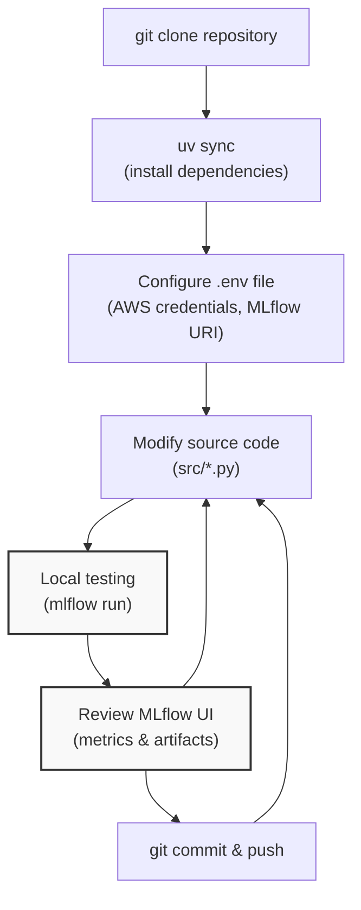
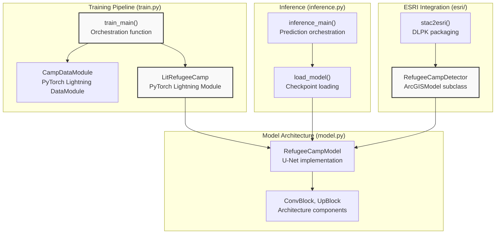
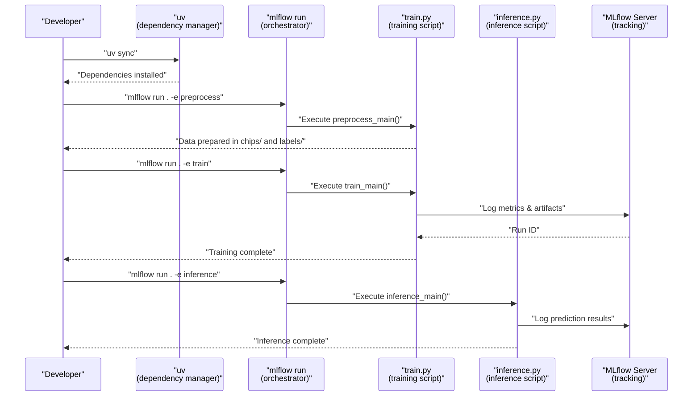

# Development Guide

<details>
<summary>Relevant source files</summary>

The following files were used as context for generating this wiki page:

- [.gitignore](.gitignore)
- [examplemodel/.env_sample](examplemodel/.env_sample)
- [examplemodel/pyproject.toml](examplemodel/pyproject.toml)

</details>


## Purpose and Scope

This guide provides technical guidance for developers working with the OpenGeoAIModelHub codebase. It covers local development environment setup, codebase organization, and common development workflows for extending or modifying the ML pipeline.

For step-by-step infrastructure deployment, see [Infrastructure Deployment](#6.1). For specific configuration of environment variables and credentials, see [Configuration Management](#4.3). For modifying individual pipeline components, refer to the subsections: [Local Development Setup](#7.1), [Working with the Training Pipeline](#7.2), and [Data Preparation and Custom Datasets](#7.3).

---

## Development Workflow Overview

The development workflow follows a modern Python MLOps pattern using `uv` for dependency management and MLflow for experiment orchestration. Developers work locally with the `examplemodel` package while logging experiments to either local MLflow or the remote infrastructure stack.

### Development Cycle Diagram



**Sources:** Analysis of high-level system diagrams (Diagram 5: System Integration and Data Flow)

---

## Code Organization

The repository is structured with clear separation between the example model implementation and infrastructure configuration. Understanding this organization is essential for efficient development.

### Repository Structure

```
OpenGeoAIModelHub/
├── examplemodel/                # Example ML model package
│   ├── src/                     # Source code
│   │   ├── train.py            # Training pipeline entry point
│   │   ├── inference.py        # Inference pipeline entry point
│   │   ├── model.py            # Model architecture definitions
│   │   ├── preprocess.py       # Data preprocessing
│   │   ├── validate_stac.py    # STAC metadata validation
│   │   └── esri/               # ESRI integration components
│   │       ├── RefugeeCampDetector.py
│   │       └── stac2esri.py
│   ├── MLproject               # MLflow project definition
│   ├── pyproject.toml          # Package dependencies
│   ├── uv.lock                 # Locked dependency versions
│   └── .env_sample             # Environment variable template
├── docker-compose.yml          # Infrastructure stack definition
├── setup.sh                    # Infrastructure automation script
└── .gitignore                  # Version control exclusions
```

### Key Python Modules and Classes



**Sources:** High-level system diagrams (Diagram 2: Example Model ML Pipeline Architecture), analysis of code structure

---

## Development Environment

### Dependency Management with uv

The project uses `uv` as the package manager, defined in [examplemodel/pyproject.toml:1-31](). Dependencies are specified in the `[project]` section:

| Dependency Category | Key Packages | Purpose |
|---------------------|--------------|---------|
| ML Framework | `pytorch-lightning>=2.5.2`, `torch>=2.7.1`, `torchvision>=0.22.1` | Model training and inference |
| MLOps | `mlflow>=3.1.1` | Experiment tracking and model registry |
| Geospatial | `geomltoolkits>=0.3.9` | Geospatial data processing utilities |
| Model Export | `onnx>=1.18.0`, `onnxscript>=0.3.2` | Cross-platform model deployment |
| STAC | `stac-model>=0.3.0`, `pystac>=1.8.0` | ML model metadata standards |
| Cloud Storage | `boto3>=1.39.12` | S3-compatible storage access |

**Sources:** [examplemodel/pyproject.toml:1-31]()

### Environment Configuration

Environment variables are required for MLflow tracking and artifact storage. The [examplemodel/.env_sample:1-5]() provides a template:

```bash
export AWS_ACCESS_KEY_ID=key_key
export AWS_SECRET_ACCESS_KEY=secret_secret
export MLFLOW_S3_ENDPOINT_URL=https://minio-api.krschap.tech
export MLFLOW_TRACKING_URI=http://mlflow.krschap.tech
```

These variables configure:
- **AWS credentials**: For MinIO S3-compatible storage authentication
- **MLFLOW_S3_ENDPOINT_URL**: MinIO API endpoint for artifact storage
- **MLFLOW_TRACKING_URI**: MLflow tracking server URL for experiment logging

For local development, developers can run MLflow locally or connect to a remote infrastructure stack. See [Local Development Setup](#7.1) for detailed configuration.

**Sources:** [examplemodel/.env_sample:1-5]()

---

## Version Control and Ignored Artifacts

The [.gitignore:1-7]() file excludes generated artifacts and temporary files from version control:

| Pattern | Purpose |
|---------|---------|
| `examplemodel/mlruns` | Local MLflow experiment runs |
| `examplemodel/mlartifacts` | Local MLflow artifacts directory |
| `examplemodel/lightning_logs` | PyTorch Lightning training logs |
| `examplemodel/src/__pycache__` | Python bytecode cache |
| `examplemodel/checkpoints` | Model checkpoint files |
| `examplemodel/meta` | Metadata files |
| `*.env` | Environment variable files (secrets) |

These exclusions prevent committing large binary files, temporary artifacts, and sensitive credentials. All model artifacts should be logged to MLflow instead of committed to git.

**Sources:** [.gitignore:1-7]()

---

## MLflow Project Entry Points

Development workflows primarily interact with MLflow project entry points defined in the `MLproject` file. These entry points provide standardized interfaces for different pipeline stages.

### Entry Point Execution Flow



**Sources:** High-level system diagrams (Diagram 4: End-to-End Model Development and Deployment Flow)

### Available Entry Points

The MLproject file defines five entry points for different pipeline stages:

1. **preprocess**: Data acquisition and preparation
2. **train**: Model training with MLflow logging
3. **inference**: Run predictions on new imagery
4. **validate_stac**: Validate STAC-MLM metadata compliance
5. **stac2esri**: Convert STAC metadata to ESRI DLPK format

For detailed parameter configurations and usage examples, see [MLproject API Reference](#8.1).

**Sources:** High-level system diagrams (Diagram 2: Example Model ML Pipeline Architecture)

---

## Common Development Tasks

### Modifying Model Architecture

To modify the model architecture, work with the classes in `src/model.py`:
- **RefugeeCampModel**: Main U-Net architecture
- **ConvBlock**: Convolutional block component
- **UpBlock**: Upsampling block component

Changes to the architecture require corresponding updates in:
1. `LitRefugeeCamp` class in `src/train.py` (if loss functions or metrics change)
2. `RefugeeCampDetector` class in `src/esri/RefugeeCampDetector.py` (for ESRI deployment)

See [Working with the Training Pipeline](#7.2) for detailed guidance.

### Adding Custom Metrics

Custom metrics can be logged during training by modifying the training loop in `src/train.py`. Metrics are logged using `self.log()` within the `LitRefugeeCamp` class methods (`training_step`, `validation_step`).

### Working with Custom Datasets

The `CampDataModule` class handles data loading. To integrate custom datasets:
1. Prepare data in the same format (chips/ and labels/ directories)
2. Modify preprocessing logic in `src/preprocess.py`
3. Update data paths in `CampDataModule` initialization

See [Data Preparation and Custom Datasets](#7.3) for implementation details.

**Sources:** Analysis of code structure from high-level diagrams

---

## Development Best Practices

### Experiment Tracking

All training runs should be logged to MLflow:
- Use `mlflow.start_run()` to create experiment runs
- Log hyperparameters with `mlflow.log_param()`
- Log metrics with `mlflow.log_metric()`
- Log artifacts (models, plots) with `mlflow.log_artifact()`

This ensures reproducibility and enables comparison of different experiments.

### Model Artifact Management

Generated artifacts should be:
1. **Logged to MLflow**: Primary storage location
2. **Excluded from git**: Via [.gitignore:1-7]()
3. **Version-controlled**: Through MLflow's model registry

### Local vs Remote Infrastructure

Developers can work with either:
- **Local MLflow**: Set `MLFLOW_TRACKING_URI=http://localhost:5000`
- **Remote infrastructure**: Point to deployed stack (see [Infrastructure Deployment](#6.1))

Local development is recommended for rapid iteration, while remote infrastructure is used for team collaboration and production training runs.

**Sources:** [.gitignore:1-7](), [examplemodel/.env_sample:1-5]()

---

## Integration Points

### External Data Sources

The training pipeline integrates with:
- **OpenAerialMap**: Satellite imagery via TMS
- **OpenStreetMap**: Label data via Overpass API

Custom data sources can be integrated by modifying `src/preprocess.py`.

### MLflow Integration

The training pipeline uses MLflow for:
- **Experiment tracking**: Metrics, parameters, and system metrics
- **Artifact storage**: Models, plots, and metadata
- **Model registry**: Versioned model management

Configuration is handled through environment variables in [examplemodel/.env_sample:1-5]().

### ESRI ArcGIS Integration

The ESRI integration enables deployment to ArcGIS platforms:
- **RefugeeCampDetector**: Implements `ArcGISModel` interface
- **DLPK generation**: Packages model, metadata, and inference code
- **STAC-MLM compliance**: Standardized metadata format

See [ESRI Integration and DLPK Generation](#3.4) for technical details.

**Sources:** [examplemodel/.env_sample:1-5](), high-level system diagrams

---

## Next Steps

For detailed guidance on specific development tasks:
- **Setting up local environment**: See [Local Development Setup](#7.1)
- **Modifying training pipeline**: See [Working with the Training Pipeline](#7.2)
- **Custom dataset integration**: See [Data Preparation and Custom Datasets](#7.3)
- **MLflow entry point reference**: See [MLproject API Reference](#8.1)
- **Configuration options**: See [Configuration Reference](#8.2)