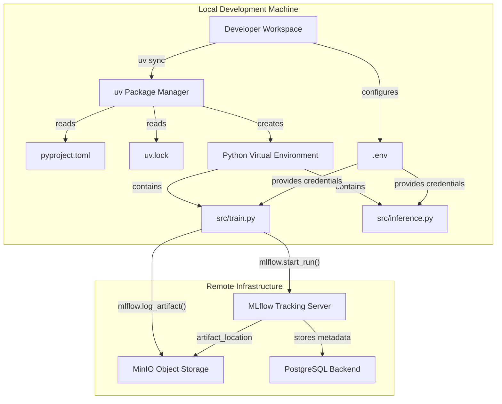
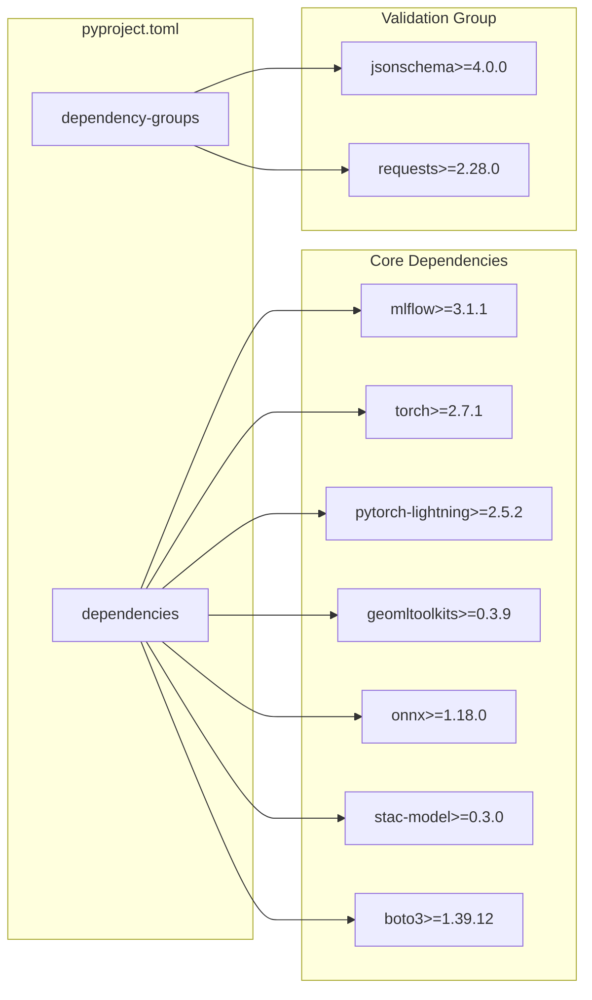
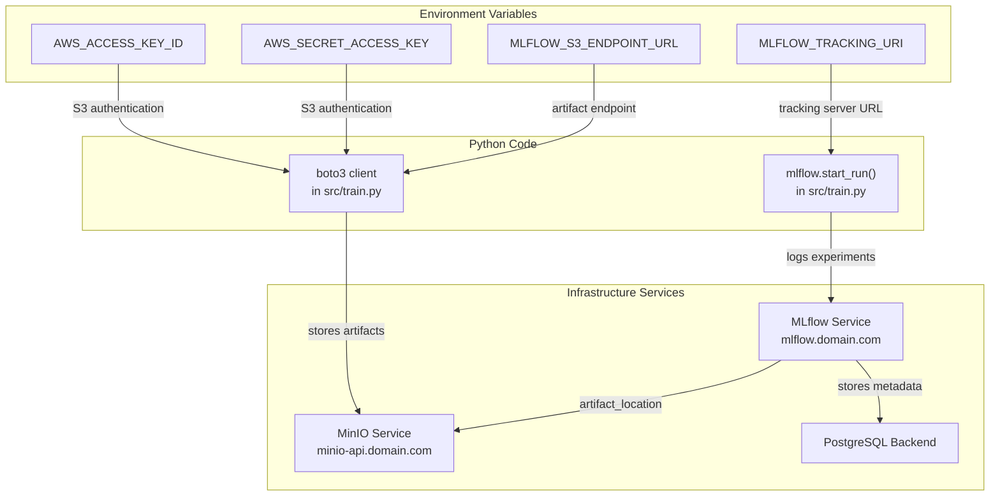
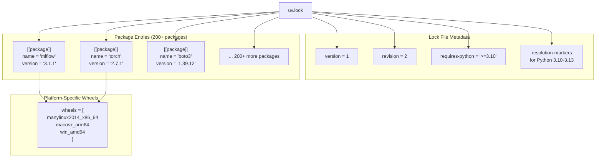
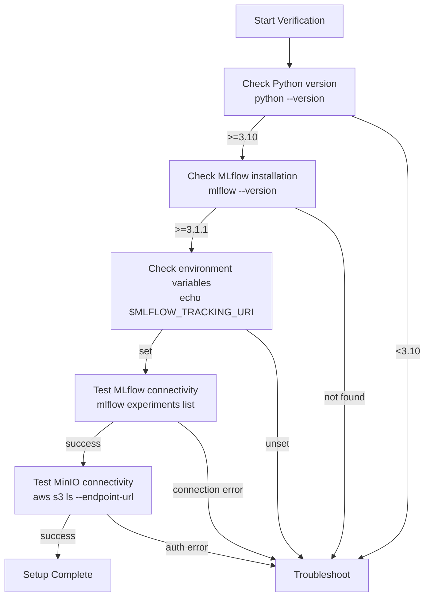

# Local Development Setup

<details>
<summary>Relevant source files</summary>

The following files were used as context for generating this wiki page:

- [examplemodel/.env_sample](examplemodel/.env_sample)
- [examplemodel/pyproject.toml](examplemodel/pyproject.toml)
- [examplemodel/uv.lock](examplemodel/uv.lock)

</details>


## Purpose and Scope

This page describes how to configure a local development environment for working with the Example Model System in the OpenGeoAIModelHub repository. It covers dependency installation, environment variable configuration, and connection setup to the infrastructure services.

For information about deploying the infrastructure stack itself, see [Infrastructure Deployment](#6.1). For guidance on modifying the training pipeline after setup is complete, see [Working with the Training Pipeline](#7.2).

---

## Overview

The local development setup involves three primary tasks:

1. **Dependency installation** using the `uv` package manager
2. **Environment configuration** for MLflow and MinIO connectivity
3. **Verification** that the setup can communicate with infrastructure services

The following diagram shows how these components interact during development:



**Sources:** [examplemodel/pyproject.toml:1-31](), Diagram 5 from high-level architecture

---

## Prerequisites

The following software must be installed on your development machine:

| Requirement | Minimum Version | Purpose |
|-------------|----------------|---------|
| Python | 3.10 | Runtime environment |
| uv | Latest | Package manager and virtual environment manager |
| Git | Any recent | Repository cloning |
| Internet connection | N/A | Dependency download and infrastructure access |

**Operating System Support:**
- Linux (recommended for production-like development)
- macOS (fully supported)
- Windows (supported, but shell scripts require WSL or Git Bash)

**Sources:** [examplemodel/pyproject.toml:6]()

---

## Installing uv Package Manager

The `uv` package manager provides fast dependency resolution and virtual environment management. Install it using one of the following methods:

**Linux/macOS:**
```bash
curl -LsSf https://astral.sh/uv/install.sh | sh
```

**Windows (PowerShell):**
```powershell
powershell -c "irm https://astral.sh/uv/install.ps1 | iex"
```

**Alternative (pip):**
```bash
pip install uv
```

Verify the installation:
```bash
uv --version
```

**Sources:** Diagram 5 from high-level architecture

---

## Cloning the Repository

Clone the OpenGeoAIModelHub repository:

```bash
git clone https://github.com/kshitijrajsharma/opengeoaimodelshub.git
cd opengeoaimodelshub/examplemodel
```

The `examplemodel/` directory contains the ML pipeline code and its dependencies.

**Sources:** Diagram 5 from high-level architecture

---

## Installing Project Dependencies

The project uses `pyproject.toml` for dependency specification and `uv.lock` for reproducible builds.

### Dependency Structure

The following diagram maps the dependency declaration in `pyproject.toml` to specific package groups:



**Sources:** [examplemodel/pyproject.toml:7-24](), [examplemodel/pyproject.toml:26-30]()

### Core Dependency Roles

| Package | Version Constraint | Purpose |
|---------|-------------------|---------|
| `mlflow` | ≥3.1.1 | Experiment tracking and model registry |
| `torch` | ≥2.7.1 | Deep learning framework |
| `pytorch-lightning` | ≥2.5.2 | Training loop abstraction |
| `geomltoolkits` | ≥0.3.9 | Geospatial data processing utilities |
| `onnx` | ≥1.18.0 | Model export format |
| `stac-model` | ≥0.3.0 | STAC-MLM metadata generation |
| `boto3` | ≥1.39.12 | S3-compatible storage client |

**Sources:** [examplemodel/pyproject.toml:7-24]()

### Installing Dependencies

From the `examplemodel/` directory, run:

```bash
uv sync
```

This command:
1. Reads [examplemodel/pyproject.toml:1-31]()
2. Resolves dependencies using [examplemodel/uv.lock:1-577987]()
3. Creates a virtual environment in `.venv/`
4. Installs all packages with exact versions from the lock file

The installation process resolves approximately 200+ transitive dependencies, including platform-specific wheels for:
- PyTorch CUDA/CPU variants
- NumPy optimized builds
- Rasterio geospatial libraries

**Sources:** [examplemodel/pyproject.toml:1-31](), [examplemodel/uv.lock:1-10]()

### Activating the Virtual Environment

After installation, activate the virtual environment:

**Linux/macOS:**
```bash
source .venv/bin/activate
```

**Windows:**
```bash
.venv\Scripts\activate
```

Verify the installation:
```bash
python --version  # Should show Python 3.10 or higher
pip list | grep mlflow  # Should show mlflow 3.1.1 or higher
```

**Sources:** Diagram 5 from high-level architecture

---

## Environment Configuration

The local development environment requires configuration to connect to the infrastructure services (MLflow, MinIO, PostgreSQL).

### Environment Variable Mapping



**Sources:** [examplemodel/.env_sample:1-5](), Diagram 4 from high-level architecture

### Creating the Environment File

1. Copy the sample environment file:
```bash
cp .env_sample .env
```

2. Edit `.env` with your infrastructure credentials:
```bash
export AWS_ACCESS_KEY_ID=your_minio_access_key
export AWS_SECRET_ACCESS_KEY=your_minio_secret_key
export MLFLOW_S3_ENDPOINT_URL=https://minio-api.yourdomain.com
export MLFLOW_TRACKING_URI=http://mlflow.yourdomain.com
```

3. Load the environment variables:
```bash
source .env
```

**Sources:** [examplemodel/.env_sample:1-5]()

### Environment Variable Reference

| Variable | Purpose | Example Value |
|----------|---------|---------------|
| `AWS_ACCESS_KEY_ID` | MinIO access key for artifact storage | `minioadmin` |
| `AWS_SECRET_ACCESS_KEY` | MinIO secret key | `minioadmin` |
| `MLFLOW_S3_ENDPOINT_URL` | MinIO API endpoint URL | `https://minio-api.yourdomain.com` |
| `MLFLOW_TRACKING_URI` | MLflow tracking server URL | `http://mlflow.yourdomain.com` |

**Note:** Despite the `AWS_` prefix, these variables are used to connect to MinIO (an S3-compatible service), not AWS itself.

**Sources:** [examplemodel/.env_sample:1-5]()

---

## Dependency Lock File Details

The `uv.lock` file ensures reproducible builds across different machines and platforms.

### Lock File Structure



**Sources:** [examplemodel/uv.lock:1-10]()

### Example Dependency Entry

The lock file contains detailed information for each package. For example, `boto3`:

- **Package name:** `boto3`
- **Version:** `1.39.12`
- **Dependencies:** `botocore`, `jmespath`, `s3transfer`
- **Source:** PyPI registry
- **Wheel URL:** Pre-built binary with cryptographic hash
- **Installation size:** ~140 KB

**Sources:** [examplemodel/uv.lock:195-206]()

### Key Lock File Attributes

| Attribute | Description | Example |
|-----------|-------------|---------|
| `version` | Lock file format version | `1` |
| `revision` | Lock file schema revision | `2` |
| `requires-python` | Python version constraint | `">=3.10"` |
| `resolution-markers` | Platform-specific resolution markers | `"python_full_version >= '3.13'"` |
| `[[package]]` | Individual package specification | See `boto3` at lines 195-206 |
| `sdist` | Source distribution with hash | For building from source |
| `wheels` | Pre-built binaries with hashes | For quick installation |

**Sources:** [examplemodel/uv.lock:1-10]()

---

## Verifying the Setup

After completing the setup, verify that your environment can communicate with the infrastructure services.

### Verification Checklist



### Manual Verification Commands

1. **Check Python version:**
```bash
python --version
# Expected: Python 3.10.x or higher
```

2. **Check MLflow installation:**
```bash
mlflow --version
# Expected: mlflow, version 3.1.1 or higher
```

3. **Verify environment variables:**
```bash
echo $MLFLOW_TRACKING_URI
echo $MLFLOW_S3_ENDPOINT_URL
echo $AWS_ACCESS_KEY_ID
# All should return non-empty values
```

4. **Test MLflow connectivity:**
```bash
mlflow experiments list
# Should return list of experiments or empty list (not connection error)
```

5. **Test MinIO connectivity (optional):**
```bash
pip install awscli
aws s3 ls --endpoint-url $MLFLOW_S3_ENDPOINT_URL
# Should list buckets or return access denied (not connection error)
```

**Sources:** Diagram 4 from high-level architecture

---

## Common Setup Issues

### Issue: `uv: command not found`

**Cause:** `uv` not installed or not in PATH

**Solution:**
```bash
# Reinstall uv
curl -LsSf https://astral.sh/uv/install.sh | sh
# Restart terminal or reload PATH
source ~/.bashrc  # or ~/.zshrc
```

### Issue: Connection Refused to MLflow

**Cause:** Infrastructure not running or incorrect `MLFLOW_TRACKING_URI`

**Solution:**
1. Verify infrastructure is running (see [Infrastructure Deployment](#6.1))
2. Check `MLFLOW_TRACKING_URI` matches your deployment domain
3. Test with `curl $MLFLOW_TRACKING_URI/api/2.0/mlflow/experiments/list`

**Sources:** [examplemodel/.env_sample:4]()

### Issue: S3 Authentication Failure

**Cause:** Incorrect MinIO credentials

**Solution:**
1. Verify `AWS_ACCESS_KEY_ID` and `AWS_SECRET_ACCESS_KEY` match MinIO deployment
2. Check that `MLFLOW_S3_ENDPOINT_URL` uses correct protocol (http/https)
3. Ensure MinIO service is accessible from your network

**Sources:** [examplemodel/.env_sample:1-3]()

### Issue: Missing Platform-Specific Wheels

**Cause:** Unsupported platform or architecture

**Solution:**
```bash
# Force source builds (slower but compatible)
uv sync --no-binary :all:
```

**Sources:** [examplemodel/uv.lock:14-18]()

---

## Next Steps

With the local development environment configured, you can:

1. **Run the training pipeline** - See [Working with the Training Pipeline](#7.2)
2. **Prepare custom datasets** - See [Data Preparation and Custom Datasets](#7.3)
3. **Execute inference** - See [Inference System](#3.3)
4. **Modify model architecture** - See [Model Overview and Architecture](#3.1)

To run a quick test of the setup, execute the preprocess entry point:

```bash
mlflow run . -e preprocess
```

This will verify that:
- MLflow can execute entry points from [MLproject]()
- Environment variables are correctly configured
- Dependencies are properly installed
- Data can be downloaded from external sources

**Sources:** Diagram 4 from high-level architecture, [examplemodel/pyproject.toml:1-31]()