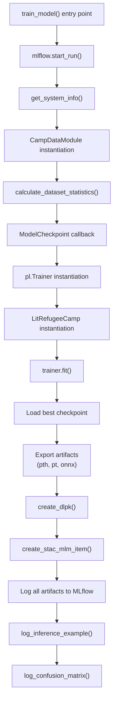
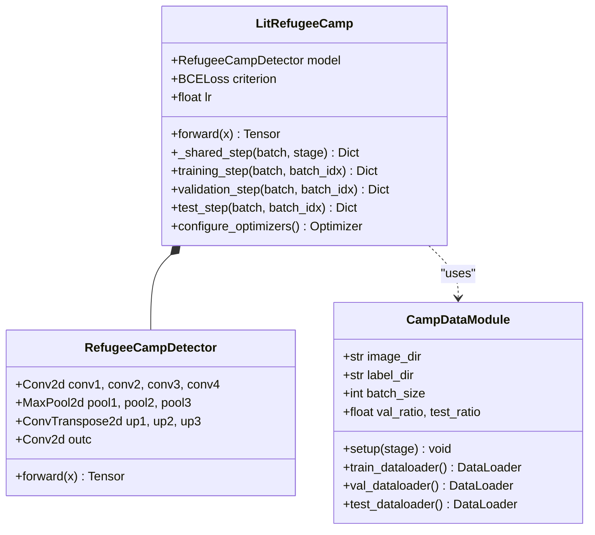
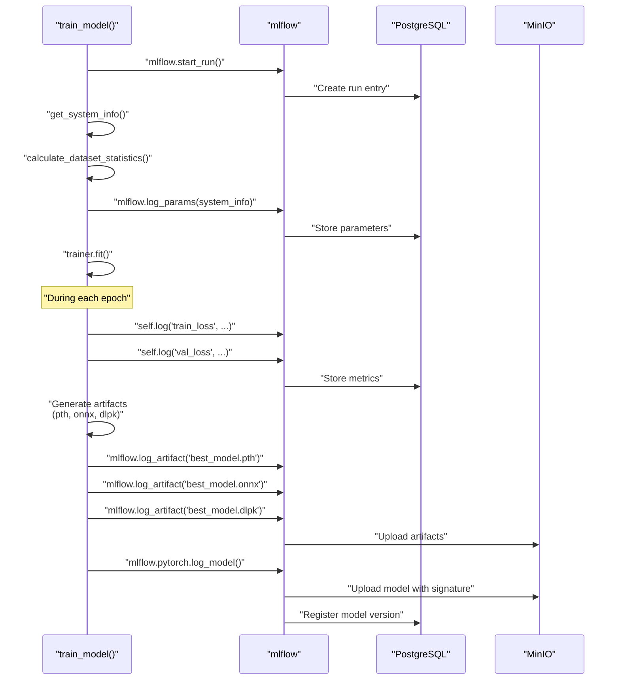

# Working with the Training Pipeline

<details>
<summary>Relevant source files</summary>

The following files were used as context for generating this wiki page:

- [examplemodel/MLproject](examplemodel/MLproject)
- [examplemodel/playground.ipynb](examplemodel/playground.ipynb)
- [examplemodel/src/model.py](examplemodel/src/model.py)
- [examplemodel/src/train.py](examplemodel/src/train.py)

</details>


## Purpose and Scope

This guide covers modifying and extending the training pipeline for custom experimentation and development. It explains the architecture of the training system, how to adjust training parameters, add custom metrics, modify the model architecture, and work with MLflow experiment tracking. This guide is intended for developers who want to customize the example model for their own use cases.

For information about setting up your local environment, see [Local Development Setup](#7.1). For preparing custom datasets, see [Data Preparation and Custom Datasets](#7.3). For the complete training pipeline architecture from a system perspective, see [Training Pipeline](#3.2).

---

## Training Pipeline Architecture

The training pipeline is implemented in [examplemodel/src/train.py]() and orchestrated through the MLflow project entry point defined in [examplemodel/MLproject:19-32](). The pipeline follows a standard PyTorch Lightning workflow with MLflow integration for experiment tracking.

### High-Level Training Flow



**Sources:** [examplemodel/src/train.py:370-518]()

### Key Components and Their Responsibilities

| Component | Class/Function | Location | Responsibility |
|-----------|---------------|----------|----------------|
| **Training Orchestration** | `train_model()` | [examplemodel/src/train.py:370-518]() | Main entry point, coordinates entire pipeline |
| **Model Architecture** | `LitRefugeeCamp` | [examplemodel/src/model.py:145-174]() | PyTorch Lightning module wrapper |
| **Network** | `RefugeeCampDetector` | [examplemodel/src/model.py:103-138]() | U-Net semantic segmentation model |
| **Data Management** | `CampDataModule` | [examplemodel/src/model.py:33-100]() | PyTorch Lightning data module |
| **System Profiling** | `get_system_info()` | [examplemodel/src/train.py:25-60]() | Hardware/software environment capture |
| **Dataset Statistics** | `calculate_dataset_statistics()` | [examplemodel/src/train.py:63-98]() | Mean, std, split sizes |
| **Model Checkpointing** | `ModelCheckpoint` | [examplemodel/src/train.py:405-412]() | Save best models during training |
| **STAC Metadata** | `create_stac_mlm_item()` | [examplemodel/src/train.py:101-367]() | Generate standardized model metadata |
| **MLflow Integration** | `mlflow.*` calls | Throughout [train.py]() | Experiment tracking and artifact logging |

**Sources:** [examplemodel/src/train.py](), [examplemodel/src/model.py]()

---

## Core Training Components

### LitRefugeeCamp: PyTorch Lightning Module

The `LitRefugeeCamp` class wraps the neural network architecture with PyTorch Lightning's training abstractions. It defines the training logic, validation logic, and optimizer configuration.



**Key methods to override for customization:**

- **`__init__()`** [examplemodel/src/model.py:146-150](): Change loss function, learning rate, or add model parameters
- **`_shared_step()`** [examplemodel/src/model.py:155-162](): Modify loss computation and metric calculation
- **`configure_optimizers()`** [examplemodel/src/model.py:173-174](): Change optimizer or add learning rate schedulers

**Sources:** [examplemodel/src/model.py:145-174](), [examplemodel/src/model.py:103-138](), [examplemodel/src/model.py:33-100]()

### CampDataModule: Data Pipeline

The `CampDataModule` handles all data loading, transformation, and splitting. It uses standard ImageNet normalization for transfer learning compatibility.

**Transformation pipeline** [examplemodel/src/model.py:53-65]():
- **Images**: Resize to 256×256 → ToTensor → Normalize with ImageNet stats
- **Labels**: Resize to 256×256 (NEAREST) → ToTensor

**Split ratios** [examplemodel/src/model.py:39-41]():
- Validation: 15% (default)
- Test: 15% (default)
- Training: 70% (remaining)

**Sources:** [examplemodel/src/model.py:33-100]()

---

## Customizing Training Parameters

Training parameters can be modified at three levels: command-line arguments, MLproject defaults, or directly in code.

### MLproject Entry Point Configuration

The `train` entry point in [examplemodel/MLproject:19-32]() defines default parameters:

| Parameter | Type | Default | Description |
|-----------|------|---------|-------------|
| `epochs` | int | 1 | Number of training epochs |
| `batch_size` | int | 32 | Batch size for training |
| `chips_dir` | str | `data/train/sample/chips` | Image directory |
| `labels_dir` | str | `data/train/sample/labels` | Label directory |
| `lr` | float | 1e-3 | Learning rate |

### Running with Custom Parameters

```bash
# Via MLflow
mlflow run . -e train -P epochs=50 -P batch_size=16 -P lr=0.0001

# Direct Python execution
uv run python src/train.py \
  --epochs 50 \
  --batch_size 16 \
  --lr 0.0001 \
  --chips_dir path/to/chips \
  --labels_dir path/to/labels
```

### Argument Parser Configuration

The argument parser is defined in [examplemodel/src/train.py:510-516]():

```python
parser = argparse.ArgumentParser()
parser.add_argument("--epochs", type=int, default=1)
parser.add_argument("--batch_size", type=int, default=32)
parser.add_argument("--chips_dir", type=str, default="data/train/sample/chips")
parser.add_argument("--labels_dir", type=str, default="data/train/sample/labels")
parser.add_argument("--lr", type=float, default=1e-3)
```

**To add new parameters:**
1. Add argument to parser in [train.py:510-516]()
2. Add parameter to MLproject entry point [MLproject:19-32]()
3. Use the parameter in model/data module initialization

**Sources:** [examplemodel/MLproject:19-32](), [examplemodel/src/train.py:510-516]()

---

## Adding Custom Metrics

Metrics are logged through PyTorch Lightning's `self.log()` method and captured by MLflow automatically.

### Current Metrics Implementation

The `_shared_step()` method in [examplemodel/src/model.py:155-162]() logs two metrics:

```python
def _shared_step(self, batch, stage):
    x, y = batch
    y_hat = self(x)
    loss = self.criterion(y_hat, y)
    acc = pixel_acc(y_hat, y)  # Helper function at model.py:140-142
    self.log(f"{stage}_loss", loss, prog_bar=True)
    self.log(f"{stage}_acc", acc, prog_bar=True)
    return {"loss": loss, "acc": acc}
```

### Adding Custom Metrics

**Step 1:** Define metric calculation function in [model.py]():

```python
def intersection_over_union(pred, target, threshold=0.5):
    """Calculate IoU for binary segmentation."""
    pred_binary = (pred > threshold).float()
    intersection = (pred_binary * target).sum()
    union = pred_binary.sum() + target.sum() - intersection
    return intersection / (union + 1e-7)  # Add epsilon to avoid division by zero
```

**Step 2:** Modify `_shared_step()` to compute and log the metric:

```python
def _shared_step(self, batch, stage):
    x, y = batch
    y_hat = self(x)
    loss = self.criterion(y_hat, y)
    acc = pixel_acc(y_hat, y)
    iou = intersection_over_union(y_hat, y)  # New metric
    
    self.log(f"{stage}_loss", loss, prog_bar=True)
    self.log(f"{stage}_acc", acc, prog_bar=True)
    self.log(f"{stage}_iou", iou, prog_bar=True)  # Log new metric
    
    return {"loss": loss, "acc": acc, "iou": iou}
```

### Post-Training Metrics

Additional metrics are logged after training completes:

- **Confusion Matrix**: [examplemodel/src/train.py:491]() via `log_confusion_matrix(model, data_module, run)`
- **Inference Example**: [examplemodel/src/train.py:490]() via `log_inference_example(model, data_module)`

These functions are defined in [utils.py]() and [inference.py]() respectively.

**Sources:** [examplemodel/src/model.py:155-162](), [examplemodel/src/model.py:140-142](), [examplemodel/src/train.py:490-491]()

---

## Modifying Model Architecture

The model architecture consists of two layers: the neural network (`RefugeeCampDetector`) and the Lightning module wrapper (`LitRefugeeCamp`).

### Current Architecture: U-Net

```mermaid
graph LR
    subgraph "Encoder"
        INPUT["Input<br/>3×256×256"]
        CONV1["conv1<br/>64 channels"]
        POOL1["pool1<br/>MaxPool 2×2"]
        CONV2["conv2<br/>128 channels"]
        POOL2["pool2<br/>MaxPool 2×2"]
        CONV3["conv3<br/>256 channels"]
        POOL3["pool3<br/>MaxPool 2×2"]
    end
    
    subgraph "Bottleneck"
        CONV4["conv4<br/>512 channels"]
    end
    
    subgraph "Decoder"
        UP1["up1<br/>ConvTranspose2d"]
        UP2["up2<br/>ConvTranspose2d"]
        UP3["up3<br/>ConvTranspose2d"]
        OUTC["outc<br/>1 channel"]
        OUTPUT["Output<br/>1×256×256"]
    end
    
    INPUT --> CONV1 --> POOL1 --> CONV2 --> POOL2 --> CONV3 --> POOL3
    POOL3 --> CONV4 --> UP1 --> UP2 --> UP3 --> OUTC --> OUTPUT
```



**Sources:** [examplemodel/src/model.py:103-138]()

### Replacing the Architecture

**Option 1: Modify RefugeeCampDetector directly** [examplemodel/src/model.py:103-138]()

Edit the `RefugeeCampDetector` class to add skip connections, more layers, or different activation functions.

**Option 2: Use a pretrained backbone**

Replace the entire network with a pretrained model:

```python
import segmentation_models_pytorch as smp

class LitRefugeeCamp(pl.LightningModule):
    def __init__(self, lr=1e-3):
        super().__init__()
        self.model = smp.Unet(
            encoder_name="resnet34",        # Use ResNet34 backbone
            encoder_weights="imagenet",     # Pretrained on ImageNet
            in_channels=3,
            classes=1,                      # Binary segmentation
        )
        self.criterion = nn.BCEWithLogitsLoss()  # Note: no sigmoid in model
        self.lr = lr
    
    def forward(self, x):
        return torch.sigmoid(self.model(x))  # Apply sigmoid for inference
```

**Important:** When changing architectures:
1. Update input/output shapes in STAC metadata [train.py:190-230]()
2. Update ONNX export dimensions [train.py:450-460]()
3. Update model signature for MLflow [train.py:498-503]()

**Sources:** [examplemodel/src/model.py:103-138](), [examplemodel/src/model.py:145-174]()

---

## Working with Callbacks

PyTorch Lightning callbacks provide hooks into the training lifecycle. The training pipeline currently uses `ModelCheckpoint`.

### Current Callback: ModelCheckpoint

Configuration in [examplemodel/src/train.py:405-412]():

```python
checkpoint_callback = ModelCheckpoint(
    dirpath="checkpoints",
    filename="epoch={epoch}-step={step}",
    save_top_k=1,           # Keep only best model
    verbose=True,
    monitor="val_loss",     # Metric to monitor
    mode="min",             # Minimize validation loss
)
```

The best checkpoint path is accessed via [train.py:424]():
```python
best_checkpoint = checkpoint_callback.best_model_path
```

### Adding Custom Callbacks

**Example: Early Stopping**

```python
from pytorch_lightning.callbacks import EarlyStopping

early_stop_callback = EarlyStopping(
    monitor="val_loss",
    patience=10,
    mode="min",
    verbose=True
)

trainer = pl.Trainer(
    max_epochs=args.epochs,
    accelerator="auto",
    callbacks=[checkpoint_callback, early_stop_callback],  # Add to list
    logger=False,
)
```

**Example: Learning Rate Monitoring**

```python
from pytorch_lightning.callbacks import LearningRateMonitor

lr_monitor = LearningRateMonitor(logging_interval='epoch')

trainer = pl.Trainer(
    callbacks=[checkpoint_callback, lr_monitor],
)
```

**Example: Custom Callback for Gradient Logging**

```python
class GradientLoggingCallback(pl.Callback):
    def on_after_backward(self, trainer, pl_module):
        if trainer.global_step % 100 == 0:  # Log every 100 steps
            for name, param in pl_module.named_parameters():
                if param.grad is not None:
                    mlflow.log_metric(
                        f"grad_{name}_mean", 
                        param.grad.mean().item(),
                        step=trainer.global_step
                    )
```

**Sources:** [examplemodel/src/train.py:405-412](), [examplemodel/src/train.py:414-419]()

---

## MLflow Integration and Experiment Tracking

The training pipeline is deeply integrated with MLflow for reproducibility and artifact management.

### MLflow Logging Flow



**Sources:** [examplemodel/src/train.py:370-507]()

### Logged Parameters

System information [train.py:374-387]() and dataset statistics [train.py:396-403]() are logged as parameters:

```python
mlflow.log_params({
    "train_samples": dataset_stats["train_samples"],
    "val_samples": dataset_stats["val_samples"],
    "test_samples": dataset_stats["test_samples"],
    "num_classes": dataset_stats["num_classes"],
})
```

### Logged Metrics

Metrics are automatically captured from PyTorch Lightning's `self.log()` calls during training:
- `train_loss`, `val_loss` per epoch
- `train_acc`, `val_acc` per epoch
- Post-training: `best_val_loss`, `epochs_trained` [train.py:426-431]()

### Logged Artifacts

Artifacts are organized in a structured folder hierarchy [train.py:478-496]():

| Artifact Path | Description | Line Reference |
|---------------|-------------|----------------|
| `metadata/stac_item.json` | STAC-MLM metadata | [479]() |
| `models/best_model.pth` | PyTorch state dict | [480]() |
| `models/best_model.pt` | TorchScript traced model | [481]() |
| `models/best_model.onnx` | ONNX format | [482]() |
| `models/best_model.dlpk` | ESRI Deep Learning Package | [483]() |
| `checkpoints/epoch=*.ckpt` | PyTorch Lightning checkpoint | [484]() |
| `datasets/train/chips/*` | Training images | [487]() |
| `datasets/train/labels/*` | Training labels | [488]() |
| `esri/*` | ESRI integration files | [493-496]() |

### MLflow Model Registry

The final model is logged with signature and metadata [train.py:498-503]():

```python
signature = infer_signature(
    dummy_input.numpy(), 
    clean_model(dummy_input).detach().numpy()
)
mlflow.pytorch.log_model(
    clean_model, 
    "model", 
    signature=signature, 
    extra_files=[stac_output_path]
)
```

This creates a model entry in the MLflow Model Registry that can be:
- Deployed to various targets
- Version controlled
- Tagged with stages (staging, production)

**Sources:** [examplemodel/src/train.py:373-503]()

---

## Advanced Customizations

### Customizing Loss Functions

The loss function is defined in `LitRefugeeCamp.__init__()` [examplemodel/src/model.py:149]():

```python
self.criterion = nn.BCELoss()
```

**Common alternatives for segmentation:**

```python
# Focal Loss for handling class imbalance
from segmentation_models_pytorch.losses import FocalLoss
self.criterion = FocalLoss(mode='binary')

# Dice Loss for better overlap optimization
from segmentation_models_pytorch.losses import DiceLoss
self.criterion = DiceLoss(mode='binary')

# Combined loss
class CombinedLoss(nn.Module):
    def __init__(self):
        super().__init__()
        self.bce = nn.BCELoss()
        self.dice = DiceLoss(mode='binary')
    
    def forward(self, pred, target):
        return self.bce(pred, target) + self.dice(pred, target)

self.criterion = CombinedLoss()
```

### Customizing Optimizers and Schedulers

The optimizer is configured in `configure_optimizers()` [examplemodel/src/model.py:173-174]():

```python
def configure_optimizers(self):
    return torch.optim.Adam(self.parameters(), lr=self.lr)
```

**Adding learning rate schedulers:**

```python
def configure_optimizers(self):
    optimizer = torch.optim.Adam(self.parameters(), lr=self.lr)
    scheduler = {
        'scheduler': torch.optim.lr_scheduler.ReduceLROnPlateau(
            optimizer, 
            mode='min',
            factor=0.5,
            patience=5,
            verbose=True
        ),
        'monitor': 'val_loss',
    }
    return {'optimizer': optimizer, 'lr_scheduler': scheduler}
```

**Alternative optimizers:**

```python
# AdamW with weight decay
optimizer = torch.optim.AdamW(self.parameters(), lr=self.lr, weight_decay=1e-4)

# SGD with momentum
optimizer = torch.optim.SGD(self.parameters(), lr=self.lr, momentum=0.9)
```

### Customizing STAC Metadata

The STAC-MLM metadata is generated in `create_stac_mlm_item()` [examplemodel/src/train.py:101-367](). Key sections to modify:

**Model description** [train.py:124-141]():
```python
"properties": {
    "title": "Your Custom Model Title",
    "description": "Your custom description",
    "keywords": ["your", "keywords"],
    "license": "MIT",
    ...
}
```

**Input/output specifications** [train.py:190-230]():
Update these when changing input dimensions, normalization, or output classes.

**Asset links** [train.py:246-364]():
Add or modify asset entries for new artifact types.

### Customizing Data Augmentation

Data augmentation can be added to the `CampDataModule.setup()` method [examplemodel/src/model.py:52-65]():

```python
from torchvision import transforms as T

def setup(self, stage=None):
    img_tf = T.Compose([
        T.Resize((256, 256)),
        T.RandomHorizontalFlip(p=0.5),      # Add augmentation
        T.RandomVerticalFlip(p=0.5),        # Add augmentation
        T.RandomRotation(degrees=15),        # Add augmentation
        T.ColorJitter(brightness=0.2, contrast=0.2),  # Add augmentation
        T.ToTensor(),
        T.Normalize([0.485, 0.456, 0.406], [0.229, 0.224, 0.225]),
    ])
    # ... rest of setup
```

**Note:** For segmentation tasks, ensure augmentations are applied consistently to both images and labels using `torchvision.transforms.functional` or specialized libraries like `albumentations`.

**Sources:** [examplemodel/src/model.py:145-174](), [examplemodel/src/train.py:101-367](), [examplemodel/src/model.py:52-65]()

---

## Summary

The training pipeline provides multiple extension points for customization:

1. **Parameters**: Modify via command-line, MLproject, or argument parser
2. **Metrics**: Add custom metrics in `_shared_step()` method
3. **Architecture**: Replace `RefugeeCampDetector` or entire `LitRefugeeCamp` class
4. **Callbacks**: Add PyTorch Lightning callbacks for monitoring and control
5. **MLflow**: All metrics and artifacts automatically tracked
6. **Loss/Optimizer**: Customize in `LitRefugeeCamp` methods
7. **Data Augmentation**: Extend transforms in `CampDataModule.setup()`

For extending the dataset handling beyond the current implementation, see [Data Preparation and Custom Datasets](#7.3). For deploying trained models, see [Model Deployment Options](#6.2).

**Sources:** [examplemodel/src/train.py](), [examplemodel/src/model.py](), [examplemodel/MLproject]()