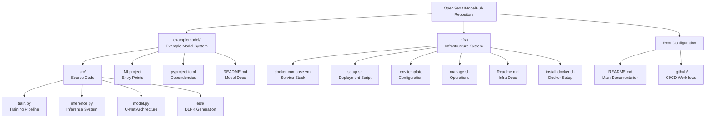
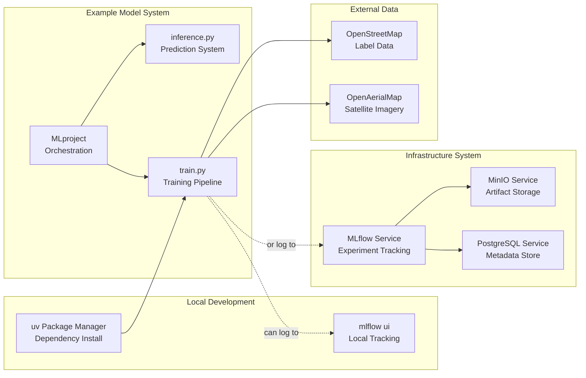
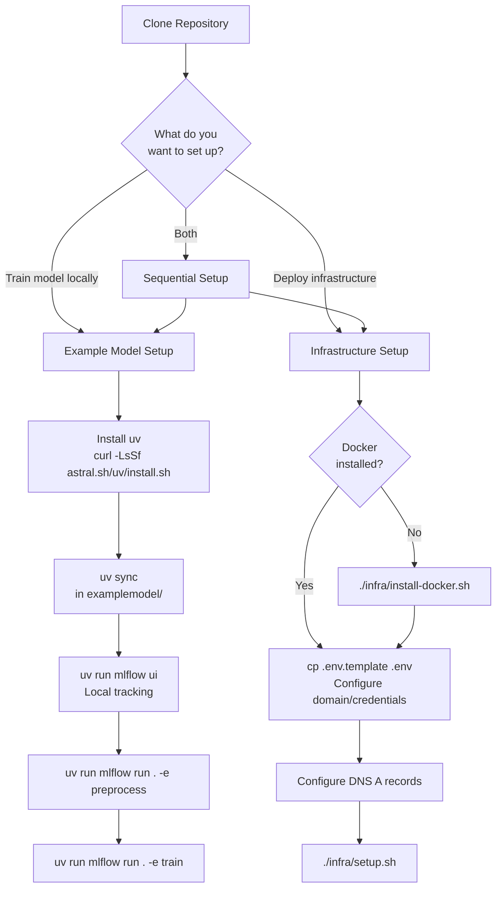
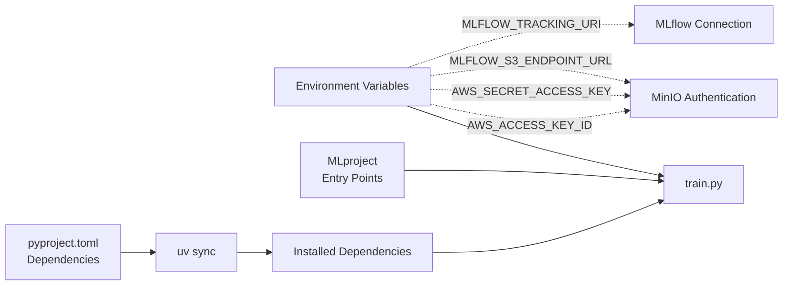
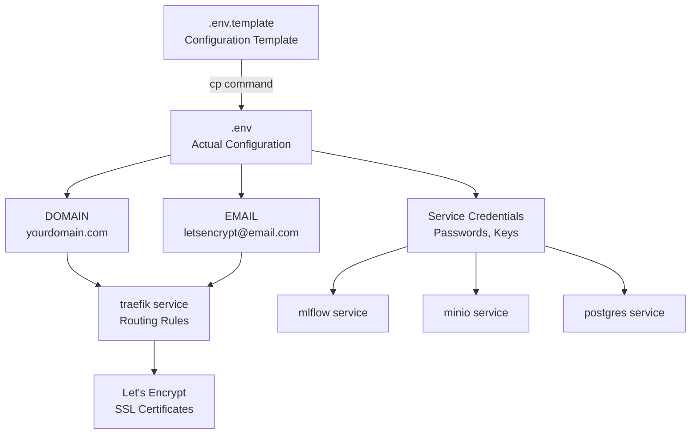
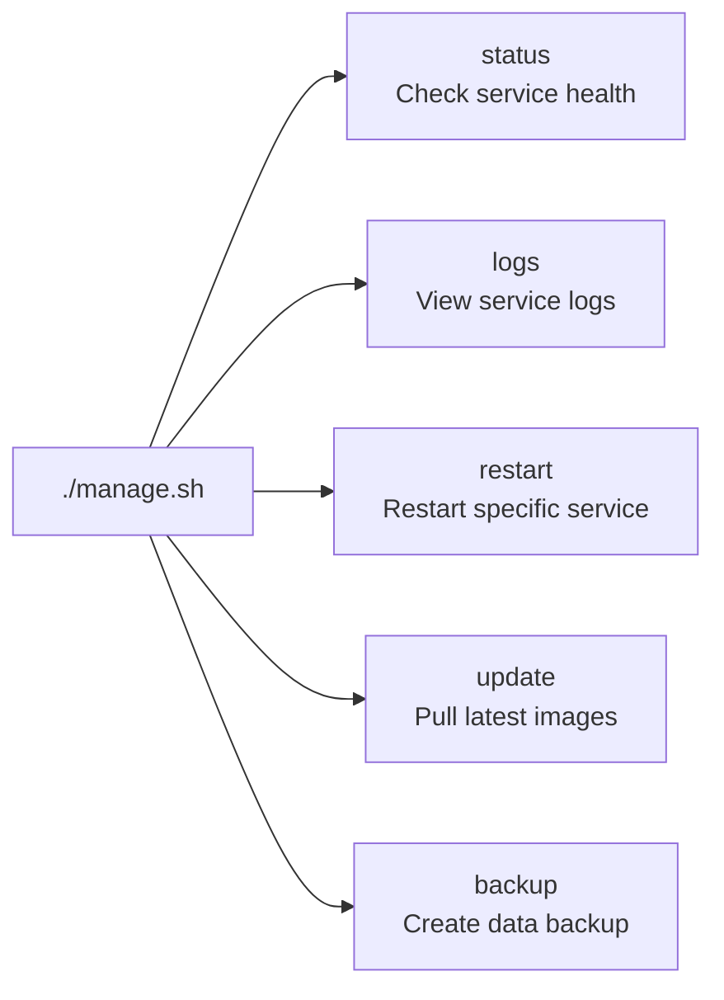
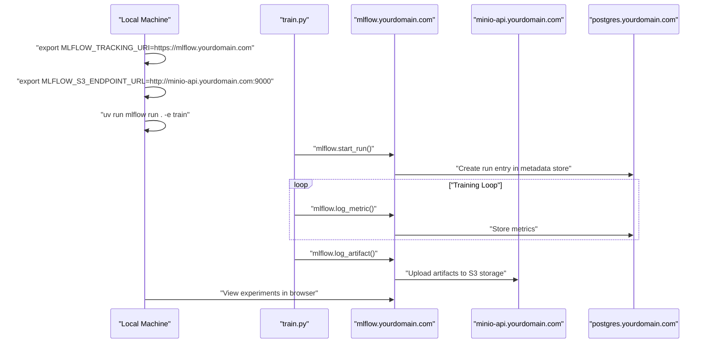

# Getting Started

Relevant source files

The following files were used as context for generating this wiki page:

- [examplemodel/README.md](examplemodel/README.md)
- [infra/Readme.md](infra/Readme.md)
- [infra/install-docker.sh](infra/install-docker.sh)

This page provides an overview of initial setup procedures for the OpenGeoAIModelHub repository. The repository contains two independent but complementary systems: an **Example Model System** for refugee camp detection and an **Infrastructure System** for production MLOps deployment. This guide introduces the setup requirements and workflows for both systems at a high level.

For detailed installation instructions, see [Prerequisites and Installation](#2.1). For step-by-step execution procedures, see [Quick Start Guide](#2.2). For comprehensive documentation of the example model, see [Example Model System](#3). For infrastructure deployment details, see [Infrastructure System](#4).

## Repository Structure

The repository is organized into two primary directories, each containing a complete system with its own dependencies, configuration, and deployment procedures:

**Sources:** [infra/Readme.md:1-83](), [examplemodel/README.md:1-52]()

## System Architecture Overview

The two systems serve different but complementary purposes and can be used independently or together:

| System | Purpose | Primary Use Case | Deployment Target |
|--------|---------|-----------------|-------------------|
| Example Model | ML model development and training | Local experimentation, model development | Standalone training environment |
| Infrastructure | Production MLOps platform | Multi-user experiment tracking, model registry | Server/cloud deployment |

**Sources:** [infra/Readme.md:1-83](), [examplemodel/README.md:1-52]()

## Setup Workflows

There are two primary setup workflows depending on your objectives:

### Workflow Diagram: Setup Decision Tree

**Sources:** [infra/Readme.md:14-30](), [examplemodel/README.md:7-38](), [infra/install-docker.sh:1-50]()

### Example Model Setup Path

The example model system runs entirely on your local machine using `uv` for dependency management and can log experiments either locally or to a remote MLflow server.

**Key Steps:**
1. Install `uv` package manager
2. Run `uv sync` in `examplemodel/` directory to install dependencies from `pyproject.toml`
3. Execute MLflow entry points defined in `MLproject` file
4. Access results via local MLflow UI or remote infrastructure

**Key Files:**
- [examplemodel/pyproject.toml]() - Python dependencies
- [examplemodel/MLproject]() - Entry point definitions
- [examplemodel/src/train.py]() - Training pipeline
- [examplemodel/src/inference.py]() - Inference pipeline

**Sources:** [examplemodel/README.md:7-38]()

### Infrastructure Setup Path

The infrastructure system deploys a multi-service Docker Compose stack on a server with automatic SSL certificates, requiring domain name configuration and Docker installation.

**Key Steps:**
1. Install Docker and Docker Compose (via `install-docker.sh` if needed)
2. Configure `.env` file from `.env.template` with domain and credentials
3. Set up DNS A records for all service subdomains
4. Run `setup.sh` to deploy the stack
5. Access services via configured subdomains

**Key Files:**
- [infra/docker-compose.yml]() - Service definitions
- [infra/.env.template]() - Configuration template
- [infra/setup.sh]() - Automated deployment
- [infra/manage.sh]() - Operations management

**Sources:** [infra/Readme.md:14-30]()

## Prerequisites Summary

### For Example Model System

| Requirement | Purpose | Installation Method |
|------------|---------|-------------------|
| `uv` package manager | Python dependency management | `curl -LsSf https://astral.sh/uv/install.sh \| sh` |
| Python 3.10+ | Runtime environment | System package manager |
| Git | Repository cloning | System package manager |

### For Infrastructure System

| Requirement | Purpose | Installation Method |
|------------|---------|-------------------|
| Docker Engine | Container runtime | [infra/install-docker.sh]() or manual |
| Docker Compose | Multi-container orchestration | Included with Docker Engine |
| Domain name | SSL certificates and routing | DNS provider |
| Server with public IP | Service hosting | Cloud provider or on-premise |

**Detailed installation instructions are provided in [Prerequisites and Installation](#2.1).**

**Sources:** [examplemodel/README.md:7-12](), [infra/Readme.md:14-30](), [infra/install-docker.sh:1-50]()

## Configuration Overview

### Example Model Configuration

The example model uses environment variables for remote tracking server configuration:

**Key Environment Variables:**
- `AWS_ACCESS_KEY_ID` - MinIO/S3 access key for artifact storage
- `AWS_SECRET_ACCESS_KEY` - MinIO/S3 secret key
- `MLFLOW_S3_ENDPOINT_URL` - MinIO endpoint URL (e.g., `http://minio.yourdomain.com:9000`)
- `MLFLOW_TRACKING_URI` - MLflow server URL (optional for remote logging)

**Sources:** [examplemodel/README.md:40-48]()

### Infrastructure Configuration

The infrastructure stack uses a single `.env` file to configure all services:

**Required DNS Records:**
- `yourdomain.com` → Homepage dashboard
- `mlflow.yourdomain.com` → MLflow tracking server
- `minio.yourdomain.com` → MinIO console
- `minio-api.yourdomain.com` → MinIO S3 API
- `postgres.yourdomain.com` → PostgreSQL database
- `rustdesk.yourdomain.com` → RustDesk server
- `traefik.yourdomain.com` → Traefik dashboard

**Sources:** [infra/Readme.md:32-41]()

## Service Management

Once the infrastructure is deployed, services are managed through two mechanisms:

### Management Script

The `manage.sh` script provides operational commands:

**Sources:** [infra/Readme.md:54-60]()

### Systemd Integration

The `setup.sh` script optionally creates a systemd service for automatic startup:

| Command | Function |
|---------|----------|
| `sudo systemctl start tech-infra` | Start all services |
| `sudo systemctl stop tech-infra` | Stop all services |
| `sudo systemctl status tech-infra` | Check service status |
| `sudo systemctl enable tech-infra` | Enable auto-start on boot |

**Sources:** [infra/Readme.md:62-68]()

## Integration Patterns

### Local Development with Remote Infrastructure

The example model can be trained locally while logging to remote infrastructure:

**Sources:** [examplemodel/README.md:40-48](), [infra/Readme.md:5-12]()

## Next Steps

After understanding the repository structure and setup overview:

1. **Install Prerequisites** - Follow [Prerequisites and Installation](#2.1) for detailed installation instructions for both `uv` and Docker
2. **Execute Quick Start** - Follow [Quick Start Guide](#2.2) for step-by-step commands to run your first training or deploy infrastructure
3. **Explore the Model** - Read [Example Model System](#3) for comprehensive documentation of the ML pipeline
4. **Deploy Infrastructure** - Read [Infrastructure System](#4) for detailed service configuration and management
5. **Customize** - See [Development Guide](#7) for instructions on extending functionality and working with custom datasets

**Sources:** [infra/Readme.md:1-83](), [examplemodel/README.md:1-52]()