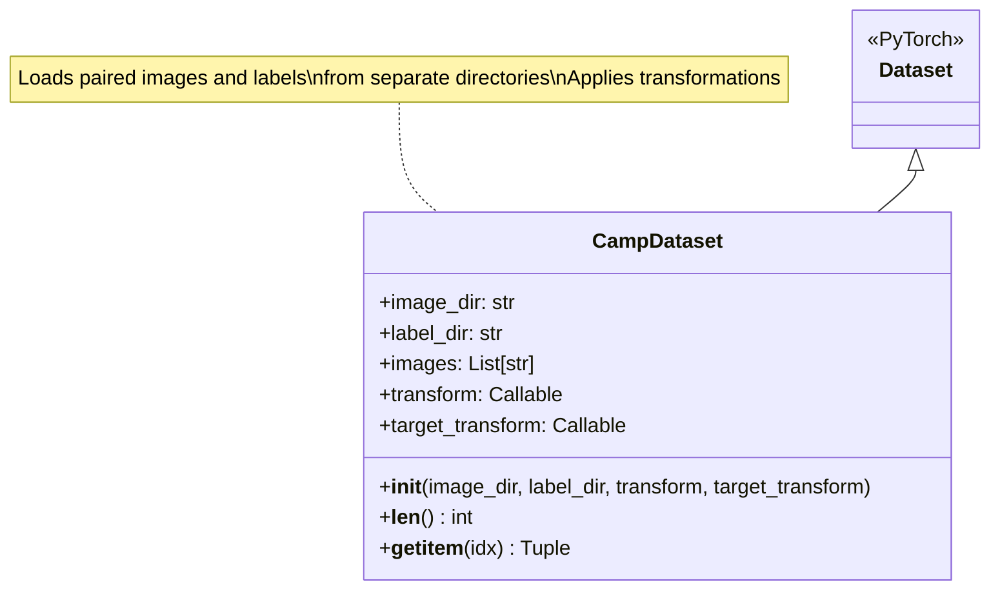
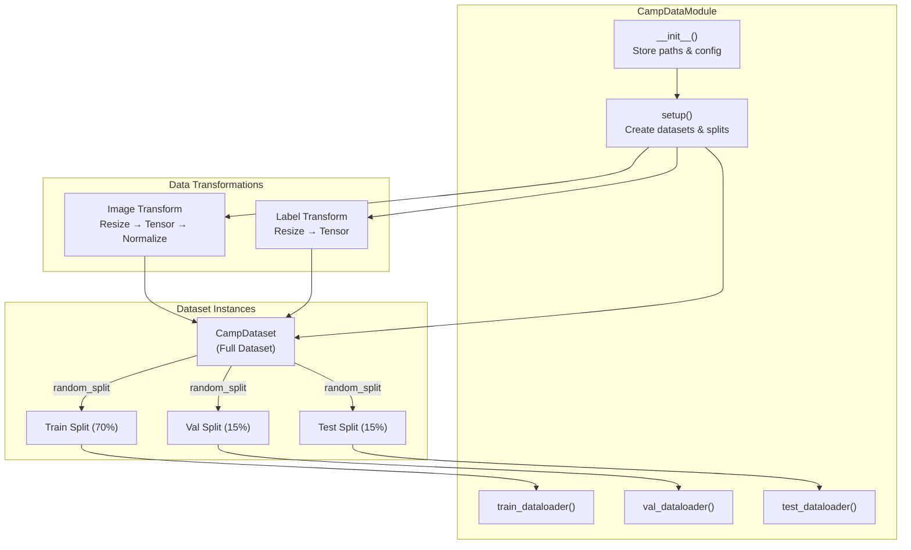
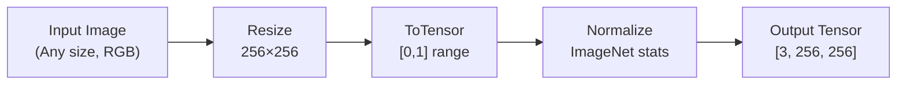
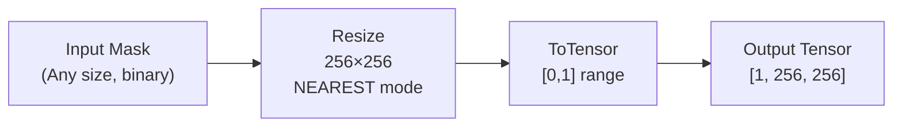
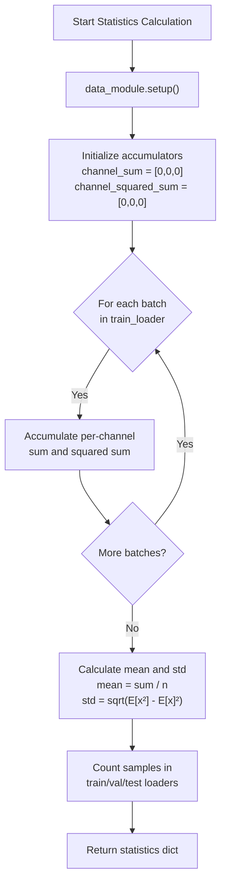
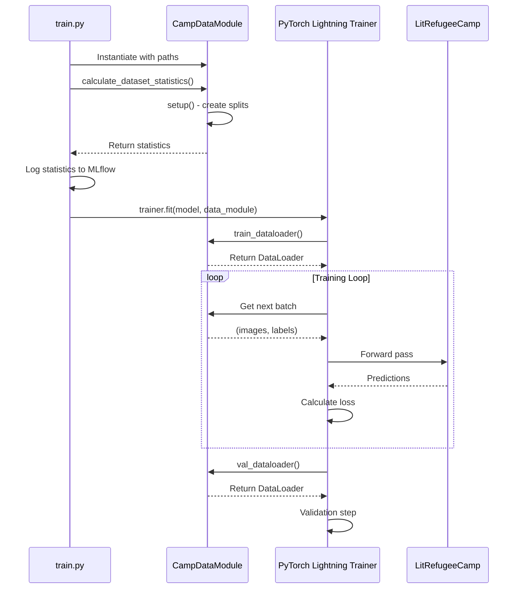

# Data Preparation and Custom Datasets

<details>
<summary>Relevant source files</summary>

The following files were used as context for generating this wiki page:

- [examplemodel/playground.ipynb](examplemodel/playground.ipynb)
- [examplemodel/src/model.py](examplemodel/src/model.py)
- [examplemodel/src/train.py](examplemodel/src/train.py)

</details>


## Purpose and Scope

This page explains the data preparation pipeline for the refugee camp detection model, including the expected dataset structure, data loading mechanisms, preprocessing transformations, and how to adapt the system for custom datasets. For information about the training process that uses these datasets, see [Working with the Training Pipeline](#7.2). For model architecture details, see [Model Overview and Architecture](#3.1).

---

## Dataset Structure and Requirements

The training pipeline expects datasets organized in a paired directory structure where images and their corresponding labels are stored separately but share matching filenames.

### Expected Directory Layout

```
data/
├── train/
│   ├── sample/
│   │   ├── chips/          # Satellite imagery
│   │   │   ├── image_001.png
│   │   │   ├── image_002.png
│   │   │   └── ...
│   │   └── labels/         # Segmentation masks
│   │       ├── image_001.png
│   │       ├── image_002.png
│   │       └── ...
```

**Requirements:**
- Images and labels must have **identical filenames**
- Images: RGB format (3 channels), typically PNG or JPEG
- Labels: Grayscale format (1 channel), binary masks (0 for background, 1 for refugee camps)
- Default input size: 256×256 pixels (resized automatically if different)

The default paths are specified as command-line arguments to the training script:
- `--chips_dir`: Path to image directory (default: `data/train/sample/chips`)
- `--labels_dir`: Path to label directory (default: `data/train/sample/labels`)

**Sources:** [examplemodel/src/train.py:513-514](), [examplemodel/src/model.py:12-30]()

---

## CampDataset: Core Data Loading Class

### Class Architecture



### Implementation Details

The `CampDataset` class [examplemodel/src/model.py:12-30]() implements the PyTorch `Dataset` interface:

| Method | Purpose | Returns |
|--------|---------|---------|
| `__init__()` | Initialize with directory paths and transforms | None |
| `__len__()` | Return total number of samples | int |
| `__getitem__(idx)` | Load and transform image/label pair at index | Tuple[Tensor, Tensor] |

**Key behaviors:**
- Automatically sorts files alphabetically to ensure consistent pairing
- Converts images to RGB (3 channels) using PIL
- Converts labels to grayscale (1 channel)
- Applies optional transforms to both images and labels independently

**Sources:** [examplemodel/src/model.py:12-30]()

---

## CampDataModule: PyTorch Lightning Data Management

### Architecture Diagram



### Configuration Parameters

The `CampDataModule` class [examplemodel/src/model.py:33-100]() accepts the following initialization parameters:

| Parameter | Type | Default | Purpose |
|-----------|------|---------|---------|
| `image_dir` | str | Required | Path to directory containing images |
| `label_dir` | str | Required | Path to directory containing labels |
| `batch_size` | int | 32 | Number of samples per batch |
| `val_ratio` | float | 0.15 | Fraction of data for validation (15%) |
| `test_ratio` | float | 0.15 | Fraction of data for testing (15%) |
| `seed` | int | 62 | Random seed for reproducible splits |

### Data Splitting Strategy

The data module uses `torch.random_split()` [examplemodel/src/model.py:70-72]() to divide the dataset:

```
Total Samples (n)
├── Train: n - val_samples - test_samples  (70%)
├── Val:   int(n × 0.15)                   (15%)
└── Test:  int(n × 0.15)                   (15%)
```

The split is **deterministic** and reproducible due to the fixed seed (default: 62).

**Sources:** [examplemodel/src/model.py:33-100]()

---

## Data Transformations Pipeline

### Image Transformations



The image transformation pipeline [examplemodel/src/model.py:53-59]() applies:

1. **Resize**: Scale to 256×256 pixels (bilinear interpolation)
2. **ToTensor**: Convert PIL Image to PyTorch tensor, scale [0, 255] → [0, 1]
3. **Normalize**: Apply ImageNet statistics for transfer learning compatibility
   - Mean: `[0.485, 0.456, 0.406]` (RGB channels)
   - Std: `[0.229, 0.224, 0.225]` (RGB channels)

### Label Transformations



The label transformation pipeline [examplemodel/src/model.py:60-65]() applies:

1. **Resize**: Scale to 256×256 pixels using **nearest-neighbor interpolation** (preserves binary values)
2. **ToTensor**: Convert to tensor format

**Critical Note:** Labels use `InterpolationMode.NEAREST` to prevent interpolation artifacts that would create non-binary values in segmentation masks.

**Sources:** [examplemodel/src/model.py:53-65]()

---

## DataLoader Configuration

Each data split is wrapped in a `DataLoader` with optimized settings:

| DataLoader | Shuffle | Batch Size | Workers | Pin Memory |
|------------|---------|------------|---------|------------|
| Train | ✓ Yes | 32 | 4 | ✓ Yes |
| Validation | ✗ No | 32 | 4 | ✓ Yes |
| Test | ✗ No | 32 | 4 | ✓ Yes |

**Performance optimizations:**
- `num_workers=4`: Parallel data loading using 4 subprocesses
- `pin_memory=True`: Enables faster GPU transfer (requires CUDA)
- `shuffle=True` (train only): Randomizes batch order each epoch

**Sources:** [examplemodel/src/model.py:75-100]()

---

## Dataset Statistics Calculation

The training pipeline calculates comprehensive dataset statistics using the `calculate_dataset_statistics()` function [examplemodel/src/train.py:63-98]().

### Statistics Workflow



### Statistics Captured

The function returns a dictionary with the following metrics:

```python
{
    "train_samples": int,      # Number of training samples
    "val_samples": int,        # Number of validation samples
    "test_samples": int,       # Number of test samples
    "total_samples": int,      # Total samples processed
    "image_channels": 3,       # RGB channels
    "image_height": 256,       # Fixed height
    "image_width": 256,        # Fixed width
    "pixel_mean": [R, G, B],   # Per-channel mean values
    "pixel_std": [R, G, B],    # Per-channel std deviation
    "num_classes": 2           # Background + refugee_camp
}
```

These statistics are logged to MLflow as parameters [examplemodel/src/train.py:396-403]() and embedded in STAC-MLM metadata.

**Sources:** [examplemodel/src/train.py:63-98](), [examplemodel/src/train.py:396-403]()

---

## Customizing for Your Dataset

### Use Case 1: Different Image Dimensions

To handle images with different input sizes, modify the `Resize` transformation:

```python
# In CampDataModule.setup() method [model.py:52-65]
img_tf = transforms.Compose([
    transforms.Resize((512, 512)),  # Change from (256, 256)
    transforms.ToTensor(),
    transforms.Normalize([0.485, 0.456, 0.406], [0.229, 0.224, 0.225]),
])
```

**Note:** You must also update the model architecture [examplemodel/src/model.py:103-137]() to accept the new dimensions, particularly the pooling and upsampling layers.

### Use Case 2: Different Normalization Statistics

If your imagery comes from a different domain (e.g., aerial photography instead of satellite), calculate custom normalization statistics:

```python
# Compute your dataset's statistics first
dataset_stats = calculate_dataset_statistics(data_module)
custom_mean = dataset_stats["pixel_mean"]  # [R_mean, G_mean, B_mean]
custom_std = dataset_stats["pixel_std"]    # [R_std, G_std, B_std]

# Use in transforms
img_tf = transforms.Compose([
    transforms.Resize((256, 256)),
    transforms.ToTensor(),
    transforms.Normalize(custom_mean, custom_std),
])
```

### Use Case 3: Adjusting Data Split Ratios

Modify the split ratios when instantiating `CampDataModule`:

```python
data_module = CampDataModule(
    image_dir="path/to/images",
    label_dir="path/to/labels",
    batch_size=32,
    val_ratio=0.10,    # 10% validation
    test_ratio=0.20,   # 20% test
    seed=42            # Different seed for different split
)
# Results in 70% train, 10% val, 20% test
```

### Use Case 4: Adding Data Augmentation

Extend the transformation pipeline with augmentations for training data:

```python
from torchvision import transforms

train_tf = transforms.Compose([
    transforms.Resize((256, 256)),
    transforms.RandomHorizontalFlip(p=0.5),
    transforms.RandomVerticalFlip(p=0.5),
    transforms.RandomRotation(degrees=15),
    transforms.ColorJitter(brightness=0.2, contrast=0.2),
    transforms.ToTensor(),
    transforms.Normalize([0.485, 0.456, 0.406], [0.229, 0.224, 0.225]),
])
```

**Important:** Apply identical **geometric** augmentations (flips, rotations) to both images and labels, but **only** apply color augmentations to images.

### Use Case 5: Multi-Class Segmentation

To adapt for multi-class segmentation (e.g., multiple camp types), modify:

1. **Labels format:** Use integer labels (0, 1, 2, ...) instead of binary
2. **Loss function:** Change from `BCELoss` to `CrossEntropyLoss` [examplemodel/src/model.py:149]()
3. **Model output:** Change output layer from 1 channel to `num_classes` channels [examplemodel/src/model.py:116]()
4. **Dataset statistics:** Update `num_classes` in the statistics dictionary

### Use Case 6: Custom Data Module

Create a subclass for specialized loading logic:

```python
class CustomCampDataModule(CampDataModule):
    def setup(self, stage=None):
        # Custom preprocessing logic
        super().setup(stage)
        
        # Add custom data filtering, balancing, etc.
        if stage == "fit":
            self.train_ds = self.apply_custom_filtering(self.train_ds)
    
    def apply_custom_filtering(self, dataset):
        # Your custom logic here
        return filtered_dataset
```

**Sources:** [examplemodel/src/model.py:33-100](), [examplemodel/src/train.py:389-393]()

---

## Integration with Training Pipeline

### Data Module Instantiation

The training script instantiates the data module with command-line arguments:

```python
# From train.py:389-393
data_module = CampDataModule(
    image_dir=args.chips_dir,     # From --chips_dir argument
    label_dir=args.labels_dir,    # From --labels_dir argument
    batch_size=args.batch_size,   # From --batch_size argument (default: 32)
)
```

### Usage in Training



**Sources:** [examplemodel/src/train.py:389-422]()

---

## Data Artifacts in MLflow

The training pipeline logs dataset artifacts to MLflow for reproducibility:

| Artifact Type | Path | Purpose |
|---------------|------|---------|
| Training images | `datasets/train/chips/` | Full training image directory |
| Training labels | `datasets/train/labels/` | Full training label directory |
| Dataset statistics | Logged as MLflow parameters | Sample counts, dimensions, normalization values |

This ensures complete reproducibility - anyone can retrieve the exact training data used for a given model run.

**Sources:** [examplemodel/src/train.py:486-488]()

---

## Best Practices

### Data Quality Checklist

- [ ] **Filename matching**: Verify image-label pairs have identical filenames
- [ ] **Label format**: Ensure labels are binary (0/1) for segmentation
- [ ] **Image format**: Use lossless formats (PNG) for labels to prevent compression artifacts
- [ ] **Data balance**: Check class distribution in your dataset
- [ ] **Split reproducibility**: Use a fixed seed for consistent train/val/test splits
- [ ] **Normalization**: Use ImageNet stats for transfer learning, or calculate custom stats for your domain

### Performance Optimization

| Setting | Recommendation | Trade-off |
|---------|---------------|-----------|
| `batch_size` | 32-64 (GPU-dependent) | Larger = faster but more memory |
| `num_workers` | 4-8 (CPU cores) | More = faster loading but more CPU |
| `pin_memory` | True (if GPU available) | Faster transfers but more RAM |
| Data caching | Consider for small datasets | Faster epochs but high RAM usage |

### Common Pitfalls

1. **Non-matching filenames**: Results in misaligned image-label pairs
2. **Non-binary labels**: Using grayscale images [0-255] instead of binary [0-1]
3. **Interpolation on labels**: Using bilinear resize creates non-integer values
4. **Inconsistent splits**: Changing seed between runs breaks reproducibility
5. **Missing normalization**: Forgetting to normalize images leads to poor convergence

**Sources:** [examplemodel/src/model.py:12-100](), [examplemodel/src/train.py:389-393]()