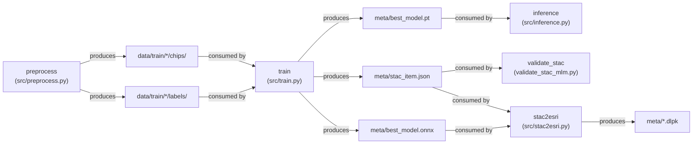
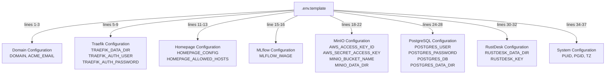
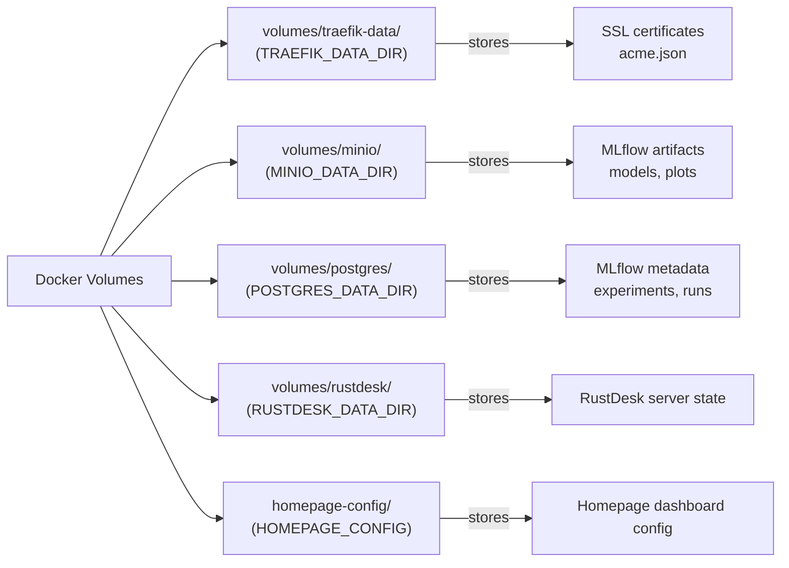

# Reference

<details>
<summary>Relevant source files</summary>

The following files were used as context for generating this wiki page:

- [docs/research.pdf](docs/research.pdf)
- [docs/slides.pdf](docs/slides.pdf)
- [examplemodel/MLproject](examplemodel/MLproject)
- [infra/.env.template](infra/.env.template)

</details>


This section provides technical reference documentation for the OpenGeoAIModelHub repository, including MLproject entry point specifications, configuration schemas, and contextual information. This page serves as a high-level reference overview with quick-access tables and diagrams. For detailed information, see:
- [MLproject API Reference](#8.1) - Complete entry point specifications and parameters
- [Configuration Reference](#8.2) - Comprehensive environment variable and configuration file documentation
- [Research and Background](#8.3) - Project context and research information

## MLproject Entry Points Quick Reference

The `MLproject` file defines five distinct entry points that orchestrate the complete ML workflow. Each entry point is a standalone command that can be executed via `mlflow run`.

### Entry Point Summary

| Entry Point | Purpose | Primary Outputs | Key Parameters |
|------------|---------|-----------------|----------------|
| `preprocess` | Data acquisition from OpenAerialMap and OpenStreetMap | Image chips, label masks | `zoom`, `bbox`, `tms`, `train_dir` |
| `train` | Model training with PyTorch Lightning | `best_model.pth`, `best_model.onnx`, `stac_item.json` | `epochs`, `batch_size`, `chips_dir`, `labels_dir`, `lr` |
| `inference` | Model prediction on new imagery | Prediction masks, overlay visualizations | `image_path`, `model_path`, `output_dir`, `mlflow_tracking` |
| `validate_stac` | STAC-MLM metadata validation | Validation report | `stac_file` |
| `stac2esri` | ESRI Deep Learning Package generation | `*.dlpk` file for ArcGIS | `stac_path`, `onnx_path`, `out_dir`, `dlpk_name` |

Sources: [examplemodel/MLproject:1-63]()

### Entry Point Workflow Diagram



Sources: [examplemodel/MLproject:1-63]()

### Parameter Type Reference

#### preprocess Entry Point

| Parameter | Type | Default | Description |
|-----------|------|---------|-------------|
| `zoom` | int | 19 | TMS zoom level for tile retrieval |
| `bbox` | str | "85.51991...,27.62883..." | Bounding box in lon_min,lat_min,lon_max,lat_max format |
| `tms` | str | "https://tiles.openaerialmap.org/..." | Tile Map Service URL template with {z}/{x}/{y} placeholders |
| `train_dir` | str | "data/train/sample" | Output directory for chips and labels |

Sources: [examplemodel/MLproject:6-17]()

#### train Entry Point

| Parameter | Type | Default | Description |
|-----------|------|---------|-------------|
| `epochs` | int | 1 | Number of training epochs |
| `batch_size` | int | 32 | Training batch size |
| `chips_dir` | str | "data/train/sample/chips" | Directory containing input image chips |
| `labels_dir` | str | "data/train/sample/labels" | Directory containing label masks |
| `lr` | float | 1e-3 | Learning rate for optimizer |

Sources: [examplemodel/MLproject:19-32]()

#### inference Entry Point

| Parameter | Type | Default | Description |
|-----------|------|---------|-------------|
| `image_path` | str | (required) | Path to input image for prediction |
| `model_path` | str | "meta/best_model.pt" | Path to trained PyTorch model checkpoint |
| `output_dir` | str | "output" | Directory for prediction outputs |
| `mlflow_tracking` | bool | false | Enable MLflow experiment logging for inference run |

Sources: [examplemodel/MLproject:34-44]()

#### validate_stac Entry Point

| Parameter | Type | Default | Description |
|-----------|------|---------|-------------|
| `stac_file` | str | "meta/stac_item.json" | Path to STAC-MLM metadata file to validate |

Sources: [examplemodel/MLproject:46-49]()

#### stac2esri Entry Point

| Parameter | Type | Default | Description |
|-----------|------|---------|-------------|
| `stac_path` | str | "meta/stac_item.json" | Path to STAC-MLM metadata file |
| `onnx_path` | str | "meta/best_model.onnx" | Path to ONNX model file |
| `out_dir` | str | "meta" | Output directory for DLPK file |
| `dlpk_name` | str | "refugee-camp-detector.dlpk" | Name of the generated Deep Learning Package |

Sources: [examplemodel/MLproject:51-62]()

## Environment Configuration Quick Reference

The infrastructure stack is configured via environment variables defined in `.env.template`. These variables control domain routing, service credentials, and storage paths.

### Configuration Categories



Sources: [infra/.env.template:1-37]()

### Critical Environment Variables

| Variable | Purpose | Example Value | Security Level |
|----------|---------|---------------|----------------|
| `DOMAIN` | Base domain for all services | example.com | Public |
| `ACME_EMAIL` | Let's Encrypt certificate notification email | admin@example.com | Public |
| `TRAEFIK_AUTH_PASSWORD_HASH` | Hashed password for Traefik dashboard | (bcrypt hash) | **Secret** |
| `AWS_ACCESS_KEY_ID` | MinIO access key (S3-compatible credentials) | (generate secure token) | **Secret** |
| `AWS_SECRET_ACCESS_KEY` | MinIO secret key | (generate secure token) | **Secret** |
| `POSTGRES_USER` | PostgreSQL database username | (custom username) | **Secret** |
| `POSTGRES_PASSWORD` | PostgreSQL database password | (generate secure password) | **Secret** |
| `RUSTDESK_KEY` | RustDesk server encryption key | (generate secure key) | **Secret** |
| `MLFLOW_IMAGE` | MLflow container image reference | ghcr.io/.../mlflow:latest | Public |

Sources: [infra/.env.template:1-37]()

### Service URL Pattern Reference

Based on the `DOMAIN` variable, services are accessible via subdomain routing managed by Traefik:

| Service | Subdomain Pattern | Example URL |
|---------|-------------------|-------------|
| Homepage Dashboard | `DOMAIN` | https://example.com |
| MLflow Tracking Server | `mlflow.DOMAIN` | https://mlflow.example.com |
| MinIO Console | `minio.DOMAIN` | https://minio.example.com |
| MinIO API | `minio-api.DOMAIN` | https://minio-api.example.com |
| PostgreSQL (via Traefik) | `postgres.DOMAIN` | https://postgres.example.com |
| Traefik Dashboard | `traefik.DOMAIN` | https://traefik.example.com |
| RustDesk Server | `rustdesk.DOMAIN` | https://rustdesk.example.com |

Sources: [infra/.env.template:2]()

### Storage Volume Mapping



Sources: [infra/.env.template:6,12,22,28,31]()

## Data Directory Structure Reference

### Training Data Layout

The preprocessing and training entry points expect and produce data in the following directory structure:

```
data/train/{dataset_name}/
├── chips/           # Input imagery tiles (PNG/TIFF)
│   ├── 0.png
│   ├── 1.png
│   └── ...
└── labels/          # Corresponding label masks (PNG)
    ├── 0.png
    ├── 1.png
    └── ...
```

Sources: [examplemodel/MLproject:11,23-24]()

### Model Output Artifacts

The training entry point produces the following artifacts in the `meta/` directory:

```
meta/
├── best_model.pt         # PyTorch checkpoint (LitRefugeeCamp state)
├── best_model.onnx       # ONNX-exported model (interoperable)
└── stac_item.json        # STAC-MLM metadata (discoverability)
```

Sources: [examplemodel/MLproject:37,54]()

### DLPK Package Structure

The `stac2esri` entry point produces an ESRI Deep Learning Package with internal structure:

```
{dlpk_name}.dlpk          # Zip archive containing:
├── esri_model_definition.emd    # ESRI model metadata
├── refugee_camp_detector.onnx   # ONNX model file
├── RefugeeCampDetector.py       # Python inference class
└── stac_item.json               # STAC-MLM metadata
```

Sources: [examplemodel/MLproject:56]()

## Command Invocation Reference

### Basic MLflow Run Commands

Execute entry points using the `mlflow run` command with the MLproject file:

```bash
# Preprocess data
mlflow run examplemodel/ -e preprocess \
  -P zoom=19 \
  -P bbox="85.519,27.628,85.527,27.633" \
  -P tms="https://tiles.openaerialmap.org/.../0/{z}/{x}/{y}" \
  -P train_dir="data/train/my_dataset"

# Train model
mlflow run examplemodel/ -e train \
  -P epochs=50 \
  -P batch_size=16 \
  -P chips_dir="data/train/my_dataset/chips" \
  -P labels_dir="data/train/my_dataset/labels" \
  -P lr=0.001

# Run inference
mlflow run examplemodel/ -e inference \
  -P image_path="test_images/camp.png" \
  -P model_path="meta/best_model.pt" \
  -P output_dir="predictions" \
  -P mlflow_tracking=true

# Validate STAC metadata
mlflow run examplemodel/ -e validate_stac \
  -P stac_file="meta/stac_item.json"

# Generate ESRI DLPK
mlflow run examplemodel/ -e stac2esri \
  -P stac_path="meta/stac_item.json" \
  -P onnx_path="meta/best_model.onnx" \
  -P out_dir="deployments" \
  -P dlpk_name="refugee_camp_detector_v1.dlpk"
```

Sources: [examplemodel/MLproject:1-63]()

### Direct Python Execution

Entry points can also be invoked directly using `uv run`:

```bash
# Preprocess
uv run python src/preprocess.py --zoom 19 --bbox "..." --tms "..." --train-dir "data/train/sample"

# Train
uv run python src/train.py --epochs 50 --batch_size 16 --chips_dir "..." --labels_dir "..." --lr 0.001

# Inference
uv run python src/inference.py test.png --model_path meta/best_model.pt --output_dir output

# Validate STAC
uv run python validate_stac_mlm.py meta/stac_item.json

# Convert to ESRI
uv run python src/stac2esri.py --stac meta/stac_item.json --onnx meta/best_model.onnx --out-dir meta --dlpk-name camp.dlpk
```

Sources: [examplemodel/MLproject:13-17,27-32,41-44,49,58-62]()

## System Requirements Reference

### Dependency Management

The project uses `uv` for deterministic dependency management:

- **Manifest**: `pyproject.toml` - declares dependencies and project metadata
- **Lockfile**: `uv.lock` - pins exact versions for reproducibility
- **Sync command**: `uv sync` - installs dependencies from lockfile
- **Run command**: `uv run` - executes commands in the managed environment

### Infrastructure Requirements

| Component | Minimum | Recommended | Purpose |
|-----------|---------|-------------|---------|
| CPU | 2 cores | 4+ cores | Training and inference |
| RAM | 8 GB | 16+ GB | Model training and services |
| Disk Space | 20 GB | 50+ GB | Docker images, volumes, datasets |
| Docker | 20.10+ | 24.0+ | Container runtime |
| Docker Compose | 2.0+ | 2.20+ | Multi-container orchestration |

### Port Allocation

| Port | Service | Protocol | Access Level |
|------|---------|----------|--------------|
| 80 | Traefik (HTTP) | TCP | Public (redirects to 443) |
| 443 | Traefik (HTTPS) | TCP | Public (TLS termination) |
| 8080 | Traefik Dashboard | TCP | Internal (via reverse proxy) |
| 5000 | MLflow Server | TCP | Internal (via reverse proxy) |
| 9000 | MinIO API | TCP | Internal (via reverse proxy) |
| 9001 | MinIO Console | TCP | Internal (via reverse proxy) |
| 5432 | PostgreSQL | TCP | Internal (via reverse proxy) |
| 21115-21119 | RustDesk | TCP/UDP | Public (direct access) |

## File and Code Entity Reference

### Key Python Modules

| Module | Purpose | Entry Point Usage |
|--------|---------|-------------------|
| `src/preprocess.py` | Data acquisition and chip generation | `preprocess` entry point |
| `src/train.py` | Model training orchestration | `train` entry point |
| `src/inference.py` | Prediction generation | `inference` entry point |
| `src/model.py` | PyTorch Lightning model classes | Imported by `train.py` |
| `src/stac2esri.py` | DLPK package creation | `stac2esri` entry point |
| `src/esri/RefugeeCampDetector.py` | ESRI inference adapter | Packaged in DLPK |
| `validate_stac_mlm.py` | STAC-MLM schema validation | `validate_stac` entry point |

Sources: [examplemodel/MLproject:13,27,41,49,58]()

### Configuration Files

| File | Purpose | Format |
|------|---------|--------|
| `examplemodel/MLproject` | MLflow project definition | YAML-like DSL |
| `examplemodel/pyproject.toml` | Python project metadata and dependencies | TOML |
| `examplemodel/uv.lock` | Dependency version lockfile | TOML |
| `infra/.env.template` | Environment variable template | Shell variable export |
| `infra/docker-compose.yml` | Infrastructure service definitions | YAML |

Sources: [examplemodel/MLproject:1](), [infra/.env.template:1]()

### Docker Images

| Image | Registry | Purpose |
|-------|----------|---------|
| `ghcr.io/kshitijrajsharma/opengeoaimodelshub/mlflow:latest` | GitHub Container Registry | Custom MLflow server with extensions |
| `traefik:v3.0` | Docker Hub | Reverse proxy and SSL termination |
| `minio/minio:latest` | Docker Hub | S3-compatible object storage |
| `postgres:16-alpine` | Docker Hub | PostgreSQL with PostGIS |
| `rustdesk/rustdesk-server:latest` | Docker Hub | Remote desktop server |
| `ghcr.io/gethomepage/homepage:latest` | GitHub Container Registry | Service monitoring dashboard |

Sources: [infra/.env.template:16]()

## Default Values Summary

Quick reference table for all default parameter values across entry points:

| Parameter | Default Value | Entry Point |
|-----------|---------------|-------------|
| `zoom` | 19 | preprocess |
| `bbox` | "85.51991979758662,27.628837632373674,85.52736620395387,27.633394557789373" | preprocess |
| `tms` | "https://tiles.openaerialmap.org/62d85d11d8499800053796c1/0/62d85d11d8499800053796c2/{z}/{x}/{y}" | preprocess |
| `train_dir` | "data/train/sample" | preprocess |
| `epochs` | 1 | train |
| `batch_size` | 32 | train |
| `chips_dir` | "data/train/sample/chips" | train |
| `labels_dir` | "data/train/sample/labels" | train |
| `lr` | 1e-3 | train |
| `model_path` | "meta/best_model.pt" | inference |
| `output_dir` | "output" | inference |
| `mlflow_tracking` | false | inference |
| `stac_file` | "meta/stac_item.json" | validate_stac |
| `stac_path` | "meta/stac_item.json" | stac2esri |
| `onnx_path` | "meta/best_model.onnx" | stac2esri |
| `out_dir` | "meta" | stac2esri |
| `dlpk_name` | "refugee-camp-detector.dlpk" | stac2esri |

Sources: [examplemodel/MLproject:8-56]()

For comprehensive API documentation including parameter constraints, validation rules, and advanced usage patterns, see [MLproject API Reference](#8.1). For detailed environment variable descriptions and configuration schemas, see [Configuration Reference](#8.2).