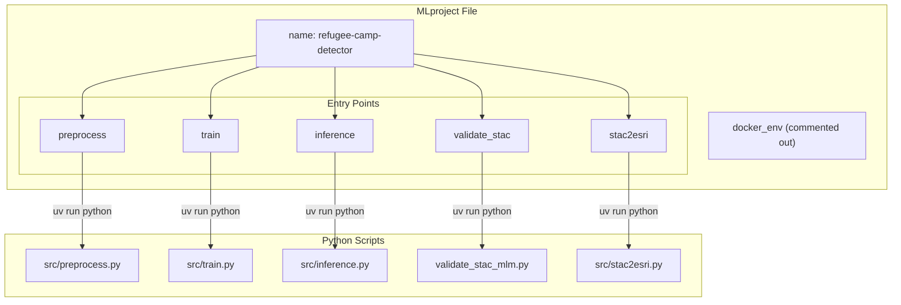
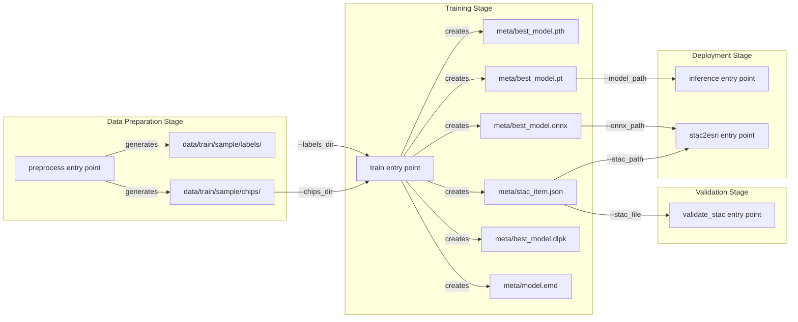
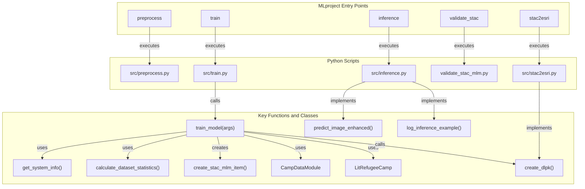

# MLproject API Reference

<details>
<summary>Relevant source files</summary>

The following files were used as context for generating this wiki page:

- [examplemodel/MLproject](examplemodel/MLproject)
- [examplemodel/src/train.py](examplemodel/src/train.py)

</details>


This document provides a complete technical reference for the MLproject file that defines the MLflow entry points for the OpenGeoAIModelHub example model system. The MLproject file serves as the orchestration interface for the refugee camp detection ML pipeline, exposing five distinct entry points that handle data preprocessing, model training, inference, metadata validation, and ESRI package generation.

For information about the training pipeline implementation details, see [Training Pipeline](#3.2). For ESRI integration specifics, see [ESRI Integration and DLPK Generation](#3.4). For broader MLflow Project structure context, see [MLflow Project Structure](#3.5).

## MLproject File Structure

The MLproject file is a YAML configuration that defines the project name, optional container environment, and multiple entry points with their parameters and execution commands. It serves as the primary interface for executing ML pipeline stages via `mlflow run` commands.

**MLproject Configuration Overview**



Sources: [examplemodel/MLproject:1-63]()

## Entry Point Reference

### preprocess Entry Point

The `preprocess` entry point downloads satellite imagery and label data from external sources (OpenAerialMap and OpenStreetMap) and prepares training chips.

**Parameters**

| Parameter | Type | Default | Description |
|-----------|------|---------|-------------|
| `zoom` | int | 19 | Tile zoom level for imagery download |
| `bbox` | str | "85.51991979758662,27.628837632373674,85.52736620395387,27.633394557789373" | Bounding box coordinates (lon_min,lat_min,lon_max,lat_max) |
| `tms` | str | "https://tiles.openaerialmap.org/..." | Tile Map Service URL template with {z}/{x}/{y} placeholders |
| `train_dir` | str | "data/train/sample" | Output directory for processed training data |

**Command Execution**

```bash
uv run python src/preprocess.py --zoom {zoom} --bbox {bbox} --tms {tms} --train-dir {train_dir}
```

**Usage Example**

```bash
mlflow run . -e preprocess -P zoom=18 -P bbox="85.51,27.62,85.53,27.64"
```

Sources: [examplemodel/MLproject:6-17]()

### train Entry Point

The `train` entry point executes the model training pipeline using PyTorch Lightning, logging metrics and artifacts to MLflow, and generating multiple model formats (PyTorch, ONNX, DLPK) along with STAC-MLM metadata.

**Parameters**

| Parameter | Type | Default | Description |
|-----------|------|---------|-------------|
| `epochs` | int | 1 | Number of training epochs |
| `batch_size` | int | 32 | Training batch size |
| `chips_dir` | str | "data/train/sample/chips" | Directory containing training image chips |
| `labels_dir` | str | "data/train/sample/labels" | Directory containing corresponding label masks |
| `lr` | float | 1e-3 | Learning rate for optimizer |

**Command Execution**

```bash
uv run python src/train.py --epochs {epochs} --batch_size {batch_size} --chips_dir {chips_dir} --labels_dir {labels_dir} --lr {lr}
```

**Artifacts Generated**

The training entry point generates and logs the following artifacts:

- `meta/best_model.pth` - PyTorch raw state dictionary
- `meta/best_model.pt` - TorchScript traced model
- `meta/best_model.onnx` - ONNX format model
- `meta/best_model.dlpk` - ESRI Deep Learning Package
- `meta/stac_item.json` - STAC-MLM metadata
- `meta/model.emd` - ESRI model definition
- Confusion matrix visualization
- Example inference outputs

**Usage Example**

```bash
mlflow run . -e train -P epochs=10 -P batch_size=16 -P lr=0.001
```

Sources: [examplemodel/MLproject:19-32](), [examplemodel/src/train.py:370-507]()

### inference Entry Point

The `inference` entry point performs prediction on a single image using a trained model, generating segmentation masks and overlay visualizations.

**Parameters**

| Parameter | Type | Default | Description |
|-----------|------|---------|-------------|
| `image_path` | str | (required) | Path to input satellite image for inference |
| `model_path` | str | "meta/best_model.pt" | Path to trained model file (TorchScript format) |
| `output_dir` | str | "output" | Directory for saving prediction outputs |
| `mlflow_tracking` | bool | false | Whether to log inference results to MLflow |

**Command Execution**

```bash
uv run python src/inference.py {image_path} --model_path {model_path} --output_dir {output_dir} {{--mlflow_tracking if mlflow_tracking}}
```

**Note on Conditional Parameters**

The `{{--mlflow_tracking if mlflow_tracking}}` syntax is MLflow's conditional parameter inclusion. The flag is only added to the command if the boolean parameter evaluates to true.

**Usage Example**

```bash
mlflow run . -e inference -P image_path=test_image.jpg -P mlflow_tracking=true
```

Sources: [examplemodel/MLproject:34-44]()

### validate_stac Entry Point

The `validate_stac` entry point validates STAC-MLM metadata files against the STAC-MLM schema to ensure compliance with the standard.

**Parameters**

| Parameter | Type | Default | Description |
|-----------|------|---------|-------------|
| `stac_file` | str | "meta/stac_item.json" | Path to STAC-MLM JSON file to validate |

**Command Execution**

```bash
uv run python validate_stac_mlm.py {stac_file}
```

**Usage Example**

```bash
mlflow run . -e validate_stac -P stac_file=custom_stac.json
```

Sources: [examplemodel/MLproject:46-49]()

### stac2esri Entry Point

The `stac2esri` entry point converts STAC-MLM metadata and ONNX models into ESRI Deep Learning Packages (DLPK) for deployment in ArcGIS platforms.

**Parameters**

| Parameter | Type | Default | Description |
|-----------|------|---------|-------------|
| `stac_path` | str | "meta/stac_item.json" | Path to STAC-MLM metadata file |
| `onnx_path` | str | "meta/best_model.onnx" | Path to ONNX model file |
| `out_dir` | str | "meta" | Output directory for generated DLPK |
| `dlpk_name` | str | "refugee-camp-detector.dlpk" | Output filename for DLPK package |

**Command Execution**

```bash
uv run python src/stac2esri.py --stac {stac_path} --onnx {onnx_path} --out-dir {out_dir} --dlpk-name {dlpk_name}
```

**Usage Example**

```bash
mlflow run . -e stac2esri -P stac_path=meta/stac_item.json -P dlpk_name=my_model.dlpk
```

Sources: [examplemodel/MLproject:51-62]()

## Entry Point Execution Flow

The following diagram illustrates the typical execution sequence and data dependencies between entry points:

**Pipeline Execution Sequence**



Sources: [examplemodel/MLproject:1-63]()

## Parameter Type System

The MLproject file uses a simple type system for parameters. All parameters are passed as command-line arguments to the underlying Python scripts.

**Supported Parameter Types**

| MLproject Type | Python Argument Type | Example Value | Notes |
|----------------|---------------------|---------------|-------|
| `int` | integer | `19`, `32` | Parsed as Python int |
| `float` | floating point | `1e-3`, `0.001` | Parsed as Python float |
| `str` | string | `"data/train/sample"` | Passed as-is, quotes removed |
| `bool` | boolean flag | `true`, `false` | Converted to flag presence/absence |

**Boolean Parameter Handling**

Boolean parameters use a special conditional syntax in MLproject:

```yaml
{{--flag_name if parameter_name}}
```

When `parameter_name` is `true`, `--flag_name` is added to the command. When `false`, the flag is omitted entirely. This is used in the inference entry point for the `mlflow_tracking` parameter.

Sources: [examplemodel/MLproject:7-62]()

## Command Execution Pattern

All entry points follow a consistent execution pattern using the `uv` package manager:

**Command Structure**


**Execution Flow**

1. `uv run python` - Executes Python in the uv-managed virtual environment
2. Script path - Specifies the Python script to run
3. Positional arguments - Required arguments (e.g., `{image_path}` in inference)
4. Named arguments - Optional/required flags (e.g., `--epochs {epochs}`)

**Parameter Substitution**

MLflow performs parameter substitution using the syntax `{parameter_name}`. When executing an entry point, MLflow replaces these placeholders with actual parameter values:

```yaml
command: "uv run python src/train.py --epochs {epochs}"
```

Becomes:

```bash
uv run python src/train.py --epochs 10
```

Sources: [examplemodel/MLproject:12-62]()

## Entry Point to Code Entity Mapping

The following diagram maps MLproject entry points to their corresponding Python implementation details:

**Entry Point Implementation Mapping**



Sources: [examplemodel/MLproject:1-63](), [examplemodel/src/train.py:1-519]()

## Common Usage Patterns

### Sequential Pipeline Execution

```bash
# 1. Preprocess data
mlflow run . -e preprocess

# 2. Train model
mlflow run . -e train -P epochs=20 -P batch_size=16

# 3. Validate metadata
mlflow run . -e validate_stac

# 4. Run inference
mlflow run . -e inference -P image_path=test.jpg -P mlflow_tracking=true
```

### Custom Parameter Configuration

```bash
# Train with custom data paths and hyperparameters
mlflow run . -e train \
  -P epochs=50 \
  -P batch_size=64 \
  -P lr=0.0001 \
  -P chips_dir=data/custom/chips \
  -P labels_dir=data/custom/labels
```

### ESRI Deployment Package Generation

```bash
# Generate custom DLPK from existing artifacts
mlflow run . -e stac2esri \
  -P stac_path=experiments/run_123/stac_item.json \
  -P onnx_path=experiments/run_123/model.onnx \
  -P dlpk_name=production_model_v2.dlpk
```

Sources: [examplemodel/MLproject:1-63]()

## Docker Environment Configuration

The MLproject file includes a commented-out Docker environment configuration:

```yaml
# docker_env:
#   image: ghcr.io/kshitijrajsharma/opengeoaimodelshub:master
```

When uncommented, this configuration instructs MLflow to execute entry points inside the specified Docker container rather than the local environment. This ensures reproducible execution across different systems.

**Enabling Docker Execution**

To enable Docker-based execution:

1. Uncomment the `docker_env` section in MLproject
2. Ensure Docker is installed and running
3. Pull the specified image: `docker pull ghcr.io/kshitijrajsharma/opengeoaimodelshub:master`
4. Run entry points normally with `mlflow run .`

Sources: [examplemodel/MLproject:2-3]()

## Integration with MLflow Tracking

All entry points integrate with MLflow tracking when executed. The `train` entry point automatically logs:

- System information (platform, GPU, PyTorch version)
- Dataset statistics (sample counts, pixel statistics)
- Training metrics (loss, accuracy per epoch)
- Model artifacts (checkpoints, ONNX, DLPK, STAC metadata)
- Visualizations (confusion matrix, example predictions)

The `inference` entry point can optionally enable tracking via the `mlflow_tracking` parameter, which logs inference results and predictions to the active MLflow run.

Sources: [examplemodel/src/train.py:373-506]()

## Parameter Validation

The MLproject file does not perform parameter validation. Validation occurs in the Python scripts themselves through:

- `argparse` in the script entry point
- Runtime type checking in functions
- File existence checks for path parameters

Invalid parameters result in Python exceptions during script execution, which MLflow captures and reports as failed runs.

Sources: [examplemodel/MLproject:1-63](), [examplemodel/src/train.py:509-518]()