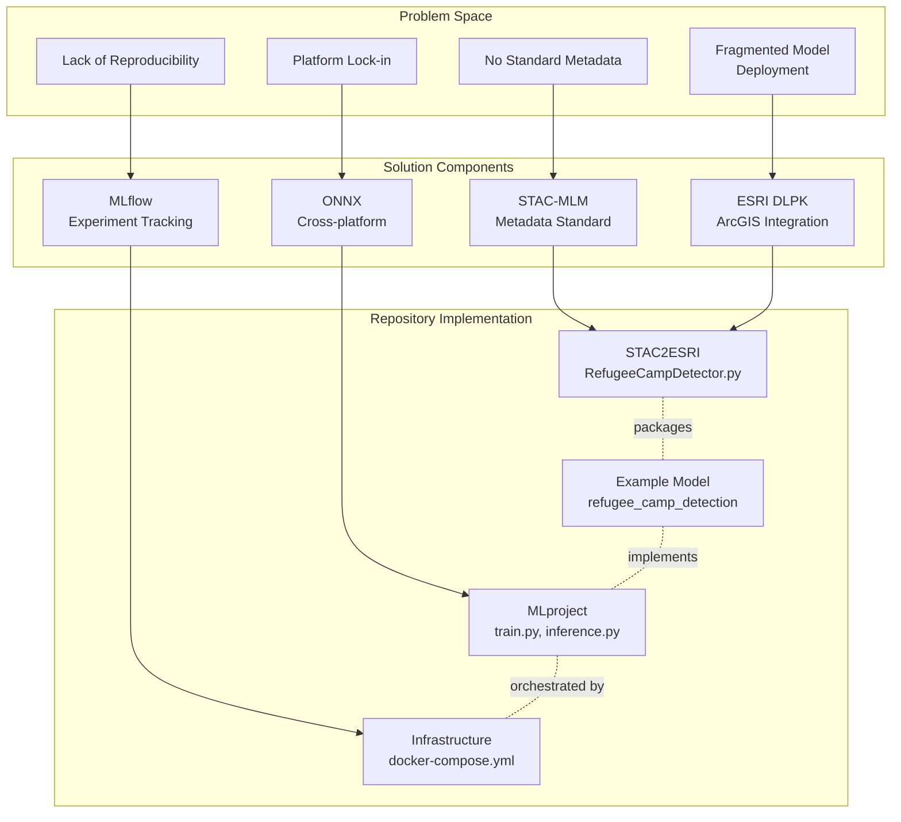
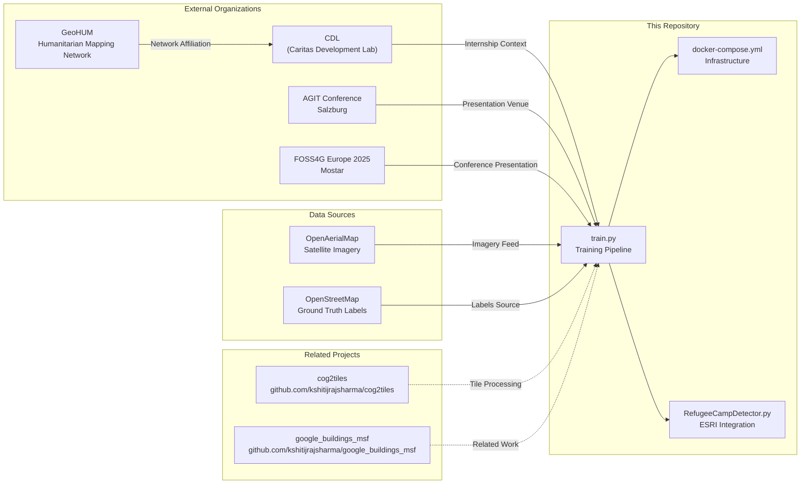
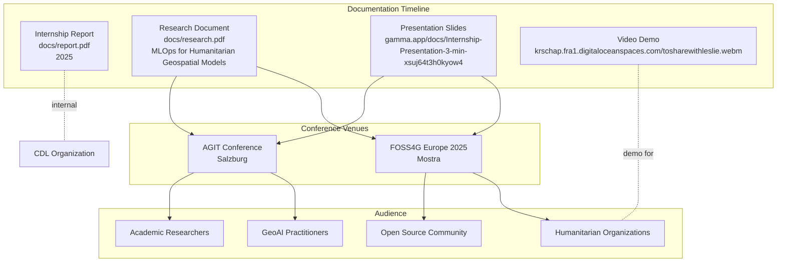
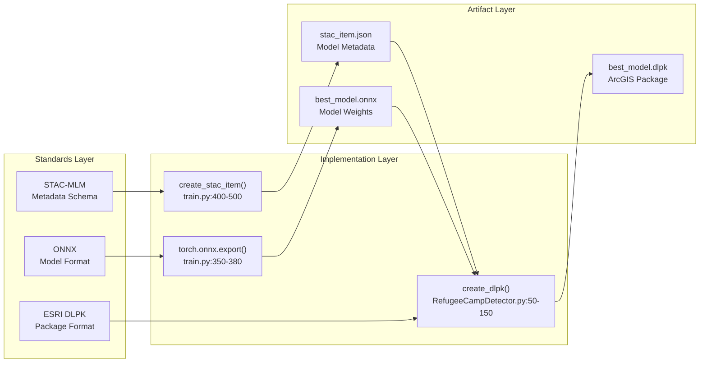

# Research and Background

Relevant source files

The following files were used as context for generating this wiki page:

- [LICENSE](LICENSE)
- [README.md](README.md)
- [docs/report.pdf](docs/report.pdf)
- [docs/research.pdf](docs/research.pdf)
- [docs/slides.pdf](docs/slides.pdf)

## Purpose and Scope

This page provides context on the research origins, academic background, and professional development work that led to the creation of the OpenGeoAIModelHub repository. It covers the project's connection to humanitarian geospatial modeling, standards development, and MLOps infrastructure for GeoAI applications.

For technical implementation details of the example model, see [Example Model System](#3).  
For infrastructure deployment specifics, see [Infrastructure System](#4).  
For development workflows, see [Development Guide](#7).

## Project Origin and Context

The OpenGeoAIModelHub repository originated as an internship project with CDL (Caritas Development Lab) focused on developing reproducible infrastructure for humanitarian geospatial AI models. The core research question was: **How can multiple GeoAI models be deployed and managed on a single platform using metadata standards?**

The project addresses a specific gap in the humanitarian mapping ecosystem: while numerous geospatial AI models exist for tasks like building detection, refugee camp identification, and infrastructure mapping, there is no standardized approach to:

1. **Model packaging and distribution** - Ensuring models can be shared across different GIS platforms
2. **Experiment tracking** - Maintaining reproducibility of training runs and model versions
3. **Metadata standardization** - Describing model capabilities, inputs, and outputs consistently
4. **Deployment infrastructure** - Providing production-ready MLOps tooling for humanitarian organizations

Sources: [README.md:1-9]()

**Project Context Mapping**

Sources: [README.md:1-9](), [docs/report.pdf:1-6]()

## Research Objectives

The primary research objectives that shaped this codebase were:

| Objective | Implementation in Codebase | Status |
|-----------|---------------------------|--------|
| **Demonstrate end-to-end MLOps workflow** | Complete pipeline from data acquisition ([train.py]()) through model training to deployment ([RefugeeCampDetector.py]()) | ✓ Complete |
| **Implement STAC-MLM metadata standard** | STAC item generation ([train.py]()) with MLM extension for model description | ✓ Complete |
| **Enable multi-platform deployment** | ONNX export ([train.py]()) + ESRI DLPK packaging ([RefugeeCampDetector.py]()) | ✓ Complete |
| **Provide reusable infrastructure** | Docker Compose stack ([docker-compose.yml]()) with Traefik, MLflow, MinIO, PostgreSQL | ✓ Complete |
| **Establish reproducible experiments** | MLproject file ([MLproject]()) with parameterized entry points | ✓ Complete |

The example model (refugee camp detection using U-Net architecture) serves as a proof-of-concept demonstrating that humanitarian geospatial models can be packaged with standardized metadata and deployed across multiple platforms (ArcGIS Pro, ONNX Runtime) from a single training pipeline.

Sources: [README.md:1-9](), [docs/research.pdf:1-6]()

## Research Ecosystem and Related Work

**Research Ecosystem and Connections**

Sources: [README.md:1-9]()

### Related Projects and Tools

The repository builds on and connects to several related open-source projects:

**cog2tiles** ([github.com/kshitijrajsharma/cog2tiles]()):
- Utility for converting Cloud Optimized GeoTIFFs to tile pyramids
- Used in preprocessing pipeline for efficient data loading
- Complementary tool for handling large satellite imagery datasets

**google_buildings_msf** ([github.com/kshitijrajsharma/google_buildings_msf]()):
- Building footprint extraction using Google Open Buildings dataset
- Demonstrates similar humanitarian mapping use case
- Shares infrastructure patterns (MLflow, Docker Compose)

Sources: [README.md:1-9]()

## Academic and Professional Context

### Internship Affiliation

The work was conducted as part of an internship with **CDL (Caritas Development Lab)**, focused on developing open-source infrastructure for humanitarian AI applications. CDL is affiliated with the **GeoHUM** network, which connects researchers and practitioners working on geospatial technologies for humanitarian purposes.

**Key Organizations:**

- **CDL**: Research and development lab focusing on technology for humanitarian aid
- **GeoHUM** ([geohum.eu]()): European network for humanitarian geospatial research
- **AGIT** ([agit.at]()): Applied Geoinformatics conference in Salzburg, Austria
- **FOSS4G Europe 2025** ([2025.europe.foss4g.org]()): Free and Open Source Software for Geospatial conference

Sources: [README.md:1-9](), [docs/report.pdf:1-6]()

### Conference Presentations and Publications

The research and implementation have been presented at academic and professional venues:

**Documentation and Dissemination**

Sources: [README.md:1-9]()

### Available Research Materials

| Resource Type | Location | Description |
|--------------|----------|-------------|
| **Internship Report** | [docs/report.pdf]() | Complete internship documentation (2025) |
| **Research Paper** | [docs/research.pdf]() | "MLOps for Humanitarian Geospatial Models" - technical paper |
| **Presentation Slides** | [gamma.app/docs/Internship-Presentation-3-min-xsuj64t3h0kyow4]() | 3-minute presentation deck |
| **Video Demonstration** | [krschap.fra1.digitaloceanspaces.com/tosharewithleslie.webm]() | System walkthrough and demo |
| **Live Deployment** | [mlflow.krschap.tech]() | Production MLflow instance |

Sources: [README.md:1-9]()

## Technical Foundations and Standards

The research implementation leverages several key technical standards and frameworks:

### Metadata Standards

**STAC-MLM (SpatioTemporal Asset Catalog - Machine Learning Model Extension)**:
- Provides standardized JSON schema for describing ML model metadata
- Implemented in [train.py]() during model export
- Enables model discovery and cataloging
- Stores model parameters, training configuration, and performance metrics in `stac_item.json`

### Model Packaging Standards

**ONNX (Open Neural Network Exchange)**:
- Cross-platform model format for interoperability
- Exported from PyTorch checkpoints in [train.py]()
- Enables deployment without framework dependencies
- Stored as `best_model.onnx` artifact

**ESRI Deep Learning Package (DLPK)**:
- ArcGIS Pro-compatible model package format
- Generated by [RefugeeCampDetector.py]()
- Bundles ONNX model + STAC metadata + Python inference script
- Enables direct deployment in ArcGIS Pro

Sources: [src/train.py](), [src/esri/RefugeeCampDetector.py]()

**Standards Implementation Pipeline**

Sources: [src/train.py](), [src/esri/RefugeeCampDetector.py]()

### MLOps Framework

**MLflow**:
- Experiment tracking and model registry platform
- Configured in [docker-compose.yml]() as `mlflow` service
- Tracks metrics, parameters, and artifacts for all training runs
- Provides REST API for model deployment
- Backed by PostgreSQL for metadata storage and MinIO for artifact storage

**Infrastructure Components** (defined in [docker-compose.yml]()):
- `mlflow` service: Experiment tracking server (port 5000)
- `postgres` service: PostgreSQL + PostGIS for metadata storage
- `minio` service: S3-compatible object storage for artifacts
- `traefik` service: Reverse proxy with automatic SSL

Sources: [docker-compose.yml:1-200](), [setup.sh:1-100]()

## Repository Documentation Structure

The repository provides comprehensive documentation across multiple formats:

| Documentation Type | Primary Audience | File Reference |
|-------------------|-----------------|----------------|
| Technical README | Developers, DevOps engineers | [README.md:1-9]() |
| Internship Report | Academic supervisors, CDL | [docs/report.pdf]() |
| Research Paper | Academic researchers, conference attendees | [docs/research.pdf]() |
| API Reference | ML engineers, model developers | This wiki page 8.1 |
| Configuration Guide | System administrators | This wiki page 8.2 |
| Development Guide | Contributing developers | This wiki page 7 |

This multi-layered documentation approach ensures that different stakeholders (academic, technical, operational) can access information appropriate to their needs.

Sources: [README.md:1-9](), [docs/report.pdf](), [docs/research.pdf]()