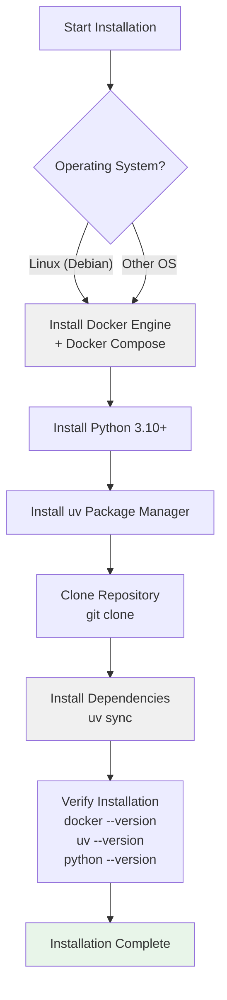
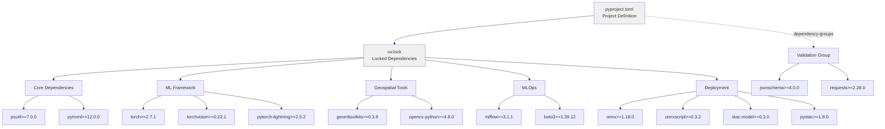
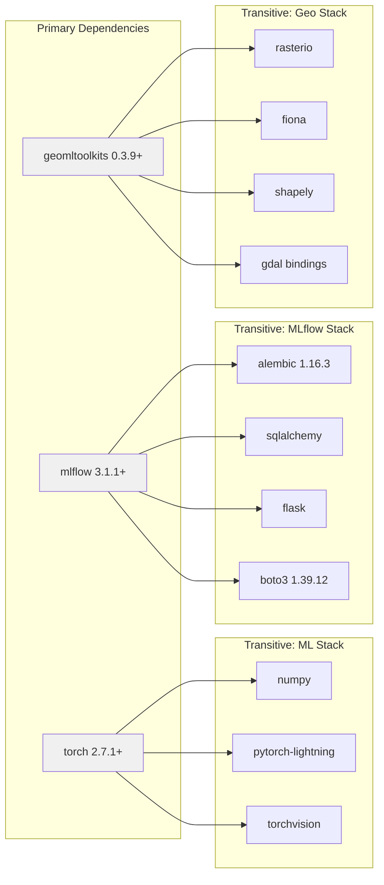
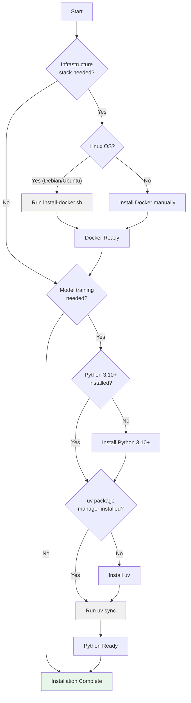

# Prerequisites and Installation

<details>
<summary>Relevant source files</summary>

The following files were used as context for generating this wiki page:

- [examplemodel/pyproject.toml](examplemodel/pyproject.toml)
- [examplemodel/uv.lock](examplemodel/uv.lock)
- [infra/install-docker.sh](infra/install-docker.sh)

</details>


This document details the system requirements and installation procedures for the OpenGeoAIModelHub repository. It covers infrastructure prerequisites (Docker, Docker Compose), development environment setup (Python, uv package manager), and dependency installation for both the example model and infrastructure stack.

For instructions on running the example model training or deploying the infrastructure stack after installation, see [Quick Start Guide](#2.2).

---

## Purpose and Scope

This page covers:
- **System requirements**: Operating system, hardware, and software prerequisites
- **Docker installation**: Installing Docker Engine and Docker Compose for infrastructure deployment
- **Python environment setup**: Installing Python and the uv package manager
- **Dependency installation**: Installing Python dependencies for the example model

This page does NOT cover:
- Running the example model training (see [Quick Start Guide](#2.2))
- Infrastructure deployment procedures (see [Infrastructure Deployment](#6.1))
- Development workflows (see [Development Guide](#7))

---

## System Requirements

### Operating System

The OpenGeoAIModelHub supports the following operating systems:

| Component | Supported OS | Notes |
|-----------|--------------|-------|
| Infrastructure Stack | Linux (Debian-based recommended) | Docker Compose stack tested on Debian/Ubuntu |
| Example Model | Linux, macOS, Windows | PyTorch supports all major platforms |
| Docker | Linux, macOS, Windows | WSL2 required for Windows |

### Hardware Requirements

| Component | Minimum | Recommended |
|-----------|---------|-------------|
| CPU | 4 cores | 8+ cores |
| RAM | 8 GB | 16+ GB (32+ GB for training) |
| Storage | 20 GB | 50+ GB (SSD recommended) |
| GPU | None (CPU training supported) | NVIDIA GPU with CUDA support for training |

### Software Prerequisites

The following software must be installed before proceeding:

| Software | Version | Purpose |
|----------|---------|---------|
| Docker Engine | 20.10+ | Container runtime for infrastructure stack |
| Docker Compose | 2.0+ | Multi-container orchestration |
| Python | 3.10+ | Example model runtime |
| Git | Any recent | Repository cloning |
| curl | Any recent | Downloading installation scripts |

**Sources:** [examplemodel/pyproject.toml:6]()

---

## Installation Workflow Overview



**Sources:** [infra/install-docker.sh:1-50](), [examplemodel/pyproject.toml:1-31]()

---

## Docker Installation

Docker and Docker Compose are required to run the infrastructure stack (MLflow, MinIO, PostgreSQL, Traefik).

### Automated Installation (Debian/Ubuntu)

The repository provides an automated installation script for Debian-based systems:

```bash
# Download and execute the installation script
curl -fsSL https://raw.githubusercontent.com/kshitijrajsharma/opengeoaimodelshub/main/infra/install-docker.sh | bash

# Or clone the repository first and run locally
git clone https://github.com/kshitijrajsharma/opengeoaimodelshub.git
cd opengeoaimodelshub
chmod +x infra/install-docker.sh
./infra/install-docker.sh
```

The script performs the following operations:

1. Updates system packages (`apt update && apt upgrade`)
2. Installs Docker prerequisites (apt-transport-https, ca-certificates, curl, gnupg, lsb-release)
3. Adds Docker's official GPG key to `/etc/apt/keyrings/docker.gpg`
4. Configures Docker's apt repository
5. Installs `docker-ce`, `docker-ce-cli`, `containerd.io`, `docker-buildx-plugin`, `docker-compose-plugin`
6. Enables and starts the Docker service
7. Adds the current user to the `docker` group

**Important:** After installation, you must log out and log back in (or restart) for Docker group permissions to take effect.

**Sources:** [infra/install-docker.sh:1-50]()

### Manual Installation

For other operating systems, follow the official Docker documentation:
- **Linux**: https://docs.docker.com/engine/install/
- **macOS**: Install Docker Desktop from https://www.docker.com/products/docker-desktop
- **Windows**: Install Docker Desktop with WSL2 backend from https://docs.docker.com/desktop/install/windows-install/

### Verification

Verify Docker and Docker Compose installation:

```bash
# Check Docker version (should be 20.10+)
docker --version

# Check Docker Compose version (should be 2.0+)
docker compose version

# Test Docker installation
docker run hello-world
```

**Sources:** [infra/install-docker.sh:35-48]()

---

## Python Environment Setup

### Python Installation

The example model requires **Python 3.10 or later**. Check your Python version:

```bash
python3 --version
```

If Python 3.10+ is not installed:

**Debian/Ubuntu:**
```bash
sudo apt update
sudo apt install python3.10 python3.10-venv python3-pip
```

**macOS:**
```bash
brew install python@3.10
```

**Windows:**
Download and install from https://www.python.org/downloads/

**Sources:** [examplemodel/pyproject.toml:6]()

### uv Package Manager Installation

The repository uses `uv` for fast, reliable Python dependency management. Install uv:

```bash
# Install uv using the official installer
curl -LsSf https://astral.sh/uv/install.sh | sh

# Or using pip
pip install uv
```

Verify installation:

```bash
uv --version
```

**Sources:** [examplemodel/pyproject.toml:1-31](), [examplemodel/uv.lock:1-10]()

---

## Dependency Installation

### Repository Clone

Clone the OpenGeoAIModelHub repository:

```bash
git clone https://github.com/kshitijrajsharma/opengeoaimodelshub.git
cd opengeoaimodelshub
```

### Example Model Dependencies

Navigate to the example model directory and install dependencies using uv:

```bash
cd examplemodel

# Install all dependencies from pyproject.toml
uv sync

# Or install in development mode with validation tools
uv sync --group validation
```

This command reads `pyproject.toml` and `uv.lock` to install exact package versions.

**Sources:** [examplemodel/pyproject.toml:1-31](), [examplemodel/uv.lock:1-10]()

### Dependency Structure



**Sources:** [examplemodel/pyproject.toml:7-24](), [examplemodel/pyproject.toml:26-30]()

### Core Dependencies by Category

The `pyproject.toml` specifies the following dependency categories:

| Category | Packages | Purpose |
|----------|----------|---------|
| **ML Framework** | `torch`, `torchvision`, `pytorch-lightning` | Model training and inference |
| **Geospatial** | `geomltoolkits`, `opencv-python` | Geospatial data processing and image manipulation |
| **MLOps** | `mlflow`, `boto3` | Experiment tracking and artifact storage |
| **Deployment** | `onnx`, `onnxscript`, `stac-model`, `pystac` | Model export and metadata generation |
| **Monitoring** | `psutil`, `pynvml` | System resource monitoring |
| **Validation** | `jsonschema`, `requests` | STAC metadata validation (optional group) |
| **Configuration** | `dotenv` | Environment variable management |

**Sources:** [examplemodel/pyproject.toml:7-24]()

### Locked Dependencies

The `uv.lock` file pins exact versions and includes transitive dependencies. Key locked packages include:



**Sources:** [examplemodel/uv.lock:1-10](), [examplemodel/uv.lock:129-141](), [examplemodel/uv.lock:195-206]()

### Platform-Specific Wheel Resolution

The `uv.lock` file contains platform-specific wheel URLs for different Python versions and operating systems:

```
resolution-markers = [
    "python_full_version >= '3.13'",
    "python_full_version == '3.12.*'",
    "python_full_version == '3.11.*'",
    "python_full_version < '3.11'",
]
```

This ensures consistent installations across:
- **Linux**: manylinux wheels for x86_64, aarch64, ppc64le, s390x
- **macOS**: Universal2 and arm64 wheels
- **Windows**: win32 and win_amd64 wheels
- **musllinux**: Alpine Linux compatibility

**Sources:** [examplemodel/uv.lock:4-9]()

---

## Verification

After completing all installation steps, verify your environment:

### Docker Verification

```bash
# Check Docker is running
docker ps

# Check Docker Compose is available
docker compose version

# Test with hello-world container
docker run hello-world
```

### Python Environment Verification

```bash
# Check Python version (should be 3.10+)
python3 --version

# Check uv is installed
uv --version

# Check installed packages
cd examplemodel
uv pip list
```

### Dependency Import Test

```bash
cd examplemodel

# Test core imports
python3 -c "import torch; print(f'PyTorch: {torch.__version__}')"
python3 -c "import mlflow; print(f'MLflow: {mlflow.__version__}')"
python3 -c "import pytorch_lightning; print(f'Lightning: {pytorch_lightning.__version__}')"
python3 -c "import geomltoolkits; print('geomltoolkits imported successfully')"
```

If all imports succeed, your environment is ready.

**Sources:** [examplemodel/pyproject.toml:7-24]()

---

## Installation Decision Tree



**Sources:** [infra/install-docker.sh:1-50](), [examplemodel/pyproject.toml:1-31]()

---

## Common Installation Issues

### Docker Permission Denied

**Symptom:** `permission denied while trying to connect to the Docker daemon socket`

**Solution:**
```bash
# Add user to docker group (already done by install-docker.sh)
sudo usermod -aG docker $USER

# Log out and log back in, or run:
newgrp docker

# Verify
docker ps
```

**Sources:** [infra/install-docker.sh:32-33]()

### Python Version Mismatch

**Symptom:** `requires-python = ">=3.10"` error during `uv sync`

**Solution:**
```bash
# Check Python version
python3 --version

# If < 3.10, install newer Python version
# Then explicitly specify Python for uv
uv sync --python python3.10
```

**Sources:** [examplemodel/pyproject.toml:6]()

### Missing System Dependencies

**Symptom:** Build errors for `gdal`, `rasterio`, or other geospatial packages

**Solution:**
```bash
# Install system dependencies (Debian/Ubuntu)
sudo apt install -y \
    gdal-bin \
    libgdal-dev \
    python3-dev \
    build-essential

# Then retry uv sync
cd examplemodel
uv sync
```

### Network/Proxy Issues

**Symptom:** Download failures during `uv sync` or Docker installation

**Solution:**
```bash
# Configure uv proxy
export HTTP_PROXY=http://proxy.example.com:8080
export HTTPS_PROXY=http://proxy.example.com:8080

# Configure Docker proxy (edit /etc/systemd/system/docker.service.d/http-proxy.conf)
```

---

## Next Steps

After completing installation:

1. **Start infrastructure services:** See [Quick Start Guide](#2.2) to deploy the MLflow stack using Docker Compose
2. **Run example model training:** See [Quick Start Guide](#2.2) for training the refugee camp detection model
3. **Configure environment variables:** See [Configuration Management](#4.3) for `.env` file setup
4. **Explore development workflows:** See [Development Guide](#7) for local development setup

**Sources:** [examplemodel/pyproject.toml:1-31](), [infra/install-docker.sh:1-50]()