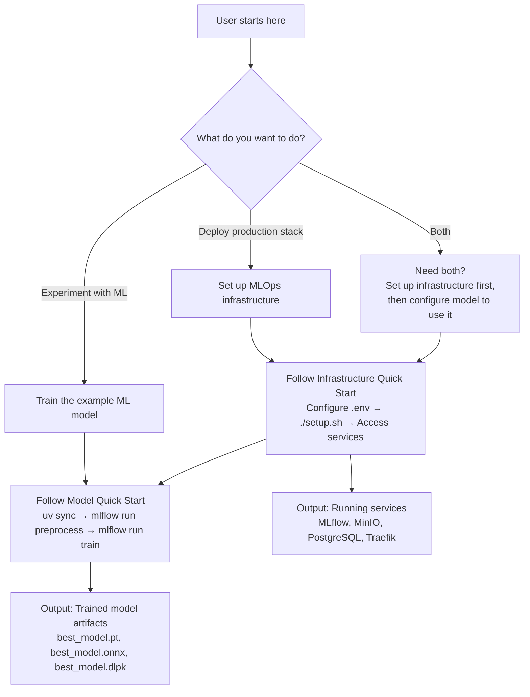
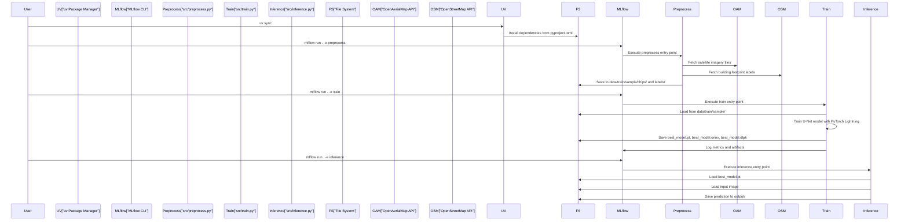
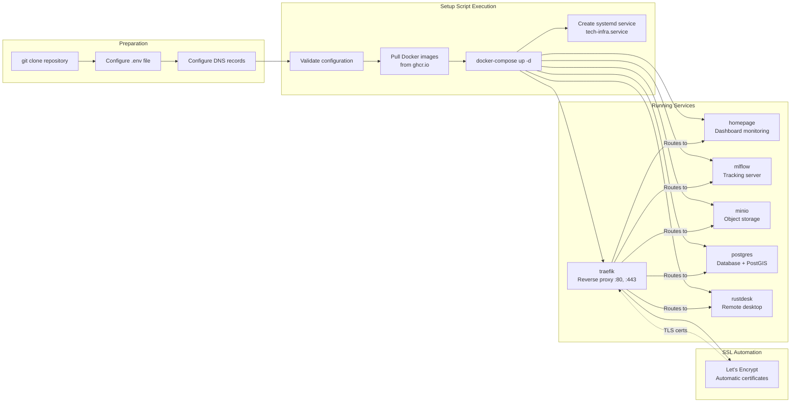

# Quick Start Guide

<details>
<summary>Relevant source files</summary>

The following files were used as context for generating this wiki page:

- [examplemodel/MLproject](examplemodel/MLproject)
- [examplemodel/README.md](examplemodel/README.md)
- [infra/Readme.md](infra/Readme.md)

</details>


## Purpose and Scope

This page provides step-by-step instructions for getting started with OpenGeoAIModelHub in under 10 minutes. It covers two quick start workflows: (1) running the example refugee camp detection model training pipeline, and (2) deploying the production infrastructure stack. 

For detailed prerequisites and installation instructions, see [Prerequisites and Installation](#2.1). For comprehensive model documentation, see [Example Model System](#3). For infrastructure deployment details, see [Infrastructure System](#4).

## Quick Start Decision Tree



**Quick Start Workflow Selection**

Sources: [infra/Readme.md:1-83](), [examplemodel/README.md:1-52]()

## Example Model Quick Start

This workflow demonstrates training the refugee camp detection model using local MLflow tracking. The model uses satellite imagery from OpenAerialMap and labels from OpenStreetMap.

### Step 1: Install UV Package Manager

```bash
curl -LsSf https://astral.sh/uv/install.sh | sh
```

Sources: [examplemodel/README.md:7-12]()

### Step 2: Install Project Dependencies

```bash
cd examplemodel
uv sync
```

The `uv sync` command reads [examplemodel/pyproject.toml]() and installs all required dependencies including PyTorch, PyTorch Lightning, MLflow, and geospatial libraries.

Sources: [examplemodel/README.md:14-20]()

### Step 3: Start Local MLflow UI (Optional)

```bash
uv run mlflow ui
```

This launches the MLflow tracking server at `http://localhost:5000` where you can monitor experiments in real-time.

Sources: [examplemodel/README.md:22-26]()

### Step 4: Preprocess Data

```bash
uv run mlflow run . -e preprocess --env-manager local
```

This executes the `preprocess` entry point defined in [examplemodel/MLproject:6-17](), which:
- Downloads satellite imagery tiles from OpenAerialMap
- Fetches building footprint labels from OpenStreetMap
- Generates training chips and labels in `data/train/sample/`

**Default Parameters:**
| Parameter | Default Value | Description |
|-----------|---------------|-------------|
| `zoom` | 19 | Tile zoom level |
| `bbox` | "85.5199...,27.6288..." | Geographic bounding box (lon_min, lat_min, lon_max, lat_max) |
| `tms` | "https://tiles.openaerialmap.org/..." | Tile Map Service URL |
| `train_dir` | "data/train/sample" | Output directory for training data |

Sources: [examplemodel/MLproject:6-17]()

### Step 5: Train Model

```bash
uv run mlflow run . -e train --env-manager local
```

This executes the `train` entry point defined in [examplemodel/MLproject:19-32](), which:
- Loads training chips and labels
- Trains a U-Net model using PyTorch Lightning
- Logs metrics to MLflow
- Generates model artifacts: `best_model.pt`, `best_model.onnx`, `best_model.dlpk`, `stac_item.json`

**Default Parameters:**
| Parameter | Default Value | Description |
|-----------|---------------|-------------|
| `epochs` | 1 | Number of training epochs |
| `batch_size` | 32 | Training batch size |
| `chips_dir` | "data/train/sample/chips" | Input chips directory |
| `labels_dir` | "data/train/sample/labels" | Input labels directory |
| `lr` | 1e-3 | Learning rate |

Sources: [examplemodel/MLproject:19-32]()

### Step 6: Run Inference (Optional)

```bash
uv run mlflow run . -e inference --env-manager local -P image_path=path/to/image.jpg
```

This executes the `inference` entry point defined in [examplemodel/MLproject:34-44]() to perform prediction on a single image.

Sources: [examplemodel/MLproject:34-44]()

### Example Model Workflow Diagram



**Example Model Execution Sequence**

Sources: [examplemodel/MLproject:1-63](), [examplemodel/README.md:1-52]()

### Output Artifacts

After successful training, the following artifacts are generated in the `meta/` directory:

| Artifact | Description | Use Case |
|----------|-------------|----------|
| `best_model.pt` | PyTorch checkpoint | Direct inference, fine-tuning |
| `best_model.onnx` | ONNX format model | Cross-platform deployment |
| `best_model.dlpk` | ESRI Deep Learning Package | ArcGIS deployment |
| `stac_item.json` | STAC-MLM metadata | Model discovery and cataloging |

Sources: [examplemodel/MLproject:19-62]()

## Infrastructure Stack Quick Start

This workflow deploys a production-ready MLOps infrastructure stack with Traefik, MLflow, MinIO, PostgreSQL, and monitoring services.

### Step 1: Clone Repository and Configure Environment

```bash
git clone <repository-url>
cd infra
cp .env.template .env
nano .env  # Edit with your domain and credentials
```

**Required `.env` Variables:**
- `DOMAIN` - Your base domain (e.g., `example.com`)
- `POSTGRES_USER`, `POSTGRES_PASSWORD` - PostgreSQL credentials
- `MINIO_ROOT_USER`, `MINIO_ROOT_PASSWORD` - MinIO credentials
- `MLFLOW_TRACKING_USERNAME`, `MLFLOW_TRACKING_PASSWORD` - MLflow authentication

Sources: [infra/Readme.md:16-25]()

### Step 2: Configure DNS Records

Point the following A records to your server's IP address:

| Subdomain | Service | Purpose |
|-----------|---------|---------|
| `yourdomain.com` | Homepage | Service dashboard |
| `mlflow.yourdomain.com` | MLflow | Experiment tracking |
| `minio.yourdomain.com` | MinIO Console | Object storage UI |
| `minio-api.yourdomain.com` | MinIO API | S3-compatible API |
| `postgres.yourdomain.com` | PostgreSQL | Database access |
| `rustdesk.yourdomain.com` | RustDesk | Remote desktop |
| `traefik.yourdomain.com` | Traefik | Proxy dashboard |

Sources: [infra/Readme.md:32-42]()

### Step 3: Run Setup Script

```bash
chmod +x setup.sh
./setup.sh
```

The `setup.sh` script performs the following operations:
1. Validates `.env` configuration
2. Pulls Docker images from GitHub Container Registry
3. Starts all services via `docker-compose`
4. Configures systemd service for auto-start
5. Generates SSL certificates via Let's Encrypt

Sources: [infra/Readme.md:26-30]()

### Step 4: Verify Services

Access the services via their respective URLs:

```bash
# Homepage dashboard
https://yourdomain.com

# MLflow tracking server
https://mlflow.yourdomain.com

# MinIO console
https://minio.yourdomain.com
```

Sources: [infra/Readme.md:5-12]()

### Infrastructure Deployment Flow



**Infrastructure Stack Deployment Workflow**

Sources: [infra/Readme.md:14-30]()

### Service Management Commands

After deployment, manage services using the `manage.sh` script:

```bash
# Check service status
./manage.sh status

# View service logs
./manage.sh logs mlflow
./manage.sh logs minio

# Restart a service
./manage.sh restart postgres

# Update images
./manage.sh update

# Create backup
./manage.sh backup
```

Alternatively, use systemd commands:

```bash
# Start all services
sudo systemctl start tech-infra

# Stop all services
sudo systemctl stop tech-infra

# Check status
sudo systemctl status tech-infra
```

Sources: [infra/Readme.md:53-68]()

## Connecting Example Model to Infrastructure

To use the deployed infrastructure for experiment tracking, configure the example model with the following environment variables:

```bash
export AWS_ACCESS_KEY_ID=<your_minio_root_user>
export AWS_SECRET_ACCESS_KEY=<your_minio_root_password>
export MLFLOW_S3_ENDPOINT_URL=https://minio-api.yourdomain.com
export MLFLOW_TRACKING_URI=https://mlflow.yourdomain.com
```

Then run training as usual:

```bash
cd examplemodel
uv run mlflow run . -e train --env-manager local
```

The training pipeline will now log all experiments and artifacts to your deployed infrastructure instead of locally.

Sources: [examplemodel/README.md:40-48]()

## Service Access Summary

After successful deployment, services are accessible at the following endpoints:

| Service | URL | Authentication | Purpose |
|---------|-----|----------------|---------|
| Homepage | `https://yourdomain.com` | None | Service monitoring dashboard |
| MLflow | `https://mlflow.yourdomain.com` | Basic Auth | Experiment tracking and model registry |
| MinIO Console | `https://minio.yourdomain.com` | MinIO credentials | Object storage management |
| MinIO API | `https://minio-api.yourdomain.com` | S3 credentials | S3-compatible API endpoint |
| PostgreSQL | `postgres.yourdomain.com:5432` | PostgreSQL credentials | Database access via clients |
| RustDesk | `https://rustdesk.yourdomain.com` | RustDesk credentials | Remote desktop access |
| Traefik Dashboard | `https://traefik.yourdomain.com` | None | Proxy routing and metrics |

Sources: [infra/Readme.md:5-42]()

## Troubleshooting Common Issues

### Model Training Issues

**Issue:** `ModuleNotFoundError` when running `mlflow run`

**Solution:** Ensure `uv sync` completed successfully and you're using `uv run` prefix:
```bash
uv sync
uv run mlflow run . -e train --env-manager local
```

**Issue:** Preprocessing fails to download imagery

**Solution:** Check network connectivity and verify the TMS URL is accessible. You can override the default TMS:
```bash
uv run mlflow run . -e preprocess --env-manager local -P tms="<your-tms-url>"
```

Sources: [examplemodel/MLproject:6-17](), [examplemodel/README.md:14-18]()

### Infrastructure Deployment Issues

**Issue:** Services fail to start with SSL errors

**Solution:** Ensure DNS records are properly configured and propagated before running `./setup.sh`. Traefik requires valid DNS resolution to obtain Let's Encrypt certificates.

**Issue:** Cannot access services via domain

**Solution:** Check that ports 80 and 443 are open in your firewall and that Traefik is running:
```bash
./manage.sh logs traefik
```

Sources: [infra/Readme.md:32-42](), [infra/Readme.md:54-56]()

## Next Steps

After completing the quick start:

- For detailed model architecture and training pipeline documentation, see [Example Model System](#3)
- For infrastructure customization and advanced configuration, see [Infrastructure System](#4)  
- For model deployment options (ONNX, DLPK, PyTorch), see [Model Deployment Options](#6.2)
- For local development setup and extending functionality, see [Development Guide](#7)

Sources: [infra/Readme.md:1-83](), [examplemodel/README.md:1-52](), [examplemodel/MLproject:1-63]()