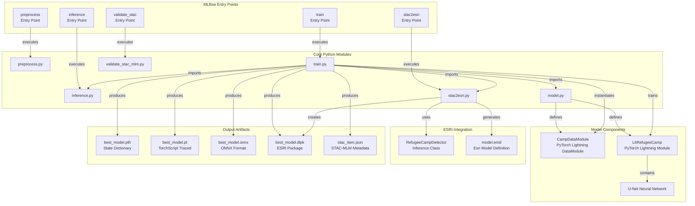
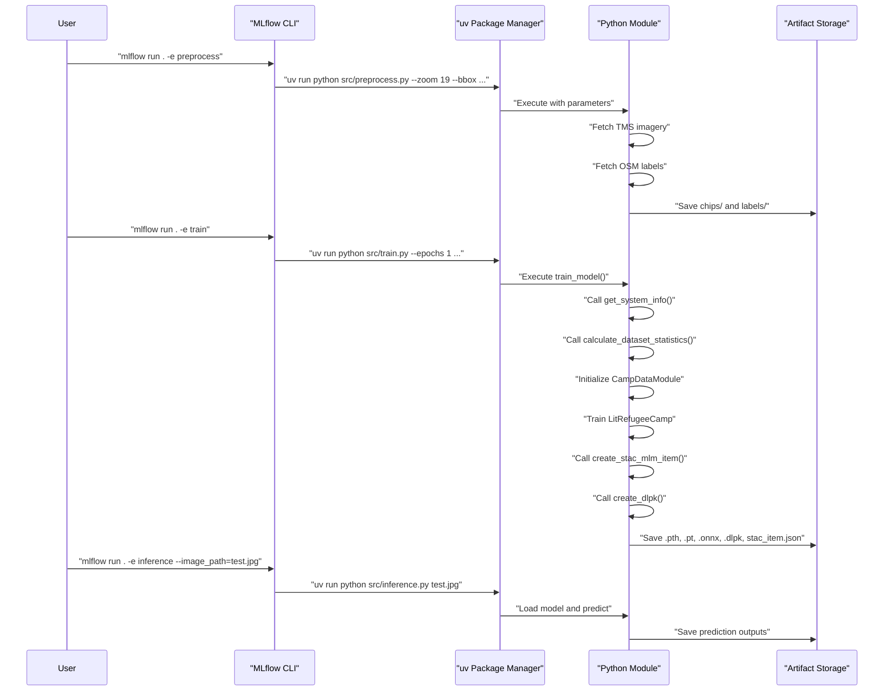
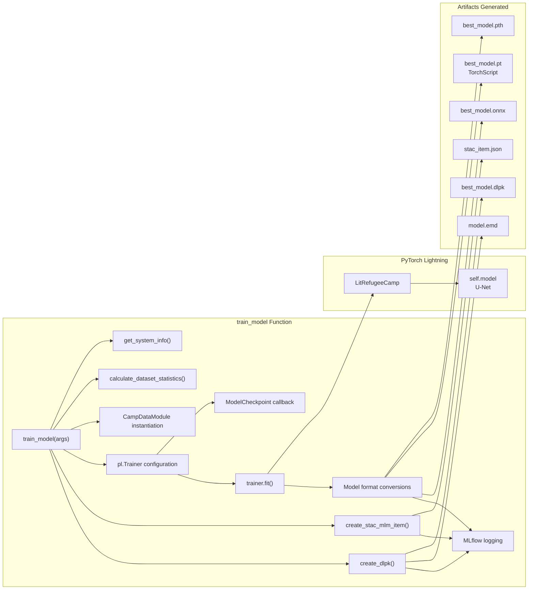
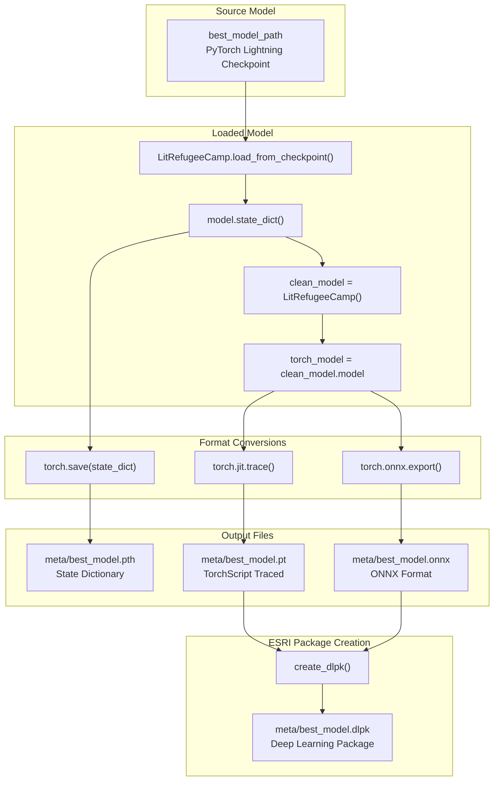
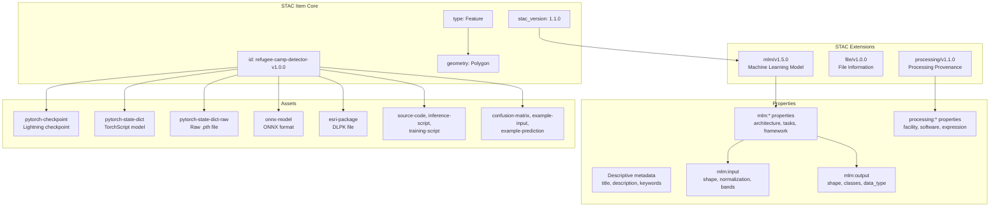
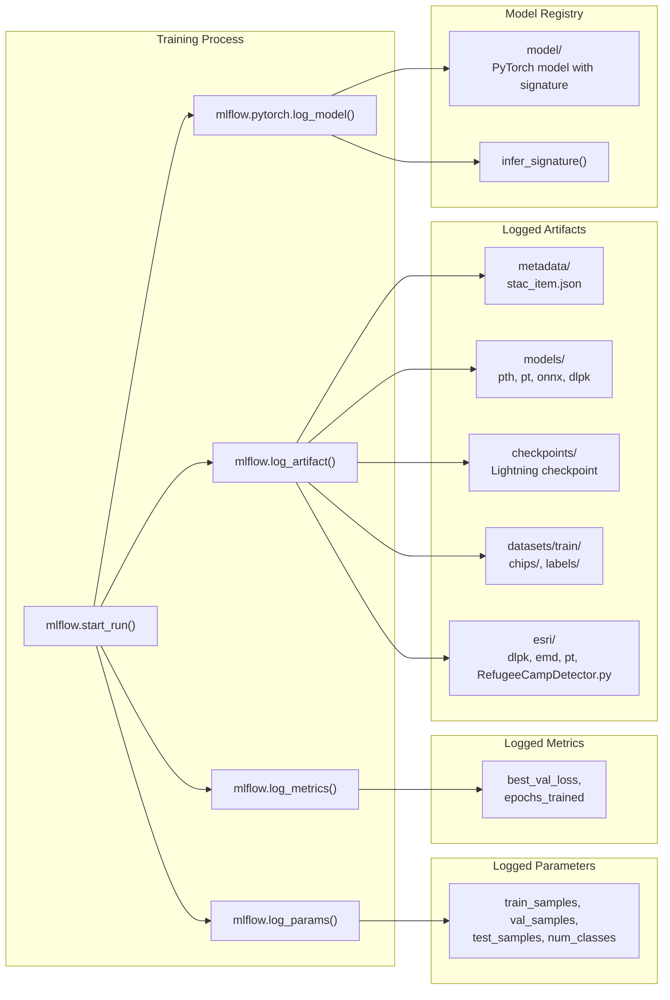
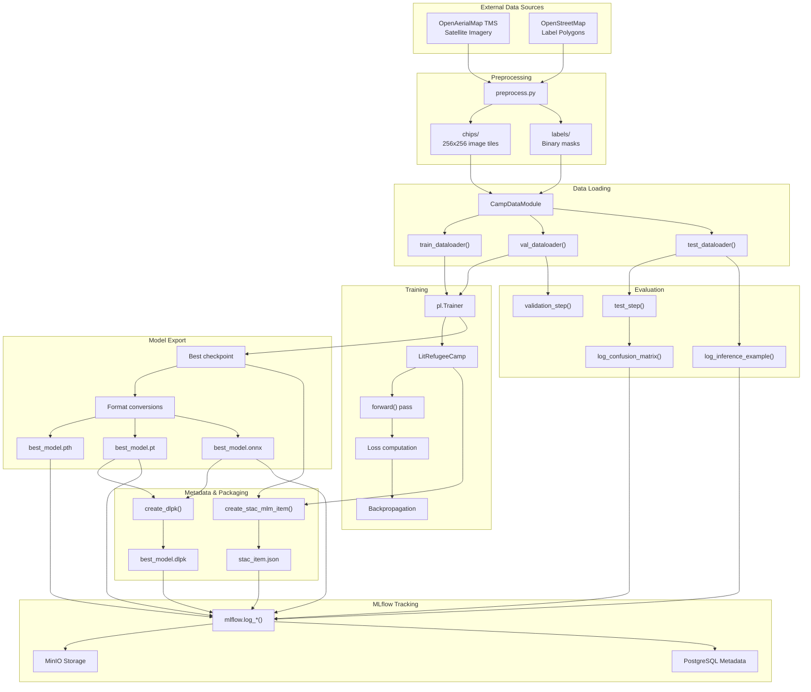
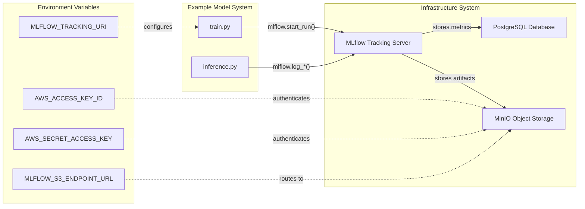

# Example Model System

<details>
<summary>Relevant source files</summary>

The following files were used as context for generating this wiki page:

- [examplemodel/MLproject](examplemodel/MLproject)
- [examplemodel/README.md](examplemodel/README.md)
- [examplemodel/src/train.py](examplemodel/src/train.py)

</details>


## Purpose and Scope

The Example Model System is a complete end-to-end machine learning pipeline for refugee camp detection in satellite imagery. This system demonstrates a production-ready implementation of a geospatial AI model with standardized metadata, multiple deployment formats, and reproducible training workflows.

This document covers the ML pipeline components, training and inference workflows, model architecture, output artifact generation, and MLflow orchestration. For infrastructure setup and deployment, see [Infrastructure System](#4). For specific deployment strategies to different platforms, see [Model Deployment Options](#6.2).

**Sources:** [examplemodel/README.md:1-52](), [examplemodel/src/train.py:1-519](), [examplemodel/MLproject:1-63]()

---

## System Overview

The Example Model System implements a semantic segmentation pipeline using U-Net architecture to identify refugee camps in satellite imagery. The system is structured around five distinct entry points orchestrated by MLflow, each handling a specific phase of the ML lifecycle.

### High-Level Architecture



**Sources:** [examplemodel/MLproject:1-63](), [examplemodel/src/train.py:1-519]()

---

## MLflow Entry Points

The system defines five entry points in the `MLproject` file, each representing a distinct phase of the ML workflow.

### Entry Point Configuration

| Entry Point | Module | Purpose | Key Parameters |
|-------------|--------|---------|----------------|
| `preprocess` | `src/preprocess.py` | Data acquisition from TMS and OSM | `zoom`, `bbox`, `tms`, `train_dir` |
| `train` | `src/train.py` | Model training and artifact generation | `epochs`, `batch_size`, `chips_dir`, `labels_dir`, `lr` |
| `inference` | `src/inference.py` | Model prediction on new images | `image_path`, `model_path`, `output_dir`, `mlflow_tracking` |
| `validate_stac` | `validate_stac_mlm.py` | STAC-MLM metadata validation | `stac_file` |
| `stac2esri` | `src/stac2esri.py` | DLPK package generation for ArcGIS | `stac_path`, `onnx_path`, `out_dir`, `dlpk_name` |

**Sources:** [examplemodel/MLproject:5-63]()

### Entry Point Execution Flow



**Sources:** [examplemodel/MLproject:5-63](), [examplemodel/src/train.py:370-519]()

---

## Training Pipeline Components

The training pipeline is orchestrated by the `train_model()` function in `train.py`, which coordinates multiple subsystems.

### Training Pipeline Architecture



**Sources:** [examplemodel/src/train.py:370-519]()

### Key Functions in train.py

#### get_system_info()

Collects comprehensive system and hardware information for reproducibility tracking.

**Function signature:** `def get_system_info() -> Dict[str, Any]:`

**Returns:** Dictionary containing:
- Platform information (`platform`, `architecture`, `processor`)
- Python version
- Hardware specs (`cpu_count`, `memory_total`, `memory_available`)
- PyTorch and CUDA versions
- GPU information via `pynvml` (name, memory stats)

**Sources:** [examplemodel/src/train.py:25-61]()

#### calculate_dataset_statistics()

Computes pixel-level statistics across the training dataset for normalization.

**Function signature:** `def calculate_dataset_statistics(data_module: CampDataModule) -> Dict[str, Any]:`

**Process:**
1. Iterates through training dataloader
2. Accumulates channel sums and squared sums
3. Calculates mean and standard deviation per channel
4. Counts samples in train/val/test splits

**Returns:** Dictionary with dataset statistics including `train_samples`, `val_samples`, `test_samples`, `pixel_mean`, `pixel_std`

**Sources:** [examplemodel/src/train.py:63-99]()

#### create_stac_mlm_item()

Generates STAC-MLM compliant metadata describing the trained model.

**Function signature:** `def create_stac_mlm_item(model, dataset_stats, system_info, model_performance, checkpoint_path) -> Dict[str, Any]:`

**STAC Item Structure:**
- **Core properties:** `id`, `geometry`, `bbox`, `datetime`
- **MLM properties:** Model architecture, framework, parameters, I/O specifications
- **Processing properties:** Training environment details
- **Assets:** Links to all model artifacts (PyTorch, ONNX, DLPK, etc.)

**Key STAC Extensions Used:**
- `mlm/v1.5.0` - Machine Learning Model extension
- `file/v1.0.0` - File information
- `processing/v1.1.0` - Processing provenance

**Sources:** [examplemodel/src/train.py:101-368]()

#### train_model()

Main training orchestration function that coordinates all pipeline components.

**Function signature:** `def train_model(args):`

**Execution Flow:**
1. Start MLflow run
2. Collect system info
3. Initialize `CampDataModule` with data directories
4. Calculate dataset statistics
5. Configure `ModelCheckpoint` callback (monitors `val_loss`)
6. Initialize `pl.Trainer` with auto-accelerator detection
7. Train `LitRefugeeCamp` model
8. Convert best checkpoint to multiple formats:
   - `.pth` - Raw state dictionary
   - `.pt` - TorchScript traced model
   - `.onnx` - ONNX format
9. Generate STAC-MLM metadata
10. Create ESRI DLPK package via `create_dlpk()`
11. Log all artifacts to MLflow
12. Log model with signature for MLflow Model Registry

**Sources:** [examplemodel/src/train.py:370-519]()

---

## Model Format Conversions

The training pipeline produces four distinct model formats for different deployment scenarios.

### Conversion Process



**Sources:** [examplemodel/src/train.py:433-469]()

### Format Specifications

| Format | File Extension | Purpose | Generation Code |
|--------|---------------|---------|-----------------|
| State Dictionary | `.pth` | Raw PyTorch weights for flexible loading | `torch.save(model.state_dict(), "meta/best_model.pth")` |
| TorchScript | `.pt` | Traced model for optimized inference | `torch.jit.trace(torch_model, torch.randn(1,3,256,256))` |
| ONNX | `.onnx` | Cross-platform interoperability | `torch.onnx.export(torch_model, ...)` with opset 11 |
| ESRI DLPK | `.dlpk` | ArcGIS Pro deployment package | `create_dlpk(emd_path, pt_path, esri_inference_path, dlpk_path)` |

**Key Implementation Details:**

**TorchScript Export:** Uses `torch.jit.trace()` on the inner neural network (`clean_model.model`) rather than the Lightning wrapper to ensure compatibility.

**ONNX Export Parameters:**
- `opset_version=11` for broad compatibility
- Dynamic axes for batch dimension: `{"input": {0: "batch_size"}, "output": {0: "batch_size"}}`
- Input/output names: `["input"]` and `["output"]`

**Sources:** [examplemodel/src/train.py:438-469]()

---

## STAC-MLM Metadata Generation

The system generates comprehensive STAC (SpatioTemporal Asset Catalog) metadata following the Machine Learning Model (MLM) extension specification v1.5.0.

### STAC Item Structure



**Sources:** [examplemodel/src/train.py:101-368]()

### Key STAC-MLM Properties

#### Model Architecture Properties

```
mlm:name: "RefugeeCampDetector"
mlm:architecture: "U-Net"
mlm:tasks: ["semantic-segmentation"]
mlm:framework: "PyTorch"
mlm:framework_version: torch.__version__
mlm:total_parameters: sum(p.numel() for p in model.parameters())
mlm:memory_size: sum(p.numel() * p.element_size() for p in model.parameters())
```

**Sources:** [examplemodel/src/train.py:172-180]()

#### Input Specification

The input specification defines expected image format and normalization:

```json
{
  "name": "satellite_image",
  "bands": ["red", "green", "blue"],
  "input": {
    "shape": [-1, 3, 256, 256],
    "dim_order": ["batch", "bands", "height", "width"],
    "data_type": "float32"
  },
  "value_scaling": [
    {"type": "z-score", "mean": 0.485, "stddev": 0.229},
    {"type": "z-score", "mean": 0.456, "stddev": 0.224},
    {"type": "z-score", "mean": 0.406, "stddev": 0.225}
  ]
}
```

Uses ImageNet normalization statistics for transfer learning compatibility.

**Sources:** [examplemodel/src/train.py:190-206]()

#### Output Specification

Defines the segmentation mask output format:

```json
{
  "name": "segmentation_mask",
  "result": {
    "shape": [-1, 1, 256, 256],
    "dim_order": ["batch", "channel", "height", "width"],
    "data_type": "float32"
  },
  "classification:classes": [
    {"value": 0, "name": "background"},
    {"value": 1, "name": "refugee_camp"}
  ]
}
```

**Sources:** [examplemodel/src/train.py:207-230]()

### Asset Catalog

The STAC item catalogs 15 distinct assets across multiple categories:

| Asset Key | Type | Role | File Path |
|-----------|------|------|-----------|
| `pytorch-checkpoint` | Lightning checkpoint | `mlm:model`, `mlm:checkpoint` | Path from checkpoint callback |
| `pytorch-state-dict` | TorchScript | `mlm:model`, `mlm:weights` | `meta/best_model.pt` |
| `pytorch-state-dict-raw` | State dict | `mlm:model`, `mlm:weights` | `meta/best_model.pth` |
| `onnx-model` | ONNX | `mlm:model`, `mlm:inference` | `meta/best_model.onnx` |
| `esri-package` | DLPK ZIP | `mlm:model` | `meta/best_model.dlpk` |
| `source-code` | Repository link | `mlm:source_code`, `code` | GitHub URL |
| `inference-script` | Python script | `mlm:source_code` | `src/inference.py` |
| `training-script` | Python script | `mlm:training`, `code` | `src/train.py` |
| `container-image` | OCI image | `mlm:container`, `runtime` | GHCR URL |
| `confusion-matrix` | PNG | `metadata`, `overview` | `meta/confusion_matrix.png` |
| `example-input` | PNG | `metadata`, `overview` | `meta/example_input.png` |
| `example-prediction` | PNG | `metadata`, `overview` | `meta/example_pred.png` |
| `example-target` | PNG | `metadata`, `overview` | `meta/example_target.png` |
| `model-metadata` | EMD JSON | `metadata` | `meta/model.emd` |
| `requirements` | Text file | `runtime`, `metadata` | `requirements.txt` |

**Sources:** [examplemodel/src/train.py:246-364]()

---

## MLflow Integration

The training pipeline integrates with MLflow for experiment tracking, artifact logging, and model registry.

### MLflow Logging Architecture



**Sources:** [examplemodel/src/train.py:373-507]()

### Artifact Organization

The system logs artifacts in a structured directory hierarchy:

```
mlflow_run/
├── metadata/
│   └── stac_item.json
├── models/
│   ├── best_model.pth
│   ├── best_model.pt
│   ├── best_model.onnx
│   └── best_model.dlpk
├── checkpoints/
│   └── epoch={epoch}-step={step}.ckpt
├── datasets/
│   └── train/
│       ├── chips/
│       └── labels/
├── esri/
│   ├── best_model.dlpk
│   ├── model.emd
│   ├── best_model.pt
│   └── RefugeeCampDetector.py
└── model/
    └── [PyTorch model with signature]
```

**Implementation:**
```python
mlflow.log_artifact(stac_output_path, artifact_path="metadata")
mlflow.log_artifact("meta/best_model.pth", artifact_path="models")
mlflow.log_artifact("meta/best_model.pt", artifact_path="models")
mlflow.log_artifact("meta/best_model.onnx", artifact_path="models")
mlflow.log_artifact("meta/best_model.dlpk", artifact_path="models")
mlflow.log_artifact(best_checkpoint, artifact_path="checkpoints")
mlflow.log_artifact(args.chips_dir, artifact_path="datasets/train/chips")
mlflow.log_artifact(args.labels_dir, artifact_path="datasets/train/labels")
```

**Sources:** [examplemodel/src/train.py:479-496]()

### Model Signature

The system uses `infer_signature()` to capture input/output schemas:

```python
dummy_input = torch.randn(1, 3, 256, 256)
signature = infer_signature(
    dummy_input.numpy(), 
    clean_model(dummy_input).detach().numpy()
)
mlflow.pytorch.log_model(
    clean_model, 
    "model", 
    signature=signature, 
    extra_files=[stac_output_path]
)
```

This enables MLflow's model serving capabilities with schema validation.

**Sources:** [examplemodel/src/train.py:498-503]()

---

## System Dependencies and Configuration

### Dependency Management

The system uses `uv` package manager with dependencies defined in `pyproject.toml`. All entry points execute via `uv run` to ensure consistent dependency resolution.

**Example from MLproject:**
```
command: >
  uv run python src/train.py 
  --epochs {epochs}
  --batch_size {batch_size}
  --chips_dir {chips_dir}
  --labels_dir {labels_dir}
  --lr {lr}
```

**Sources:** [examplemodel/MLproject:26-32]()

### Training Parameters

The training entry point accepts five configurable parameters:

| Parameter | Type | Default | Description |
|-----------|------|---------|-------------|
| `epochs` | int | 1 | Number of training epochs |
| `batch_size` | int | 32 | Batch size for training |
| `chips_dir` | str | `data/train/sample/chips` | Directory containing image chips |
| `labels_dir` | str | `data/train/sample/labels` | Directory containing label masks |
| `lr` | float | 1e-3 | Learning rate for optimizer |

**Command-line usage:**
```bash
uv run mlflow run . -e train \
  -P epochs=10 \
  -P batch_size=16 \
  -P chips_dir=data/custom/chips \
  -P labels_dir=data/custom/labels \
  -P lr=0.001
```

**Sources:** [examplemodel/MLproject:19-32](), [examplemodel/src/train.py:510-518]()

---

## Data Flow Through the System



**Sources:** [examplemodel/src/train.py:1-519](), [examplemodel/MLproject:1-63]()

---

## Output Artifacts Summary

The training pipeline generates a comprehensive set of outputs for different use cases:

### Model Artifacts

1. **best_model.pth** - Raw PyTorch state dictionary for flexible loading and fine-tuning
2. **best_model.pt** - TorchScript traced model for production inference with JIT compilation
3. **best_model.onnx** - ONNX format for cross-platform deployment (TensorRT, ONNX Runtime, etc.)
4. **best_model.dlpk** - ESRI Deep Learning Package for ArcGIS Pro integration

### Metadata and Documentation

1. **stac_item.json** - STAC-MLM compliant metadata describing model capabilities, requirements, and provenance
2. **model.emd** - ESRI Model Definition file with ArcGIS-specific configuration

### Evaluation Artifacts

1. **confusion_matrix.png** - Model performance visualization on test set
2. **example_input.png** - Sample input satellite imagery
3. **example_pred.png** - Model prediction on sample
4. **example_target.png** - Ground truth for sample

### Source Code

1. **RefugeeCampDetector.py** - ESRI inference class bundled in DLPK
2. Links to training and inference scripts in STAC metadata

**Sources:** [examplemodel/src/train.py:436-496]()

---

## Integration with Infrastructure

The Example Model System integrates with the Infrastructure System through MLflow tracking:



**Configuration Example (from README):**
```bash
export AWS_ACCESS_KEY_ID=mlflow
export AWS_SECRET_ACCESS_KEY=mlflow123
export MLFLOW_S3_ENDPOINT_URL=http://your_remote_server_minio:9000
```

**Sources:** [examplemodel/README.md:40-48](), [examplemodel/src/train.py:8-22]()

---

## Related Documentation

- For model architecture details and PyTorch Lightning components, see [Model Overview and Architecture](#3.1)
- For detailed training process and hyperparameters, see [Training Pipeline](#3.2)
- For inference workflows and prediction generation, see [Inference System](#3.3)
- For ESRI package creation and ArcGIS deployment, see [ESRI Integration and DLPK Generation](#3.4)
- For MLproject entry point specifications, see [MLflow Project Structure](#3.5)
- For dependency management and configuration, see [Dependencies and Configuration](#3.6)
- For infrastructure setup and MLflow server deployment, see [Infrastructure System](#4)