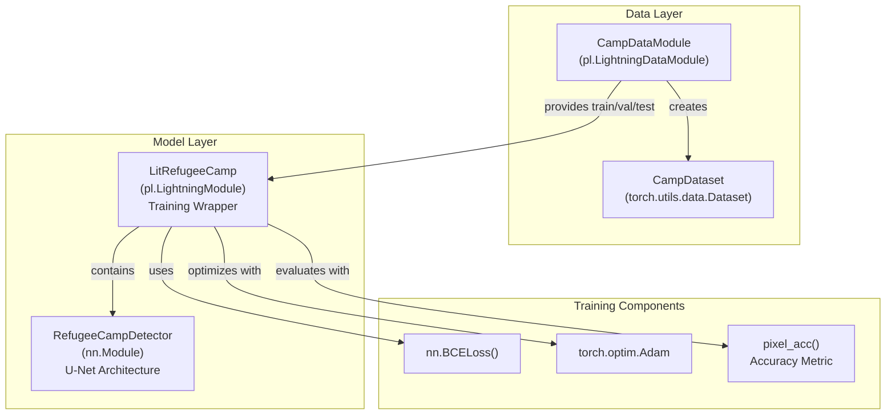
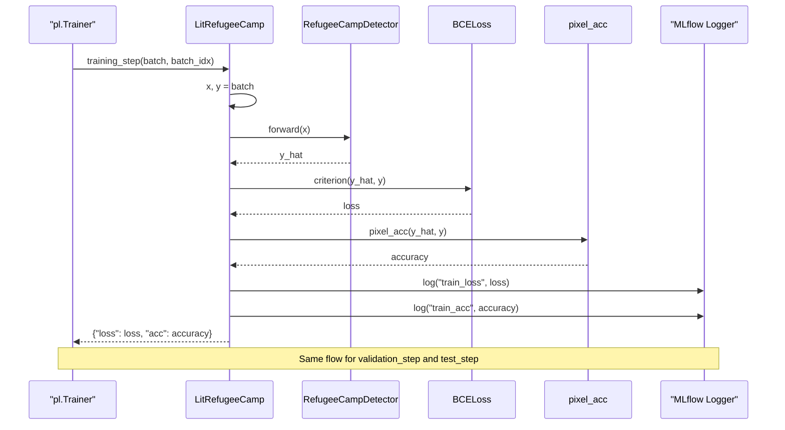
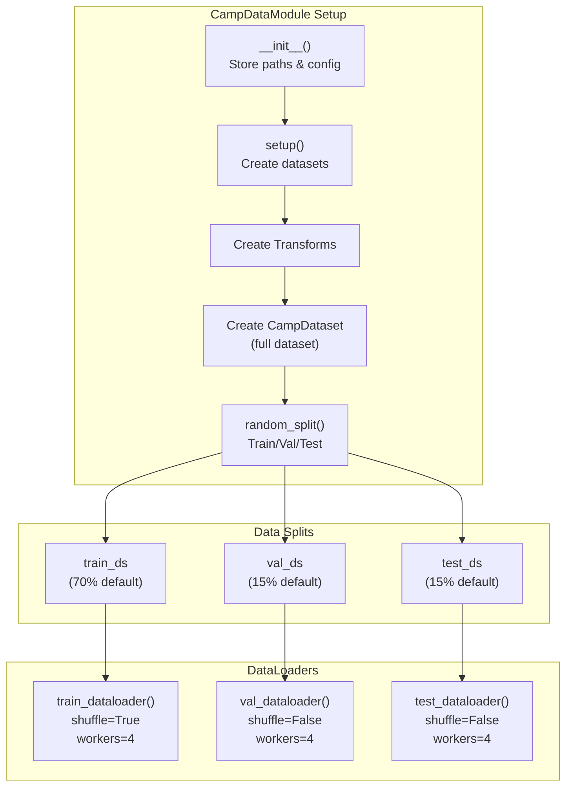

# Model Overview and Architecture

<details>
<summary>Relevant source files</summary>

The following files were used as context for generating this wiki page:

- [examplemodel/README.md](examplemodel/README.md)
- [examplemodel/playground.ipynb](examplemodel/playground.ipynb)
- [examplemodel/src/model.py](examplemodel/src/model.py)

</details>


## Purpose and Scope

This document provides a detailed technical overview of the refugee camp detection model architecture implemented in the OpenGeoAIModelHub example model system. It covers the U-Net based segmentation model (`RefugeeCampDetector`), the PyTorch Lightning training wrapper (`LitRefugeeCamp`), and the data handling components (`CampDataModule` and `CampDataset`).

For information about the training pipeline that uses these components, see [Training Pipeline](#3.2). For details on the inference system, see [Inference System](#3.3). For MLflow project orchestration, see [MLflow Project Structure](#3.5).

---

## Architecture Overview

The example model implements a semantic segmentation task for detecting refugee camps (or buildings) in satellite imagery. The architecture follows a simplified U-Net design without skip connections, implemented as a standalone PyTorch model (`RefugeeCampDetector`) and wrapped in a PyTorch Lightning module (`LitRefugeeCamp`) for training orchestration.

### High-Level Component Diagram



Sources: [examplemodel/src/model.py:1-175]()

---

## RefugeeCampDetector: U-Net Model Architecture

The `RefugeeCampDetector` class implements a simplified U-Net architecture for binary semantic segmentation. The model consists of an encoder path that progressively downsamples the input, a bottleneck layer, and a decoder path that upsamples back to the original resolution.

### Network Structure Diagram

```mermaid
graph LR
    subgraph "Encoder Path"
        Input["Input<br/>3x256x256"]
        conv1["conv1<br/>Conv2d(3,64)<br/>ReLU"]
        pool1["pool1<br/>MaxPool2d(2)"]
        conv2["conv2<br/>Conv2d(64,128)<br/>ReLU"]
        pool2["pool2<br/>MaxPool2d(2)"]
        conv3["conv3<br/>Conv2d(128,256)<br/>ReLU"]
        pool3["pool3<br/>MaxPool2d(2)"]
    end
    
    subgraph "Bottleneck"
        conv4["conv4<br/>Conv2d(256,512)<br/>ReLU"]
    end
    
    subgraph "Decoder Path"
        up1["up1<br/>ConvTranspose2d(512,256)"]
        up2["up2<br/>ConvTranspose2d(256,128)"]
        up3["up3<br/>ConvTranspose2d(128,64)"]
        outc["outc<br/>Conv2d(64,1)"]
        sigmoid["Sigmoid"]
        Output["Output<br/>1x256x256"]
    end
    
    Input --> conv1 --> pool1 --> conv2 --> pool2 --> conv3 --> pool3
    pool3 --> conv4
    conv4 --> up1 --> up2 --> up3 --> outc --> sigmoid --> Output
```



Sources: [examplemodel/src/model.py:103-137]()

### Layer Configuration

The following table details the layer-by-layer configuration of the `RefugeeCampDetector` model:

| Layer Name | Layer Type | Input Channels | Output Channels | Kernel/Stride | Output Size (HxW) | Purpose |
|------------|------------|----------------|-----------------|---------------|-------------------|---------|
| `conv1` | Conv2d | 3 | 64 | 3x3, padding=1 | 256x256 | Initial feature extraction |
| `pool1` | MaxPool2d | 64 | 64 | 2x2 | 128x128 | Spatial downsampling |
| `conv2` | Conv2d | 64 | 128 | 3x3, padding=1 | 128x128 | Feature expansion |
| `pool2` | MaxPool2d | 128 | 128 | 2x2 | 64x64 | Spatial downsampling |
| `conv3` | Conv2d | 128 | 256 | 3x3, padding=1 | 64x64 | Feature expansion |
| `pool3` | MaxPool2d | 256 | 256 | 2x2 | 32x32 | Spatial downsampling |
| `conv4` | Conv2d | 256 | 512 | 3x3, padding=1 | 32x32 | Bottleneck features |
| `up1` | ConvTranspose2d | 512 | 256 | 2x2, stride=2 | 64x64 | Spatial upsampling |
| `up2` | ConvTranspose2d | 256 | 128 | 2x2, stride=2 | 128x128 | Spatial upsampling |
| `up3` | ConvTranspose2d | 128 | 64 | 2x2, stride=2 | 256x256 | Spatial upsampling |
| `outc` | Conv2d | 64 | 1 | 1x1 | 256x256 | Final prediction layer |
| (activation) | Sigmoid | 1 | 1 | - | 256x256 | Probability output |

Sources: [examplemodel/src/model.py:104-116](), [examplemodel/src/model.py:118-137]()

### Design Characteristics

The model has the following notable characteristics:

- **No Skip Connections**: Unlike the canonical U-Net architecture, this implementation does not include skip connections between encoder and decoder paths. This simplifies the architecture but may limit feature reuse.
- **Progressive Channel Expansion**: Encoder path doubles channels at each stage (3→64→128→256→512), capturing increasingly complex features.
- **Symmetric Decoder**: Decoder mirrors the encoder structure, progressively halving channels (512→256→128→64→1).
- **Fixed Input Size**: Model expects 256x256 pixel RGB images as input, producing 256x256 single-channel probability masks.
- **Binary Segmentation**: Output is a single-channel probability map for the "refugee camp/building" class.

Sources: [examplemodel/src/model.py:103-137](), [examplemodel/README.md:50-52]()

---

## LitRefugeeCamp: PyTorch Lightning Training Module

The `LitRefugeeCamp` class wraps the `RefugeeCampDetector` model in a PyTorch Lightning module, providing a standardized training interface with automatic logging, checkpointing, and distributed training support.

### Training Loop Flow



Sources: [examplemodel/src/model.py:145-174]()

### Component Details

| Component | Implementation | Configuration | Purpose |
|-----------|---------------|---------------|---------|
| Base Model | `RefugeeCampDetector()` | Initialized in `__init__` | Core U-Net architecture |
| Loss Function | `nn.BCELoss()` | Binary Cross-Entropy | Measures pixel-wise prediction error |
| Optimizer | `torch.optim.Adam` | Learning rate configurable (default: 1e-3) | Parameter updates |
| Metrics | `pixel_acc()` function | Threshold at 0.5 | Binary pixel accuracy |
| Logging | `self.log()` | Automatic MLflow integration | Tracks loss and accuracy |

Sources: [examplemodel/src/model.py:145-174]()

### Training Step Implementation

The `_shared_step` method [examplemodel/src/model.py:155-162]() implements a unified training/validation/test logic:

1. **Forward Pass**: Input images `x` are passed through the model to generate predictions `y_hat`
2. **Loss Computation**: Binary Cross-Entropy loss is calculated between predictions and ground truth `y`
3. **Accuracy Calculation**: `pixel_acc()` function computes percentage of correctly classified pixels (threshold=0.5)
4. **Logging**: Both loss and accuracy are logged with appropriate stage prefix (`train_`, `val_`, `test_`)
5. **Return**: Dictionary containing loss and accuracy for optional aggregation

The optimizer is configured in `configure_optimizers()` [examplemodel/src/model.py:173-174]() using Adam with the learning rate specified during initialization.

Sources: [examplemodel/src/model.py:145-174]()

---

## Data Handling Components

### CampDataset: Custom PyTorch Dataset

The `CampDataset` class [examplemodel/src/model.py:12-30]() implements a custom PyTorch `Dataset` for loading paired image-label data from disk.

**Key Features:**
- **Paired Loading**: Loads matching image and label files from separate directories
- **Format Conversion**: Images converted to RGB, labels to grayscale
- **Transform Support**: Applies optional transforms to images and labels independently
- **File Matching**: Assumes image and label files have identical filenames

**Constructor Parameters:**
- `image_dir`: Path to directory containing RGB image chips
- `label_dir`: Path to directory containing label masks
- `transform`: Optional transform pipeline for images
- `target_transform`: Optional transform pipeline for labels

Sources: [examplemodel/src/model.py:12-30]()

### CampDataModule: PyTorch Lightning DataModule

The `CampDataModule` class [examplemodel/src/model.py:33-100]() encapsulates all data-related logic in a reusable PyTorch Lightning component.



Sources: [examplemodel/src/model.py:33-100]()

### Data Transformation Pipeline

The `CampDataModule.setup()` method [examplemodel/src/model.py:52-73]() defines standard transformation pipelines:

**Image Transform:**
```python
transforms.Compose([
    transforms.Resize((256, 256)),                          # Resize to fixed size
    transforms.ToTensor(),                                  # Convert to [0,1] tensor
    transforms.Normalize([0.485, 0.456, 0.406],            # ImageNet mean
                        [0.229, 0.224, 0.225])              # ImageNet std
])
```

**Label Transform:**
```python
transforms.Compose([
    transforms.Resize((256, 256), 
                     transforms.InterpolationMode.NEAREST),  # Preserve discrete values
    transforms.ToTensor()                                    # Convert to [0,1] tensor
])
```

The use of ImageNet normalization statistics suggests the model may benefit from transfer learning in future iterations, though the current implementation trains from scratch [examplemodel/README.md:50-52]().

Sources: [examplemodel/src/model.py:53-65]()

### Configuration Parameters

| Parameter | Default Value | Description |
|-----------|---------------|-------------|
| `batch_size` | 32 | Number of samples per batch |
| `val_ratio` | 0.15 | Fraction of data for validation |
| `test_ratio` | 0.15 | Fraction of data for testing |
| `seed` | 62 | Random seed for reproducible splits |
| `num_workers` | 4 | Parallel data loading workers |
| `pin_memory` | True | Pin memory for faster GPU transfer |

Sources: [examplemodel/src/model.py:34-50](), [examplemodel/src/model.py:75-100]()

---

## Input/Output Specifications

### Model Input Requirements

| Property | Specification | Notes |
|----------|--------------|-------|
| **Format** | PyTorch Tensor | `torch.Tensor` with dtype float32 |
| **Shape** | (B, 3, 256, 256) | Batch size × RGB channels × Height × Width |
| **Color Space** | RGB | Red, Green, Blue channels |
| **Value Range** | Normalized | Mean=[0.485, 0.456, 0.406], Std=[0.229, 0.224, 0.225] |
| **Source** | OpenAerialMap | Satellite imagery tiles |

### Model Output Format

| Property | Specification | Notes |
|----------|--------------|-------|
| **Format** | PyTorch Tensor | `torch.Tensor` with dtype float32 |
| **Shape** | (B, 1, 256, 256) | Batch size × 1 channel × Height × Width |
| **Value Range** | [0.0, 1.0] | Probability per pixel (sigmoid activation) |
| **Interpretation** | Binary segmentation | Values > 0.5 typically classified as "building/camp" |
| **Ground Truth Source** | OpenStreetMap | Building footprint polygons |

Sources: [examplemodel/src/model.py:118-137](), [examplemodel/README.md:50-52](), [examplemodel/playground.ipynb:55-78]()

### Inference Example

The [examplemodel/playground.ipynb]() demonstrates the complete inference flow:

1. **Load Model**: `torch.jit.load()` loads serialized model [examplemodel/playground.ipynb:44-46]()
2. **Prepare Input**: Create or load tensor with shape (1, 3, 256, 256) [examplemodel/playground.ipynb:55-56]()
3. **Forward Pass**: `model(input)` produces raw probability output [examplemodel/playground.ipynb:67-72]()
4. **Thresholding**: Apply threshold (e.g., 0.5) to convert to binary mask [examplemodel/playground.ipynb:75-78]()

---

## Model Design Rationale

The architecture balances several design objectives:

1. **Simplicity**: Simplified U-Net without skip connections reduces complexity, making it easier to understand and modify as a template model.

2. **Self-Contained**: No pretrained backbone dependency allows the model to serve as a complete example without external model dependencies [examplemodel/README.md:50-52]().

3. **Reproducibility**: Fixed random seeds, deterministic data splits, and comprehensive logging ensure reproducible experiments.

4. **Extensibility**: Clear separation between model architecture (`RefugeeCampDetector`), training logic (`LitRefugeeCamp`), and data handling (`CampDataModule`) facilitates modifications.

5. **Standards Compliance**: PyTorch Lightning integration provides automatic support for distributed training, mixed precision, and checkpoint management without custom code.

The model serves as a reference implementation demonstrating best practices for GeoAI model development rather than achieving state-of-the-art performance.

Sources: [examplemodel/README.md:1-52](), [examplemodel/src/model.py:1-175]()