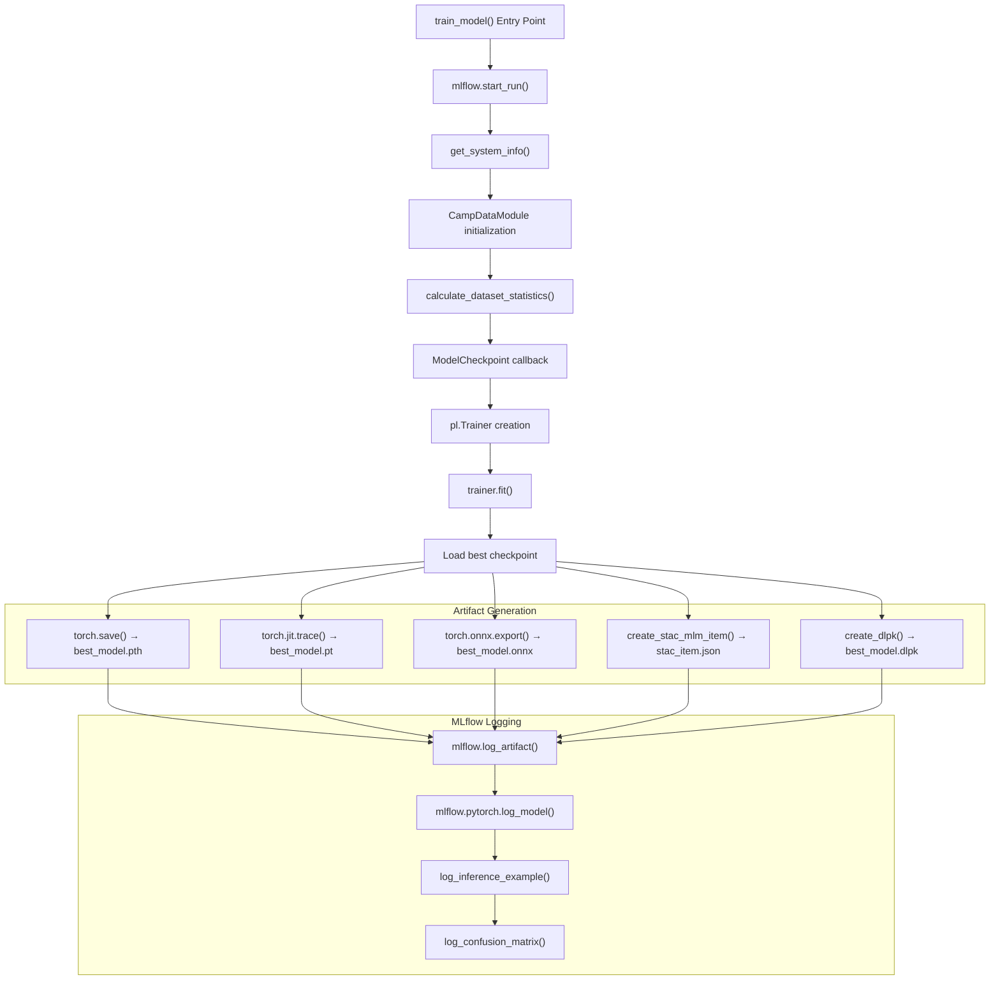
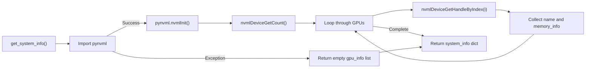
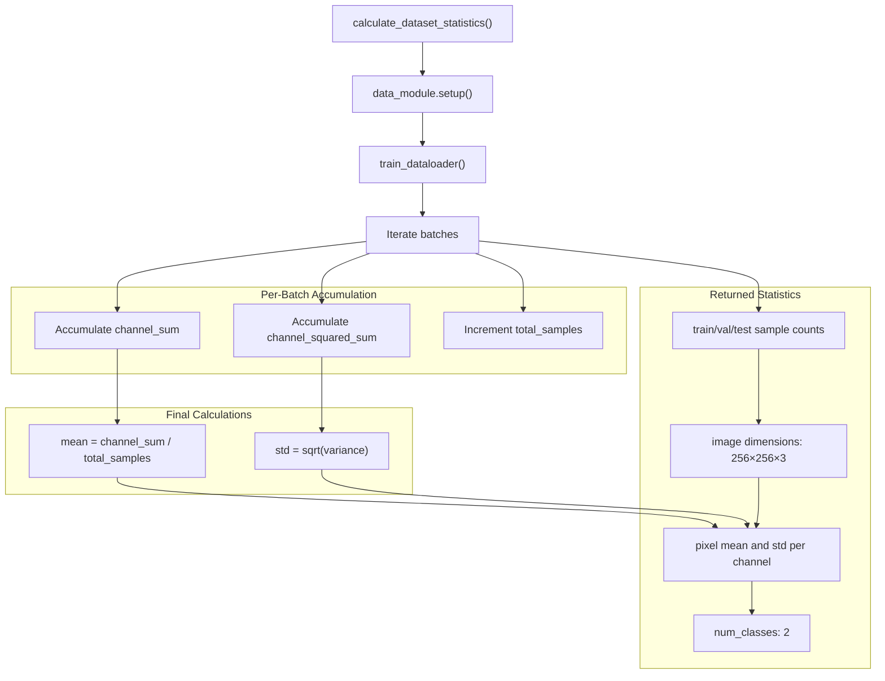
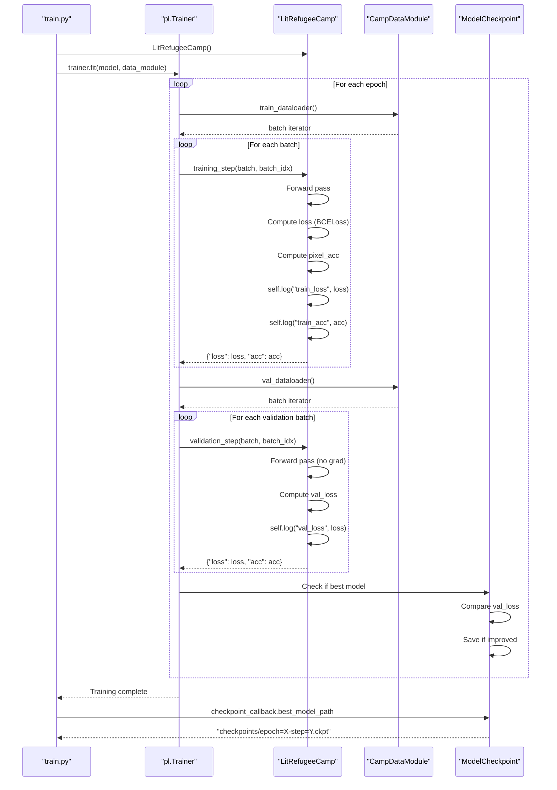
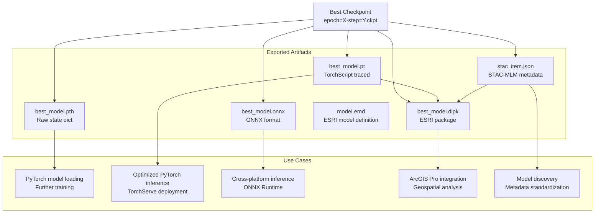
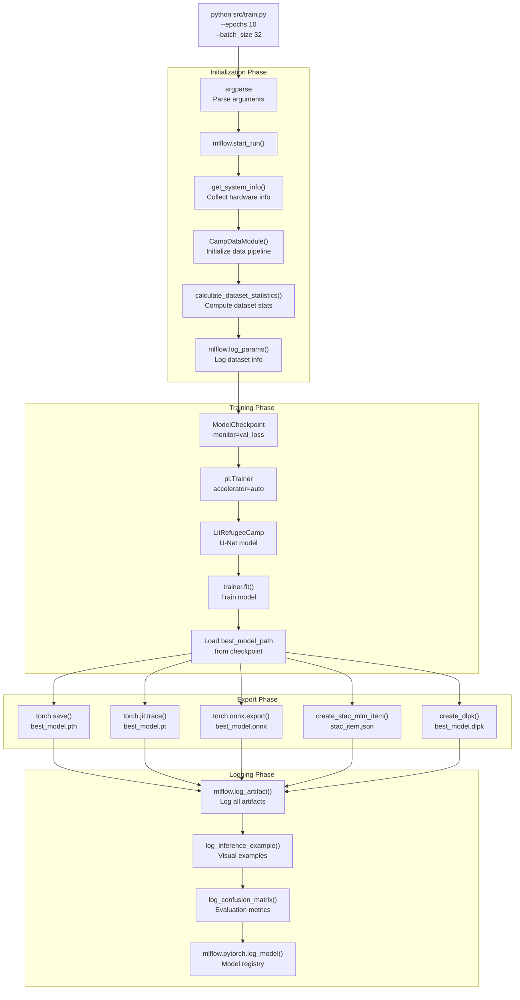

# Training Pipeline

<details>
<summary>Relevant source files</summary>

The following files were used as context for generating this wiki page:

- [examplemodel/playground.ipynb](examplemodel/playground.ipynb)
- [examplemodel/src/model.py](examplemodel/src/model.py)
- [examplemodel/src/train.py](examplemodel/src/train.py)

</details>


## Purpose and Scope

This document describes the training pipeline for the refugee camp detection model, covering the end-to-end process from data loading through model training to artifact generation and MLflow logging. The pipeline is implemented in [examplemodel/src/train.py]() and orchestrates all components required for reproducible model training.

For information about the model architecture itself, see [Model Overview and Architecture](#3.1). For details on using trained models for prediction, see [Inference System](#3.3). For MLflow orchestration and entry points, see [MLflow Project Structure](#3.5).

**Sources:** [examplemodel/src/train.py:1-519]()

---

## Training Pipeline Architecture

The training pipeline follows a structured workflow that integrates PyTorch Lightning for model training, MLflow for experiment tracking, and multiple export formats for deployment flexibility.



**Sources:** [examplemodel/src/train.py:370-507]()

---

## System Information Collection

The `get_system_info()` function captures comprehensive hardware and software configuration details for reproducibility and debugging. This information is logged to MLflow and embedded in STAC-MLM metadata.

### Collected Metadata

| Category | Information Collected |
|----------|----------------------|
| **Platform** | OS type, architecture, processor |
| **Python** | Version, virtual environment details |
| **PyTorch** | PyTorch version, TorchVision version |
| **CUDA** | Availability, version, GPU count |
| **GPU Details** | Name, total memory, free memory, used memory per device |
| **CPU** | Core count |
| **Memory** | Total and available system memory |

### GPU Detection

The function attempts to import `pynvml` (NVIDIA Management Library) to query GPU information. If unavailable or an error occurs, it falls back to an empty GPU list, ensuring the training pipeline continues on CPU-only systems.



**Sources:** [examplemodel/src/train.py:25-60]()

---

## Data Module Initialization

The training pipeline uses `CampDataModule`, a PyTorch Lightning `LightningDataModule` that handles data loading, preprocessing, and splitting.

### CampDataModule Configuration

The data module is instantiated with the following parameters:

```python
data_module = CampDataModule(
    image_dir=args.chips_dir,
    label_dir=args.labels_dir,
    batch_size=args.batch_size,
)
```

### Internal Data Splitting

| Split | Default Ratio | Purpose |
|-------|---------------|---------|
| **Training** | 70% | Model parameter optimization |
| **Validation** | 15% | Hyperparameter tuning, checkpoint selection |
| **Test** | 15% | Final performance evaluation |

The splits are created using `torch.utils.data.random_split()` with a fixed seed (62) for reproducibility.

### Transformations

**Image Transformations:**
- Resize to 256×256
- Convert to tensor
- Normalize with ImageNet statistics: mean=[0.485, 0.456, 0.406], std=[0.229, 0.224, 0.225]

**Label Transformations:**
- Resize to 256×256 using NEAREST interpolation (preserves discrete values)
- Convert to tensor

**Sources:** [examplemodel/src/model.py:33-100](), [examplemodel/src/train.py:389-393]()

---

## Dataset Statistics Calculation

The `calculate_dataset_statistics()` function computes dataset-level statistics by iterating through the training data loader. These statistics are logged to MLflow for dataset provenance tracking.

### Computed Statistics



### Output Schema

```python
{
    "train_samples": int,
    "val_samples": int,
    "test_samples": int,
    "total_samples": int,
    "image_channels": 3,
    "image_height": 256,
    "image_width": 256,
    "pixel_mean": [float, float, float],  # RGB channels
    "pixel_std": [float, float, float],   # RGB channels
    "num_classes": 2
}
```

**Sources:** [examplemodel/src/train.py:63-98]()

---

## Training Configuration

### Command-Line Arguments

The training script accepts the following command-line arguments:

| Argument | Type | Default | Description |
|----------|------|---------|-------------|
| `--epochs` | int | 1 | Number of training epochs |
| `--batch_size` | int | 32 | Batch size for training |
| `--chips_dir` | str | `data/train/sample/chips` | Path to input image chips |
| `--labels_dir` | str | `data/train/sample/labels` | Path to label masks |
| `--lr` | float | 1e-3 | Learning rate (passed to LitRefugeeCamp) |

### ModelCheckpoint Callback

The training pipeline uses PyTorch Lightning's `ModelCheckpoint` callback to save the best model based on validation loss:

```python
checkpoint_callback = ModelCheckpoint(
    dirpath="checkpoints",
    filename="epoch={epoch}-step={step}",
    save_top_k=1,
    verbose=True,
    monitor="val_loss",
    mode="min",
)
```

**Configuration Details:**
- **dirpath:** Checkpoints saved to `checkpoints/` directory
- **save_top_k=1:** Only the best checkpoint is retained
- **monitor="val_loss":** Selection criterion is validation loss
- **mode="min":** Lower validation loss is better

### PyTorch Lightning Trainer

```python
trainer = pl.Trainer(
    max_epochs=args.epochs,
    accelerator="auto",
    callbacks=[checkpoint_callback],
    logger=False,
)
```

**Trainer Configuration:**
- **accelerator="auto":** Automatically selects GPU if available, otherwise CPU
- **logger=False:** MLflow logging is handled manually for greater control

**Sources:** [examplemodel/src/train.py:405-419](), [examplemodel/src/train.py:510-516]()

---

## Model Training Execution

### Training Process



### Loss Function and Metrics

The `LitRefugeeCamp` model uses:
- **Loss Function:** Binary Cross-Entropy Loss (`nn.BCELoss`)
- **Metric:** Pixel accuracy computed by `pixel_acc()` function
  - Applies threshold of 0.5 to predictions
  - Computes percentage of correctly classified pixels

### Optimizer

The model uses Adam optimizer with the specified learning rate:
```python
torch.optim.Adam(self.parameters(), lr=self.lr)
```

**Sources:** [examplemodel/src/train.py:414-422](), [examplemodel/src/model.py:145-174]()

---

## Artifact Generation

After training completes, the pipeline generates multiple artifact formats to support different deployment scenarios.

### Artifact Types and Purposes



### PyTorch State Dictionary (.pth)

Raw PyTorch state dictionary containing model weights:
```python
torch.save(model.state_dict(), "meta/best_model.pth")
```

**Use Case:** Loading weights into the same model architecture for fine-tuning or continued training.

### TorchScript Model (.pt)

Traced model using TorchScript for optimized inference:
```python
torch_model = clean_model.model
torch_model.eval()
traced_model = torch.jit.trace(torch_model, torch.randn(1, 3, 256, 256))
torch.jit.save(traced_model, "meta/best_model.pt")
```

**Key Details:**
- Extracts the underlying `RefugeeCampDetector` module (not the Lightning wrapper)
- Traces with a dummy input of shape (1, 3, 256, 256)
- Enables deployment without PyTorch Lightning dependency

### ONNX Model (.onnx)

Cross-platform model format:
```python
torch.onnx.export(
    torch_model,
    dummy_input,
    "meta/best_model.onnx",
    export_params=True,
    opset_version=11,
    input_names=["input"],
    output_names=["output"],
    dynamic_axes={"input": {0: "batch_size"}, "output": {0: "batch_size"}},
)
```

**Configuration:**
- **opset_version=11:** Compatible with most ONNX runtimes
- **dynamic_axes:** Batch dimension is dynamic, allowing variable batch sizes
- **input/output names:** Named tensors for clarity

### ESRI Deep Learning Package (.dlpk)

Package for ArcGIS integration:
```python
create_dlpk(emd_path, pt_path, esri_inference_path, dlpk_path)
```

The DLPK includes:
- TorchScript model (.pt)
- ESRI model definition (model.emd)
- Inference script (RefugeeCampDetector.py)
- STAC-MLM metadata

For details on DLPK creation, see [ESRI Integration and DLPK Generation](#3.4).

**Sources:** [examplemodel/src/train.py:436-468]()

---

## STAC-MLM Metadata Generation

The `create_stac_mlm_item()` function generates comprehensive metadata following the STAC (SpatioTemporal Asset Catalog) Machine Learning Model (MLM) extension specification.

### STAC Item Structure

```mermaid
graph TB
    STAC["STAC Item<br/>stac_item.json"]
    
    subgraph "Core STAC Fields"
        TYPE["type: Feature"]
        VERSION["stac_version: 1.1.0"]
        ID["id: refugee-camp-detector-v1.0.0"]
        GEOM["geometry: Polygon"]
    end
    
    subgraph "STAC Extensions"
        MLM["MLM Extension<br/>v1.5.0"]
        FILE["File Extension<br/>v1.0.0"]
        PROC["Processing Extension<br/>v1.1.0"]
    end
    
    subgraph "Properties"
        BASIC["datetime, title, description"]
        KEYWORDS["keywords, license, mission"]
        BANDS["bands: red, green, blue"]
        MLM_PROPS["mlm:* fields"]
        PROC_PROPS["processing:* fields"]
    end
    
    subgraph "Assets"
        MODELS["Model artifacts<br/>pth, pt, onnx, dlpk"]
        CODE["Source code<br/>train.py, inference.py"]
        IMAGES["Visualization assets<br/>confusion matrix, examples"]
        META["Metadata files<br/>model.emd, requirements.txt"]
    end
    
    STAC --> TYPE
    STAC --> VERSION
    STAC --> ID
    STAC --> GEOM
    STAC --> MLM
    STAC --> FILE
    STAC --> PROC
    STAC --> BASIC
    STAC --> KEYWORDS
    STAC --> BANDS
    STAC --> MLM_PROPS
    STAC --> PROC_PROPS
    STAC --> MODELS
    STAC --> CODE
    STAC --> IMAGES
    STAC --> META
```



### MLM Extension Properties

The metadata includes extensive MLM-specific fields:

| Property | Example Value | Description |
|----------|--------------|-------------|
| `mlm:name` | "RefugeeCampDetector" | Model name |
| `mlm:architecture` | "U-Net" | Neural network architecture |
| `mlm:tasks` | ["semantic-segmentation"] | ML task types |
| `mlm:framework` | "PyTorch" | Deep learning framework |
| `mlm:framework_version` | torch.__version__ | Framework version |
| `mlm:total_parameters` | Computed from model | Total parameter count |
| `mlm:memory_size` | Computed from model | Memory footprint in bytes |
| `mlm:batch_size_suggestion` | 32 | Recommended batch size |
| `mlm:accelerator` | "cuda" or "cpu" | Required accelerator type |
| `mlm:accelerator_count` | GPU count | Number of accelerators used |

### Input/Output Specifications

**Input Specification:**
```python
"mlm:input": [
    {
        "name": "satellite_image",
        "bands": ["red", "green", "blue"],
        "input": {
            "shape": [-1, 3, 256, 256],
            "dim_order": ["batch", "bands", "height", "width"],
            "data_type": "float32",
        },
        "value_scaling": [
            {"type": "z-score", "mean": 0.485, "stddev": 0.229},  # Red
            {"type": "z-score", "mean": 0.456, "stddev": 0.224},  # Green
            {"type": "z-score", "mean": 0.406, "stddev": 0.225},  # Blue
        ],
    }
]
```

**Output Specification:**
```python
"mlm:output": [
    {
        "name": "segmentation_mask",
        "result": {
            "shape": [-1, 1, 256, 256],
            "dim_order": ["batch", "channel", "height", "width"],
            "data_type": "float32",
        },
        "classification:classes": [
            {"value": 0, "name": "background"},
            {"value": 1, "name": "refugee_camp"},
        ],
    }
]
```

### Asset Catalog

The STAC item catalogs 15 different assets:

| Asset Role | Files | Purpose |
|------------|-------|---------|
| **mlm:model** | best_model.pth, best_model.pt, best_model.onnx, best_model.dlpk | Model artifacts in various formats |
| **mlm:checkpoint** | epoch=X-step=Y.ckpt | Full training checkpoint |
| **mlm:source_code** | train.py, inference.py | Training and inference code |
| **mlm:container** | ghcr.io/*/opengeoaimodelshub | Docker image |
| **metadata** | model.emd, stac_item.json, confusion_matrix.png | Metadata and evaluation |
| **overview** | example_input.png, example_pred.png, example_target.png | Example visualizations |

**Sources:** [examplemodel/src/train.py:101-367]()

---

## MLflow Integration

The training pipeline integrates with MLflow for comprehensive experiment tracking and artifact management.

### MLflow Run Structure

```mermaid
graph TB
    RUN["mlflow.start_run()"]
    
    subgraph "Parameters Logged"
        SYS_PARAMS["System parameters<br/>platform, GPU info"]
        DATA_PARAMS["Dataset parameters<br/>train/val/test counts"]
    end
    
    subgraph "Metrics Logged"
        TRAIN_METRICS["Training metrics<br/>train_loss, train_acc"]
        VAL_METRICS["Validation metrics<br/>val_loss, val_acc"]
        PERF_METRICS["Performance metrics<br/>best_val_loss, epochs_trained"]
    end
    
    subgraph "Artifacts Logged"
        META_DIR["metadata/<br/>stac_item.json"]
        MODEL_DIR["models/<br/>pth, pt, onnx, dlpk"]
        CKPT_DIR["checkpoints/<br/>best checkpoint"]
        DATASET_DIR["datasets/train/<br/>chips/, labels/"]
        ESRI_DIR["esri/<br/>DLPK components"]
        VIZ_DIR["Visualizations<br/>confusion matrix, examples"]
    end
    
    subgraph "Model Registry"
        PYTORCH_MODEL["mlflow.pytorch.log_model()<br/>with signature"]
    end
    
    RUN --> SYS_PARAMS
    RUN --> DATA_PARAMS
    RUN --> TRAIN_METRICS
    RUN --> VAL_METRICS
    RUN --> PERF_METRICS
    RUN --> META_DIR
    RUN --> MODEL_DIR
    RUN --> CKPT_DIR
    RUN --> DATASET_DIR
    RUN --> ESRI_DIR
    RUN --> VIZ_DIR
    RUN --> PYTORCH_MODEL
```



### Parameters Logged

The pipeline logs dataset statistics as MLflow parameters:
```python
mlflow.log_params({
    "train_samples": dataset_stats["train_samples"],
    "val_samples": dataset_stats["val_samples"],
    "test_samples": dataset_stats["test_samples"],
    "num_classes": dataset_stats["num_classes"],
})
```

### Metrics Logged

Performance metrics are logged at the end of training:
```python
model_performance = {
    "best_val_loss": float(checkpoint_callback.best_model_score),
    "epochs_trained": trainer.current_epoch + 1,
}
mlflow.log_metrics(model_performance)
```

Note: Per-epoch metrics (train_loss, val_loss, etc.) are logged automatically by PyTorch Lightning through the `self.log()` calls in `LitRefugeeCamp`.

### Artifact Organization

Artifacts are organized into logical directories:

```python
# Metadata artifacts
mlflow.log_artifact(stac_output_path, artifact_path="metadata")

# Model artifacts
mlflow.log_artifact("meta/best_model.pth", artifact_path="models")
mlflow.log_artifact("meta/best_model.pt", artifact_path="models")
mlflow.log_artifact("meta/best_model.onnx", artifact_path="models")
mlflow.log_artifact("meta/best_model.dlpk", artifact_path="models")

# Checkpoint
mlflow.log_artifact(best_checkpoint, artifact_path="checkpoints")

# Training data
mlflow.log_artifact(args.chips_dir, artifact_path="datasets/train/chips")
mlflow.log_artifact(args.labels_dir, artifact_path="datasets/train/labels")

# ESRI components
mlflow.log_artifact(dlpk_path, artifact_path="esri")
mlflow.log_artifact(emd_path, artifact_path="esri")
mlflow.log_artifact(pt_path, artifact_path="esri")
mlflow.log_artifact(esri_inference_path, artifact_path="esri")
```

### Model Registry Integration

The pipeline registers the model with MLflow's model registry, including input/output signature:
```python
signature = infer_signature(
    dummy_input.numpy(), 
    clean_model(dummy_input).detach().numpy()
)
mlflow.pytorch.log_model(
    clean_model, 
    "model", 
    signature=signature, 
    extra_files=[stac_output_path]
)
```

**Signature Format:**
- Input: (1, 3, 256, 256) float32 array
- Output: (1, 1, 256, 256) float32 array

**Sources:** [examplemodel/src/train.py:373-506]()

---

## Evaluation and Visualization

### Inference Example Logging

The `log_inference_example()` function creates visual examples of model predictions:

```python
log_inference_example(model, data_module)
```

This function:
1. Loads a sample from the test set
2. Runs inference
3. Saves three images:
   - `meta/example_input.png` - Input satellite image
   - `meta/example_pred.png` - Model prediction mask
   - `meta/example_target.png` - Ground truth mask
4. Logs all three to MLflow

### Confusion Matrix Logging

The `log_confusion_matrix()` function generates and logs a confusion matrix visualization:

```python
log_confusion_matrix(model, data_module, run)
```

This utility:
1. Iterates through the test dataset
2. Collects all predictions and ground truth labels
3. Computes a confusion matrix
4. Generates a heatmap visualization
5. Logs to MLflow as `meta/confusion_matrix.png`

For implementation details, see [Utilities and Helper Functions](#3.7).

**Sources:** [examplemodel/src/train.py:490-491]()

---

## Command-Line Usage

### Basic Training

Train the model with default parameters:
```bash
python src/train.py
```

### Custom Configuration

Train with custom parameters:
```bash
python src/train.py \
  --epochs 10 \
  --batch_size 16 \
  --lr 5e-4 \
  --chips_dir /path/to/chips \
  --labels_dir /path/to/labels
```

### Via MLflow Project

The training pipeline is typically invoked through the MLflow project interface:
```bash
mlflow run . -e train -P epochs=10 -P batch_size=16
```

For details on MLflow entry points, see [MLflow Project Structure](#3.5).

### Output Files

After successful training, the following files are generated:

```
checkpoints/
└── epoch=X-step=Y.ckpt

meta/
├── best_model.pth
├── best_model.pt
├── best_model.onnx
├── best_model.dlpk
├── model.emd
├── stac_item.json
├── confusion_matrix.png
├── example_input.png
├── example_pred.png
└── example_target.png
```

**Sources:** [examplemodel/src/train.py:509-518]()

---

## Training Pipeline Flow Diagram

The complete training pipeline with all components and their interactions:



**Sources:** [examplemodel/src/train.py:370-507]()

---

## Key Classes and Functions Reference

### Primary Functions

| Function | Location | Purpose |
|----------|----------|---------|
| `train_model()` | [examplemodel/src/train.py:370-507]() | Main training orchestration function |
| `get_system_info()` | [examplemodel/src/train.py:25-60]() | Collects system and hardware information |
| `calculate_dataset_statistics()` | [examplemodel/src/train.py:63-98]() | Computes dataset-level statistics |
| `create_stac_mlm_item()` | [examplemodel/src/train.py:101-367]() | Generates STAC-MLM metadata |

### Classes Used

| Class | Location | Purpose |
|-------|----------|---------|
| `CampDataModule` | [examplemodel/src/model.py:33-100]() | PyTorch Lightning data module for dataset management |
| `LitRefugeeCamp` | [examplemodel/src/model.py:145-174]() | PyTorch Lightning module wrapping the model |
| `RefugeeCampDetector` | [examplemodel/src/model.py:103-137]() | Core U-Net neural network architecture |
| `ModelCheckpoint` | PyTorch Lightning | Callback for saving best model checkpoints |
| `Trainer` | PyTorch Lightning | Training loop orchestration |

### External Utilities

| Function | Source Module | Purpose |
|----------|---------------|---------|
| `log_inference_example()` | [examplemodel/src/inference.py]() | Generates and logs example predictions |
| `log_confusion_matrix()` | [examplemodel/src/utils.py]() | Generates and logs confusion matrix |
| `create_dlpk()` | [examplemodel/src/stac2esri.py]() | Creates ESRI Deep Learning Package |

**Sources:** [examplemodel/src/train.py:1-22](), [examplemodel/src/model.py:1-175]()

---

## Performance Considerations

### GPU Acceleration

The training pipeline automatically detects and uses CUDA-enabled GPUs when available. GPU information is collected via `pynvml` and logged to MLflow for reproducibility.

**Fallback Behavior:** If GPU is unavailable, training proceeds on CPU without manual intervention.

### DataLoader Configuration

The `CampDataModule` configures data loaders with:
- **num_workers=4:** Parallel data loading with 4 worker processes
- **pin_memory=True:** Faster CPU-to-GPU memory transfer when CUDA is available
- **shuffle=True:** Training data is shuffled each epoch

### Batch Size Selection

The default batch size of 32 is a reasonable starting point. Adjust based on:
- Available GPU memory
- Dataset size
- Model architecture complexity

**Recommendation:** Start with 32 and reduce by factors of 2 if OOM errors occur.

**Sources:** [examplemodel/src/model.py:75-100](), [examplemodel/src/train.py:25-60]()