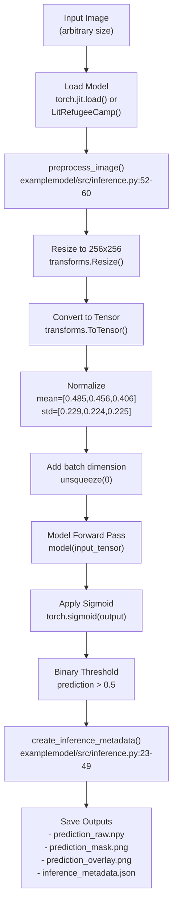
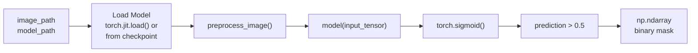
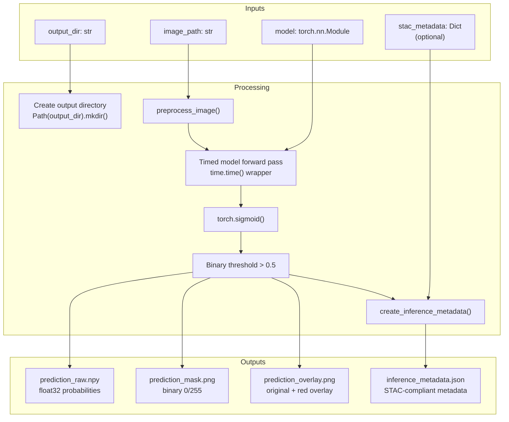
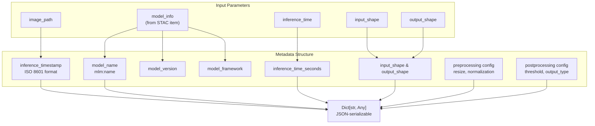
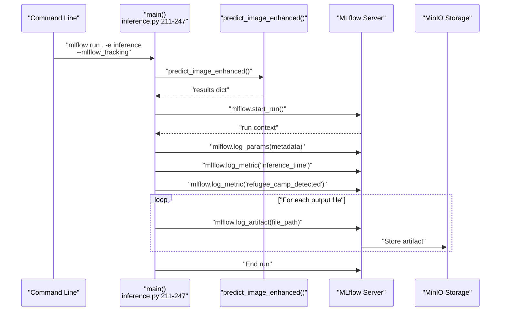
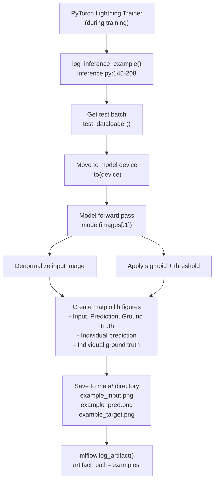

# Inference System

<details>
<summary>Relevant source files</summary>

The following files were used as context for generating this wiki page:

- [examplemodel/playground.ipynb](examplemodel/playground.ipynb)
- [examplemodel/src/inference.py](examplemodel/src/inference.py)
- [examplemodel/src/model.py](examplemodel/src/model.py)

</details>


## Purpose and Scope

The Inference System provides the capability to apply trained refugee camp detection models to new satellite imagery. This system handles image preprocessing, model execution, prediction postprocessing, and metadata generation. It supports both simple inference workflows and enhanced workflows that produce comprehensive output artifacts including visualizations and structured metadata.

For information about the model architecture used during inference, see [Model Overview and Architecture](#3.1). For details on how models are trained and exported, see [Training Pipeline](#3.2). For ESRI-specific inference capabilities, see [ESRI Integration and DLPK Generation](#3.4).

## Inference Pipeline Architecture

The inference system implements a multi-stage pipeline that transforms raw satellite imagery into segmentation predictions and associated metadata.



**Sources:** [examplemodel/src/inference.py:52-143]()

## Image Preprocessing

The `preprocess_image()` function standardizes input images to the format expected by the model. This function is located at [examplemodel/src/inference.py:52-60]() and implements the following transformation pipeline:

| Step | Operation | Parameters |
|------|-----------|------------|
| 1. Load | `Image.open().convert('RGB')` | Ensures 3-channel RGB format |
| 2. Resize | `transforms.Resize((256, 256))` | Fixed input size for model |
| 3. Tensor Conversion | `transforms.ToTensor()` | Converts to [0,1] range |
| 4. Normalization | `transforms.Normalize()` | mean=[0.485, 0.456, 0.406]<br/>std=[0.229, 0.224, 0.225] |
| 5. Batch Dimension | `.unsqueeze(0)` | Shape: [1, 3, 256, 256] |

The normalization parameters follow ImageNet statistics, which are standard for models pretrained on natural images. The output tensor has shape `[1, 3, 256, 256]` and is ready for direct input to the model.

**Sources:** [examplemodel/src/inference.py:52-60]()

## Prediction Functions

### Basic Inference: `predict_image()`

The `predict_image()` function at [examplemodel/src/inference.py:127-142]() provides a lightweight inference interface that returns a binary mask:



This function:
- Accepts either TorchScript models (`.pt` files) or PyTorch state dicts (`.pth` files)
- Performs inference with `model.eval()` and `torch.no_grad()`
- Applies sigmoid activation to convert logits to probabilities
- Applies threshold of 0.5 to produce binary predictions
- Returns a NumPy array with dtype `uint8` containing 0s and 1s

**Sources:** [examplemodel/src/inference.py:127-142]()

### Enhanced Inference: `predict_image_enhanced()`

The `predict_image_enhanced()` function at [examplemodel/src/inference.py:63-124]() provides comprehensive inference with metadata generation and multiple output formats:



The function produces four output files:

| File | Format | Content | Line Reference |
|------|--------|---------|----------------|
| `prediction_raw.npy` | NumPy | Float32 probability map [0,1] | [examplemodel/src/inference.py:93-95]() |
| `prediction_mask.png` | PNG | Binary mask (0=black, 255=white) | [examplemodel/src/inference.py:97-99]() |
| `prediction_overlay.png` | PNG | Original image with red overlay on detections | [examplemodel/src/inference.py:101-109]() |
| `inference_metadata.json` | JSON | STAC-compliant inference metadata | [examplemodel/src/inference.py:111-114]() |

**Sources:** [examplemodel/src/inference.py:63-124]()

## Inference Metadata Generation

The `create_inference_metadata()` function at [examplemodel/src/inference.py:23-49]() generates structured metadata for each inference run. This metadata follows STAC-MLM conventions and includes:



The preprocessing section documents:
- Resize dimensions: `[256, 256]`
- Normalization scheme: `"ImageNet"`
- Mean values: `[0.485, 0.456, 0.406]`
- Std values: `[0.229, 0.224, 0.225]`

The postprocessing section documents:
- Threshold value: `0.5`
- Output type: `"binary_mask"`

**Sources:** [examplemodel/src/inference.py:23-49]()

## MLflow Integration

### Inference Run Tracking

When invoked with the `--mlflow_tracking` flag, the inference system logs results to MLflow:



Logged parameters include all fields from `inference_metadata.json`, such as model name, version, framework, input/output shapes, and preprocessing configuration. Logged metrics include `inference_time` (seconds) and `refugee_camp_detected` (0 or 1).

**Sources:** [examplemodel/src/inference.py:236-243]()

### Training-Time Inference Examples

The `log_inference_example()` function at [examplemodel/src/inference.py:145-208]() is called during training to log example predictions:



This function:
- Takes the first image from the test dataset
- Denormalizes the input for visualization
- Converts predictions to binary format (0 or 1)
- Creates three visualization files
- Logs them to MLflow under the `examples` artifact path

**Sources:** [examplemodel/src/inference.py:145-208]()

## Command-Line Interface

The inference system can be invoked via the command line with the following interface:

| Argument | Type | Required | Description | Default |
|----------|------|----------|-------------|---------|
| `image_path` | Positional | Yes | Path to input image file | - |
| `--model_path` | Optional | No | Path to model file (.pt or .pth) | `meta/best_model.pth` |
| `--stac_path` | Optional | No | Path to STAC metadata file | None |
| `--output_dir` | Optional | No | Directory for output files | `output` |
| `--mlflow_tracking` | Flag | No | Enable MLflow logging | False |

Example usage:
```bash
# Basic inference
python src/inference.py satellite_image.jpg

# With custom model and MLflow tracking
python src/inference.py satellite_image.jpg \
  --model_path models/custom_model.pt \
  --mlflow_tracking

# With STAC metadata
python src/inference.py satellite_image.jpg \
  --stac_path meta/stac_item.json \
  --output_dir results/
```

The main function at [examplemodel/src/inference.py:211-247]() orchestrates the complete inference workflow, including argument parsing, model loading, prediction generation, and optional MLflow logging.

**Sources:** [examplemodel/src/inference.py:211-247]()

## Output Artifacts

### Overlay Visualization

The overlay visualization ([examplemodel/src/inference.py:101-109]()) composites the binary prediction mask onto the original image:

1. Load and resize original image to 256×256
2. Create overlay with red color `[0, 0, 255]` where mask equals 1
3. Blend using `cv2.addWeighted()` with weights 0.7 (original) and 0.3 (overlay)
4. Save as `prediction_overlay.png`

This provides immediate visual feedback on model predictions, highlighting detected refugee camp areas in red.

**Sources:** [examplemodel/src/inference.py:101-109]()

### Return Value Structure

The `predict_image_enhanced()` function returns a dictionary with the following structure:

```python
{
    "prediction": np.ndarray,           # Float probabilities [0,1]
    "binary_mask": np.ndarray,          # Binary mask {0,1}
    "metadata": dict,                   # Inference metadata
    "output_files": {
        "raw_prediction": str,          # Path to .npy file
        "binary_mask": str,             # Path to mask .png
        "overlay": str,                 # Path to overlay .png
        "metadata": str                 # Path to .json file
    },
    "refugee_camp_detected": bool       # True if any pixel is positive
}
```

The `refugee_camp_detected` field is computed as `bool(np.any(binary_mask))` at [examplemodel/src/inference.py:121](), indicating whether any pixels in the image were classified as refugee camp structures.

**Sources:** [examplemodel/src/inference.py:116-124]()

## Integration with MLflow Project

The inference system is exposed as an MLflow entry point, allowing it to be invoked via MLflow's orchestration layer. For details on the MLflow project configuration and entry point parameters, see [MLflow Project Structure](#3.5).

**Sources:** [examplemodel/src/inference.py:1-251]()