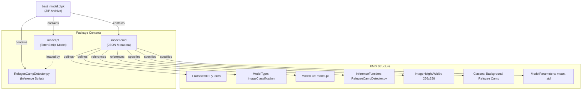
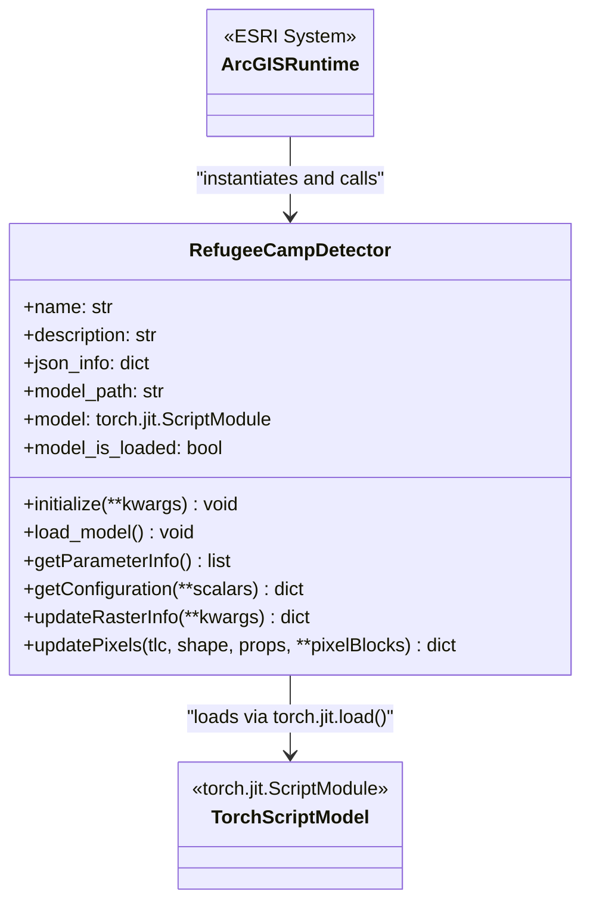
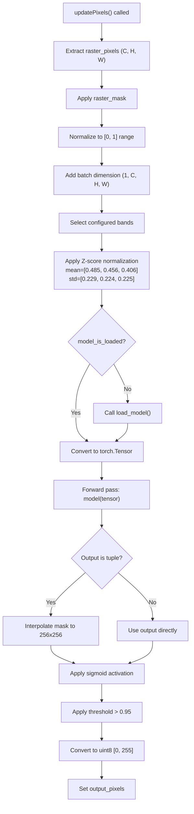
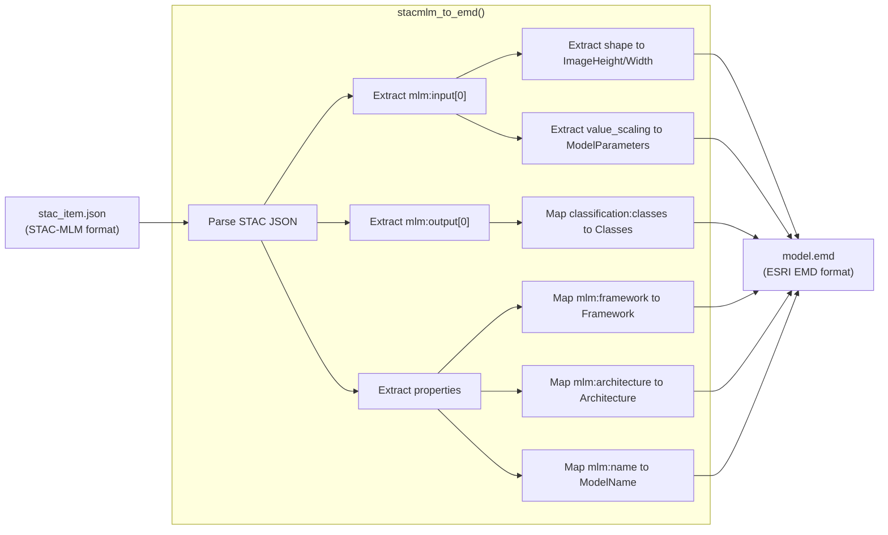
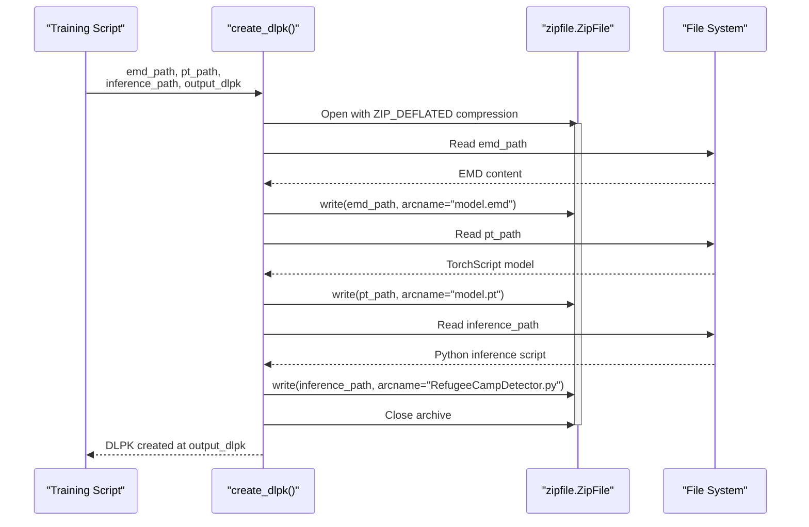
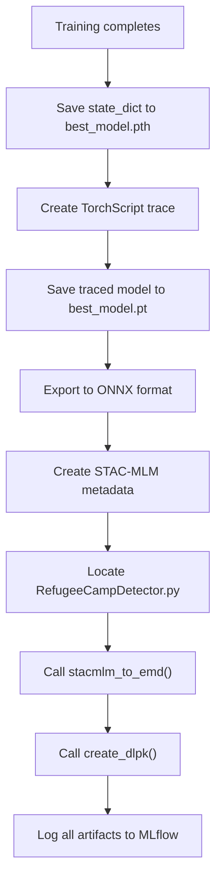
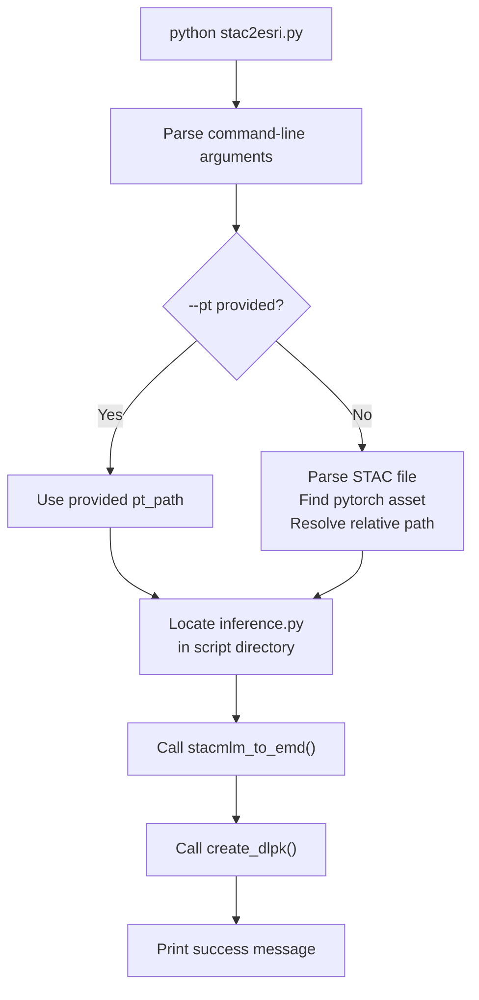

# ESRI Integration and DLPK Generation

<details>
<summary>Relevant source files</summary>

The following files were used as context for generating this wiki page:

- [examplemodel/src/esri/RefugeeCampDetector.py](examplemodel/src/esri/RefugeeCampDetector.py)
- [examplemodel/src/stac2esri.py](examplemodel/src/stac2esri.py)
- [examplemodel/src/train.py](examplemodel/src/train.py)

</details>


## Purpose and Scope

This document covers the ESRI integration components of the OpenGeoAIModelHub, specifically the creation and structure of Deep Learning Package (DLPK) files for deployment in ArcGIS Pro and ArcGIS Enterprise environments. The system converts trained PyTorch models into ESRI-compatible packages that can be directly loaded and used for raster inference within ESRI's geospatial tooling ecosystem.

For information about the model training process that produces the artifacts packaged into DLPKs, see [Training Pipeline](#3.2). For details on the STAC-MLM metadata that serves as the source for EMD generation, see [Training Pipeline](#3.2). For deployment strategies using the generated DLPK files, see [Model Deployment Options](#6.2).

---

## DLPK Package Format

A DLPK (Deep Learning Package) is a ZIP archive containing model files and metadata required for ArcGIS deep learning inference. The package structure follows ESRI's specification for custom deep learning models.

### Package Structure



**Sources:** [examplemodel/src/stac2esri.py:23-46](), [examplemodel/src/train.py:462-468]()

### EMD File Format

The Esri Model Definition (EMD) file is a JSON document that describes the model architecture, input/output specifications, and inference parameters.

| Field | Type | Description |
|-------|------|-------------|
| `Framework` | string | Deep learning framework (e.g., "PyTorch") |
| `ModelType` | string | Type of model task (e.g., "ImageClassification") |
| `ModelName` | string | Human-readable model identifier |
| `Architecture` | string | Neural network architecture (e.g., "U-Net") |
| `ModelFile` | string | Relative path to model weights file |
| `InferenceFunction` | string | Relative path to Python inference script |
| `ImageHeight` | integer | Expected input tile height in pixels |
| `ImageWidth` | integer | Expected input tile width in pixels |
| `ImageSpaceUsed` | string | Coordinate system ("MAP_SPACE" or "PIXEL_SPACE") |
| `ExtractBands` | array | Zero-indexed band indices to extract from input |
| `DataRange` | array | Expected data value range [min, max] |
| `BatchSize` | integer | Number of tiles to process simultaneously |
| `Classes` | array | Class definitions with Value, Name, and Color |
| `ModelParameters` | object | Preprocessing parameters (mean, std, etc.) |
| `Threshold` | float | Classification confidence threshold |

**Sources:** [examplemodel/src/stac2esri.py:23-46]()

---

## RefugeeCampDetector Class

The `RefugeeCampDetector` class implements ESRI's Python Raster Function interface, enabling custom deep learning inference within ArcGIS workflows. This class is packaged into the DLPK and instantiated by ArcGIS at runtime.

### Class Interface



**Sources:** [examplemodel/src/esri/RefugeeCampDetector.py:25-184]()

### Method Responsibilities

#### initialize()

Parses the EMD file and extracts model configuration parameters.

- **Input:** `model` parameter containing path to EMD file or JSON string
- **Output:** Populates `self.json_info` and `self.model_path`
- **Location:** [examplemodel/src/esri/RefugeeCampDetector.py:31-51]()

Key operations:
1. Loads EMD file as JSON dictionary
2. Extracts `ModelFile` path and resolves to absolute path
3. Sets `model_is_loaded` flag to `False`

#### load_model()

Lazy-loads the TorchScript model file into memory.

- **Input:** Uses `self.model_path` set during initialization
- **Output:** Populates `self.model` with loaded `torch.jit.ScriptModule`
- **Location:** [examplemodel/src/esri/RefugeeCampDetector.py:53-65]()

The model is loaded with `map_location="cpu"` to ensure compatibility across systems, even if trained with GPU acceleration.

#### getParameterInfo()

Defines the parameters that ArcGIS users can configure in the UI.

- **Returns:** List of parameter dictionaries with name, dataType, and default values
- **Location:** [examplemodel/src/esri/RefugeeCampDetector.py:67-83]()

Exposed parameters:
- `raster`: Input raster dataset (required)
- `model`: Path to EMD file (required)
- `BatchSize`: Number of tiles to process together (optional, default from EMD)
- `Threshold`: Classification confidence threshold (optional, default from EMD)

#### getConfiguration()

Configures the raster processing pipeline based on user parameters and EMD metadata.

- **Input:** Scalar parameters from `getParameterInfo()`
- **Returns:** Dictionary with processing configuration
- **Location:** [examplemodel/src/esri/RefugeeCampDetector.py:85-100]()

Configuration keys:
- `BatchSize`: Tiles per batch
- `tx`, `ty`: Tile dimensions
- `extractBands`: Band indices to extract
- `dataRange`: Expected pixel value range
- `inputMask`: Whether to respect input mask
- `inheritProperties`: Bitfield for metadata inheritance

#### updateRasterInfo()

Modifies output raster metadata to match the segmentation mask format.

- **Input:** Keyword arguments including `output_info` dictionary
- **Returns:** Modified kwargs with updated `output_info`
- **Location:** [examplemodel/src/esri/RefugeeCampDetector.py:102-105]()

Sets output to single-band, 8-bit unsigned integer (pixel type `u1`).

#### updatePixels()

Core inference method called for each raster tile.

- **Input:** Tile coordinates, shape, properties, and pixel blocks
- **Returns:** Modified `pixelBlocks` with `output_pixels` populated
- **Location:** [examplemodel/src/esri/RefugeeCampDetector.py:107-183]()

### Inference Pipeline



**Sources:** [examplemodel/src/esri/RefugeeCampDetector.py:107-183]()

Key operations in the pipeline:

1. **Masking**: Applies `raster_mask` to handle NoData regions [line 112]()
2. **Type conversion**: Converts to float32 for computation [line 116]()
3. **Band extraction**: Selects configured bands (typically RGB) [lines 121-123]()
4. **Normalization**: Scales to [0, 1] if input exceeds 1.0 [lines 125-126]()
5. **Z-score standardization**: Applies ImageNet statistics [lines 134-141]()
6. **Model inference**: Forward pass with `torch.no_grad()` [lines 147-148]()
7. **Post-processing**: Sigmoid activation and thresholding [lines 172-174]()
8. **Output formatting**: Converts to uint8 binary mask [line 180]()

---

## STAC-MLM to EMD Conversion

The `stacmlm_to_emd()` function converts STAC-MLM metadata to ESRI's EMD format, bridging the standardized machine learning model metadata with ESRI-specific requirements.

### Conversion Flow



**Sources:** [examplemodel/src/stac2esri.py:7-51]()

### Field Mapping Table

| STAC-MLM Path | EMD Field | Transformation |
|---------------|-----------|----------------|
| `properties.mlm:framework` | `Framework` | Direct copy (e.g., "PyTorch") |
| `properties.mlm:architecture` | `Architecture` | Direct copy (e.g., "U-Net") |
| `properties.mlm:name` | `ModelName` | Direct copy or default "RefugeeCampDetector" |
| `properties.mlm:input[0].input.shape[2]` | `ImageHeight` | Extract dimension |
| `properties.mlm:input[0].input.shape[3]` | `ImageWidth` | Extract dimension |
| `properties.mlm:input[0].value_scaling` | `ModelParameters.mean/std` | Extract z-score parameters |
| `properties.mlm:output[0].classification:classes` | `Classes` | Convert to EMD class format |
| (hardcoded) | `ModelFile` | Always "model.pt" |
| (hardcoded) | `InferenceFunction` | Always "RefugeeCampDetector.py" |

**Sources:** [examplemodel/src/stac2esri.py:7-51]()

The function performs these steps:

1. **Load STAC file**: Reads JSON from `stac_path` [line 8]()
2. **Extract properties**: Accesses `properties` dictionary [line 9]()
3. **Find PyTorch asset**: Searches for asset with `mlm:artifact_type == "pytorch"` [lines 11-16]()
4. **Build EMD structure**: Constructs EMD dictionary with required fields [lines 23-46]()
5. **Write EMD file**: Saves JSON to `output_dir/model.emd` [lines 48-50]()

---

## DLPK Creation Process

The `create_dlpk()` function packages the EMD file, TorchScript model, and inference script into a single ZIP archive.

### Packaging Sequence



**Sources:** [examplemodel/src/stac2esri.py:54-58]()

Function signature:
```python
def create_dlpk(emd_path: Path, pt_path: Path, inference_path: Path, output_dlpk: Path)
```

Parameters:
- `emd_path`: Path to the EMD JSON file
- `pt_path`: Path to the TorchScript `.pt` model file
- `inference_path`: Path to `RefugeeCampDetector.py` inference script
- `output_dlpk`: Destination path for the `.dlpk` output file

The function uses `zipfile.ZIP_DEFLATED` compression to reduce package size while maintaining fast decompression performance.

---

## Integration with Training Pipeline

The DLPK generation is integrated into the main training pipeline and executed automatically after model training completes.

### Training Pipeline Integration



**Sources:** [examplemodel/src/train.py:436-496]()

### Code Flow in train.py

The DLPK creation occurs in the `train_model()` function after model training:

1. **Save PyTorch state dict** [line 438]():
   ```python
   torch.save(model.state_dict(), "meta/best_model.pth")
   ```

2. **Create TorchScript model** [lines 444-448]():
   ```python
   torch_model = clean_model.model
   torch_model.eval()
   traced_model = torch.jit.trace(torch_model, torch.randn(1, 3, 256, 256))
   torch.jit.save(traced_model, "meta/best_model.pt")
   ```

3. **Locate inference script** [lines 463-464]():
   ```python
   current_dir = Path(__file__).parent.absolute()
   esri_inference_path = current_dir / "esri" / "RefugeeCampDetector.py"
   ```

4. **Define paths** [lines 465-467]():
   ```python
   emd_path = Path("meta/model.emd")
   pt_path = Path("meta/best_model.pt")
   dlpk_path = Path("meta/best_model.dlpk")
   ```

5. **Create DLPK** [line 468]():
   ```python
   create_dlpk(emd_path, pt_path, esri_inference_path, dlpk_path)
   ```

6. **Log to MLflow** [lines 493-496]():
   ```python
   mlflow.log_artifact(dlpk_path, artifact_path="esri")
   mlflow.log_artifact(emd_path, artifact_path="esri")
   mlflow.log_artifact(pt_path, artifact_path="esri")
   mlflow.log_artifact(esri_inference_path, artifact_path="esri")
   ```

**Sources:** [examplemodel/src/train.py:462-496]()

### Artifact Organization

After training, the DLPK and related artifacts are logged to MLflow in a structured hierarchy:

```
mlflow_run/
├── models/
│   ├── best_model.pth
│   ├── best_model.pt
│   ├── best_model.onnx
│   └── best_model.dlpk
├── metadata/
│   └── stac_item.json
├── esri/
│   ├── best_model.dlpk
│   ├── model.emd
│   ├── model.pt
│   └── RefugeeCampDetector.py
└── checkpoints/
    └── epoch=X-step=Y.ckpt
```

The `esri/` directory contains all files needed for ESRI deployment, making it easy to download and deploy the complete package.

**Sources:** [examplemodel/src/train.py:479-496]()

---

## Standalone Usage

The `stac2esri.py` script can be executed standalone for converting existing STAC-MLM files to DLPK packages without re-running training.

### Command-Line Interface

```bash
python stac2esri.py \
  --stac path/to/stac_item.json \
  --pt path/to/model.pt \
  --out-dir output/ \
  --dlpk-name custom_model.dlpk
```

Parameters:

| Flag | Required | Default | Description |
|------|----------|---------|-------------|
| `--stac` | Yes | - | Path to STAC-MLM JSON file |
| `--pt` | No | (inferred) | Path to PyTorch model; if omitted, inferred from STAC assets |
| `--out-dir` | No | `output` | Output directory for EMD and DLPK |
| `--dlpk-name` | No | `model.dlpk` | Filename for output DLPK package |

**Sources:** [examplemodel/src/stac2esri.py:61-114]()

### Standalone Execution Flow



**Sources:** [examplemodel/src/stac2esri.py:61-114]()

The standalone mode is useful for:
- Converting STAC-MLM files from external sources
- Re-packaging models with updated inference scripts
- Batch processing multiple models for deployment
- Testing DLPK creation without full training runs

---

## Deployment in ArcGIS

Once created, DLPK packages can be deployed in ArcGIS Pro or ArcGIS Enterprise for raster inference operations.

### ArcGIS Pro Integration

1. **Load DLPK**: In ArcGIS Pro, use the "Add Deep Learning Model" tool
2. **Configure Inference**: Open the "Classify Pixels Using Deep Learning" tool
3. **Select DLPK**: Point to the `.dlpk` file location
4. **Set Parameters**: Configure BatchSize and Threshold parameters
5. **Run Inference**: Process raster datasets to generate segmentation masks

### Runtime Behavior

When ArcGIS loads the DLPK:

1. Extracts the ZIP archive to a temporary directory
2. Parses `model.emd` to understand model requirements
3. Imports `RefugeeCampDetector.py` as a Python module
4. Instantiates `RefugeeCampDetector` class
5. Calls `initialize()` with path to `model.emd`
6. Divides input raster into tiles matching `ImageHeight` x `ImageWidth`
7. Calls `updatePixels()` for each tile or batch of tiles
8. Mosaics output tiles into final segmentation raster

### Performance Considerations

The DLPK inference performance in ArcGIS depends on:

- **Tile size**: Larger tiles (e.g., 256x256) reduce overhead but increase memory usage
- **Batch size**: Higher batch sizes improve GPU utilization but require more VRAM
- **Model size**: TorchScript models are optimized but still larger than ONNX alternatives
- **CPU vs GPU**: The `RefugeeCampDetector` loads models with `map_location="cpu"` by default; GPU acceleration requires ArcGIS environment configuration

**Sources:** [examplemodel/src/esri/RefugeeCampDetector.py:59]()

---

## Debugging and Logging

The `RefugeeCampDetector` class includes extensive logging for debugging DLPK inference issues in ArcGIS environments.

### Log File Location

All debug messages are written to `rcd_debug.log` in the same directory as the inference script:

```python
SCRIPT_DIR = Path(__file__).parent
LOG_PATH = SCRIPT_DIR / "rcd_debug.log"
```

**Sources:** [examplemodel/src/esri/RefugeeCampDetector.py:16-17]()

### Logged Information

The inference script logs:

- Initialization parameters [line 32]()
- Model loading success/failure [lines 54, 62, 64]()
- Tile coordinates and shapes [line 108]()
- Mask statistics [line 110]()
- Array shapes at each processing step [lines 117, 120, 124, 142]()
- Input/output value ranges [lines 138, 141, 173]()
- Model output types and shapes [lines 149, 157, 163, 170]()

This logging is essential for diagnosing issues when deploying DLPKs in production ArcGIS environments where interactive debugging is not available.

**Sources:** [examplemodel/src/esri/RefugeeCampDetector.py:20-184]()